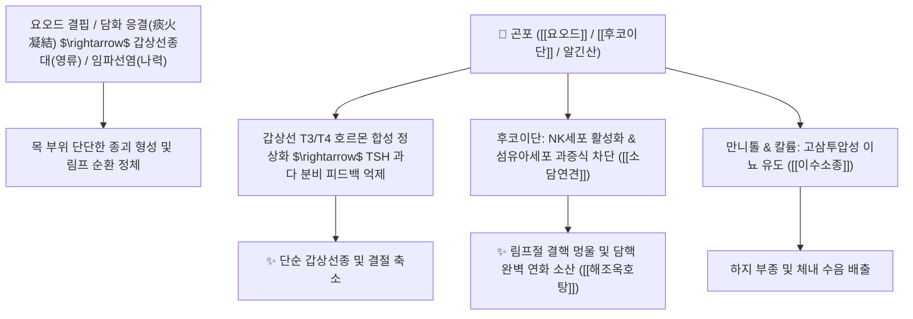

# 🌿 [[곤포]] (昆布, Thallus Laminariae)

> **핵심 요약 (Key Summary)**:
> 다시마과 다시마(*Laminaria japonica*) 또는 미역과 식물의 건조 엽상체로 바다의 짠 기운을 품은 해조류 본초.
> 풍부한 유기 요오드와 후코이단 및 알긴산 다당류가 갑상선 호르몬 합성을 정상화하고 림프절 섬유성 결절을 연화시키며 지질 대사를 개선.
> 목에 멍울이 잡히는 갑상선종(영류)과 임파선 결핵(나력) 및 부종을 가라앉히는 대표적인 [[소담연견]](消痰軟堅)·[[이수소종]](利水消腫)의 군약(君藥).

---
## 📌 목차
1. [기본 본초 정보 & 해조류 생약학 (Pharmacognosy)](#1-기본-본초-정보--해조류-생약학-pharmacognosy)
2. [핵심 분자약리 기전 & 요오드 대사·후코이단 신호망](#2-핵심-분자약리-기전--요오드-대사후코이단-신호망)
3. [해조(海藻) vs 곤포(昆布) 약리 비교 및 상호 배오 시너지](#3-해조海藻-vs-곤포昆布-약리-비교-및-상호-배오-시너지)
4. [연견산결(軟堅散結)의 현대 분자생물학적 기전 (항종양·면역)](#4-연견산결軟堅散結의-현대-분자생물학적-기전-항종양면역)
5. [고전 의학 처방 배오 매트릭스 (해조옥호탕 & 곤포환)](#5-고전-의학-처방-배오-매트릭스-해조옥호탕--곤포환)
6. [출처 및 학술 참고 문헌 (References)](#6-출처-및-학술-참고-문헌-references)

---
## 1. 기본 본초 정보 & 해조류 생약학 (Pharmacognosy)

| 항목 | 상세 내용 |
| :--- | :--- |
| **기원 식물** | 다시마과(Laminariaceae) 다시마 *Laminaria japonica* Aresch.의 건조 엽상체 |
| **성미 (性味)** | 鹹 (짜고), 寒 (차다) |
| **귀경 (歸經)** | 肝·胃·腎經 (간경, 위경, 신경) - **단단하게 뭉친 담핵을 풀고 소변으로 수습 배출** |
| **효능 (Actions)** | [[소담연견]](消痰軟堅), [[이수소종]](利水消腫), 청열설열 |
| **주요 성분** | • **유기 및 무기 요오드**: 건조물 중 0.3~0.56% 함유, 갑상선 호르몬 합성 원료 • **황산화 다당류**: 후코이단(Fucoidan), 라미나린(Laminarin, 항응고·면역 활성) • **식이섬유 및 점액질**: 알긴산(Alginic acid, 20~30%), 만니톨(Mannitol, 10~20%) |

---
## 2. 핵심 분자약리 기전 & 요오드 대사·후코이단 신호망

* **갑상선 항상성 조절 (Iodine Feedback)**:
  * 유기 결합형 요오드가 풍부하여 식이 요오드 결핍으로 인한 대뇌하수체의 TSH 과다 분비를 차단함으로써 갑상선 여포세포의 보상성 과증식을 억제합니다.
* **후코이단(Fucoidan)의 항염 및 항종양 활성**:
  * 황산화 후코이단은 혈관내피성장인자(VEGF) 수용체 결합을 저지하여 병변 부위 비정상 미세혈관 신생을 억제하고, 대식세포를 자극하여 만성 육아종성 염증을 흡수합니다.
* **지질 흡수 억제 및 혈관벽 보호**:
  * 장관 내에서 알긴산이 콜레스테롤 및 담즙산과 결합하여 배출을 촉진하고, 라미나린이 헤파린 유사 작용으로 혈소판 응집을 저지하여 혈관 플라크 형성을 방어합니다.

---
## 3. 해조(海藻) vs 곤포(昆布) 약리 비교 및 상호 배오 시너지

| 본초 구분 | 기원 생약 | 주 생리활성 성분 특성 | 임상 배오 주치 |
| :--- | :--- | :--- | :--- |
| **[[해조]] (海藻)** | 모자반과(Sargassaceae) 괭생이모자반 | 삭결(削結)하는 힘이 강하여 단단한 멍울을 깨뜨림 | 고환 종통, 서혜부 탈장, 경부 림프절염 |
| **[[곤포]] (昆布)** | 다시마과(Laminariaceae) 다시마 | 유연(柔軟)하게 진액을 보태며 연견하고 수기 배출 | 갑상선 비대(영류), 만성 각기 부종, 동맥경화 |

---
## 4. 연견산결(軟堅散結)의 현대 분자생물학적 기전 (항종양·면역)

* **단단한 병리적 결절의 기전**:
  * 한의학에서 담(痰)과 기(氣)가 엉켜 굳어지는 병태는 현대 병리학적으로 세포외기질의 섬유화(Fibrosis), 림프액 울체 및 염증 세포 침윤을 의미합니다.
  * 곤포의 함미(鹹味, 짠맛)는 삼투압을 조절하고 세포간질액의 점도를 낮추며, 점액성 다당류가 콜라겐 가교 결합을 이완시켜 결절 조직의 연화를 촉진합니다.

---
## 5. 고전 의학 처방 배오 매트릭스 (해조옥호탕 & 곤포환)

| 처방명 | 주요 구성 | 주치 병증 및 임상 타깃 | 배오 원리 및 특징 |
| :--- | :--- | :--- | :--- |
| [[해조옥호탕]] | 곤포, [[해조]], 패모, 진피, 청피, 반하, 당귀, 천궁 | **영류(癭瘤, 갑상선 기능항진/종대), 나력(경부 림프절 결핵), 목 부위 결절** | 해조와 곤포가 짝을 이루어 단단한 멍울을 연화시키는 제1방 |
| [[곤포환]] | 곤포, 해인삼, 목향, 빈랑, 욱리인 | **비위 담탁, 완복 비만, 수종, 장간막 림프절 멍울** | 이수통변과 연견산결을 동시에 도모 |
| [[내소나력환]] | 곤포, 해조, 하고초, 현삼, 백강잠, 패모 | **만성 나력, 귀 뒤 및 겨드랑이 임파선 멍울 융기** | 열을 내리고 담핵을 삭여 결절 재발 방지 |

---
## 6. 출처 및 학술 참고 문헌 (References)

* 대한침구의학회 교재편찬위원회. *침구의학*. 집문당; 2020.
  * `[연구 요약]` 갑상선 질환 및 경부 림프절 비대에 대한 해조옥호탕 투여와 침구 치료의 임상적 병용 효과.
