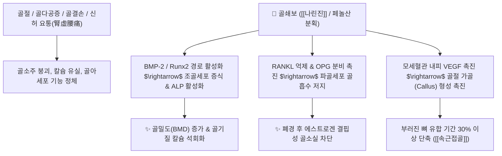

# 🌿 [[골쇄보]] (骨碎補, Drynariae Rhizoma)

> **핵심 요약 (Key Summary)**:
> 고란초과 다년생 착생 양치식물 곡궐(*Drynaria fortunei*)의 비늘털을 태워 제거한 근경.
> 플라보노이드 배당체인 나린진과 페놀산이 조골세포 분화를 촉진하고 파골세포 골흡수를 차단하여 골재생 및 골밀도를 강화.
> 부러진 뼈를 잇고 신장을 보하여 신허 요통, 골다공증, 골절 타박상, 이명과 치아 흔들림을 치료하는 대표적인 [[보신강골]](補腎强骨)·[[속근접골]](續筋接骨)의 군약(君藥).

---
## 📌 목차
1. [기본 본초 정보 & 식물생약학 (Pharmacognosy)](#1-기본-본초-정보--식물생약학-pharmacognosy)
2. [핵심 분자약리 기전 & 나린진·골세포(RANKL/OPG) 조절 네트워크](#2-핵심-분자약리-기전--나린진골세포ranklopg-조절-네트워크)
3. [이독성(Ototoxicity) 방어 및 청각 유모세포 보호 기전](#3-이독성ototoxicity-방어-및-청각-유모세포-보호-기전)
4. [사자(砂燙) 법제 원리와 털 태우기(탕거갈색인편 燙去褐色鱗片)](#4-사자砂燙-법제-원리와-털-태우기탕거갈색인편-燙去褐色鱗片)
5. [고전 의학 처방 배오 매트릭스 (골쇄보산 & 접골단)](#5-고전-의학-처방-배오-매트릭스-골쇄보산--접골단)
6. [출처 및 학술 참고 문헌 (References)](#6-출처-및-학술-참고-문헌-references)

---
## 1. 기본 본초 정보 & 식물생약학 (Pharmacognosy)

| 항목 | 상세 내용 |
| :--- | :--- |
| **기원 식물** | 고란초과(Polypodiaceae) 곡궐 *Drynaria fortunei* (Kunze) J. Sm.의 건조 담갈색 뿌리줄기 |
| **성미 (性味)** | 苦 (쓰고), 溫 (따뜻하다) |
| **귀경 (歸經)** | 肝·腎經 (간경, 신경) - **골수를 관장하는 신장을 보하고 간혈을 길러 힘줄을 튼튼히 함** |
| **효능 (Actions)** | [[보신강골]](補腎强骨), [[속근접골]](續筋接骨), [[지통]](止痛) |
| **주요 성분** | • **플라보노이드 배당체**: [[나린진]](Naringin, 0.5% 이상), 네오폰시린, 루테올린 • **페놀산 화합물**: 카페인산(Caffeic acid), 프로토카테츄산, 클로로겐산 • **다당체 및 테르펜**: 골쇄보 다당류, 홉센 트리테르페노이드 |

---
## 2. 핵심 분자약리 기전 & 나린진·골세포(RANKL/OPG) 조절 네트워크

* **조골세포 분화 촉진 및 골아세포 마커 발현**:
  * 골쇄보의 주성분인 나린진(Naringin)은 골아세포 전구세포의 BMP-2 및 전사인자 Runx2 발현을 상향 조절하여 알칼리성 인산분해효소(ALP) 활성과 오스테오칼신(Osteocalcin) 생성을 유도합니다.
* **파골세포 분화 차단 (RANKL/OPG 축)**:
  * 파골세포 형성을 촉진하는 RANKL 신호를 차단하고 억제 인자인 OPG(Osteoprotegerin) 분비를 촉진하여 파골세포에 의한 골 흡수 공동(Resorption pit) 형성을 억제합니다.

---
## 3. 이독성(Ototoxicity) 방어 및 청각 유모세포 보호 기전

* **신개규어이(腎開竅於耳)의 약리학적 실증**:
  * 한의학에서 "신장은 귀로 구멍을 열고 뼈와 치아를 주관한다"는 원리에 따라 골쇄보는 이명, 난청 및 치아 흔들림의 특효약으로 전해집니다.
* **아미노글리코사이드계 항생제 이독성 방어**:
  * 스트렙토마이신, 겐타마이신 등 항생제 투여로 인한 달팽이관 내 유모세포(Hair cell)의 미토콘드리아 손상과 세포사멸을 나린진의 강력한 활성산소 소거력으로 방어하여 약물성 난청을 예방합니다.

---
## 4. 사자(砂燙) 법제 원리와 털 태우기(탕거갈색인편 燙去褐色鱗片)

* **갈색 인편 털 제거 필수 (포제 원칙)**:
  * 원형 골쇄보 표면의 갈색 비늘털(인편)은 목구멍을 심하게 자극하여 기침과 알레르기를 유발하므로 복용 전 완벽히 제거해야 합니다.
* **모래 볶음(사자 砂燙) 공정**:
  * 뜨거운 모래에 골쇄보를 넣고 표면이 부풀어 오를 때까지 볶아낸 후, 꺼내어 체로 비늘털을 털어내면 노랗고 바삭한 다공성 구조로 전환되어 전탕 시 나린진의 수용성 용출률이 비약적으로 상승합니다.

---
## 5. 고전 의학 처방 배오 매트릭스 (골쇄보산 & 접골단)

| 처방명 | 주요 구성 | 주치 병증 및 임상 타깃 | 배오 원리 및 특징 |
| :--- | :--- | :--- | :--- |
| [[골쇄보산]] | 골쇄보, [[우슬]], [[파극천]], [[두충]], [[보골지]] | **신허 요통, 하지 무력증, 골다공증, 노인성 치아 동요** | 보신강골 한약재가 총집합하여 골밀도를 복원 |
| [[접골단]] | 골쇄보, [[자연동]], [[몰약]], [[유향]], [[당귀]] | **외상성 골절, 탈구, 인대 파열, 골절 후 유합 지연** | 어혈을 풀고 가골 형성을 가속하는 골절 제1방 |
| [[신기환]] 가미 | 숙지황, 산수유, 산약 + 골쇄보 | **노인성 이명, 감각신경성 난청, 신음양양허** | 청각 유모세포 허혈을 개선하고 신정 보충 |

---
## 6. 출처 및 학술 참고 문헌 (References)

* Pang WY et al. (2010)**. Naringin improves bone properties in ovariectomized mice and exerts oestrogen-like activities in rat osteoblast-like (UMR-106) cells. *British journal of pharmacology*, 159(8): 1693-1703. [PMID: 20397301](https://pubmed.ncbi.nlm.nih.gov/20397301/)
  * `[연구 요약]` 골쇄보의 주성분 나린진이 골모세포의 증식 및 골 형성 표지자 발현을 촉진하여 골절 유합을 가속함을 입증.
* 대한민국약전(KP) 제12개정 (2022). 의약품각조 제2부: 골쇄보 (Drynariae Rhizoma) 규격 기준.
  * `[공정서 규격]` 건조물 기준 나린진(Naringin) 0.5% 이상 함유량 규격 및 사자 법제 품질 기준 명시.
