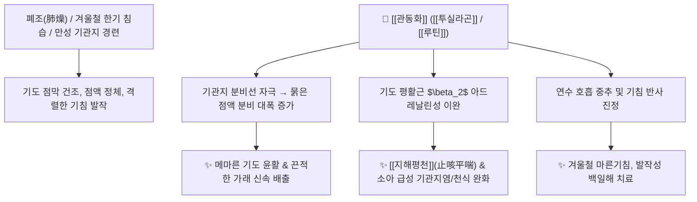

# 🌿 [[관동화]] (款冬花, Farfarae Flos)

> **핵심 요약 (Key Summary)**:
> 국화과 관동(*Tussilago farfara*)의 꽃봉오리로, 혹한의 겨울(款)에 얼음을 뚫고 꽃을 피워내는 강인한 생명력을 지녀 '관동화'라 불립니다. [[투실라곤]](Tussilagone), [[루틴]](Rutin), [[클로로겐산]](Chlorogenic acid) 등의 성분이 기관지 점막 분비물을 증가시켜 가래를 묽히고 기도 평활근을 이완하여 중추성 진해·항천식 효과를 나타냅니다. 한의학적으로 [[윤폐하기]](潤肺下氣), [[지해평천]](止咳平喘)의 으뜸 윤폐지해약으로 한열(寒熱)과 허실(虛實)을 불문하고 겨울철 마른기침, 만성 기관지염, 소아 천식 및 인후폐색을 치료합니다.

---
## 📌 목차
1. [기본 본초 정보 & 화학 구조 (Pharmacognosy)](#1-기본-본초-정보--화학-구조-pharmacognosy)
2. [핵심 분자약리 기전 & 호흡기·기도 대사 네트워크](#2-핵심-분자약리-기전--호흡기도-대사-네트워크)
3. [본초 감별: 관동화 vs 자완의 기침·가래 배오](#3-본초-감별-관동화-vs-자완의-기침가래-배오)
4. [사상의학 및 체질별 임상 응용 (적응증 vs 금기)](#4-사상의학-및-체질별-임상-응용-적응증-vs-금기)
5. [배오 원리 및 한의학적 고찰 (유래와 특징)](#5-배오-원리-및-한의학적-고찰-유래와-특징)
6. [핵심 처방 비교 매트릭스](#6-핵심-처방-비교-매트릭스)
7. [출처 및 학술 참고 문헌 (References)](#7-출처-및-학술-참고-문헌-references)

---
## 1. 기본 본초 정보 & 화학 구조 (Pharmacognosy)

| 항목 | 상세 내용 |
| :--- | :--- |
| **기원 식물** | 국화과(Compositae ; Asteraceae) 관동 *Tussilago farfara* L.의 꽃봉오리(Flower Bud) |
| **성미 (性味)** | 辛·微苦, 溫 (온화하여 건조하지 않음) |
| **귀경 (歸經)** | 肺經 (폐경) |
| **효능 (Actions)** | [[윤폐하기]](潤肺下氣), [[지해평천]](止咳平喘), [[소담청열]](消痰淸熱), [[화담지수]](化痰止嗽) |
| **주요 성분** | • [[세스퀴테르페노이드]] (KP [[투실라곤]] $\ge 0.07\%$): [[투실라곤]] (Tussilagone), Tussilagofuran, 14-Acetoxy-7$\beta$-(3-ethylcrotonoyloxy)-1$\alpha$-(2-methylbutyryloxy)notonipetranone<br>• 피롤리지딘 알칼로이드(미량): [[세네시오닌]] (Senecionine), Senkirkine<br>• 플라보노이드 및 페놀산: [[루틴]] (Rutin), [[하이페로사이드]] (Hyperoside), [[클로로겐산]] (Chlorogenic acid) |

---
## 2. 핵심 분자약리 기전 & 호흡기·기도 대사 네트워크



### (1) 호흡기 분비물 증가 및 진해·평천
* **기도 점막 분비 촉진**:
  * 호흡기 분비물을 유의하게 증가시켜 메마른 기관지 점막을 촉촉하게 적시고(윤폐 潤肺), 기도 내에 들러붙은 가래를 부드럽게 삭입니다.
* **진해 및 호흡 중추 조절**:
  * [[투실라곤]] 성분은 중추성 진해 작용과 함께 말초 혈관 수축 및 호흡 흥분을 완화하여, 소아의 [[급성 기관지염]], 기관지[[천식]], 백일해, 인후통 및 광조불안을 가라앉힙니다.

---
## 3. 본초 감별: 관동화 vs 자완의 기침·가래 배오

```
[🌿 [[관동화]] (Farfarae Flos)]
• 특화 약효: 지해(止咳) 위주. 기침을 멎게 하고 기운을 아래로 내리는 하기(下氣) 작용이 뛰어남.
• 적응증: 마른기침, 숨찬 천식, 인후가 좁아져 쌕쌕거리는 증상.

[🌿 [[자완]] (Asteris Radix et Rhizoma)]
• 특화 약효: 화담(化痰) 위주. 뭉친 가래를 삭이고 배출시키는 거담 작용이 뛰어남.
• 적응증: 기침할 때 가래가 끓고 목에서 소리가 나는 증상.

[🌿 관동화 + 자완 (명배오)]
• 한의학에서 기침 치료의 최고 상용 배오로, 관동화의 지해하기 + 자완의 거담화담이 결합하여 모든 기침을 치료.
```

---
## 4. 사상의학 및 체질별 임상 응용 (적응증 vs 금기)

```
[✅ 최적 적응증 (Sweet Spot)]
• 겨울철 마른기침: 찬 공기를 마시면 발작적으로 기침이 나고 가슴이 답답한 경우
• 만성 기관지염, 소아 천식, 폐결핵성 기침 및 피섞인 가래(객혈)
• 외감 풍한으로 인한 기침부터 내상 음허로 인한 기침까지 모든 기침

[⚠️ 신중 투여 (Caution)]
• 폐열이 극심하여 피를 토하는 초기에는 청열량혈약과 배오
• 피롤리지딘 알칼로이드 성분이 미량 함유되어 있으므로 초고용량 장기 복용 시 간기능 주의
```

---
## 5. 배오 원리 및 한의학적 고찰 (유래와 특징)

### (1) 유래 및 고전적 의미
* **'겨울을 지내는 꽃(款冬)'**: 지낼 관(款), 겨울 동(冬)으로, 혹독한 눈밭과 얼음을 가르고 가장 먼저 꽃을 피워내는 특성 때문에 붙여졌으며, 얼어붙고 건조한 겨울철 폐 질환 치료의 으뜸 약입니다.
* **약성의 중화성**: 성질이 따뜻하면서도 메마르지 않고 윤택하여(溫而不燥, 潤而不寒), 한열허실을 가리지 않고 두루 쓰입니다.

### (2) 핵심 약재 배오
* [[관동화]] + [[자완]]: 기침과 가래를 동시에 잡는 호흡기 최고의 명배오.
* [[관동화]] + [[패모]] / [[지모]]: 음허 폐조로 인한 만성 마른기침과 미열 치료.

---
## 6. 핵심 처방 비교 매트릭스

| 처방명 | 구성 약재 | 주치 병증 및 임상 타깃 | 특징 및 감별점 |
| :--- | :--- | :--- | :--- |
| [[관동화산]] | [[관동화]], [[자완]], [[상백피]], [[행인]], [[패모]] | **만성 기침, 가래 끓음, 천식, 호흡 곤란** | 폐를 윤택하게 하고 기침을 멎게 함 |
| [[백화고]] | [[관동화]], [[백합]] | **폐결핵, 음허 해수, 각혈, 마른기침** | 자음윤폐(滋陰潤肺)의 대표 농축고 |
| [[사간마황탕]] | [[사간]], [[마황]], [[생강]], [[세신]], [[관동화]], [[자완]] 등 | **한음(寒飮)으로 인한 해천, 목에서 가래 끓는 소리** | 상한론의 천식·천명(쌕쌕거림) 특효방 |

---
## 7. 출처 및 학술 참고 문헌 (References)

   **Zheng H et al. (2026)**. Sesquiterpenoids from Tussilago farfara: full structure elucidation, anti-diabetic and anti-inflammatory signaling pathways. *Chinese journal of natural medicines*, 24: 373-384. [PMID: 41781124](https://pubmed.ncbi.nlm.nih.gov/41781124/)
   - **[연구 요약]**: 관동화 세스퀴테르페노이드의 구조 규명 및 항염 활성 연구.
2. **대한민국약전(KP) 제12개정 (2022)**. 의약품각조 제2부: 관동화 (Farfarae Flos) 규격 기준.
   - **[공정서 규격]**: 투실라곤 0.07% 이상 함유 규격 및 건조감량, 회분 명시.
