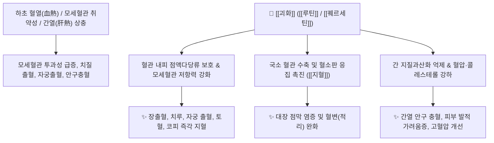

# 🌿 [[괴화]] / [[괴미]] (槐花 / 槐米, Sophorae Flos / Immaturus Flos)

> **핵심 요약 (Key Summary)**:
> 콩과 회화나무(*Sophora japonica*)의 꽃(괴화) 및 꽃봉오리(괴미)로, 플라보노이드 배당체인 [[루틴]](Rutin, 최대 20% 함유)과 [[퀘르세틴]](Quercetin)이 모세혈관의 투과성과 취약성을 현저히 낮추어 혈관 파열성 출혈을 예방하고 혈압과 콜레스테롤을 강하시킵니다. 한의학적으로 [[량혈지혈]](凉血止血), [[청간강화]](淸肝降火), [[살충료창]](殺蟲療瘡)의 대표 지혈약으로 치질 출혈(장풍변혈), 치루, 자궁부정출혈, 토혈, 코피, 간열로 인한 안구 충혈 및 고혈압성 뇌출혈을 치료합니다.

---
## 📌 목차
1. [기본 본초 정보 & 화학 구조 (Pharmacognosy)](#1-기본-본초-정보--화학-구조-pharmacognosy)
2. [핵심 분자약리 기전 & 모세혈관·지혈 대사 네트워크](#2-핵심-분자약리-기전--모세혈관지혈-대사-네트워크)
3. [포제 메커니즘: 생괴화(생용) vs 괴화탄(초탄)의 약효 변화](#3-포제-메커니즘-생괴화생용-vs-괴화탄초탄의-약효-변화)
4. [사상의학 및 체질별 임상 응용 (적응증 vs 금기)](#4-사상의학-및-체질별-임상-응용-적응증-vs-금기)
5. [배오 원리 및 한의학적 고찰 (유래와 특징)](#5-배오-원리-및-한의학적-고찰-유래와-특징)
6. [핵심 처방 비교 매트릭스](#6-핵심-처방-비교-매트릭스)
7. [출처 및 학술 참고 문헌 (References)](#7-출처-및-학술-참고-문헌-references)

---
## 1. 기본 본초 정보 & 화학 구조 (Pharmacognosy)

| 항목 | 상세 내용 |
| :--- | :--- |
| **기원 식물** | 콩과(Leguminosae ; Fabaceae) 회화나무 *Sophora japonica* L. [= *Styphnolobium japonicum* (L.) Schott]의 꽃봉오리([[괴미]]) 또는 피기 시작한 꽃([[괴화]]) |
| **성미 (性味)** | 苦, 微寒 |
| **귀경 (歸經)** | 肝·大腸經 (간경, 대장경) |
| **효능 (Actions)** | [[량혈지혈]](凉血止血), [[청간강화]](淸肝降火), [[살충료창]](殺蟲療瘡), [[혈관강화]](血管强化) |
| **주요 성분** | • [[플라보놀]] 배당체 (KP [[루틴]] $\ge 8.0\%$, 괴미는 $\ge 15.0\%$): [[루틴]] (Rutin), [[퀘르세틴]] (Quercetin), Isoquercitrin, Genistein<br>• 트리테르페노이드: [[소포라디올]] (Sophoradiol), Betulin, Sophorin<br>• 기타: Tannins, 지방산 |

### 🔬 주요 지표물질 화학 구조
> **[구조적 특징]**: 주성분인 [[루틴]](Rutin, 비타민 P 복합체)은 퀘르세틴에 루티노오스 당이 결합된 플라보놀 배당체로, 혈관 내피세포의 세포간질을 견고하게 하여 모세혈관의 투과성 항진과 취약성 파열을 억제합니다.

---
## 2. 핵심 분자약리 기전 & 모세혈관·지혈 대사 네트워크



### (1) 모세혈관 투과성 억제 및 지혈 (량혈지혈 凉血止血)
* **모세혈관 강화와 출혈 억제**:
  * [[루틴]] 성분이 모세혈관의 투과성을 낮추고 탄력성을 높여, 장출혈, 치질 출혈, 치루, 자궁 부정출혈, 객혈, 토혈, 코피, 적리(이질성 혈변) 등 혈관 파열성 출혈을 지혈합니다.
* **혈압 및 지질 대사 개선**:
  * 혈관을 확장시키고 혈중 콜레스테롤과 중성지방 수치를 낮추어 동맥경화 및 고혈압성 혈관 질환을 예방합니다.

### (2) 간열(肝熱) 해열과 안과·피부 질환 치료
* 간열을 내려 눈이 벌겋게 충혈되고 아픈 증상을 치료하며, 혈열(血熱)로 피부가 벌겋게 달아오르고 가려운 두드러기와 종기(살충료창 殺蟲療瘡)를 치료합니다.

---
## 3. 포제 메커니즘: 생괴화(생용) vs 괴화탄(초탄)의 약효 변화

```
[🌿 생괴화 (生用, 생것 그대로 사용)]
• 약효 특성: 청열(淸熱), 청간강화(淸肝降火), 혈압 강하력이 강함.
• 주치: 간열로 인한 안구 충혈, 고혈압, 두통, 혈열 피부염.

[🌿 [[괴화탄]] (槐花炭, 겉을 검게 볶음)]
• 약효 특성: 찬 성질이 줄어들고 수렴지혈(收斂止血)력이 극대화됨.
• 주치: 치질 출혈, 장출혈, 혈변, 자궁 부정출혈 등 심한 출혈증.
```

---
## 4. 사상의학 및 체질별 임상 응용 (적응증 vs 금기)

```
[✅ 최적 적응증 (Sweet Spot)]
• 하초 습열성 출혈: 내치핵/외치핵 출혈, 치루, 혈변, 궤양성 대장염의 점액혈변
• 고혈압 환자의 모세혈관 파열 예방 (뇌출혈 전조, 결막하 출혈, 잦은 코피)
• 간열(肝熱)로 인한 눈 충혈, 두통, 어지럼증

[⚠️ 신중 투여 및 금기 (Caution / Contraindication)]
• 비위허한(脾胃虛寒)으로 소화가 안 되고 배가 차며 묽은 변을 보는 환자
• 혈열(血熱)이 없는 허한성(虛寒性) 만성 출혈
```

---
## 5. 배오 원리 및 한의학적 고찰 (유래와 특징)

### (1) 유래 및 고전적 의미
* **기괴한 생김새와 지혈**: 꽃봉오리와 열매가 기괴하고 독특하게 생겨 고대부터 출혈을 다스리는 영약으로 연관지어졌으며, 특히 대장경의 열을 식혀 치질 출혈을 멎게 하는 특효약으로 정립되었습니다.

### (2) 핵심 약재 배오
* [[괴화]] + [[측백엽]] / [[지유]]: 하초 출혈(혈변, 치질 출혈)을 치료하는 지혈의 3대 명배오.
* [[괴화]] + [[국화]] / [[결명자]]: 간열을 내리고 고혈압과 눈 충혈을 치료하는 청간 명배오.

---
## 6. 핵심 처방 비교 매트릭스

| 처방명 | 구성 약재 | 주치 병증 및 임상 타깃 | 특징 및 감별점 |
| :--- | :--- | :--- | :--- |
| [[괴화산]] | [[괴화]], [[측백엽]], [[형개탄]], [[지각]] | **장풍변혈(腸風便血), 치질 출혈, 항문 열통** | 혈변 및 치질 출혈의 최고 기본 처방 |
| [[괴각환]] | [[괴각]](괴화), [[지유]], [[황금]], [[당귀]], [[방풍]] 등 | **만성 치질, 치루, 탈항, 항문 부종 및 출혈** | 청열조습과 양혈지혈의 치질 명방 |
| [[청간명목탕]] | [[괴화]], [[국화]], [[결명자]], [[치자]], [[황련]] 등 | **간열 상충, 안구 충혈, 안구 건조, 두통** | 간열을 식히고 시력을 밝게 함 |

---
## 7. 출처 및 학술 참고 문헌 (References)

   **Liu Y et al. (2025)**. Self-Healing, Hemostatic, and Antioxidant Chitosan Hydrogel Loaded with Sophora Japonica Carbon Dots and ZnO NPs for Wound Healing. *Macromolecular bioscience*, 25: e70000. [PMID: 40384311](https://pubmed.ncbi.nlm.nih.gov/40384311/)
   - **[연구 요약]**: 괴화(회화나무) 추출물 기반의 지혈·항산화 소재 연구.
3. **대한민국약전(KP) 제12개정 (2022)**. 의약품각조 제2부: 괴화 (Sophorae Flos) / 괴미 (Sophorae Immaturus Flos) 규격 기준.
   - **[공정서 규격]**: 괴화 루틴 8.0% 이상, 괴미 루틴 15.0% 이상 함유 규격 명시.
