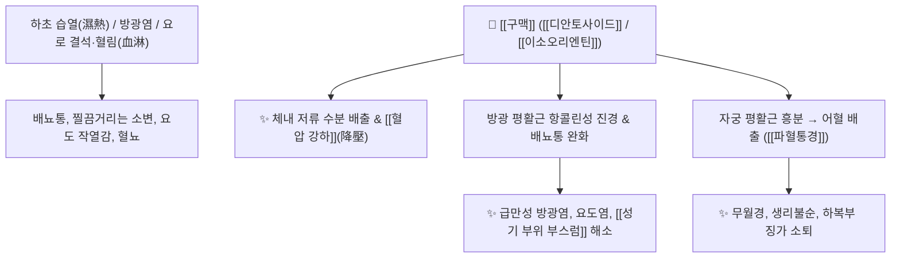

# 🌿 [[구맥]] (瞿麥, Dianthi Herba)

> **핵심 요약 (Key Summary)**:
> 석죽과 패랭이꽃(*Dianthus chinensis*) 또는 술패랭이꽃(*Dianthus superbus*)의 지상부(전초)로, 씨앗의 형태가 보리(麥)와 닮아 '구맥'이라 불렸습니다. [[디안토사이드]](Dianthosides), [[디안틴]](Dianthin), [[이소오리엔틴]](Isoorientin) 등의 사포닌과 플라보노이드 성분이 신장 사구체 혈류를 촉진하여 이뇨 및 혈압 강하를 유도하고 방광 평활근의 감염성 연축을 완화합니다. 한의학적으로 [[청열이뇨]](淸熱利尿), [[파혈통경]](破血通經), [[소종지통]](消腫止痛)의 대표 이뇨통림약으로 열림(熱淋), 혈림(血淋, 배뇨통과 혈뇨), 임질, 성기 부위 부스럼, 부종 및 어혈성 무월경을 치료합니다.

---
## 📌 목차
1. [기본 본초 정보 & 화학 구조 (Pharmacognosy)](#1-기본-본초-정보--화학-구조-pharmacognosy)
2. [핵심 분자약리 기전 & 비뇨기·이뇨 대사 네트워크](#2-핵심-분자약리-기전--비뇨기이뇨-대사-네트워크)
3. [해부생체역학 / 방광 삼각부 & 요도 점막 연계](#3-해부생체역학--방광-삼각부--요도-점막-연계)
4. [사상의학 및 체질별 임상 응용 (적응증 vs 금기)](#4-사상의학-및-체질별-임상-응용-적응증-vs-금기)
5. [배오 원리 및 한의학적 고찰 (유래와 특징)](#5-배오-원리-및-한의학적-고찰-유래와-특징)
6. [핵심 처방 비교 매트릭스](#6-핵심-처방-비교-매트릭스)
7. [출처 및 학술 참고 문헌 (References)](#7-출처-및-학술-참고-문헌-references)

---
## 1. 기본 본초 정보 & 화학 구조 (Pharmacognosy)

| 항목 | 상세 내용 |
| :--- | :--- |
| **기원 식물** | 석죽과(Caryophyllaceae) 패랭이꽃 *Dianthus chinensis* L. 또는 술패랭이꽃 *Dianthus superbus* L.의 꽃이 필 때 채취한 전초 (Dianthi Herba) |
| **성미 (性味)** | 苦, 寒 |
| **귀경 (歸經)** | 心·小腸·膀胱經 (심경, 소장경, 방광경) |
| **효능 (Actions)** | [[청열이뇨]](淸熱利尿), [[파혈통경]](破血通經), [[소종지통]](消腫止痛), [[통림]](通淋) |
| **주요 성분** | • [[트리테르페노이드]] 사포닌: [[디안토사이드]] A~D (Dianthosides A~D)<br>• 펩타이드 단백질: [[디안틴]] (Dianthin 30, 32, 리보솜 불활성화 단백질)<br>• [[C-글리코실플라본]]: [[이소오리엔틴]] (Isoorientin), [[비텍신]] (Vitexin)<br>• 기타: Eugenol, Coumarin, Phenolic acids |

---
## 2. 핵심 분자약리 기전 & 비뇨기·이뇨 대사 네트워크



### (1) 강력한 이뇨 및 요로 소염 작용
* **삼투성 이뇨 및 요로 청소**:
  * 소변 배출량을 급격히 늘려 요도 내에 증식한 세균과 염증 부산물, 미세 결석을 씻어냅니다.
  * 소변이 시원하지 않고 찔끔거리며 아픈 열림(熱淋)과 피가 섞여 나오는 혈림(血淋)을 치료합니다.
* **항균 및 종기 제거 ([[소종]] 消腫)**:
  * 외음부 및 성기 주위에 생기는 습열성 부스럼, 종기, 궤양을 가라앉히고 혈액 순환을 돕습니다.

---
## 3. 해부생체역학 / 방광 삼각부 & 요도 점막 연계

* **방광 삼각부(Trigone) 염증성 과민성 진정**:
  * 요로 감염 시 극심한 잔뇨감과 찌르는 통증을 유발하는 방광 삼각부 점막의 충혈을 가라앉혀 배뇨 곤란을 즉각 완화합니다.
* **자궁 수축 활성**:
  * 자궁 평활근을 흥분 수축시켜 정체된 어혈과 생리혈의 배출을 유도하므로, 어혈성 생리통과 무월경에 탁월합니다.

---
## 4. 사상의학 및 체질별 임상 응용 (적응증 vs 금기)

```
[✅ 최적 적응증 (Sweet Spot)]
• 급만성 방광염, 요도염, 신우신염으로 소변 볼 때 요도가 타는 듯이 아프고 피가 비치는 경우
• 성기 부위의 가려움증, 습진, 화농성 부스럼
• 하복부 어혈로 인한 월경폐색(무월경), 산후 어혈 정체

[⚠️ 절대 금기 (Contraindication)]
• 임산부 (자궁 수축을 강하게 촉진하여 유산을 유발하므로 절대 복용 금지)
• 비위허약자 및 진액 부족 환자
```

---
## 5. 배오 원리 및 한의학적 고찰 (유래와 특징)

### (1) 유래 및 해학적 일화
* 씨앗의 모양이 보리(麥)와 비슷하여 구맥(瞿麥)이라 불렸으며, "구맥이 보리를 보면 정체가 탄로날까 봐 너무 놀라 오줌을 시원하게 싸버렸다"는 한의학적 구전처럼 하초의 막힌 소변을 시원하게 쏟아내는 이뇨통림의 명약입니다.

### (2) 핵심 약재 배오
* [[구맥]] + [[편축]] / [[차전자]]: 요로 감염성 배뇨통과 혈뇨를 치료하는 3대 이뇨통림 배오 ([[팔정산]]).
* [[구맥]] + [[도인]] / [[홍화]]: 어혈로 막힌 월경을 통하게 하는 활혈통경 배오.

---
## 6. 핵심 처방 비교 매트릭스

| 처방명 | 구성 약재 | 주치 병증 및 임상 타깃 | 특징 및 감별점 |
| :--- | :--- | :--- | :--- |
| [[팔정산]] | [[구맥]], [[편축]], [[차전자]], [[활석]], [[목통]], [[대황]], [[치자]], [[감초]] | **습열하주(濕熱下注), 급성 방광염, 혈림, 배뇨통, 요폐** | 비뇨기과 염증 질환의 제1 표준 처방 |
| [[석위산]] | [[석위]], [[구맥]], [[활석]], [[동규자]] 등 | **요로 결석(석림 石淋), 모래 같은 결석 배출** | 결석 용해 및 배출 촉진 |
| [[구맥산]] | [[구맥]], [[당귀]], [[적작약]], [[포황]] | **산후 어혈 정체, 하복통, 배뇨 곤란** | 활혈화어와 이뇨를 겸비 |

---
## 7. 출처 및 학술 참고 문헌 (References)

   **Yuan C et al. (2022)**. Preparative isolation of maltol glycoside from Dianthus superbus and its anti-inflammatory activity in vitro. *RSC advances*, 12: 5031-5041. [PMID: 35425507](https://pubmed.ncbi.nlm.nih.gov/35425507/)
   - **[연구 요약]**: 구맥(술패랭이꽃) 유래 말톨 배당체 분리 및 항염 활성 연구.
2. **대한민국약전(KP) 제12개정 (2022)**. 의약품각조 제2부: 구맥 (Dianthi Herba) 규격 기준.
   - **[공정서 규격]**: 패랭이꽃 전초 규격, 건조감량, 회분 및 순도시험 명시.
