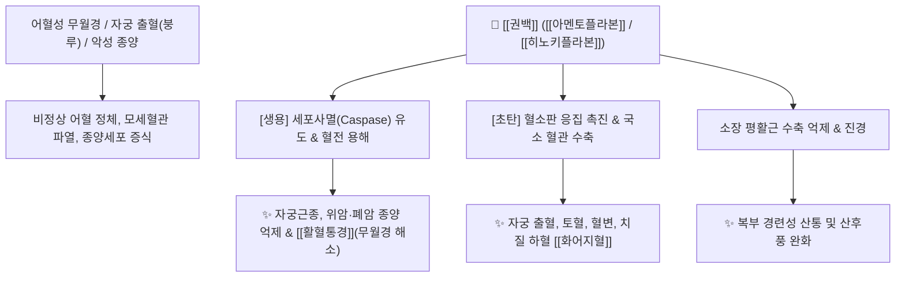

# 🌿 [[권백]] / [[부처손]] (卷柏, Selaginellae Herba)

> **핵심 요약 (Key Summary)**:
> 부처손과 바위손(부처손, *Selaginella tamariscina*)의 전초로, 가뭄에 잎이 주먹처럼 오그라들었다가 비가 오면 다시 펴지는 부활 능력을 지녀 '부처손', '바위손'이라 불립니다. 비플라보노이드(Biflavonoids) 성분인 [[아멘토플라본]](Amentoflavone), [[히노키플라본]](Hinokiflavone), [[로부스타플라본]](Robustaflavone)이 풍부하여 생용(生用) 시 [[활혈통경]](活血通經) 및 강력한 항종양(항암) 작용을, 초탄(炒炭) 시 [[화어지혈]](化瘀止血) 작용을 나타냅니다. 한의학적으로 자궁출혈(붕루하혈), 무월경, 산후풍, 탈모, 오래된 각기 및 소화기계 암종을 치료하나, 과량 복용 시 위장 장애 및 중추신경 억제 부작용에 주의해야 합니다.

---
## 📌 목차
1. [기본 본초 정보 & 화학 구조 (Pharmacognosy)](#1-기본-본초-정보--화학-구조-pharmacognosy)
2. [핵심 분자약리 기전 & 종양·지혈 대사 네트워크](#2-핵심-분자약리-기전--종양지혈-대사-네트워크)
3. [포제 메커니즘: 생용(활혈파어) vs 초탄(화어지혈)의 반전](#3-포제-메커니즘-생용활혈파어-vs-초탄화어지혈의-반전)
4. [독성학 및 임상 복용 주의사항 (부작용 모니터링)](#4-독성학-및-임상-복용-주의사항-부작용-모니터링)
5. [사상의학 및 체질별 임상 응용 (적응증 vs 금기)](#5-사상의학-및-체질별-임상-응용-적응증-vs-금기)
6. [배오 원리 및 한의학적 고찰 (유래와 특징)](#6-배오-원리-및-한의학적-고찰-유래와-특징)
7. [핵심 처방 비교 매트릭스](#7-핵심-처방-비교-매트릭스)
8. [출처 및 학술 참고 문헌 (References)](#8-출처-및-학술-참고-문헌-references)

---
## 1. 기본 본초 정보 & 화학 구조 (Pharmacognosy)

| 항목 | 상세 내용 |
| :--- | :--- |
| **기원 식물** | 부처손과(Selaginellaceae ; 卷柏科) 바위손 *Selaginella tamariscina* (P.Beauv.) Spring 또는 점상권백 *Selaginella pulvinata* (Hook. & Grev.) Maxim.의 건조한 전초 (Selaginellae Herba) |
| **성미 (性味)** | 辛·微苦, 平 (생용: 微寒 / 초탄: 溫) |
| **귀경 (歸經)** | 肝·心經 (간경, 심경) |
| **효능 (Actions)** | **생용(生用)**: [[활혈통경]](活血通經), [[파어소적]](破瘀消積), [[항암]](抗癌)<br>**초탄용(炒炭用)**: [[화어지혈]](化瘀止血), [[수렴지혈]](收斂止血) |
| **주요 성분** | • [[비플라보노이드]] (KP [[아멘토플라본]] $\ge 0.40\%$): [[아멘토플라본]] (Amentoflavone), [[히노키플라본]] (Hinokiflavone), [[이소크립토메린]] (Isocryptomerin), Robustaflavone<br>• 페놀성 글루코사이드: Tamariscinaoside A~C<br>• 당류: [[트레할로오스]] (Trehalose, 건조 저항성 물질) |

---
## 2. 핵심 분자약리 기전 & 종양·지혈 대사 네트워크



### (1) 항종양(항암) 및 활혈 작용 (생용 生用)
* **종양세포 사멸 촉진**:
  * [[아멘토플라본]]과 [[히노키플라본]]은 종양세포의 혈관 신생을 억제하고 Caspase-3 경로를 통해 세포고사를 유도합니다.
* **어혈 제거와 통경**:
  * 굳은 어혈 덩어리를 깨뜨려 무월경, 산후 어혈 복통, 산후풍을 치료합니다.

### (2) 수렴 및 지혈 작용 (초탄용 炒炭用)
* 권백을 불에 볶아 탄화시키면([[권백탄]]), 혈소판 응집 시간을 단축시키고 혈관을 수렴시켜 자궁출혈(하혈), 변혈, 혈뇨를 신속히 멎게 합니다.
* [[측백엽]](側柏葉)과 유사한 지혈 효능을 지니나, 편성(偏性)이 비교적 온화합니다.

---
## 3. 포제 메커니즘: 생용(활혈파어) vs 초탄(화어지혈)의 반전

```
[🌿 생권백 (生用, 말린 그대로 사용)]
• 약효: 기운이 차고 활혈(活血)력이 강함.
• 주치: 어혈성 무월경, 복강 내 종괴(징가), 타박상, 항암 보조.

[🌿 [[권백탄]] (炒炭, 불에 볶아 겉을 검게 태움)]
• 약효: 활혈력은 감소하고 수렴지혈(收斂止血)력이 극대화됨.
• 주치: 자궁 부정출혈(붕루), 혈변, 토혈, 치질 출혈, 혈뇨.
```

---
## 4. 독성학 및 임상 복용 주의사항 (부작용 모니터링)

```
[⚠️ 부작용 및 과량 복용 주의]
• 위장관 자극: 과량 복용 시 메스꺼움, 구토, 위부 불쾌감 유발
• 중추신경계 억제: 대량 투여 시 중추 억제, 졸림, 호흡 곤란을 일으킬 수 있으므로 정량(1일 3~10g) 준수
• 임산부 복용 절대 금기: 강력한 활혈파어 작용으로 유산 위험 초래
```

---
## 5. 사상의학 및 체질별 임상 응용 (적응증 vs 금기)

```
[✅ 최적 적응증 (Sweet Spot)]
• 부인과 어혈 및 출혈: 월경불순, 자궁근종성 부정출혈(초탄용)
• 산후풍으로 인한 뼈마디 시림, 오래된 각기병, 원형 탈모증
• 소화기계 및 폐암 환자의 보조적 항암·면역 요법

[⚠️ 절대 금기 (Contraindication)]
• 임산부 (절대 복용 금지)
• 혈허(血虛)로 인해 마르고 창백한 환자는 신중 투여
```

---
## 6. 배오 원리 및 한의학적 고찰 (유래와 특징)

### (1) 유래 및 형태학적 특징
* **거북이 손과 부처의 손**: 건조할 때 잎이 거북이 손(주먹)처럼 둥글게 말려 있다가 물을 만나면 손바닥을 펴듯 살아나 '부처손', '바위손'이라 불렸으며, "거북이가 주먹으로 피를 꽉 쥐어 지혈시킨다"는 형상의학적 지혈 약재입니다.

### (2) 핵심 약재 배오
* [[권백]](생용) + [[당귀]] / [[적작약]]: 어혈성 무월경과 생리통 치료.
* [[권백]](초탄) + [[측백엽]] / [[지유]]: 부인 자궁출혈과 장출혈 지혈.

---
## 7. 핵심 처방 비교 매트릭스

| 처방명 | 구성 약재 | 주치 병증 및 임상 타깃 | 특징 및 감별점 |
| :--- | :--- | :--- | :--- |
| [[권백산]] | [[권백탄]], [[당귀탄]], [[백작약]], [[포황]] | **부인 붕루하혈, 자궁 부정출혈, 산후 출혈 과다** | 화어지혈의 부인과 대표 지혈방 |
| [[생권백환]] | [[권백]](생용), [[도인]], [[홍화]], [[우슬]] | **어혈 징가, 월경폐색(무월경), 하복부 종괴** | 활혈통경 및 파어소적 |
| [[항암보조방]] | [[권백]], [[백화사설초]], [[반지련]] | **위암, 폐암, 간암의 보조적 종양 억제** | 비플라보노이드 항종양 시너지 |

---
## 8. 출처 및 학술 참고 문헌 (References)

   **Hashida H et al. (2026)**. Amentoflavone and cancer: mechanistic insights and translational perspectives. *Frontiers in oncology*, 16: 1813172. [PMID: 42598615](https://pubmed.ncbi.nlm.nih.gov/42598615/)
   - **[연구 요약]**: 권백 지표성분 아멘토플라본의 항암 기전에 대한 리뷰.
2. **대한민국약전(KP) 제12개정 (2022)**. 의약품각조 제2부: 권백 (Selaginellae Herba) 규격 기준.
   - **[공정서 규격]**: 아멘토플라본 0.40% 이상 함유 규격 및 건조감량, 회분 명시.
