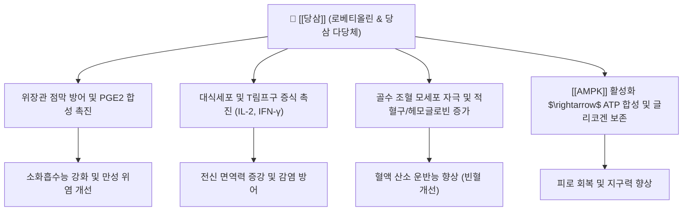

---
aliases:
  - 당삼
  - 黨參
  - 상삼
  - 만삼
  - Codonopsis Radix
tags:
  - 본초
  - 보기약
  - 보중익기
  - 건비익폐
  - 양혈생진
---
# 🌿 [[당삼]] (黨參, Codonopsis Radix)

> **핵심 요약 (Key Summary)**:
> 초롱꽃과(Campanulaceae) 식물인 당삼(*Codonopsis pilosula*) 및 동속 근연식물의 뿌리
> 핵심 지표 성분인 [[로베티올린]]과 당삼 다당체가 [[AMPK]] 경로 및 대식세포를 활성화하여 면역 증강과 위점막 보호 및 조혈 촉진
> 비폐기허(脾肺氣虛)로 인한 식욕부진·만성 피로·빈혈을 치료하며 인삼에 비해 온열성이 완만하여 널리 응용되는 대표 보기양혈 약재

---

## 📌 목차
1. [기본 본초 정보 & 화학 구조 (Pharmacognosy)](#1-기본-본초-정보--화학-구조-pharmacognosy)
2. [핵심 분자약리 기전 & 대사 네트워크](#2-핵심-분자약리-기전--대사-네트워크)
3. [해부생체역학 / 근육·신경 대사 연계](#3-해부생체역학--근육신경-대사-연계)
4. [사상의학 및 체질별 임상 응용 (적응증 vs 금기)](#4-사상의학-및-체질별-임상-응용-적응증-vs-금기)
5. [상한론 및 역대 방제 배오 원리](#5-상한론-및-역대-방제-배오-원리)
6. [핵심 처방 비교 매트릭스](#6-핵심-처방-비교-매트릭스)
7. [출처 및 학술 참고 문헌 (References)](#7-출처-및-학술-참고-문헌-references)

---

## 1. 기본 본초 정보 & 화학 구조 (Pharmacognosy)

| 항목 | 상세 내용 |
| :--- | :--- |
| **기원 식물** | 초롱꽃과(Campanulaceae) 당삼(*Codonopsis pilosula*), 소화당삼, 천당삼의 건조한 뿌리 |
| **성미 (性味)** | 감(甘), 평(平) |
| **귀경 (歸經)** | 비경(脾經), 폐경(肺經) |
| **효능 (Actions)** | 보중익기(補中益氣), 건비익폐(健脾益肺), 양혈생진(養血生津) |
| **주요 성분** | • **지표 성분유효 활성 성분군**: 코도놉신(Codonopsine), 당삼 다당체(CPP), 아트락틸레놀라이드 |

---

## 2. 핵심 분자약리 기전 & 대사 네트워크

* **위점막 보호 및 소화관 운동성 조절**:
  * 위점막 프로스타글란딘($\text{PGE}_2$) 분비를 촉진하고 공격인자인 위산·펩신 자극을 완화하여 위궤양 및 위염을 예방.
* **면역 증강 및 대식세포 활성화**:
  * 수용성 다당체(CPP)가 대식세포 표면 수용체(TLR4 등)에 결합하여 탐식능을 높이고 체액성·세포성 면역 복합 증강.
* **조혈 촉진 및 빈혈 개선**:
  * 골수 미세환경을 자극하여 적혈구(RBC) 및 혈색소(Hb) 수치를 상승시켜 만성 질환 빈혈에 탁월한 효과 발휘.

---

## 3. 해부생체역학 / 근육·신경 대사 연계

* **골격근 피로 저항력 증진**:
  * 운동 중 근육 글리코겐 고갈을 지연시키고 혈중 젖산(Lactate) 및 혈액요소질소(BUN) 축적을 억제하여 근육 피로를 감소.
* **자율신경계 안정화**:
  * 만성 스트레스에 의한 시상하부-하수체-부신(HPA) 축의 과흥분을 완화하여 신경성 식욕부진과 무력감 개선.

---

## 4. 사상의학 및 체질별 임상 응용 (적응증 vs 금기)

* **체질별 적합도**:
  * : [[인삼]]에 비해 약성이 평순(平順)하여 열감이나 상열감이 덜하므로, 인삼 복용 시 두통·가슴 답답함을 느끼는 환자에게 최적의 대용제.
* **주치 병증**:
  * 비폐기허로 인한 식욕 감퇴, 무력감, 사지권태, 만성 해수천식, 산후 기혈부족.
* **금기 및 신중 투여**:
  * 실열(實熱) 증상 및 외감 초기 표사(表邪)가 성할 때에는 단독 투여를 금함.

---

## 5. 상한론 및 역대 방제 배오 원리

* **인삼과의 대비 및 상용 대용**:
  * 전통 방제에서 인삼의 구급 회양(回陽) 또는 대보원기(大補元氣) 작용을 제외한 일상적 보기건비(補氣健脾) 목적에는 당삼을 2~3배 용량으로 치환하여 상용.
* **양혈약과의 배오 시너지**:
  * [[당귀]], [[숙지황]]과 배오하여 기혈쌍보(氣血雙補)를 유도.

---

## 6. 핵심 처방 비교 매트릭스

| 처방명 | 구성 특징 | 주치 병증 |
| :--- | :--- | :--- |
| [[사군자탕]](당삼 대용) | [[당삼]], [[백출]], [[복령]], [[감초]] | 비위기허, 식소연변, 피로무력 |
| [[보중익기탕]](당삼 가감) | [[황기]], [[당삼]], [[백출]], [[승마]], [[시호]] | 기허하함, 만성 위하수, 내장하수 |
| [[팔물탕]] | 사군자탕 합 사물탕 | 기혈양허, 얼굴 창백, 현훈, 월경부족 |
| [[생맥산]] | [[당삼]], [[맥문동]], [[오미자]] | 기음양허, 땀 과다 후 갈증 및 기력 쇠약 |

---

## 7. 출처 및 학술 참고 문헌 (References)
* State Pharmacopoeia Commission of PRC. *Pharmacopoeia of the People's Republic of China*. Chemical Industry Press, 2020: 298-299.
  * `[연구 요약]`: 당삼의 규격 기준(로베티올린 0.03% 이상) 및 기원 식물, 효능 표준화.
* **Li Z et al. (2026)**. A comprehensive review on the polysaccharides derived from Codonopsis pilosula: Extraction, isolation and purification, structural characteristics, biological activities, structure-activity relationships, toxicity, and development and utilization. *Journal of ethnopharmacology*. [PMID: 42600873](https://pubmed.ncbi.nlm.nih.gov/42600873/)
  * `[연구 요약]`: 당삼의 로베티올린, 다당체 중심의 면역 조절, 위점막 보호, 신경보호 및 항피로 작용 총괄 리뷰.
