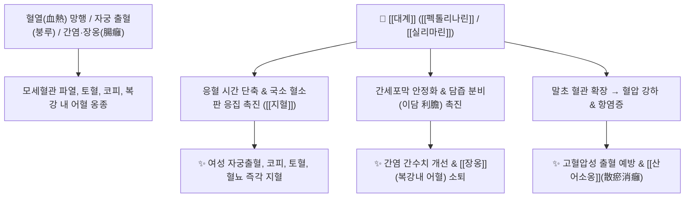

# 🌿 [[대계]] / [[엉겅퀴]] (大薊, Cirsii Herba) / [[소계]] (小薊)

> **핵심 요약 (Key Summary)**:
> 국화과 엉겅퀴(*Cirsium maackii*) 또는 큰엉겅퀴(*Cirsium pendulum*)의 지상부(전초)로, 새싹의 가시 돋친 모양이 사나운 큰 개(大薊)와 같다는 유래가 전해집니다. [[실리마린]](Silymarin), [[펙톨리나린]](Pectolinarin), [[아피제닌]](Apigenin) 성분이 간세포를 보호하고 담즙 분비를 촉진(이담)하며, 혈액 응고를 촉진하여 지혈하고 혈관을 확장시켜 혈압을 낮춥니다. 한의학적으로 [[량혈지혈]](凉血止血), [[산어소옹]](散瘀消癰), [[청간이담]](淸肝利膽), [[안태]](安胎)의 명약으로 여성의 자궁출혈(붕루), 적백대하, 토혈, 코피, 급성 간염, 장옹(복막염/맹장염) 및 화농성 종기를 치료합니다.

---
## 📌 목차
1. [기본 본초 정보 & 화학 구조 (Pharmacognosy)](#1-기본-본초-정보--화학-구조-pharmacognosy)
2. [핵심 분자약리 기전 & 지혈·간장 대사 네트워크](#2-핵심-분자약리-기전--지혈간장-대사-네트워크)
3. [본초 감별: 대계(엉겅퀴) vs 소계(조뱅이)의 임상 타깃](#3-본초-감별-대계엉겅퀴-vs-소계조뱅이의-임상-타깃)
4. [사상의학 및 체질별 임상 응용 (적응증 vs 금기)](#4-사상의학-및-체질별-임상-응용-적응증-vs-금기)
5. [배오 원리 및 한의학적 고찰 (유래와 특징)](#5-배오-원리-및-한의학적-고찰-유래와-특징)
6. [핵심 처방 비교 매트릭스](#6-핵심-처방-비교-매트릭스)
7. [출처 및 학술 참고 문헌 (References)](#7-출처-및-학술-참고-문헌-references)

---
## 1. 기본 본초 정보 & 화학 구조 (Pharmacognosy)

| 항목 | 상세 내용 |
| :--- | :--- |
| **기원 식물** | 국화과(Compositae ; Asteraceae) 엉겅퀴 *Cirsium maackii* Maxim. 또는 큰엉겅퀴 *Cirsium pendulum* Fisch., 지느러미엉겅퀴 *Carduus crispus* L.의 전초 또는 뿌리 (Cirsii Herba / Radix) |
| **성미 (性味)** | 甘·苦, 凉 |
| **귀경 (歸經)** | 肝·脾經 (간경, 비경) |
| **효능 (Actions)** | [[량혈지혈]](凉血止血), [[산어소옹]](散瘀消癰), [[청간이담]](淸肝利膽), [[강압이뇨]](降壓利尿), [[안태]](安胎) |
| **주요 성분** | • 플라보노이드 배당체: [[펙톨리나린]] (Pectolinarin), [[펙톨리나리게닌]] (Pectolinarigenin), [[실리마린]] (Silymarin 군)<br>• 페놀류: [[아피제닌]] (Apigenin), [[루테올린]] (Luteolin), Chlorogenic acid<br>• 정유 및 알칼로이드: Linarin, Cirsimarin |

---
## 2. 핵심 분자약리 기전 & 지혈·간장 대사 네트워크



### (1) 혈액 응고 촉진 및 지혈 (량혈지혈 凉血止血)
* **응혈 시간 단축**:
  * 출혈 부위의 혈소판 활성화를 돕고 모세혈관 투과성을 줄여 여성의 붕루(자궁출혈), 토혈, 코피, 혈뇨를 신속히 멎게 합니다.
* **간세포 보호 및 이담(利膽) 작용**:
  * 간세포의 지질과산화를 억제하고 담즙 분비를 촉진하여 급만성 간염, 황달, 지방간을 개선합니다.

---
## 3. 본초 감별: 대계(엉겅퀴) vs 소계(조뱅이)의 임상 타깃

```
[🌿 [[대계]] (엉겅퀴, Cirsii Herba)]
• 약효 특성: 산어(散瘀), 소옹(消癰)력이 강함.
• 주치: 복강 내 장옹(맹장염), 화농성 부스럼(옹종창독), 자궁출혈.

[🌿 [[소계]] (조뱅이, Cephalanoploris Herba)]
• 약효 특성: 청열이뇨(淸熱利尿), 지혈통림(止血通淋)력이 강함.
• 주치: 요로 감염성 혈뇨(혈림 血淋), 비뇨기 출혈.
```

---
## 4. 사상의학 및 체질별 임상 응용 (적응증 vs 금기)

```
[✅ 최적 적응증 (Sweet Spot)]
• 혈열(血熱)로 인한 부인과 자궁 부정출혈, 생리과다, 임신 중 복통(태동불안)
• 급만성 간염, 황달, 지방간을 동반한 고혈압 환자
• 맹장염(장옹), 급성 화농성 피부 종기 및 타박상 어혈

[⚠️ 신중 투여 및 금기 (Caution / Contraindication)]
• 비위허한(脾胃虛寒)으로 소화가 안 되고 배가 차며 묽은 변을 보는 환자
```

---
## 5. 배오 원리 및 한의학적 고찰 (유래와 특징)

### (1) 유래 및 형상의학적 의미
* **사나운 짐승과 엉겅퀴 가시**: 잎의 날카로운 가시가 사나운 큰 개(大薊)의 이빨과 같아 붙여졌으며, 맹수에게 물려 피를 흘리고 기혈이 허약해진 위급 출혈과 상처를 치유하는 명약입니다.

### (2) 핵심 약재 배오
* [[대계]] + [[소계]] / [[측백엽]]: 상초와 하초의 모든 출혈을 치료하는 지혈의 기본 배오 ([[십회산]]).
* [[대계]] + [[금은화]] / [[포공영]]: 장옹 및 피부 화농성 옹종을 삭이는 배오.

---
## 6. 핵심 처방 비교 매트릭스

| 처방명 | 구성 약재 | 주치 병증 및 임상 타깃 | 특징 및 감별점 |
| :--- | :--- | :--- | :--- |
| [[십회산]] | [[대계]], [[소계]], [[하엽]], [[측백엽]], [[모근]], [[치자]] 등 | **혈열망행, 토혈, 각혈, 코피, 자궁 급성 출혈** | 10종 약재를 태워 만든 응급 지혈방 |
| [[대계음]] | [[대계]], [[생지황]], [[당귀]], [[작약]] | **부인 붕루하혈, 적백대하, 하복통** | 량혈지혈과 보혈 |
| [[대계탕]] | [[대계]], [[금은화]], [[의이인]], [[부자]] | **장옹(복막염/충수돌기염), 복통, 농양** | 복강 내 어혈과 고름을 배출 |

---
## 7. 출처 및 학술 참고 문헌 (References)

   **Zhu X et al. (2026)**. Cirsium japonicum Fisch. ex DC.: A review of ethnomedicine, botany, phytochemistry, pharmacology and pharmacokinetics. *Journal of ethnopharmacology*, 371: 122050. [PMID: 42323062](https://pubmed.ncbi.nlm.nih.gov/42323062/)
   - **[연구 요약]**: 대계(큰엉겅퀴)의 민속약용·식물화학·약리 활성 리뷰.
2. **대한민국약전(KP) 제12개정 (2022)**. 의약품각조 제2부: 대계 (Cirsii Herba / Radix) 규격 기준.
   - **[공정서 규격]**: 엉겅퀴 전초 규격, 건조감량, 회분 명시.
