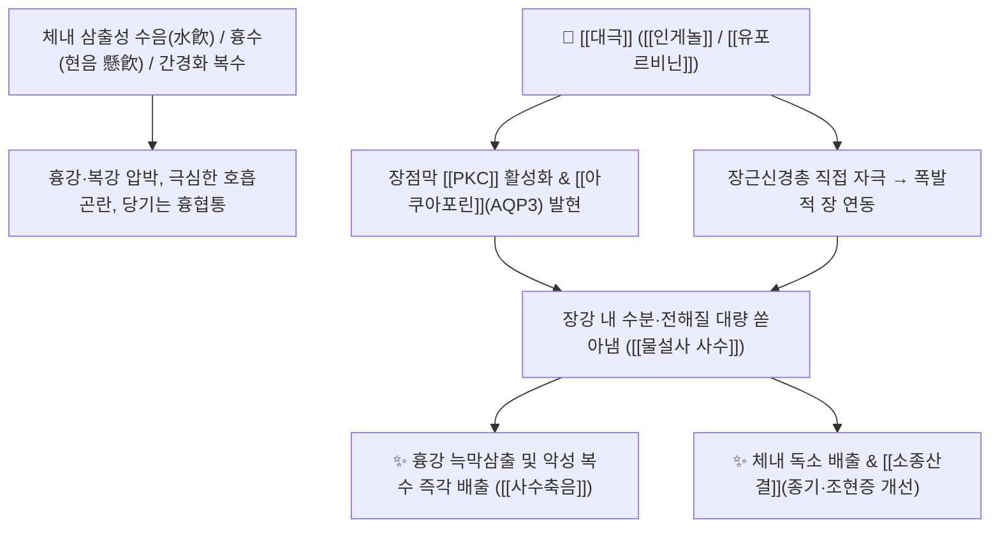

# 🌿 [[대극]] (大戟, Euphorbiae Pekinensis Radix)

> **핵심 요약 (Key Summary)**:
> 대극과 대극(*Euphorbia pekinensis*)의 뿌리로, 맛이 맵고 쓰고 인후를 강하게 자극하여 '대극(大戟)'이라 불렸으며 "날아가는 창(戟)처럼 효과가 맹렬하고 빠르다"는 준하축수약입니다. [[디테르페노이드]]([[인게놀]] 유도체, [[유포르비닌]]) 성분이 장점막의 수분 분비를 폭발적으로 촉진하여 강력한 물설사(사수 瀉水)와 이뇨를 일으킵니다. [[대황]](大黃)이 장내 숙변과 열독을 빼낸다면, [[대극]]은 체내 고인 병리적 수액(물)을 일거에 쏟아냅니다. 한의학적으로 [[사수축음]](瀉水逐飮), [[소종산결]](消腫散結)의 명약으로 흉수(현음 懸飮, [[십조탕]]), 간경변 복수, 전신 부종, 조현증 및 화농성 종기를 치료합니다.

---
## 📌 목차
1. [기본 본초 정보 & 화학 구조 (Pharmacognosy)](#1-기본-본초-정보--화학-구조-pharmacognosy)
2. [핵심 분자약리 기전 & 장관 수분 분비 대사](#2-핵심-분자약리-기전--장관-수분-분비-대사)
3. [독성학 및 포제(식초 수치) 메커니즘 (감초 배오 금기)](#3-독성학-및-포제식초-수치-메커니즘-감초-배오-금기)
4. [사상의학 및 체질별 임상 응용 (적응증 vs 금기)](#4-사상의학-및-체질별-임상-응용-적응증-vs-금기)
5. [상한론 『약징(藥徵)』 분석: 대극 vs 대황의 배독 감별](#5-상한론-약징藥徵-분석-대극-vs-대황의-배독-감별)
6. [핵심 처방 비교 매트릭스](#6-핵심-처방-비교-매트릭스)
7. [출처 및 학술 참고 문헌 (References)](#7-출처-및-학술-참고-문헌-references)

---
## 1. 기본 본초 정보 & 화학 구조 (Pharmacognosy)

| 항목 | 상세 내용 |
| :--- | :--- |
| **기원 식물** | 대극과(Euphorbiaceae) 대극 *Euphorbia pekinensis* Rupr. 또는 낭독대극 *Euphorbia fischeriana* Steud.의 뿌리 |
| **성미 (性味)** | 苦·辛, 寒, 有毒 (유독) |
| **귀경 (歸經)** | 肺·脾·腎·大腸經 (폐경, 비경, 신경, 대장경) |
| **효능 (Actions)** | [[사수축음]](瀉水逐飮), [[소종산결]](消腫散結), [[파적도체]](破積導滯) |
| **주요 성분** | • [[디테르페노이드]]: [[인게놀]] (Ingenol) 유도체, [[유포르비닌]] (Euphorbion), Pekinensis A~F<br>• 트리테르펜 및 유기산: Euphol, $\beta$-Amyrin, Citric acid, Oxalic acid<br>• 플라보노이드: Quercetin, Kaempferol |

---
## 2. 핵심 분자약리 기전 & 장관 수분 분비 대사



### (1) 폭발적 장관 사수 및 이뇨 작용
* **체내 정체 수액의 일거 배출**:
  * 장관 상피세포의 수분 수송체를 활성화하고 장벽을 강하게 자극하여, 완고한 흉수(삼출성 늑막염), 간경변 복수, 신장염 전신 부종을 물설사로 신속히 쏟아냅니다.
* **소종산결 및 정신 질환(조현증) 응용**:
  * 담음(痰飮)과 어혈이 뭉친 복부 종괴(징가적취)와 피부 옹종을 삭이며, 담화(痰火)가 뇌를 교란하여 생기는 광증(조현증, 정신분열)에서 담음을 사하하여 치료합니다.

---
## 3. 독성학 및 포제(식초 수치) 메커니즘 (감초 배오 금기)

```
[⚠️ 식초 수치 ([[초대극]] 醋大戟)]
• 생용(生用) 대극은 인후와 위점막에 심한 출혈성 자극을 주므로, 쌀식초(米醋)와 함께 볶아(초대극) 자극성 디테르펜을 가수분해시켜 독성을 반감시킨 후 사용.

[⛔ 십팔반(十八反) 배오 금기]
• [[감초]](甘草)와 동용 절대 금지: 감초의 글리시리진이 대극 독성 성분의 간 대사 및 배설을 차단하여 치명적 중독 유발.
• [[산약]](山藥)과도 배오를 피함.
```

---
## 4. 사상의학 및 체질별 임상 응용 (적응증 vs 금기)

```
[✅ 최적 적응증 (Sweet Spot)]
• 실증(實證)의 완고한 체액 저류: 늑막삼출(현음), 간경변 복수, 신우신염의 극심한 부종
• 옆구리가 결리고 기침할 때 당기는 통증(懸飮)
• 화농성 악성 종기, 나력(림프절 결핵), 담화 상충 조현증

[⚠️ 절대 금기 (Contraindication)]
• 임산부 (절대 복용 금지)
• 허약자, 노약자, 만성 설사 환자
```

---
## 5. 상한론 『약징(藥徵)』 분석: 대극 vs 대황의 배독 감별

### (1) 『[[약징]]』에 나타난 대극의 주치
> **"大戟 主治水氣也. 故治牽引, 欬, 旁治胸脇滿, 痛, 乾嘔, 氣喘..."**  
> (대극의 주치는 수기(水氣)이다. 그러므로 당기는 통증(牽引), 기침(欬)을 치료하고 흉협만통, 헛구역질, 숨참을 곁들여 치료한다.)

* **대극 vs 대황의 배독 감별**:
  * [[대황]](大黃): 장관의 숙변과 적열(積熱)을 고형성 변으로 사하.
  * [[대극]](大戟): 대황의 연장선상에 있으나, 체내의 병리적 수액(독소)을 **물설사(水瀉)**로 일거에 쏟아냄.

---
## 6. 핵심 처방 비교 매트릭스

| 처방명 | 구성 약재 | 주치 병증 및 임상 타깃 | 특징 및 감별점 |
| :--- | :--- | :--- | :--- |
| [[십조탕]] | [[원화]], [[대극]], [[감수]], [[대추|대조]] | **현음(懸飮), 흉막삼출, 기침 시 옆구리 당김 통증** | 3대 축수약을 대조 달인 물로 복용 |
| [[대극환]] | [[대극]], [[백강잠]], [[사상자]] | **악성 나력, 임파선 종대, 화농성 피부 종기** | 소종산결 및 해독 |
| [[공수단]] | [[대극]], [[감수]], [[흑축]], [[빈랑]] 등 | **실증 복수, 고창(鼓脹), 소변불리** | 강력한 축수 사하방 |

---
## 7. 출처 및 학술 참고 문헌 (References)

1. **Wang KL et al. (2015)**. [Totoxicity fraction from Euphorbia pekinensis and composition change after vinegar processing]. *Zhongguo Zhong yao za zhi = Zhongguo zhongyao zazhi = China journal of Chinese materia medica*, 40(23): 4603-8. [PMID: 27141670](https://pubmed.ncbi.nlm.nih.gov/27141670/)
   - **[연구 요약]**: 식초 수치 과정에서 대극의 자극성 인게놀계 디테르페노이드가 분해되어 위장관 자극 독성이 유의하게 감소함을 입증.
2. **대한민국약전(KP) 제12개정 (2022)**. 의약품각조 제2부: 대극 (Euphorbiae Pekinensis Radix) 규격 기준.
   - **[공정서 규격]**: 대극 뿌리 규격, 건조감량, 회분 명시.
3. **길익동동 (1784)**. 『약징(藥徵)』: 大戟 조문.
   - **[고전 원전]**: 수기(水氣), 견인통(牽引), 천해(喘咳)에 대한 축수 적응증 수록.
