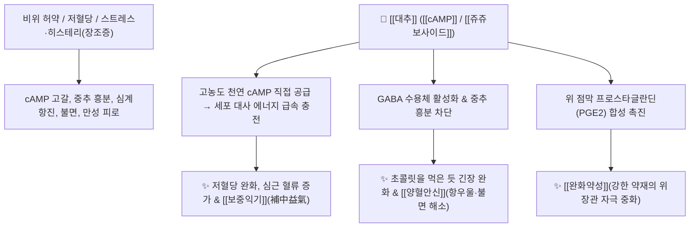

---
aliases:
  - 대추
  - 대조
  - 大棗
  - Zizyphi Fructus
---

# 🌿 [[대추]] / [[대조]] (大棗, Zizyphi Fructus)

> **핵심 요약 (Key Summary)**:
> 갈매나무과 대추나무(*Zizyphus jujuba*)의 성숙한 열매로, 당류와 미네랄, 비타민이 풍부하여 마치 "초콜릿을 먹은 듯 몸과 마음을 이완시키고 저혈당을 완화"하는 천연 진정·에너지원입니다. 천연 [[cAMP]](Cyclic AMP) 함량이 식물계 중 가장 높아 심근 대사와 면역을 활성화하며, [[쥬쥬보사이드]](Jujuboside A/B) 성분이 중추성 [[GABA_A 수용체]]를 자극하여 항불안·항우울·수면 개선 작용을 발휘합니다. 한의학적으로 [[보중익기]](補中益氣), [[양혈안신]](養血安神), [[완화약성]](緩和藥性)의 필수 약재로 비위 허약, 식욕부진, 히스테리(장조증), 불면증 및 강렬한 약재의 독성을 조화롭게 중화([[생강]] + [[대추]])합니다.

---
## 📌 목차
1. [기본 본초 정보 & 화학 구조 (Pharmacognosy)](#1-기본-본초-정보--화학-구조-pharmacognosy)
2. [핵심 분자약리 기전 & 신경·에너지 대사 네트워크](#2-핵심-분자약리-기전--신경에너지-대사-네트워크)
3. [본초 배오학: 생강-대조(薑棗) 배오와 약성 조화의 원리](#3-본초-배오학-생강-대조薑棗-배오와-약성-조화의-원리)
4. [사상의학 및 체질별 임상 응용 (적응증 vs 금기)](#4-사상의학-및-체질별-임상-응용-적응증-vs-금기)
5. [상한론 『약징(藥徵)』 분석: 대조의 련급(攣急) 완화 기전](#5-상한론-약징藥徵-분석-대조의-련급攣急-완화-기전)
6. [핵심 처방 비교 매트릭스](#6-핵심-처방-비교-매트릭스)
7. [출처 및 학술 참고 문헌 (References)](#7-출처-및-학술-참고-문헌-references)

---
## 1. 기본 본초 정보 & 화학 구조 (Pharmacognosy)

| 항목 | 상세 내용 |
| :--- | :--- |
| **기원 식물** | 갈매나무과(Rhamnaceae) 대추나무 *Zizyphus jujuba* Mill. var. *inermis* (Bunge) Rehder 또는 대추 *Z. jujuba* Mill.의 성숙한 열매 (Zizyphi Fructus) |
| **성미 (性味)** | 甘, 溫 |
| **귀경 (歸經)** | 脾·胃·心經 (비경, 위경, 심경) |
| **효능 (Actions)** | [[보중익기]](補中益氣), [[양혈안신]](養血安神), [[완화약성]](緩和藥性), [[영위조화]](營衛調和) |
| **주요 성분** | • 2차 신호전달 물질: [[cAMP]] (Cyclic adenosine monophosphate, 식물계 최고 수준 함유)<br>• 담마란형 트리테르펜 사포닌: [[쥬쥬보사이드]] A, B (Jujuboside A, B)<br>• 트리테르펜산: [[베툴린산]] (Betulinic acid), [[올레아놀산]] (Oleanolic acid), Maslinic acid<br>• 영양 성분: 포도당, 과당, [[비타민 C]], 칼륨, 칼슘, 아연 |

---
## 2. 핵심 분자약리 기전 & 신경·에너지 대사 네트워크



### (1) 천연 cAMP 공급과 세포 대사 촉진
* **초콜릿을 먹은 듯한 안도감과 에너지 회복**:
  * 식물계 중 가장 높은 농도의 천연 [[cAMP]]와 당분을 함유하여, 저혈당 상태와 극심한 피로를 즉각 완화하고 심근 수축력 및 뇌 혈류량을 증강시킵니다.
* **중추신경 진정 및 항우울 (양혈안신 養血安神)**:
  * 사포닌인 [[쥬쥬보사이드]]가 [[GABA_A 수용체]]에 작용하여 흥분된 뇌파를 안정시키고, 여성의 갱년기 히스테리(장조증 臟躁症), 스트레스성 가슴 두근거림 및 불면증을 편안하게 가라앉힙니다.

---
## 3. 본초 배오학: 생강-대조(薑棗) 배오와 약성 조화의 원리

```
[🌿 [[생강]] + 🌿 [[대추]] 황금 배오]
• 영위 조화(營衛調和): 생강의 발산(위기 衛氣)과 대추의 수렴·자양(영혈 營血)이 만나 면역의 균형을 완성.
• 위점막 완충(緩和藥性): 부자, 대황, 감수 등 강렬하고 자극적인 약재가 위점막을 손상시키는 것을 대추의 당단백질과 점액질이 완벽히 코팅하여 방어.
```

---
## 4. 사상의학 및 체질별 임상 응용 (적응증 vs 금기)

```
[✅ 최적 적응증 (Sweet Spot)]
• 비위허약으로 식욕이 없고 기운이 없으며 피로를 자주 느끼는 환자
• 장조증(臟躁症): 이유 없이 슬퍼서 울고, 하품을 자주 하며 가슴이 두근거리는 신경쇠약 여성
• 감기약 및 독성 약물 복용 시 위장 장애를 예방하고자 할 때

[⚠️ 신중 투여 및 주의점 (Caution)]
• 중만습성(中滿濕盛): 평소 배가 팽팽하게 부르고 가스가 차며 충치나 치통이 있는 경우 과다 복용 주의
```

---
## 5. 상한론 『약징(藥徵)』 분석: 대조의 련급(攣急) 완화 기전

### (1) 『[[약징]]』에 나타난 대조의 주치
> **"大棗 主治攣急, 强痙也. 旁治咳嗽, 奔豚, 煩躁, 脇痛, 腹痛, 冒眩..."**  
> (대조의 주치는 근육과 복부의 당김(攣急)과 뻣뻣한 경련(强痙)이다. 기침, 분돈, 번조, 협통, 복통을 곁들여 치료한다.)

* 급격한 근육 연축과 통증을 단맛(甘味)으로 느슨하게 풀어주는 완급지통(緩急止痛)의 명약입니다.

---
## 6. 핵심 처방 비교 매트릭스

| 처방명 | 구성 약재 | 주치 병증 및 임상 타깃 | 특징 및 감별점 |
| :--- | :--- | :--- | :--- |
| [[감맥대조탕]] | [[감초]], [[소맥]], [[대조]] | **부인 장조증, 히스테리, 이유 없는 슬픔과 울음, 불면** | 3대 감미 약재의 천연 항우울·신경안정 명방 |
| [[계지탕]] | [[계지]], [[작약]], [[생강]], [[대조]], [[감초]] | **외감풍한, 발열, 오풍, 자한출(식은땀)** | 영위(營衛)를 조화시키는 상한론 제1방 |
| [[십조탕]] | [[원화]], [[대극]], [[감수]], [[대조]] | **현음(懸飮), 흉막삼출, 기침 협통** | 3대 준하약의 독성을 대추 달인 물로 완충 |

---
## 7. 출처 및 학술 참고 문헌 (References)

1. **Han, B. H., et al. (1987)**. Sedative activity and active components of *Zizyphus jujuba* seed and fruit. *Archives of Pharmacal Research*, 10(4), 203-207.
   - **[연구 요약]**: 대추의 [[쥬쥬보사이드]] 및 [[cAMP]] 성분이 중추 억제성 GABA 신경계를 활성화하여 강력한 진정, 항우울 및 수면 촉진 효과를 유도함을 규명.
2. **대한민국약전(KP) 제12개정 (2022)**. 의약품각조 제2부: 대추 (Zizyphi Fructus) 규격 기준.
   - **[공정서 규격]**: 대추 과육 규격, 건조감량, 회분 및 순도시험 명시.
3. **길익동동 (1784)**. 『약징(藥徵)』: 大棗 조문.
   - **[고전 원전]**: 연급(攣急), 강경(强痙), 번조(煩躁) 치료 조문 수록.