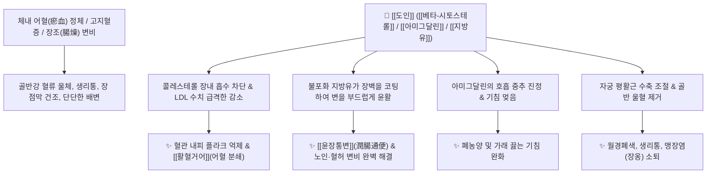

# 🌿 [[도인]] (桃仁, Persicae Semen)

> **핵심 요약 (Key Summary)**:
> 장미과 복사나무(*Prunus persica*) 또는 산복사(*Prunus davidiana*)의 잘 익은 씨앗(종인)으로, 복숭아처럼 혈관을 확장시키고 생기를 돌게 하는 활혈윤장약입니다. 식물성 스테롤인 [[베타-시토스테롤]]($\beta$-Sitosterol)과 [[캄페스테롤]](Campesterol)이 장내 콜레스테롤 흡수를 차단하여 LDL을 낮추고 혈관을 청소하며, 50%에 달하는 불포화 지방유가 장관을 미끄럽게 코팅합니다. 또한 청산 배당체인 [[아미그달린]](Amygdalin)이 기침을 멎게 합니다. 한의학적으로 [[활혈거어]](活血祛瘀), [[윤장통변]](潤腸通便)의 명약으로 어혈성 무월경, 생리통, 자궁근종(징가), 타박상, 맹장염(장옹), 폐농양 및 혈허 장조변비를 치료합니다.

---
## 📌 목차
1. [기본 본초 정보 & 화학 구조 (Pharmacognosy)](#1-기본-본초-정보--화학-구조-pharmacognosy)
2. [핵심 분자약리 기전 & 지질 대사·장관 윤활 네트워크](#2-핵심-분자약리-기전--지질-대사장관-윤활-네트워크)
3. [본초 감별: 도인(혈어변비) vs 행인(기체변비)의 임상 선택](#3-본초-감별-도인혈어변비-vs-행인기체변비의-임상-선택)
4. [사상의학 및 체질별 임상 응용 (적응증 vs 금기)](#4-사상의학-및-체질별-임상-응용-적응증-vs-금기)
5. [배오 원리 및 한의학적 고찰 (유래와 특징)](#5-배오-원리-및-한의학적-고찰-유래와-특징)
6. [핵심 처방 비교 매트릭스](#6-핵심-처방-비교-매트릭스)
7. [출처 및 학술 참고 문헌 (References)](#7-출처-및-학술-참고-문헌-references)

---
## 1. 기본 본초 정보 & 화학 구조 (Pharmacognosy)

| 항목 | 상세 내용 |
| :--- | :--- |
| **기원 식물** | 장미과(Rosaceae ; 薔薇科) 복사나무 *Prunus persica* (L.) Batsch 또는 산복사나무 *Prunus davidiana* (Carrière) Franch.의 성숙한 씨앗 (Persicae Semen) |
| **성미 (性味)** | 苦·甘, 平 |
| **귀경 (歸經)** | 心·肝·大腸·肺經 (심경, 간경, 대장경, 폐경) |
| **효능 (Actions)** | [[활혈거어]](活血祛瘀), [[윤장통변]](潤腸通便), [[지해평천]](止咳平喘), [[소옹생기]](消癰生肌) |
| **주요 성분** | • [[청산 배당체]] (KP [[아미그달린]] $\ge 1.5\%$): [[아미그달린]] (Amygdalin), Prunasin<br>• 식물성 스테롤: [[베타-시토스테롤]] ($\beta$-Sitosterol), [[캄페스테롤]] (Campesterol)<br>• 불포화 지방유 (약 45~50%): Oleic acid, Linoleic acid<br>• 플라보노이드 및 정유: Persicogenin |

---
## 2. 핵심 분자약리 기전 & 지질 대사·장관 윤활 네트워크



### (1) 피토스테롤의 지질 대사 개선과 활혈거어
* **콜레스테롤 흡수 차단**:
  * [[베타-시토스테롤]]과 [[캄페스테롤]]은 장내에서 외인성 및 내인성 콜레스테롤의 미셀(Micelle) 형성을 방해하여 LDL 수치를 낮추고 죽상경화를 예방합니다.
* **지방유의 윤장통변 (潤腸通便)**:
  * 50%에 달하는 풍부한 지방유가 메마른 대장 점막을 촉촉하고 미끄럽게 적셔주어, 자극 없이 부드럽게 변을 배출시킵니다.
* **아미그달린의 진해 및 폐농양 치료**:
  * 호흡기 점막의 염증을 가라앉히고 기침을 멎게 하며, 장옹(맹장염)과 폐옹(폐농양)의 화농성 염증을 삭입니다.

---
## 3. 본초 감별: 도인(혈어변비) vs 행인(기체변비)의 임상 선택

```
[🌿 [[도인]] (Persicae Semen)]
• 병리 타깃: 혈어(血瘀) 및 혈허(血虛)로 인한 변비.
• 임상 징후: 얼굴이 검붉거나 거칠고, 생리통·어혈 멍울이 있으며, 대변이 밤톨처럼 굳은 경우.

[🌿 [[행인]] (Armeniacae Semen)]
• 병리 타깃: 폐기(肺氣) 울체 및 담음으로 인한 변비.
• 임상 징후: 기침, 가래, 숨참이 동반되고 가슴이 답답하며 대변이 안 나오는 경우.
```

---
## 4. 사상의학 및 체질별 임상 응용 (적응증 vs 금기)

```
[✅ 최적 적응증 (Sweet Spot)]
• 부인과 어혈 질환: 생리통(통경), 무월경(경폐), 자궁근종, 산후 오로 정체
• 혈허(血虛) 및 노인성 장조 변비 (장이 말라 변이 굳은 경우)
• 급성 맹장염(장옹), 폐렴 후기 기침과 피고름 가래, 타박상 피멍

[⚠️ 절대 금기 (Contraindication)]
• 임산부 (활혈파어 작용으로 유산 위험이 있으므로 금기)
```

---
## 5. 배오 원리 및 한의학적 고찰 (유래와 특징)

### (1) 유래 및 형상의학
* 붉고 탐스러운 복숭아의 씨앗으로, 분홍빛 과육처럼 혈관을 확장시키고 생기를 돌게 하여 뭉친 피(어혈)를 시원하게 풀어냅니다.

### (2) 핵심 약재 배오
* [[도인]] + [[홍화]]: 어혈을 깨뜨리는 최강의 짝궁 배오 ([[도홍사물탕]]).
* [[도인]] + [[대황]] / [[계지]]: 하초 축혈과 광증, 극심한 생리통을 사하하는 배오 ([[도핵승기탕]]).

---
## 6. 핵심 처방 비교 매트릭스

| 처방명 | 구성 약재 | 주치 병증 및 임상 타깃 | 특징 및 감별점 |
| :--- | :--- | :--- | :--- |
| [[도핵승기탕]] | [[도인]], [[대황]], [[계지]], [[망초]], [[감초]] | **하초 축혈, 어혈성 생리통, 산후 어혈 발광, 변비** | 어혈과 숙변을 동시에 사하 |
| [[계지복령환]] | [[계지]], [[복령]], [[목단피]], [[도인]], [[작약]] | **부인 징가적취, 자궁근종, 난소낭종, 생리불순** | 활혈화어와 완화한 종괴 삭임 |
| [[대황목단피탕]] | [[대황]], [[목단피]], [[도인]], [[과루인]], [[망초]] | **장옹(급성 충수돌기염/맹장염), 하복부 압통, 발열** | 장관의 화농성 농양 배출 |

---
## 7. 출처 및 학술 참고 문헌 (References)

   **Moghal ZKB et al. (2026)**. Attenuating amygdalin (vitamin B17) toxicity for potential therapeutic uses: insights into controlled release technology-based formulations as a strategy for improving clinical safety. *Expert opinion on drug delivery*, 23: 83-97. [PMID: 41036766](https://pubmed.ncbi.nlm.nih.gov/41036766/)
   - **[연구 요약]**: 아미그달린(도인 지표성분)의 독성과 치료적 활용 가능성에 대한 리뷰.
2. **대한민국약전(KP) 제12개정 (2022)**. 의약품각조 제2부: 도인 (Persicae Semen) 규격 기준.
   - **[공정서 규격]**: 아미그달린 1.5% 이상 함유 규격 명시.
