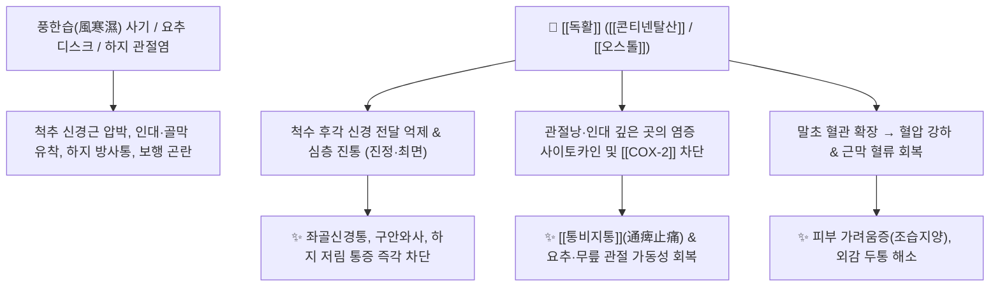

# 🌿 [[독활]] (獨活, Araliae Continentalis / Angelicae Pubescentis Radix)

> **핵심 요약 (Key Summary)**:
> 두릅나무과 독활(*Aralia continentalis*, 한국 땅두릅) 또는 산형과 중치모독활(*Angelica biserrata*, 중국 독활)의 뿌리로, "바람이 불어도 홀로 흔들리지 않고 굳세게 서 있다(獨搖草)"는 이름처럼 체내 깊숙이 침투한 풍한습(風寒濕)을 뿌리 뽑는 거풍습약입니다. 디테르펜산인 [[콘티넨탈산]](Continentalic acid)과 [[피마르산]](Pimaric acid), [[올레아놀산]](Oleanolic acid), [[오스톨]](Osthole) 성분이 척추 신경근과 관절막, 인대 심층부의 염증과 통증을 강력히 차단합니다. [[강활]](羌活)이 상지(경추·어깨 표층 근육통)에 특화되었다면, [[독활]]은 **하지(요추 디스크·골반·무릎·심층 인대/골막통)**를 지배합니다. 한의학적으로 [[거풍승습]](祛風勝濕), [[통비지통]](通痺止痛)의 최고 명약으로 요추간판탈출증(디스크), 퇴행성 관절염, 좌골신경통, 구안와사 및 두통을 치료합니다.

---
## 📌 목차
1. [기본 본초 정보 & 화학 구조 (Pharmacognosy)](#1-기본-본초-정보--화학-구조-pharmacognosy)
2. [핵심 분자약리 기전 & 신경·관절 대사 네트워크](#2-핵심-분자약리-기전--신경관절-대사-네트워크)
3. [해부생체역학: 강활(상지 근육통) vs 독활(하지 인대·골막통)의 심도 감별](#3-해부생체역학-강활상지-근육통-vs-독활하지-인대골막통의-심도-감별)
4. [사상의학 및 체질별 임상 응용 (적응증 vs 금기)](#4-사상의학-및-체질별-임상-응용-적응증-vs-금기)
5. [배오 원리 및 한의학적 고찰 (유래와 특징)](#5-배오-원리-및-한의학적-고찰-유래와-특징)
6. [핵심 처방 비교 매트릭스](#6-핵심-처방-비교-매트릭스)
7. [출처 및 학술 참고 문헌 (References)](#7-출처-및-학술-참고-문헌-references)

---
## 1. 기본 본초 정보 & 화학 구조 (Pharmacognosy)

| 항목 | 상세 내용 |
| :--- | :--- |
| **기원 식물** | • 한국공정서: 두릅나무과(Araliaceae) 독활(땅두릅) *Aralia continentalis* Kitag.의 뿌리<br>• 중국약전: 산형과(Apiaceae) 중치모독활 *Angelica biserrata* Shan et Yuan의 뿌리 |
| **성미 (性味)** | 辛·苦, 微溫 |
| **귀경 (歸經)** | 腎·膀胱·肝經 (신경, 방광경, 간경) |
| **효능 (Actions)** | [[거풍승습]](祛風勝濕), [[통비지통]](通痺止痛), [[해표산한]](解表散寒), [[조습지양]](燥濕止痒) |
| **주요 성분** | • [[디테르펜산]] (한국 독활 지표): [[콘티넨탈산]] (Continentalic acid), [[피마르산]] (Pimaric acid), Kauradienoic acid<br>• 사포닌 및 트리테르펜: [[올레아놀산]] (Oleanolic acid), Araliosides, $\beta$-[[시토스테롤]]<br>• 쿠마린류 (중국 독활 지표): [[오스톨]] (Osthole), [[콜룸비아나딘]] (Columbianadin), [[페룰산]] (Ferulic acid) |

### 🔬 지표물질 화학 구조
![[image-13.png|450]]
> **[독활의 주요 약리 성분 구조]**: 콘티넨탈산 및 피마르산의 디테르펜 골격을 통한 항염증·심층 진통 작용.

---
## 2. 핵심 분자약리 기전 & 신경·관절 대사 네트워크



### (1) 척추 신경근 및 심층 결합조직 진통
* **심층 인대 및 골막 염증 차단**:
  * [[콘티넨탈산]]과 [[오스톨]] 성분이 척추 신경근 주위의 염증성 부종을 가라앉히고 척수 레벨에서 통증 신호를 차단하여, 좌골신경통과 요통을 획기적으로 개선합니다.
* **진정, 혈압 강하 및 조습지양 (燥濕止痒)**:
  * 중추신경 진정 및 항경련 작용을 나타내며, 혈압을 강하시키고 피부 가려움증과 풍습성 두통을 치료합니다.

---
## 3. 해부생체역학: 강활(상지 근육통) vs 독활(하지 인대·골막통)의 심도 감별

```
[🌿 [[강활]] (Notopterygii Rhizoma et Radix)]
• 해부학적 타깃: 상초(上焦) - 경추(C-spine), 승모근, 견갑거근, 어깨 등 **표층 근육계**.
• 병리 특성: 풍한(風寒) 사기로 인한 급성 근육통, 오한, 표증(表證).

[🌿 [[독활]] (Araliae Continentalis Radix)]
• 해부학적 타깃: 하초(下焦) - 요추(L-spine), 천장관절, 둔근, 무릎의 **심층 인대·디스크·골막계**.
• 병리 특성: 풍습(風濕) 사기가 깊숙이 침범하여 오래된 만성 퇴행성 관절통, 신경통, 저림.
```

---
## 4. 사상의학 및 체질별 임상 응용 (적응증 vs 금기)

```
[✅ 최적 적응증 (Sweet Spot)]
• 만성 요통, 요추 추간판 탈출증(디스크), 척추관 협착증, 좌골신경통
• 무릎 퇴행성 관절염, 족저근막염, 발목 만성 염좌
• 안면신경마비(구안와사), 풍한습성 후두통 및 피부 소양증

[⚠️ 신중 투여 및 금기 (Caution / Contraindication)]
• 음허화왕(陰虛火旺)으로 관절에 열감이 심하고 붉게 부어오른 열비(熱痺)
• 혈허(血虛)로 인한 사지 경련 환자
```

---
## 5. 배오 원리 및 한의학적 고찰 (유래와 특징)

### (1) 유래 및 본초 성질
* 다른 풀들은 바람이 불면 흔들리지만 독활은 홀로 꿋꿋이 서서 흔들리지 않는다 하여 독요초(獨搖草)라 불렸으며, 몸속의 굳센 풍습을 몰아내는 명약입니다.

### (2) 핵심 약재 배오
* [[독활]] + [[상기생]] / [[두충]] / [[우슬]]: 간신을 보하고 하지 관절과 허리를 강하게 하는 불멸의 배오 ([[독활기생탕]]).
* [[독활]] + [[강활]]: 상초와 하초의 전신 풍습 관절통을 동시에 다스리는 배오.

---
## 6. 핵심 처방 비교 매트릭스

| 처방명 | 구성 약재 | 주치 병증 및 임상 타깃 | 특징 및 감별점 |
| :--- | :--- | :--- | :--- |
| [[독활기생탕]] | [[독활]], [[상기생]], [[두충]], [[우슬]], [[세신]], [[진교]], [[당귀]], [[숙지황]] 등 | **간신양허, 만성 요통, 척추 디스크, 퇴행성 슬관절염, 하지 무력** | 근골을 보하고 풍습을 쫓는 제1 명방 |
| [[독활탕]] | [[독활]], [[강활]], [[방풍]], [[천궁]] 등 | **구안와사(안면신경마비), 풍습성 두통, 경항통** | 풍사를 날리고 경락 개통 |
| [[대진교탕]] | [[진교]], [[독활]], [[강활]], [[방풍]], [[당귀]], [[숙지황]] 등 | **중풍 초기, 안면마비, 사지 굴신불리** | 기혈을 보하며 거풍통락 |

---
## 7. 출처 및 학술 참고 문헌 (References)

2. **대한민국약전(KP) 제12개정 (2022)**. 의약품각조 제2부: 독활 (Araliae Continentalis Radix) 규격 기준.
   - **[공정서 규격]**: 독활 뿌리 규격, 건조감량, 회분 명시.

---

## 📎 개념 학습 보충 (2026-09-01 논문 연계)

- 2026-09-01 심층리뷰 4번(한약재 유래 활성 성분의 항염·연골 보호 리뷰): 골관절염·건초염 치료에 쓰이는 대표 본초로 독활이 언급됨 — 활성 성분이 **MMP(연골 기질 분해 효소) 발현 억제·[[NF-κB]] 신호 차단**으로 관절 내 염증을 억제하는 분자 기전 연구
- 위 표의 콘티넨탈산 연구(Park 2005, COX-2/iNOS 차단)와 연결하면: 항염 경로(COX-2·iNOS)와 연골 보호 경로(MMP·NF-κB)가 **겹치는 상류 신호**를 공유 — 거풍제습약의 현대적 해석
- 독활기생탕([[독활기생탕]])은 요추부 질환([[만성 요통]]·[[요추 추간판 탈출증]])·퇴행성 슬관절염 처방으로 연결
- 함께 보기: [[퇴행성 관절염]] · [[NF-κB]] · [[MMP]] · [[낙석등]] · [[2026-09-01_근골격계_척추관절_심층리뷰]]
