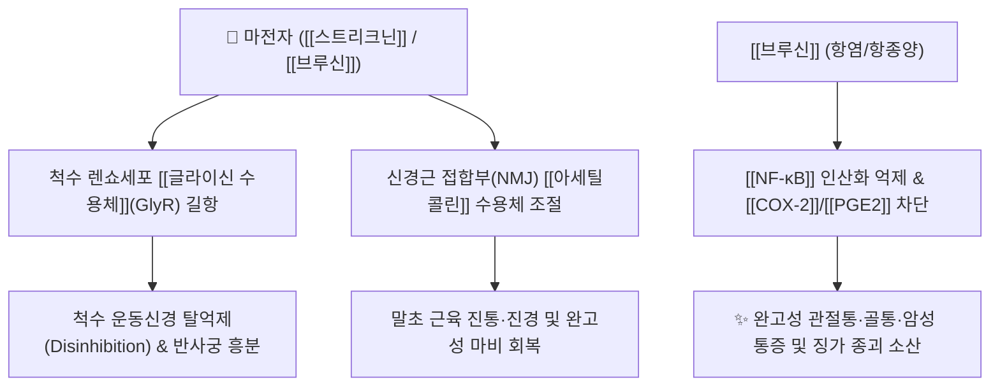

# 🌿 [[마전자]] (馬錢子, Strychni Semen)

> **핵심 요약 (Key Summary)**:
> 마전과(*Loganiaceae*) 마전(*Strychnos nux-vomica* L.)의 성숙한 씨
> 핵심 인돌 알칼로이드인 [[스트리크닌]](Strychnine)과 [[브루신]](Brucine)이 척수 반사궁의 [[글라이신 수용체]](GlyR)를 길항하여 신경근 흥분성을 극대화하고 강력한 진통·소염 작용 발휘
> 완고한 신경마비, 중풍 후유증, 암성 동통, [[통락지통]](通絡止痛) 및 [[산결소종]](散結消腫)의 대표적인 극독성 거풍습 통락약

---
## 📌 목차
1. [기본 본초 정보 & 화학 구조 (Pharmacognosy)](#1-기본-본초-정보--화학-구조-pharmacognosy)
2. [핵심 분자약리 기전 & 신경·면역 네트워크](#2-핵심-분자약리-기전--신경면역-네트워크)
3. [해부생체역학 / 근육·신경 대사 연계](#3-해부생체역학--근육신경-대사-연계)
4. [사상의학 및 체질별 임상 응용 (적응증 vs 독성 관리)](#4-사상의학-및-체질별-임상-응용-적응증-vs-독성-관리)
5. [고전 의학 및 배오 원리 (전통 약화 분석)](#5-고전-의학-및-배오-원리-전통-약화-분석)
6. [핵심 처방 비교 매트릭스](#6-핵심-처방-비교-매트릭스)
7. [출처 및 학술 참고 문헌 (References)](#7-출처-및-학술-참고-문헌-references)

---
## 1. 기본 본초 정보 & 화학 구조 (Pharmacognosy)

| 항목 | 상세 내용 |
| :--- | :--- |
| **기원 식물** | 마전과(Loganiaceae) 마전 *Strychnos nux-vomica* L.의 여문 씨(종자) |
| **성미 (性味)** | 苦, 寒, 有大毒(대독) |
| **귀경 (歸經)** | 肝·脾經 (간경, 비경) |
| **효능 (Actions)** | [[통락지통]](通絡止痛), [[산결소종]](散結消腫), 거풍습(祛風濕), 해독산결(解毒散結) |
| **주요 성분** | • **인돌 알칼로이드(Indole Alkaloids)**: [[스트리크닌]](Strychnine, KP 규격 $\ge 1.20\%$), [[브루신]](Brucine, KP 규격 $\ge 0.65\%$), [[이소스트리크닌]](Isostrychnine), [[브루신 N-옥사이드]](Brucine N-oxide)<br>• **이리도이드 배당체**: [[로가닌]](Loganin)<br>• **기타 성분군**: 비스벤질이소퀴놀린계 유도체 및 [[d-투보쿠라린]] 유사 신경근 접합 조절 복합체 |

> **[유래 및 명칭 고찰]**:
> * 말의 발굽(馬蹄) 및 엽전(銅錢)과 모양이 비슷하여 '마전자(馬錢子)'라 불렸습니다. 
> * 고대 의록에서는 말고기를 먹고 풍습(風濕)이 침범하여 체하고 아프며 기침하는 증상, 한열(寒熱) 사기의 침범으로 인한 완고한 관절통과 인후종통, 복중 징가(적취)를 치료하는 맹독성 약재로 전해집니다.

### 🔬 마전자의 주요 지표물질 화학 구조
![[마전자-20240916021156592.png|520]]
> **[구조적 특징 및 활성]**: 마전자의 주 활성 지표인 [[스트리크닌]]은 다환성 인돌 알칼로이드로 지용성이 매우 높아 혈액-뇌 장벽(BBB)을 신속히 통과합니다. 벤젠 고리에 메톡시기($-\text{OCH}_3$)가 2개 추가된 [[브루신]]은 스트리크닌보다 중추 독성이 약 1/5 수준으로 낮으면서도 강력한 말초성 진통·항염증 활성을 나타냅니다.

---
## 2. 핵심 분자약리 기전 & 신경·면역 네트워크



### (1) 표적 수용체 및 신호전달 경로
* [[글라이신 수용체]](GlyR) 선택적 길항:
  * 척수 회백질의 억제성 개재뉴런인 렌쇼 세포(Renshaw cell)에서 분비되는 [[글라이신]](Glycine)의 결합을 경쟁적으로 차단합니다.
  * 억제 기전이 소실됨으로써 척수 반사궁의 흥분 전도가 극도로 촉진되어 감각 및 운동 신경 반응성이 증가합니다.
* **신경근 접합부([[아세틸콜린]]) 조절 및 마비 기전**:
  * 비스벤질이소퀴놀린계 알칼로이드 골격과 [[d-투보쿠라린]] 유사 작용으로 운동신경 말단에서 방출되는 [[아세틸콜린]]과 길항적 경쟁을 일으켜 병리적 경련 상태를 이완시키고 통증 경로를 차단합니다.
  * **중독 시 마비 발현 순서**: 안면근/눈·귀·발가락 등 단근(短筋) $\rightarrow$ 사지 원위부 근육 $\rightarrow$ 경항부 근육 $\rightarrow$ 늑간근 및 횡격막(호흡근) 마비(질식 위험).
* **항염증 및 항종양 활성 ([[브루신]])**:
  * [[브루신]]은 대식세포에서 [[NF-κB]] 핵 내 이동을 차단하여 [[TNF-α]], [[IL-1β]], [[COX-2]] 및 [[PGE2]] 발현을 현저히 억제합니다.
  * 종양 세포의 혈관신생(VEGF)을 차단하고 아폽토시스(Apoptosis)를 유도하여 [[산결소종]](종양 및 림프절 종대 억제) 효과를 나타냅니다.

---
## 3. 해부생체역학 / 근육·신경 대사 연계

* **근육 섬유 대사 ([[지근]] vs [[속근]])**:
  * [[속근]](Type II 근육): 억제성 신경 차단으로 인해 척수 반사가 촉발되면 속근 섬유의 급격한 칼슘 유입 및 강직성 수축(Tetanic contraction)이 일어납니다.
  * **치료 농도에서의 조절**: 미세 조절 용량 투여 시 이완성 마비(Flaccid paralysis)에 빠진 지근 및 속근의 운동단위(Motor unit) 발화를 자극하여 만성 뇌졸중 후 근위축과 불완전 마비 회복을 촉진합니다.
* **자율신경 및 혈관계 조절**:
  * 연수 혈관운동중추를 흥분시켜 말초 혈관 수축 및 혈압 상승을 유도하며, 감각신경 역치를 높여 만성 난치성 신경통(삼차신경통, 좌골신경통)을 제어합니다.

---
## 4. 사상의학 및 체질별 임상 응용 (적응증 vs 독성 관리)

```
[✅ 최적 적응증 (Sweet Spot)]
• 뇌혈관 사고 후유증: 반신불수, 안면신경마비(구안와사), 혀가 굳어 말을 못하는 경우
• 완고한 풍습비통: 류마티스 관절염, 강직성 척추염, 말기 암성 골통증
• 외용 산결: 악성 종기, 림프절 결핵(나력), 완고한 타박어혈 및 연부조직 종괴

[⚠️ 신중 투여 및 금기 (Caution / Contraindication)]
• 절대 금기: 임산부, 소아, 고혈압, 간신장 기능 부전, 심혈관 질환 환자
• 법제 필수: 생용(生用) 금지, 반드시 모래로 볶거나(탕포 燙炮) 기름에 튀겨 독성 스트리크닌 함량을 감량한 포마전자(炮馬錢子) 사용
• 용량 엄수: 1일 내복량 극량 0.3~0.6g(가루약 기준), 점증 투약 후 중단기 유지
```

---
## 5. 고전 의학 및 배오 원리 (전통 약화 분석)

### (1) 고전 본초학적 주치와 방치
> **"馬錢子 苦寒有大毒, 開通經絡, 透關節, 散結消腫, 止痛..."**  
> (마전자는 성미가 쓰고 차며 대독이 있어, 경락을 개통시키고 관절의 막힘을 뚫어주며 종결을 흩어버리고 통증을 멎게 한다.)

* **약재 배오의 묘미**:
  * [[마전자]] + [[마황]] $\rightarrow$ 경락의 한습(寒濕)을 뚫고 완고한 마목(痲木) 관절통 해소
  * [[마전자]] + [[유향]] + [[몰약]] $\rightarrow$ 어혈 종괴 소산 및 극심한 타박 골절 동통 완화
  * [[마전자]] + [[감초]] $\rightarrow$ 스트리크닌 알칼로이드의 흡수를 지연시켜 급격한 중독 반응 완화

---
## 6. 핵심 처방 비교 매트릭스

| 처방명 | 구성 약재 | 주치 병증 및 임상 타깃 | 특징 및 감별점 |
| :--- | :--- | :--- | :--- |
| [[마황마전탕]] | [[마전자]](포), [[마황]], [[당귀]], [[천궁]], [[감초]] | 만성 류마티스 관절염, 완고한 사지 마비통 | 관절 강직과 한습 마목을 강력히 개통 |
| [[구룡단]] | [[마전자]], [[유향]], [[몰약]], [[혈갈]], [[지네]](오공) 등 | 중풍 후 반신마비, 구안와사, 암성 통증 | 어혈과 담음이 얽힌 신경마비 질환의 통락제 |
| [[소활락단]](가감) | [[마전자]](가감), [[초오]], [[천오]], [[담남성]], [[유향]] | 풍한습비(風寒濕痺), 관절 변형 및 극심한 야간통 | 맹독성 약재 배오로 극심한 냉증 관절 파괴 제어 |
| [[마전산]](외용) | [[마전자]](분말), [[식초]]/[[달걀흰자]] | 나력(림프절염), 유옹(유선염), 악성 종양 국소 부종 | 피부 점막 흡수를 통한 국소 종괴 축소 |

---
## 7. 출처 및 학술 참고 문헌 (References)

1. **Guo, R., Wang, T., Zhou, G., Xu, M., & Yu, X. (2018)**. Botany, phytochemistry, pharmacology and toxicity of *Strychnos nux-vomica* L.: A review. *The American Journal of Chinese Medicine*, 46(01), 1-23. doi:10.1142/S0192415X1850001X.
   - **[연구 요약]**: 마전자의 식물학, 식물화학, 분자약리 및 독성학적 프로파일 총괄 리뷰. 스트리크닌의 GlyR 억제 기전과 브루신의 항염·항암 활성, 포제(법제) 과정 중 독성 성분 전환 경로 상세 제시.
2. **Deng, X. K., Yin, F., Lu, X. Y., Lu, R. H., & Zhang, W. D. (2006)**. The apoptotic effect of brucine on human hepatoma SMMC-7721 cells through involvement of mitochondrial pathway. *Toxicology in Vitro*, 20(8), 1476-1482. doi:10.1016/j.tiv.2006.07.008.
   - **[연구 요약]**: 브루신이 미토콘드리아 카스파제 경로 활성화를 통해 간암 세포의 아폽토시스를 유도하고 NF-κB 활성을 억제하여 종양 세포 증식을 저해함을 규명.
3. **대한민국약전(KP) 제12개정 (2022)**. 의약품각조 제2부: 마전자 (Strychni Semen) 규격 기준.
   - **[공정서 규격]**: 건조물 기준 스트리크닌($\text{C}_{21}\text{H}_{22}\text{N}_2\text{O}_2$) 1.20% 이상, 브루신($\text{C}_{23}\text{H}_{26}\text{N}_2\text{O}_4$) 0.65% 이상 함유 및 비소·중금속·잔류농약 기준치 엄격 규제.
