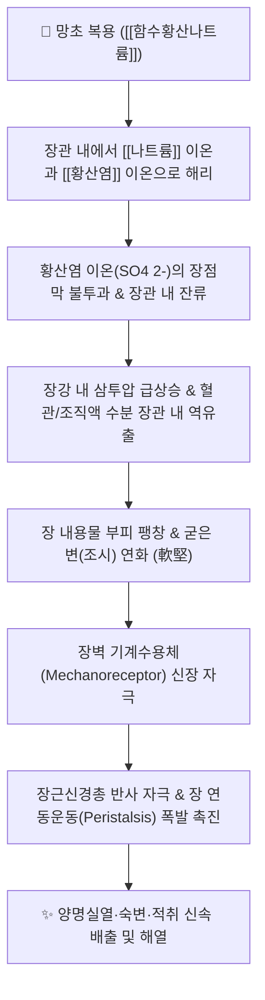

# 🌿 [[망초]] (芒硝, Natrii Sulfas)

> **핵심 요약 (Key Summary)**:
> 천연 광물 황산염계 함수황산나트륨($\text{Na}_2\text{SO}_4 \cdot 10\text{H}_2\text{O}$)의 정제 결정체
> 주성분인 [[함수황산나트륨]]이 장관 내에서 거의 흡수되지 않고 강력한 삼투압 경차를 형성하여 장관 내로 수분을 끌어당겨 분변을 연화시키고 장 연동운동 촉진
> [[상한론]] 양명병의 조열(潮熱), 섬어(讝語), 조시(燥屎, 마른 똥) 및 흉복부의 석견(石堅)한 결흉(結胸)을 치료하는 대표적인 [[사하약]](瀉下藥)이자 [[연견윤하제]](軟堅潤下劑)

---
## 📌 목차
1. [기본 본초 정보 & 화학 구조 (Pharmacognosy)](#1-기본-본초-정보--화학-구조-pharmacognosy)
2. [핵심 분자약리 기전 & 삼투성 사하 네트워크](#2-핵심-분자약리-기전--삼투성-사하-네트워크)
3. [해부생체역학 / 평활근·전해질 대사 연계](#3-해부생체역학--평활근전해질-대사-연계)
4. [사상의학 및 체질별 임상 응용 (적응증 vs 금기)](#4-사상의학-및-체질별-임상-응용-적응증-vs-금기)
5. [상한론 『약징(藥徵)』 분석 및 배오 원리](#5-상한론-약징藥徵-분석-및-배오-원리)
6. [핵심 처방 비교 매트릭스](#6-핵심-처방-비교-매트릭스)
7. [출처 및 학술 참고 문헌 (References)](#7-출처-및-학술-참고-문헌-references)

---
## 1. 기본 본초 정보 & 화학 구조 (Pharmacognosy)

| 항목 | 상세 내용 |
| :--- | :--- |
| **기원 광물** | 천연 광물 황산염계 함수황산나트륨($\text{Na}_2\text{SO}_4 \cdot 10\text{H}_2\text{O}$)을 정제하여 얻은 결정체 (포제 시 현명분 玄明粉) |
| **성미 (性味)** | 鹹·苦, 大寒 |
| **귀경 (歸經)** | 胃·大腸經 (위경, 대장경) |
| **효능 (Actions)** | [[연견사하]](軟堅瀉下), [[청열제습]](淸熱除濕), [[소종료창]](消腫療瘡), [[파혈통경]](破血通經) |
| **주요 성분** | • **주성분**: [[함수황산나트륨]] ($\text{Na}_2\text{SO}_4 \cdot 10\text{H}_2\text{O}$, KP 규격 $\text{Na}_2\text{SO}_4 \ge 99.0\%$)<br>• **미량 원소**: 염화나트륨($\text{NaCl}$), 황산마그네슘($\text{MgSO}_4$), 칼슘 염류 등 |

> **[유래 및 본초학적 기전]**:
> * 물에 닿으면 즉시 녹아 사라지므로 '소(消)'라고도 불렸으며, 소금처럼 강한 짠맛(鹹味)을 띱니다.
> * 체내 전해질과 장관 삼투 환경에 작용하여 대변을 묽게 하고 오장의 적취나 오랜 열병으로 위의 기능이 실조되어 담(痰)과 열이 엉킨 것을 아래로 씻어내립니다.

### 🔬 망초의 결정 및 용해 특성
![[Pasted image 20240227145303.png|500]]
> **[결정 구조와 물리화학적 특성]**: 망초는 단사정계 결정으로 10개의 결정수를 함유하고 있어 실온 건조 공기 중에서 풍화(Efflorescence)되어 흰 가루인 무수 황산나트륨(현명분)으로 변합니다. 물에 녹을 때 많은 열을 흡수(흡열 반응)하여 냉각 효과를 내므로, 대장의 극심한 실열(實熱)을 식혀주는 데 탁월합니다.

---
## 2. 핵심 분자약리 기전 & 삼투성 사하 네트워크



### (1) 표적 기전 및 생화학적 메커니즘
* **삼투성 완하 작용 (Osmotic Laxative)**:
  * 황산 이온($\text{SO}_4^{2-}$)은 장 점막 상피세포를 거의 통과하지 못합니다.
  * 장관 내부의 이온 농도가 급증하여 혈장과의 사이에 높은 삼투압 경차가 형성되며, 장관 주변 조직과 모세혈관으로부터 수분이 장관 내강으로 대량 유입됩니다.
* **장벽 신장 및 연동운동 촉진**:
  * 증가된 수분으로 인해 장 내용물의 부피가 팽창하여 장벽의 근층간신경총(Auerbach's plexus)을 기계적으로 자극합니다.
  * 연동운동 반사가 즉각적으로 격발되어 1~3시간 이내에 수양성 설사를 유발하며 축적된 열독과 분변을 체외로 배출합니다.
* **대식세포 및 장점막 손상 주의**:
  * 탈수력이 강하므로 장 점막이 건조하고 궤양이나 염증이 심한 환자에게는 세포 탈수로 인한 점막 손상을 가중시킬 수 있으므로 대황, 감초 등과 정밀하게 배오해야 합니다.

---
## 3. 해부생체역학 / 평활근·전해질 대사 연계

* **장관 평활근 수축 기전**:
  * 장관 팽창으로 인한 $\text{IP}_3$ 경로 활성화 및 세포질 내 칼슘 농도 증가로 윤상근과 종주근의 강력한 동시 수축을 유도합니다.
* **혈중 산염기 및 전해질 균형**:
  * 고열로 인한 체액 농축과 산증(Acidosis) 상태에서 장관을 통해 열성 대사산물과 과잉 전해질을 배출시킵니다.
  * 장기 연용 시 나트륨 과잉 축적이나 칼륨 소실(저칼륨혈증)이 유발될 수 있으므로 급성 실증에 한하여 단기 투여합니다.

---
## 4. 사상의학 및 체질별 임상 응용 (적응증 vs 금기)

```
[✅ 최적 적응증 (Sweet Spot)]
• [[양명병]] 열결실증: 고열, 섬어(헛소리), 번조, 복부 팽만 및 극심한 압통, 변비
• 조시(燥屎): 장관 내에 돌처럼 단단하게 굳은 마른 변
• 결흉증(結胸證): 흉하부와 심하부가 돌처럼 단단하고 누르면 극심한 통증이 있는 경우
• 하초 축혈 및 어혈: 아랫배가 단단하게 뭉치고 찌르는 듯 아픈 어혈 질환 (월경불순, 골반염, 충수염)
• 외용 청열소종: 유옹, 치질 종통, 인후종통, 결막염에 수용액 외용 세척

[⚠️ 신중 투여 및 금기 (Caution / Contraindication)]
• 임산부 절대 금기 (자궁 수축 유발 위험)
• 비위허한(脾胃虛寒): 평소 소화력이 약하고 설사를 자주 하는 허약자
• 만성 탈수, 심부전, 신부전 환자 (나트륨 부하 위험)
```

---
## 5. 상한론 『약징(藥徵)』 분석 및 배오 원리

### (1) 『[[약징]]』에 나타난 망초의 주치
> **"芒硝 主治堅也. 旁治心下痞堅, 心下石堅, 少腹結急, 結胸, 燥屎, 大便硬..."**  
> (망초의 주치는 단단하게 굳은 것(堅)을 무르게 하는 것이며, 곁들여 명치 아래가 막히고 돌처럼 단단한 것, 아랫배가 긴장되고 뭉친 것, 결흉, 마른 똥, 굳은 대변을 치료한다.)

* **핵심 배오 원리**:
  * [[망초]] + [[대황]] $\rightarrow$ 대황의 안트라퀴논([[센노사이드]]) 연동 자극 + 망초의 삼투 연견 시너지로 장관 내 숙변과 실열을 가장 신속히 배출 ([[대승기탕]])
  * [[망초]] + [[인삼]] / [[시호]] $\rightarrow$ 심하 부위의 단단한 저체(심하비견, 심하석견)를 풀어주고 정기 보존 ([[시호가망초탕]])
  * [[망초]] + [[감초]] + [[작약]] $\rightarrow$ 급격한 복통과 산통을 완화하며 부드럽게 윤하 통변 ([[조위승기탕]])

---
## 6. 핵심 처방 비교 매트릭스

| 처방명 | 구성 약재 | 주치 병증 및 임상 타깃 | 특징 및 감별점 |
| :--- | :--- | :--- | :--- |
| [[대승기탕]] | [[대황]], [[망초]], [[지실]], [[후박]] | 양명부실증, **비(痞)·만(滿)·조(燥)·실(實) 전구, 고열, 섬어, 복창통** | 사하력이 가장 맹렬한 공하제 (탕약 전탕 후 망초를 녹여 복용) |
| [[조위승기탕]] | [[대황]], [[망초]], [[감초]] | 양명병, **조(燥)·실(實) 중심, 변비 + 발열 + 복부 완통** | 지실·후박을 빼고 감초를 넣어 완만하게 조열을 조절 |
| [[도핵승기탕]] | [[도인]], [[대황]], [[계지]], [[망초]], [[감초]] | 하초 축혈증, **소복급결(아랫배 뭉침), 야간 발광, 생리통** | 어혈과 열독이 결합한 하초 질환의 명방 |
| [[대함흉탕]] | [[대황]], [[망초]], [[감수]] | 대결흉(大結胸), **심하석견(명치가 돌처럼 굳음), 호흡곤란, 극심한 산통** | 수열(水熱)이 흉복부에 결합된 응급 중증에 사수파결 |
| [[대황목단피탕]] | [[대황]], [[목단피]], [[도인]], [[망초]], [[과루인]] | 장옹(腸癰, 급성 충수염), **우하복부 압통, 발열, 오한** | 장관의 습열 어혈을 배출하고 염증 소산 |
| [[시호가망초탕]] | [[소시호탕]] + [[망초]] | 소양병 병태 + **조열, 가벼운 섬어, 변비, 심하비견** | 반표반리 열이 이열로 전입하려는 과도기 치료 |

---
## 7. 출처 및 학술 참고 문헌 (References)

1. **Sweetser, S. (2012)**. Evaluating the patient with normal and abnormal bowel habits. *Mayo Clinic Proceedings*, 87(7), 696-702.
   - **[연구 요약]**: 황산나트륨 등 삼투성 하제가 장 점막을 통한 비흡수성 음이온의 삼투압 경차를 형성하여 장관 내 수분을 정체시키고 장관 통과 시간을 단축시키는 생리학적 기전 고찰.
2. **대한민국약전(KP) 제12개정 (2022)**. 의약품각조 제2부: 망초 (Natrii Sulfas) 규격 기준.
   - **[공정서 규격]**: 무수물 기준으로 황산나트륨($\text{Na}_2\text{SO}_4$) 99.0% 이상 함유 규격 및 비소·염화물·마그네슘 불순물 한도 시험 기준.
3. **길익동동 (吉益東洞, 1784)**. 『약징(藥徵)』: 芒硝 조문.
   - **[고전 원전]**: "芒硝 主治堅也. 旁治心下痞堅, 心下石堅, 少腹結急, 結胸, 燥屎, 大便硬" - 체내 유형의 응결과 굳은 대변을 부드럽게 무르게 하는 연견사하 원리 명시.