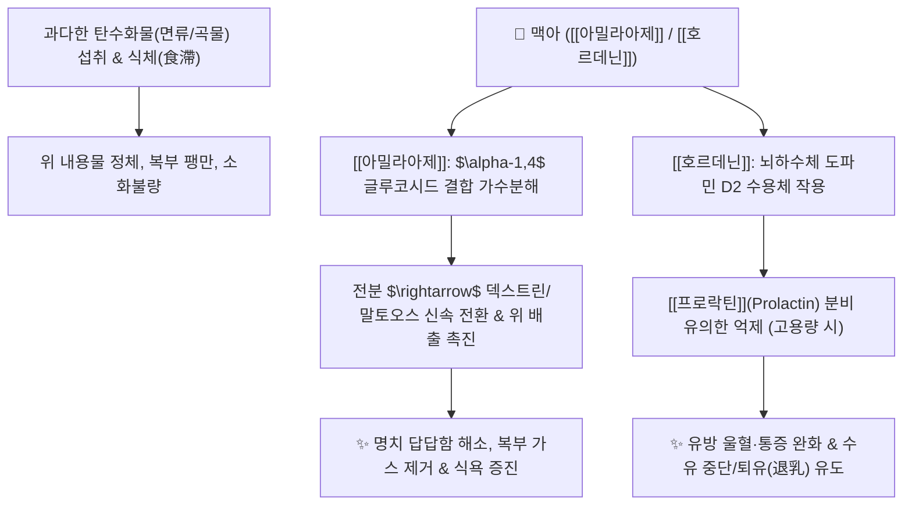

# 🌿 [[맥아]] (麥芽, Hordei Fructus Germinatus)

> **핵심 요약 (Key Summary)**:
> 벼과(*Poaceae*) 보리(*Hordeum vulgare*)의 성숙한 열매를 발아시킨 것
> 풍부한 [[아밀라아제]]($\alpha,\beta$-Amylase) 효소와 [[호르데닌]](Hordenine)이 탄수화물 전분을 분해하고 도파민 D2 수용체를 자극하여 [[프로락틴]](Prolactin) 분비 억제
> 전분성 식체(食滯), 소화불량 및 수유부 단유(퇴유 退乳)를 유도하는 대표적인 [[하기소식]](下氣消食)·[[퇴유소창]](退乳消脹)의 소식소도약

---
## 📌 목차
1. [기본 본초 정보 & 화학 구조 (Pharmacognosy)](#1-기본-본초-정보--화학-구조-pharmacognosy)
2. [핵심 분자약리 기전 & 소화·내분비 대사 네트워크](#2-핵심-분자약리-기전--소화내분비-대사-네트워크)
3. [해부생체역학 / 위장관 평활근 대사 연계](#3-해부생체역학--위장관-평활근-대사-연계)
4. [사상의학 및 체질별 임상 응용 (적응증 vs 용량별 차이)](#4-사상의학-및-체질별-임상-응용-적응증-vs-용량별-차이)
5. [고전 의학 및 배오 원리 (소도지제 배오)](#5-고전-의학-및-배오-원리-소도지제-배오)
6. [핵심 처방 비교 매트릭스](#6-핵심-처방-비교-매트릭스)
7. [출처 및 학술 참고 문헌 (References)](#7-출처-및-학술-참고-문헌-references)

---
## 1. 기본 본초 정보 & 화학 구조 (Pharmacognosy)

| 항목 | 상세 내용 |
| :--- | :--- |
| **기원 식물** | 벼과(Gramineae / Poaceae) 보리 *Hordeum vulgare* L.의 잘 익은 열매를 발아시켜 말린 것 |
| **성미 (性味)** | 甘, 平 |
| **귀경 (歸經)** | 脾·胃·肝經 (비경, 위경, 간경) |
| **효능 (Actions)** | [[하기소식]](下氣消食), [[화중개위]](和中開胃), [[퇴유소창]](退乳消脹), [[행기산혈]](行氣散血) |
| **주요 성분** | • **탄수화물 분해 효소**: [[아밀라아제]] ($\alpha$-Amylase, $\beta$-Amylase), 프로테아제(단백분해효소), 인버타아제<br>• **알칼로이드**: [[호르데닌]] (Hordenine), [[메틸티라민]] (N-Methyltyramine), [[티라민]] (Tyramine), [[그라민]] (Gramine)<br>• **비타민 및 미네랄**: 비타민 B군, 비타민 E, 인지질, [[식이섬유]] |

> **[유래 및 본초학적 기전]**:
> * 보리를 발아(發芽)시켜 만든 맥아는 곡물 내 저장된 전분을 분해하는 효소 역가가 극대화되어 있습니다.
> * 밥, 국수, 빵 등 밀가루와 곡식류(탄수화물)로 인한 식체(食滯)를 풀어내고, 명치 부위의 냉기와 갑갑증을 해소합니다.
> * 수유부의 유즙 분비를 조절하여 적정 용량에서는 소화를 돕고, 고용량에서는 젖을 말려주는(퇴유) 양면적 조절 작용을 합니다.

### 🔬 맥아의 알칼로이드 생합성 및 화학 구조
![[맥아-20240916011946889.png|317]]
![[맥아-20241013194826746.png|437]]
> **[생합성 경로 및 구조적 특징]**: 보리가 발아할 때 아미노산인 [[티로신]](L-Tyrosine)**이 탈탄산 반응을 거쳐 [[티라민]](Tyramine)**이 되고, 연쇄적인 N-메틸화(N-methylation)를 통해 [[메틸티라민]](N-Methyltyramine)**을 거쳐 최종적으로 [[호르데닌]](Hordenine)**으로 생합성됩니다. 호르데닌은 교감신경 및 도파민 수용체 조절 활성을 지닙니다.

---
## 2. 핵심 분자약리 기전 & 소화·내분비 대사 네트워크



### (1) 소화 효소 및 위장관 배출 촉진
* **천연 전분 소화효소제**:
  * 맥아에 풍부한 $\alpha$-아밀라아제와 $\beta$-아밀라아제는 다당류 전분의 $\alpha-1,4$ 글루코시드 결합을 절단하여 덱스트린과 맥아당으로 신속히 전환합니다.
  * 위 내 음식물 체류 시간을 단축시켜 식후 조기 포만감, 트림, 복부 팽만감을 해소합니다.
* **프로락틴(Prolactin) 억제 및 퇴유(단유) 기전**:
  * 맥아 추출물 및 [[호르데닌]]은 시상하부-뇌하수체 축에서 **도파민 D2 수용체를 자극**하여 도파민 작동성 신호를 강화합니다.
  * 도파민은 프로락틴 억제 인자(PIF)로 작용하므로, 혈중 프로락틴 농도를 현저히 낮추어 유방 울혈 및 젖 분비를 억제(퇴유 작용)합니다.
* **장관 평활근 운동 조절**:
  * [[메틸티라민]]과 [[호르데닌]]은 위장관 평활근의 아드레날린 및 콜린성 신호에 관여하여 경련성 복통을 진정시키고 장관의 규칙적인 연동운동을 회복시킵니다.

---
## 3. 해부생체역학 / 위장관 평활근 대사 연계

* **위 기저부(Fundus) 이완 및 유문부(Pylorus) 개폐 조절**:
  * 전분 분해 산물이 위 배출을 촉진하여 위 유문부 평활근의 협조 운동을 개선하고 위식도 역류를 완화합니다.
* **대사 및 혈당 조절**:
  * 전분의 급격한 혈당 스파이크를 완충하는 복합 올리고당 형성을 보조하고 소화기 점막을 보호합니다.

---
## 4. 사상의학 및 체질별 임상 응용 (적응증 vs 용량별 차이)

```
[✅ 최적 적응증 (Sweet Spot)]
• [[소음인]] 및 [[태음인]]의 면류(국수, 빵, 떡 등) 섭취 후 만성 식체 및 소화불량
• 비위허약(脾胃虛弱)으로 인한 식욕부진, 헛배부름, 명치 답답증
• 수유 중단 시 유방의 극심한 통증과 팽만(단유 목적 시 생맥아/초맥아 고용량 사용)
• 간울기체(肝鬱氣滯)로 인한 소화 장애 및 옆구리 결림

[⚠️ 용량에 따른 임상 사용 가이드]
• 젖을 떼고자 할 때(단유/퇴유): 생맥아 또는 초맥아 60~120g 대량 전탕 복용
• 소화 촉진 및 건비위 목적: 초맥아 10~15g 적정량 배오
• 수유 중인 산모 주의: 수유 중에는 소화제 목적으로 고용량 맥아 투여 시 모유량이 줄어들 수 있으므로 신중 투여
```

---
## 5. 고전 의학 및 배오 원리 (소도지제 배오)

### (1) 소도(消導) 3대 배오 원리 (산사·신곡·맥아)
* **음식물 종류별 소도약 특화 배오**:
  * [[맥아]] $\rightarrow$ **곡식·밀가루 전분(탄수화물)** 소화에 특화
  * [[산사]] $\rightarrow$ **육류·지방질(단백질/지방)** 소화 및 어혈 제거에 특화
  * [[신곡]] $\rightarrow$ **발효 곡물 및 알코올/주독** 소화에 특화
* **배오 조합**:
  * [[맥아]] + [[산사]] + [[신곡]] (초삼선 焦三仙) $\rightarrow$ 모든 종류의 복합 음식물 식체를 완벽히 분해
  * [[맥아]] + [[백출]] + [[복령]] $\rightarrow$ 비위를 튼튼히 하면서 비위 허약성 만성 소화불량 개선 ([[건비환]])

---
## 6. 핵심 처방 비교 매트릭스

| 처방명 | 구성 약재 | 주치 병증 및 임상 타깃 | 특징 및 감별점 |
| :--- | :--- | :--- | :--- |
| [[건비환]] | [[맥아]], [[산사]], [[백출]], [[지실]], [[진피]], [[육두구]] 등 | 비허식체(脾虛食滯), **만성 소화불량, 식욕부진, 묽은 변** | 소화와 비장 보강을 겸비한 대표 명방 |
| [[보비환]] | [[인삼]], [[백출]], [[복령]], [[맥아]], [[신곡]], [[산사]] | 만성 비위 허약, **수척, 복부 팽만, 소화불량** | 보제(補劑)를 중심으로 소도약을 보조 배치 |
| [[소도환]] | [[맥아]], [[신곡]], [[산사]], [[지실]], [[반하]], [[연교]] | 급성 식체, **음식 상함, 복통, 트림, 변비/설사** | 실증 급성 식체를 강하게 흩어버리는 처방 |
| [[맥아단유탕]] | [[맥아]](대량 60~120g 전탕) | **수유부 단유, 유방 울혈 팽통, 젖몸살** | 프로락틴을 억제하여 통증 없이 젖을 말림 |
| [[평위산]](가미) | [[창출]], [[후박]], [[진피]], [[감초]] + [[맥아]], [[신곡]] | 습체비위(濕滯脾胃), 과식 후 명치 답답함, 오심, 식후 식곤증 | 위장의 습기를 말리고 식체를 즉시 뚫어줌 |

---
## 7. 출처 및 학술 참고 문헌 (References)

1. **Frank, M. P., & Peeters, T. L. (1993)**. Effects of hordenine on gastrointestinal motility in dogs. *Gastroenterology*, 104(4), A508.
   - **[연구 요약]**: 맥아의 주요 성분인 호르데닌이 위장관 평활근의 아드레날린성 신경전달에 작용하여 위 배출 속도와 장관 연동운동을 촉진함을 동물 모델에서 입증.
   - **[연구 요약]**: 대량의 맥아 추출물이 시상하부-뇌하수체 축에서 도파민 D2 수용체를 활성화시켜 혈중 프로락틴 농도를 유의하게 감소시키고 유선 조직의 위축을 유도하여 단유를 촉진함을 규명.
3. **대한민국약전(KP) 제12개정 (2022)**. 의약품각조 제2부: 맥아 (Hordei Fructus Germinatus) 규격 기준.
   - **[공정서 규격]**: 보리 발아 종자의 성상, 효소 활성도(디아스타아제 소화력가 시험) 및 건조감량 기준 명시.
