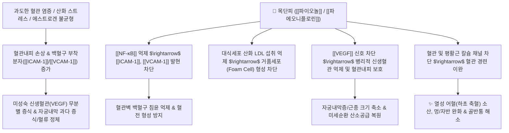

# 🌿 [[목단피]] (牡丹皮, Moutan Radicis Cortex)

> **핵심 요약 (Key Summary)**:
> 작약과(*Paeoniaceae*) 모란(*Paeonia suffruticosa*)의 뿌리껍질
> 핵심 지표 성분인 [[파이오놀]](Paeonol)과 모노테르펜 배당체인 [[파에오니플로린]](Paeoniflorin)이 혈관 내피세포를 보호하고 [[ICAM-1]]/[[VCAM-1]] 접착분자 발현 및 병리적 혈관신생(VEGF)을 억제하여 열성 어혈(熱性 瘀血)을 해소
> [[상한론]]의 하초 축혈증(下焦 蓄血證), [[소양인]]의 음허오열(陰虛午熱) 및 자궁내막 과다 증식을 치료하는 대표적인 [[청열량혈]](淸熱凉血)·[[활혈산어]](活血散瘀) 약재

---
## 📌 목차
1. [기본 본초 정보 & 화학 구조 (Pharmacognosy)](#1-기본-본초-정보--화학-구조-pharmacognosy)
2. [핵심 분자약리 기전 & 혈관·항염 네트워크](#2-핵심-분자약리-기전--혈관항염-네트워크)
3. [해부생체역학 / 미세혈관 순환 & 평활근 이완 연계](#3-해부생체역학--미세혈관-순환--평활근-이완-연계)
4. [사상의학 및 체질별 임상 응용 (적응증 vs 감별점)](#4-사상의학-및-체질별-임상-응용-적응증-vs-감별점)
5. [상한론 『약징(藥徵)』 분석 및 배오 원리](#5-상한론-약징藥徵-분석-및-배오-원리)
6. [핵심 처방 비교 매트릭스](#6-핵심-처방-비교-매트릭스)
7. [출처 및 학술 참고 문헌 (References)](#7-출처-및-학술-참고-문헌-references)

---
## 1. 기본 본초 정보 & 화학 구조 (Pharmacognosy)

| 항목 | 상세 내용 |
| :--- | :--- |
| **기원 식물** | 작약과(Paeoniaceae) 모란 *Paeonia suffruticosa* Andrews의 뿌리껍질(근피) |
| **성미 (性味)** | 苦·辛, 微寒 |
| **귀경 (歸經)** | 心·肝·腎經 (심경, 간경, 신경) |
| **효능 (Actions)** | [[청열량혈]](淸熱凉血), [[활혈산어]](活血散瘀), [[퇴허열]](退虛熱), [[퇴골증]](退骨蒸) |
| **주요 성분** | • **페놀성 물질**: [[파이오놀]] (Paeonol, KP 규격 $\ge 1.0\%$), Paeonoside, Paeonolide<br>• **모노테르펜 배당체**: [[파에오니플로린]] (Paeoniflorin), Oxypaeoniflorin, Benzoylpaeoniflorin<br>• **탄닌 및 플라보노이드**: 1,2,3,4,6-penta-O-galloyl-$\beta$-D-glucose |

> **[유래 및 본초학적 기전]**:
> * '목에 매단 피(목울을 풀고 어혈을 내린다)'라는 의미처럼 체내에 울체된 열독과 장부의 묵은 어혈을 차갑게 식히며 소산시킵니다.
> * 혈맥(血脈)의 구멍을 통하게 하고, 허열(虛熱)이 실열(實熱)로 치달을 때 혈분(血分)의 번열을 즉시 잡아줍니다.
> * 온독발반(溫毒發斑), 야열조량(夜熱早凉, 밤에 열이 나고 아침에 식음), 무한골증(無汗骨蒸), 생리통, 무월경 및 징가(종괴)를 다스립니다.

### 🔬 목단피의 주요 지표물질 화학 구조
![[Pasted image 20240510014612.png|445]]
> **[구조적 특징 및 활성]**: 목단피의 핵심 휘발성 페놀 유도체인 [[파이오놀]](Paeonol)은 분자량이 작아 조직 침투력이 우수하며, 혈관 평활근의 칼슘 유입을 차단하여 혈관을 확장하고 강력한 항혈전·항동맥경화 활성을 발휘합니다.

---
## 2. 핵심 분자약리 기전 & 혈관·항염 네트워크



### (1) 혈관 내피 보호 및 항동맥경화 기전
* **혈관 세포 부착 분자([[ICAM-1]]/[[VCAM-1]]) 억제**:
  * 염증 유발 사이토카인([[TNF-α]])에 의해 유도되는 혈관내피세포의 [[ICAM-1]] 및 [[VCAM-1]] 발현을 [[파이오놀]]이 차단하여 백혈구의 혈관벽 부착 및 혈관 내막 침윤을 억제합니다.
* **대식세포 거품세포(Foam Cell) 형성 방지**:
  * 대식세포가 산화 LDL을 무분별하게 탐식하여 죽상경화반을 형성하는 과정을 억제하여 혈관 협착과 미세순환 장애를 방지합니다.
* **병리적 신생혈관(Angiogenesis) 억제 및 자궁 질환 응용**:
  * 신생 혈관이 과도하게 만들어지면 혈관벽이 취약하여 혈류 속도가 급감하고 모세혈관 단위 산소 공급이 차단되어 멍이 잘 들고 조직 괴사가 일어납니다.
  * <font color="#fa7e7e">과도한 염증으로 조직이 손상되고 혈관 신생이 급증한 상태, 자궁내막이 과다 증식하는 자궁내막증 및 자궁근종에 목단피가 탁월한 억제 효과를 발휘합니다.</font>

---
## 3. 해부생체역학 / 미세혈관 순환 & 평활근 이완 연계

* **골반강 및 자궁 평활근 이완**:
  * 전위의존성 칼슘 채널(VDCC)을 억제하여 자궁 평활근의 과도한 수축 경련(생리통)을 풀어줍니다.
* **혈액 유동성 개선**:
  * 혈소판 응집을 유도하는 [[트롬복산 A2]](TXA2) 생성을 억제하고 혈관 확장을 유도하여 골반강 내 혈류 정체를 해소합니다.

---
## 4. 사상의학 및 체질별 임상 응용 (적응증 vs 감별점)

```
[✅ 최적 적응증 (Sweet Spot)]
• [[소양인]] 신열(腎熱) 및 음허오열(陰虛午熱) 패턴: 늦은 오후나 야간에 열감이 뜨고 뼈마디가 쑤시며 번조가 동반될 때
• 하초 축혈증(下焦 蓄血證): 생리통, 만성 골반염, 자궁내막증, 자궁근종으로 아랫배가 찌르듯 아프고 단단하게 뭉칠 때
• 열성 피부 질환: 알레르기 자반증, 홍반, 여드름, 혈관염으로 붉은 반점이 돋을 때
• 멍이 잘 들고 미세혈관 출혈이 잦은 혈열(血熱) 환자

[🔍 목단피 vs 계지 혈액순환 감별 포인트]
• [[목단피]]: 몸에 열(熱)이 많아 혈관이 충혈되고 염증성으로 어혈이 생겼을 때 (熱性 어혈)
• [[계지]]: 몸이 차가워서(寒) 혈관이 수축되고 혈액순환이 안 될 때 (寒性 어혈)

[⚠️ 신중 투여 및 금기 (Caution / Contraindication)]
• 임산부 신중 투여 및 다량 금기 (활혈 파어 작용으로 유산 위험)
• 월경 과다 및 출혈성 질환 환자, 혈허유한(血虛有寒) 환자
```

---
## 5. 상한론 『약징(藥徵)』 분석 및 배오 원리

### (1) 『[[약징]]』에 나타난 목단피의 주치
> **"牡丹皮 主治瘀血也. 旁治腹滿, 驚狂, 癰膿..."**  
> (목단피의 주치는 어혈(瘀血)이며, 곁들여 배가 팽만하고 아픈 것, 잘 놀라고 발광하는 것, 옹종과 고름을 치료한다.)

* **핵심 배오 원리**:
  * [[목단피]] + [[도인]] + [[계지]] $\rightarrow$ 온통(溫通)과 청열활혈(淸熱活血)의 절묘한 조화로 자궁 내 징가와 하초 어혈을 소산 ([[계지복령환]])
  * [[목단피]] + [[대황]] + [[망초]] $\rightarrow$ 맹렬한 하초 습열 어혈과 옹농(급성 충수염)을 설사로 배출 ([[대황목단피탕]])
  * [[목단피]] + [[지황]] + [[산수유]] $\rightarrow$ 간신(肝腎)의 음을 보하면서 허열을 내리고 혈맥을 맑게 함 ([[육미지황탕]])

---
## 6. 핵심 처방 비교 매트릭스

| 처방명 | 구성 약재 | 주치 병증 및 임상 타깃 | 특징 및 감별점 |
| :--- | :--- | :--- | :--- |
| [[계지복령환]] | [[계지]], [[복령]], [[목단피]], [[도인]], [[작약]] | **하초 축혈, 자궁근종, 자궁내막증, 난소낭종, 생리통** | 한열을 조화시켜 골반강 어혈 종괴를 녹이는 명방 |
| [[대황목단피탕]] | [[대황]], [[목단피]], [[도인]], [[과루인]], [[망초]] | **장옹(腸癰, 급성 충수염), 우하복통, 발열, 오한** | 장관의 염증성 농양과 어혈을 급히 배출 |
| [[육미지황탕]] | [[숙지황]], [[산약]], [[산수유]], [[택사]], [[목단피]], [[복령]] | **간신음허(肝腎陰虛), 요슬산연, 두훈, 이명, 도한, 조열** | 삼보삼사(三補三瀉) 중 목단피가 간화(肝火)를 사함 |
| [[독활지황탕]] | [[숙지황]], [[산수유]], [[복령]], [[택사]], [[목단피]], [[독활]], [[방풍]] | [[소양인]] **신국음허(腎局陰虛), 요통, 하지무력, 관절통** | 소양인의 하초 허열과 음허 관절통 다스림 |
| [[십이미지황탕]] | [[독활지황탕]] + [[형개]], [[강활]], [[황련]], [[현삼]] 등 | [[소양인]] **상열하한, 극심한 번조, 두통, 염증성 질환** | 소양인 상초 화열과 혈열을 강력히 청해 |

---
## 7. 출처 및 학술 참고 문헌 (References)

1. **Li, P., Shen, J., Wang, Z., Zheng, X., & Liu, J. (2016)**. Paeonol inhibits adhesion of monocytes to vascular endothelial cells by suppressing NF-κB-dependent ICAM-1 expression. *International Immunopharmacology*, 38, 281-287.
   - **[연구 요약]**: 파이오놀이 NF-κB 신호 억제를 통해 혈관내피세포의 ICAM-1 발현을 차단하고 단핵구 부착을 방지하여 죽상동맥경화 및 혈관 염증을 완화함을 규명.
2. **Kim, J. H., et al. (2014)**. Paeonol inhibits angiogenesis and tumor growth through VEGF signaling pathway. *Oncology Reports*, 31(6), 2549-2556.
   - **[연구 요약]**: 목단피의 파이오놀이 VEGF 수용체 인산화를 차단하여 병리적 미세혈관 신생을 억제하고 조직의 비정상적 과다 증식을 제어함을 입증.
3. **대한민국약전(KP) 제12개정 (2022)**. 의약품각조 제2부: 목단피 (Moutan Radicis Cortex) 규격 기준.
   - **[공정서 규격]**: 건조물 기준 파이오놀($\text{C}_9\text{H}_{10}\text{O}_3$) 1.0% 이상 함유 규격 명시.
4. **길익동동 (吉益東洞, 1784)**. 『약징(藥徵)』: 牡丹皮 조문.
   - **[고전 원전]**: "牡丹皮 主治瘀血也. 旁治腹滿, 驚狂, 癰膿" - 어혈 및 하초 축혈증에 대한 감별 주치 조문 제시.