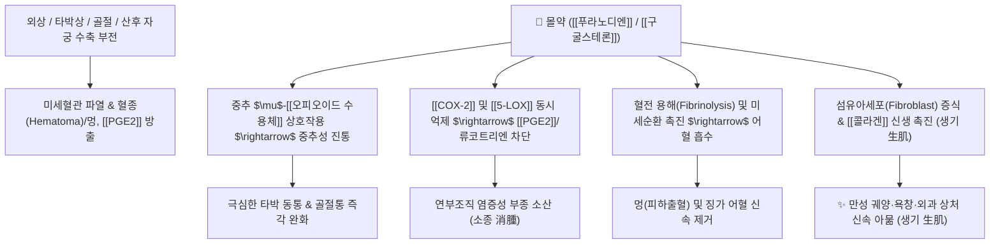

# 🌿 [[몰약]] (沒藥, Myrrha)

> **핵심 요약 (Key Summary)**:
> 감람나무과(*Burseraceae*) 몰약나무(*Commiphora myrrha*) 줄기의 천연 고무수지(Gum-resin)
> 푸라노세스퀴테르펜([[푸라노디엔]], [[쿠르제렌]])과 트리테르페노이드([[구굴스테론]])가 중추 $\mu$-오피오이드 수용체 자극 및 [[COX-2]]/[[PGE2]] 억제로 진통·소염·새살 재생
> 타박상 멍, 골절통, 산후 어혈통 및 만성 피부 궤양을 치료하는 대표적인 [[활혈거어지통]](活血祛瘀止痛)·[[소종생기]](消腫生肌)의 상과(傷科) 명약

---
## 📌 목차
1. [기본 본초 정보 & 화학 구조 (Pharmacognosy)](#1-기본-본초-정보--화학-구조-pharmacognosy)
2. [핵심 분자약리 기전 & 진통·조직 재생 네트워크](#2-핵심-분자약리-기전--진통조직-재생-네트워크)
3. [해부생체역학 / 연부조직 손상 & 미세혈류 대사 연계](#3-해부생체역학--연부조직-손상--미세혈류-대사-연계)
4. [사상의학 및 임상 응용 (적응증 vs 금기)](#4-사상의학-및-임상-응용-적응증-vs-금기)
5. [고전 의학 및 배오 원리 (유향 vs 몰약 배오)](#5-고전-의학-및-배오-원리-유향-vs-몰약-배오)
6. [핵심 처방 비교 매트릭스](#6-핵심-처방-비교-매트릭스)
7. [출처 및 학술 참고 문헌 (References)](#7-출처-및-학술-참고-문헌-references)

---
## 1. 기본 본초 정보 & 화학 구조 (Pharmacognosy)

| 항목 | 상세 내용 |
| :--- | :--- |
| **기원 식물** | 감람나무과(Burseraceae) 몰약나무 *Commiphora myrrha* Engler 또는 동속 식물의 줄기에 상처를 내어 흘러나온 수지(천연 검수지) |
| **성미 (性味)** | 苦·辛, 平 |
| **귀경 (歸經)** | 心·肝·脾經 (심경, 간경, 비경) |
| **효능 (Actions)** | [[활혈거어지통]](活血祛瘀止痛), [[소종생기]](消腫生肌), [[청열해독]](淸熱解毒) |
| **주요 성분** | • **푸라노세스퀴테르펜(Furanosesquiterpenes)**: [[푸라노디엔]] (Furanodiene), [[쿠르제렌]] (Curzerene), [[린데스트렌]] (Lindestrene), Furanodienone<br>• **트리테르페노이드**: [[구굴스테론]] (Guggulsterone E/Z), Myrrha acid, Commiphoric acid<br>• **수지 및 고무질**: 아라비아검 유사 다당류, 단백질, 칼슘/마그네슘 염류 |

> **[유래 및 본초학적 기전]**:
> * 몰(沒, 가라앉다)이라는 명칭처럼 비중이 물보다 무거워 물에 넣으면 가라앉는 독특한 암갈색 덩어리 수지입니다.
> * 소염 및 진통 작용이 매우 뛰어나며, 피부 진균(무좀균) 억제 및 결핵균 발육 억제 활성을 지닙니다.
> * 혈액 순환을 개선하여 타박상으로 멍들고 붓고 아픈 울혈을 신속히 흩어버리고, 산후 하복부 어혈 산통 및 월경통을 치료합니다.

### 🔬 몰약의 주요 지표물질 화학 구조
```
        CH3
         |
    [ A 고리 ]====O
       /    \
 [ B 고리 ]-[ Furan 고리 ]  <-- 푸라노디엔 (Furanodiene)
      \     /
       (CH3)2
```
> **[구조적 특징 및 활성]**: 몰약 특유의 푸란(Furan) 고리를 포함하는 세스퀴테르페노이드 구조는 뇌 내 오피오이드 진통 경로에 친화성을 나타내어 몰핀 유사 진통 활성을 발휘하며, 공기 중에서 쉽게 산화 고형화되면서 점막 및 피부 궤양에 강력한 보호막(생기 작용)을 형성합니다.

---
## 2. 핵심 분자약리 기전 & 진통·조직 재생 네트워크



### (1) 통증 제어 및 아편유사체 경로 활성화
* **중추 및 말초 이중 진통 효과**:
  * 몰약의 휘발성 푸라노세스퀴테르펜 분획은 뇌의 $\mu$-오피오이드 수용체에 작용하여 침통(痛) 역치를 높입니다.
  * 말초에서는 [[COX-2]]와 [[iNOS]] 효소의 전사를 차단하여 염증성 통증 유발 물질인 [[PGE2]] 생성을 억제합니다.
* **혈전 용해 및 멍/부종 흡수 ([[활혈거어]](活血祛瘀))**:
  * 미세혈관 내 혈소판 응집을 차단하고 섬유소 용해계를 활성화하여 외상 및 수술 후 발생한 피하 혈종(멍)과 울혈성 부종을 체내로 재흡수시킵니다.
* **육아조직 증식 및 상처 치유 ([[생기]](生肌) 작용)**:
  * 피부 섬유아세포의 이동과 타입 I/III 콜라겐 합성을 촉진하여 잘 아물지 않는 만성 궤양, 욕창, 외과 수술 부위의 새살을 돋아나게 합니다.

---
## 3. 해부생체역학 / 연부조직 손상 & 미세혈류 대사 연계

* **급성 인대 염좌 및 근육 파열 (상과 傷科 손상)**:
  * 발목 염좌, 햄스트링 손상 등에서 조직 내 삼출액과 출혈성 어혈을 신속히 제거하여 관절의 가동 범위(ROM)를 조기 회복시킵니다.
* **산후 자궁 복구 및 오로 배출**:
  * 산후 자궁 내 잔류 오로와 혈괴(어혈)를 배출시키고 자궁 평활근의 정상 수축을 유도합니다.

---
## 4. 사상의학 및 임상 응용 (적응증 vs 금기)

```
[✅ 최적 적응증 (Sweet Spot)]
• 상과 및 정형외과 질환: 급성 타박상, 인대 염좌, 골절통, 근육 파열, 피하 혈종(멍)
• 부인과 어혈 질환: 산후 오로 부전으로 인한 하복부 어혈통, 만성 무월경, 극심한 생리통
• 외과 궤양: 욕창, 만성 당뇨발 궤양, 누공(瘻孔), 종기 궤양 후 새살이 돋지 않는 경우
• 관절 질환: 류마티스 관절염, 퇴행성 관절염으로 관절이 붓고 찌르듯 아픈 비통

[⚠️ 신중 투여 및 금기 (Caution / Contraindication)]
• 임산부 절대 금기 (자궁 수축 및 통경 활혈 작용으로 유산 위험)
• 출혈성 질환자 및 수술 직전 환자
• 소화기 궤양이 심한 자 (수지 성분이 위점막을 자극할 수 있어 반드시 식후 복용 또는 제형화)
```

---
## 5. 고전 의학 및 배오 원리 (유향 vs 몰약 배오)

### (1) 상과 외과의 최고 명짝: 유향(乳香) vs 몰약(沒藥)
* **기혈(氣血) 협조 배오 원리**:
  * [[유향]] $\rightarrow$ **향기가 강하여 기(氣)를 순환시키고 근육을 펴줌** (行氣活血, 舒筋)
  * [[몰약]] $\rightarrow$ **맛이 쓰고 차가워 혈(血)의 어혈을 직접 부수고 새살을 돋게 함** (活血破瘀, 生肌)
  * [[유향]] + [[몰약]] (동량 배오) $\rightarrow$ 기와 혈의 울체를 동시에 뚫어 모든 극심한 타박 동통, 옹저 종통을 단번에 진정시키는 최고의 시너지 형성

---
## 6. 핵심 처방 비교 매트릭스

| 처방명 | 구성 약재 | 주치 병증 및 임상 타깃 | 특징 및 감별점 |
| :--- | :--- | :--- | :--- |
| [[칠리산]] | [[몰약]], [[유향]], [[혈갈]], [[홍화]], [[사향]], [[빙편]], [[주사]] | **외상 타박, 골절 어혈, 극심한 자통, 출혈/멍** | 상과 구급 및 타박어혈 진통의 전설적인 명방 |
| [[소활락단]] | [[초오]], [[천오]], [[담남성]], [[지룡]], [[유향]], [[몰약]] | **풍한습비, 뇌졸중 후유 마비통, 완고한 관절통** | 한습과 어혈을 동시에 깨부수는 강력한 통락제 |
| [[생혈보원탕]] | [[당귀]], [[천궁]], [[백작약]], [[유향]], [[몰약]], [[인삼]] 등 | **산후 어혈 복통, 오로 불통, 기혈 허약** | 산후 어혈을 몰아내며 새 피를 보충 |
| [[성유탕]](가미) | [[사물탕]] + [[황기]], [[인삼]] + [[유향]], [[몰약]] | 만성 궤양, 옹저 파궤 후 새살이 돋지 않는 증상 | 기혈을 크게 보하며 궤양 상처를 아물게 함 |
| [[해어산]] | [[몰약]], [[유향]], [[당귀]], [[적작약]], [[단삼]] | **하복부 징가(난소낭종, 자궁근종), 만성 골반통** | 하초 골반강의 굳은 어혈을 녹여 배출 |

---
## 7. 출처 및 학술 참고 문헌 (References)

1. **Dolara P et al. (2000)**. Local anaesthetic, antibacterial and antifungal properties of sesquiterpenes from myrrh. *Planta medica*, 66: 356-8. [PMID: 10865454](https://pubmed.ncbi.nlm.nih.gov/10865454/)
   - **[연구 요약]**: 몰약에서 분리된 푸라노세스퀴테르펜 성분들이 국소 마취(진통) 효과 및 피부 진균과 세균에 대한 강력한 억제 활성을 나타냄을 입증.
   - **[연구 요약]**: 몰약의 구굴스테론 및 정유 분획이 나타내는 항염증(NF-κB 및 COX-2 차단), 항관절염, 항종양 및 상처 치유 촉진 기전 종합 고찰.
3. **대한민국약전외한약(생약)규격집(KHP) (2022)**. 몰약 (Myrrha) 규격 기준.
   - **[공정서 규격]**: 수지의 성상, 에탄올 불용물 한도시험 및 회분/산불용성회분 안전 기준치 규정.
