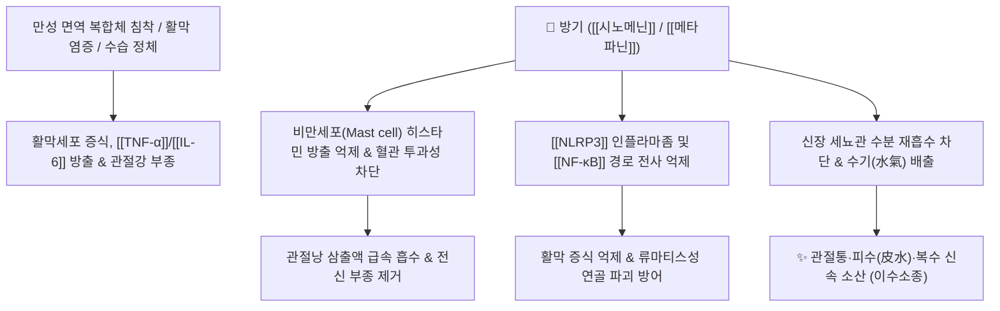

# 🌿 [[방기]] (防己, Sinomenii Caulis et Rhizoma)

> **핵심 요약 (Key Summary)**:
> 방기과(*Menispermaceae*) 방기(*Sinomenium acutum*)의 덩굴성 줄기 및 뿌리줄기
> 모르난(Morphinan)계 알칼로이드인 [[시노메닌]](Sinomenine)이 비만세포 히스타민 방출을 차단하고 [[NF-κB]]/[[NLRP3]] 인플라마좀을 억제하여 강력한 진통·소염·이뇨 작용 발휘
> [[상한론]]의 수기(水氣) 부종·관절 팽만통 및 피수(皮水)·복수를 치료하는 대표적인 [[거풍지통]](祛風止痛)·[[이수소종]](利水消腫)·[[청열이습]](淸熱利濕) 약재

---
## 📌 목차
1. [기본 본초 정보 & 화학 구조 (Pharmacognosy)](#1-기본-본초-정보--화학-구조-pharmacognosy)
2. [핵심 분자약리 기전 & 관절염·이뇨 네트워크](#2-핵심-분자약리-기전--관절염이뇨-네트워크)
3. [해부생체역학 / 활막강 부종 & 근육 이완 연계](#3-해부생체역학--활막강-부종--근육-이완-연계)
4. [사상의학 및 임상 응용 (적응증 vs 감별점)](#4-사상의학-및-임상-응용-적응증-vs-감별점)
5. [상한론 『약징(藥徵)』 분석 및 배오 원리](#5-상한론-약징藥徵-분석-및-배오-원리)
6. [핵심 처방 비교 매트릭스](#6-핵심-처방-비교-매트릭스)
7. [출처 및 학술 참고 문헌 (References)](#7-출처-및-학술-참고-문헌-references)

---
## 1. 기본 본초 정보 & 화학 구조 (Pharmacognosy)

| 항목 | 상세 내용 |
| :--- | :--- |
| **기원 식물** | 방기과(Menispermaceae) 방기 *Sinomenium acutum* (Thunb.) Rehder & E.H.Wilson 또는 동속 식물의 줄기 및 뿌리줄기 (청풍등 靑風藤) |
| **성미 (性味)** | 苦·辛, 寒 (또는 平) |
| **귀경 (歸經)** | 膀胱·肺·脾經 (방광경, 폐경, 비경) |
| **효능 (Actions)** | [[거풍지통]](祛風止痛), [[이수소종]](利水消腫), [[청열이습]](淸熱利濕), [[통경활락]](通經活絡) |
| **주요 성분** | • **모르난계 알칼로이드**: [[시노메닌]] (Sinomenine, KP 규격 $\ge 0.5\%$), [[메타파닌]] (Metaphanine), 아쿠투민, 시노악틴<br>• **플라보노이드 및 리그난**: Magnoflorine, Syringaresinol |

> **[유래 및 본초학적 기전]**:
> * 체내에 침범한 풍한습(風寒濕)의 사기(邪氣)를 든든하게 방어(防)한다는 의미에서 '방기(防己)'라 불렸습니다.
> * 관절과 조직 사이에 갇혀 빠져나가지 못하는 불필요한 체액(수기 水氣)을 소변으로 몰아내어 수습(水濕)과 습열로 인한 관절염, 복수, 각기병, 수족 경련을 치료합니다.
> * 진통, 소염, 해열, 횡문근 및 기관지 평활근 이완, 면역 억제 작용을 나타냅니다.

### 🔬 방기의 주요 지표물질 화학 구조
```
        CH3O
         |
    [ A 고리 ]
       /    \
 [ B 고리 ]-[ C 고리 ]=O  <-- 시노메닌 (Sinomenine, 모피난 골격)
      \     /
       N-CH3
```
> **[구조적 특징 및 작용기전]**: 지표성분인 [[시노메닌]]은 모르핀(Morphine)과 유사한 모르난 골격을 지니지만 마약성 중독 작용은 없으며, 강력한 항류마티스 및 비만세포 탈과립 억제 작용을 나타냅니다.

---
## 2. 핵심 분자약리 기전 & 관절염·이뇨 네트워크



### (1) 항류마티스 및 관절 염증 억제
* **비만세포 탈과립 억제 및 혈관 투과성 정상화**:
  * 시노메닌은 초기 투여 시 일시적으로 히스타민을 방출시킨 후 비만세포를 고갈시켜, 장기적으로 혈관 투과성 항진과 조직 부종을 강력히 차단합니다.
* **염증성 사이토카인 및 파골세포 억제**:
  * 활막 섬유아세포(FLS)에서 [[TNF-α]], [[IL-1β]], [[IL-6]] 및 [[MMP-9]] 분비를 차단하여 관절 연골 기질 침식을 막고 뼈 파괴를 방어합니다.
* **이뇨 및 수기(水氣) 정체 해소**:
  * 신장 혈류 개선 및 전해질 배출을 통해 피부 밑에 정체된 피수(皮水), 복수, 하지 부종을 소변으로 배출시킵니다.

---
## 3. 해부생체역학 / 활막강 부종 & 근육 이완 연계

* **관절낭 내압(Intra-articular Pressure) 감소**:
  * 슬관절 및 수관절의 활막 삼출액을 흡수시켜 관절 팽만감과 굴신 장애를 즉각 개선합니다.
* **골격근 및 횡문근 연축 완화**:
  * 신경근 접합부 전달을 조절하여 관절 주변 지근/속근의 반사성 근경련을 이완시킵니다.

---
## 4. 사상의학 및 임상 응용 (적응증 vs 감별점)

```
[✅ 최적 적응증 (Sweet Spot)]
• 류마티스 관절염, 퇴행성 관절염으로 관절이 퉁퉁 붓고 열감이 있으며 누르면 물이 찬 느낌이 드는 경우
• 피수(皮水) 및 신장성·심장성 부종: 피부가 부석부석하게 붓고 누르면 쑥 들어가서 잘 나오지 않는 경우
• 각기병(腳氣病)으로 다리가 무겁고 붓고 저리며 걷기 힘든 경우
• 간경화 복수 및 늑막 삼출액 정체

[🔍 방기 vs 한방기(분방기) 감별]
• 방기(청풍등): 진통·거풍습 작용이 우수하여 관절통 다용
• 분방기(방기과 Stephania tetrandra): 이뇨소종 작용이 우수하여 부종·수기 다용
• 주의: 신독성 성분(아리스톨로크산)이 있는 광방기(쥐방울덩굴과)는 혼용 절대 금기

[⚠️ 신중 투여 및 금기 (Caution / Contraindication)]
• 비위허한(脾胃虛寒) 환자 (약성이 차가워 소화 장애 유발 가능)
• 음허(陰虛)로 진액이 마르고 열이 뜨는 환자
```

---
## 5. 상한론 『약징(藥徵)』 분석 및 배오 원리

### (1) 『[[약징]]』에 나타난 방기의 주치
> **"防己 主治水也. 旁治心下痞, 結熱, 腹滿, 腫痛..."**  
> (방기의 주치는 몸에 정체된 부적절한 물(水)이며, 곁들여 명치 아래가 막힌 것, 뭉친 열, 배가 팽만하고 아픈 것, 붓고 쑤시는 통증을 치료한다.)

* **핵심 배오 원리**:
  * [[방기]] + [[황기]] + [[백출]] $\rightarrow$ 표허(表虛)로 땀이 나고 몸이 무거우며 붓는 피수(皮水) 치료의 황금 조합 ([[방기황기탕]])
  * [[방기]] + [[복령]] + [[계지]] $\rightarrow$ 사지 관절의 수기(水氣)를 흩어버리고 전신 부종 해소 ([[방기복령탕]])
  * [[방기]] + [[계지]] + [[인삼]] + [[석고]] $\rightarrow$ 흉부 수음(水飲)과 결열을 내리고 심장 부담 경감 ([[목방기탕]])

---
## 6. 핵심 처방 비교 매트릭스

| 처방명 | 구성 약재 | 주치 병증 및 임상 타깃 | 특징 및 감별점 |
| :--- | :--- | :--- | :--- |
| [[방기황기탕]] | [[방기]], [[황기]], [[백출]], [[감초]], [[생강]], [[대추|대조]] | **표허수종(表虛水腫), 자한(식은땀), 신체중(몸이 무거움), 관절 부종** | 기허로 물살이 찌고 관절이 붓는 환자의 명방 |
| [[방기복령탕]] | [[방기]], [[황기]], [[계지]], [[복령]], [[감초]] | **피수(皮水), 사지 부종, 관절 팽통, 소변불리** | 복령과 계지를 더해 피하 수분을 강력히 이뇨 |
| [[목방기탕]] | [[목방기]], [[석고]], [[계지]], [[인삼]] | **심하비견, 천해, 흉부 수기 정체, 얼굴 부종** | 흉막 삼출 및 심부전성 수종을 구급 치료 |
| [[삼묘환]](가미) | [[황백]], [[창출]], [[우슬]] + [[방기]] | 습열하주(濕熱下注), 통풍성 관절염, 하지 관절 종통, 각기 | 하초의 습열과 요산 침착을 소변으로 배출 |

---
## 7. 출처 및 학술 참고 문헌 (References)

1. **Li JM et al. (2023)**. Pharmacological mechanisms of sinomenine in anti-inflammatory immunity and osteoprotection in rheumatoid arthritis: A systematic review. *Phytomedicine : international journal of phytotherapy and phytopharmacology*. [PMID: 37816287](https://pubmed.ncbi.nlm.nih.gov/37816287/)
   - **[연구 요약]**: 방기의 시노메닌이 NF-κB 및 NLRP3 인플라마좀을 억제하고 FLS 활막세포 증식을 차단하여 류마티스 관절염의 관절 부종과 연골 파괴를 방어하는 기전 총괄 고찰.
2. **대한민국약전(KP) 제12개정 (2022)**. 의약품각조 제2부: 방기 (Sinomenii Caulis et Rhizoma) 규격 기준.
   - **[공정서 규격]**: 건조물 기준 시노메닌($\text{C}_{19}\text{H}_{23}\text{NO}_4$) 0.5% 이상 함유 규격 및 아리스톨로크산 불포함 확인 기준 명시.
3. **길익동동 (吉益東洞, 1784)**. 『약징(藥徵)』: 防己 조문.
   - **[고전 원전]**: "防己 主治水也. 旁治心下痞, 結熱, 腹滿, 腫痛" - 체내 수기 병태 및 관절 종통 주치 원리 제시.
