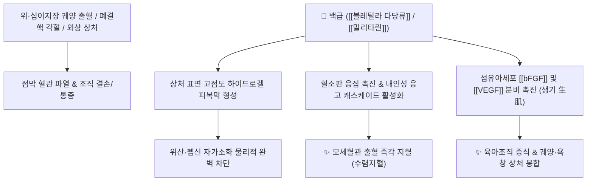

# 🌿 [[백급]] (白芨, Bletillae Rhizoma)

> **핵심 요약 (Key Summary)**:
> 난초과(*Orchidaceae*) 자란(*Bletilla striata*)의 덩이줄기(괴경)
> 점액성 다당체인 [[블레틸라 다당류]](BSP)와 페난트렌 성분이 혈소판 응집을 촉진하여 점막 출혈을 즉시 지혈하고 섬유아세포 증식을 유도하여 상처 재생(생기 生肌) 촉진
> 폐열(肺熱) 각혈, 위열(胃熱) 토혈, 위·십이지장궤양 및 외상성 출혈·욕창을 치료하는 대표적인 [[수렴지혈]](收斂止血)·[[염창생기]](斂瘡生肌)·[[소종살충]](消腫殺蟲) 약재

---
## 📌 목차
1. [기본 본초 정보 & 화학 구조 (Pharmacognosy)](#1-기본-본초-정보--화학-구조-pharmacognosy)
2. [핵심 분자약리 기전 & 지혈·점막 치유 네트워크](#2-핵심-분자약리-기전--지혈점막-치유-네트워크)
3. [해부생체역학 / 위점막 장벽 & 조직 재생 연계](#3-해부생체역학--위점막-장벽--조직-재생-연계)
4. [사상의학 및 임상 응용 (적응증 vs 십팔반 금기)](#4-사상의학-및-임상-응용-적응증-vs-십팔반-금기)
5. [고전 의학 및 배오 원리](#5-고전-의학-및-배오-원리)
6. [핵심 처방 비교 매트릭스](#6-핵심-처방-비교-매트릭스)
7. [출처 및 학술 참고 문헌 (References)](#7-출처-및-학술-참고-문헌-references)

---
## 1. 기본 본초 정보 & 화학 구조 (Pharmacognosy)

| 항목 | 상세 내용 |
| :--- | :--- |
| **기원 식물** | 난초과(Orchidaceae) 자란 *Bletilla striata* (Thunb.) Rchb. f.의 덩이줄기(괴경) |
| **성미 (性味)** | 苦·甘·澁, 微寒 |
| **귀경 (歸經)** | 肺·肝·胃經 (폐경, 간경, 위경) |
| **효능 (Actions)** | [[수렴지혈]](收斂止血), [[소종생기]](消腫生肌), [[염창생기]](斂瘡生肌), [[소종살충]](消腫殺蟲) |
| **주요 성분** | • **점액성 다당체**: [[블레틸라 다당류]] (Bletilla striata polysaccharide, BSP), 만난(Mannan), 글루코만난<br>• **페난트렌 및 스틸베노이드**: [[블레스트린]] (Bletstrin A-B), Militarine, Gymnoside, Dactylorhin<br>• **페놀성 물질**: Batatasin III, Coelonin |

> **[유래 및 본초학적 기전]**:
> * '백급(白芨)'이라는 농부가 토혈과 각혈을 하던 중 이 풀뿌리를 먹고 완치되었다는 전설에서 유래했습니다.
> * 점액질이 극히 풍부하여 물과 닿으면 끈적끈적한 젤(Gel)을 형성하며, 폐와 위의 혈관 파열로 인한 토혈, 각혈을 부드럽게 감싸 지혈하고 헐어버린 궤양(창양 瘡瘍)에 새살을 돋게 합니다.

### 🔬 백급 다당류(BSP)의 겔 형성 및 지혈 구조
```
[ 블레틸라 다당류 (BSP) 사슬 ] ──> 물 흡수 ──> 고점도 생체친화성 하이드로겔 형성
                                                      │
                       ┌──────────────────────────────┴──────────────────────────────┐
                       ▼                                                             ▼
         위점막/혈관벽 물리적 코팅 (차폐막)                             혈소판 응집 촉진 & 피브린 그물망 가교
```
> **[구조적 특징 및 생체재료적 가치]**: 백급의 글루코만난 다당체(BSP)는 천연 생체 고분자로 뛰어난 점착성과 조직 적합성을 가져, 현대 의학에서도 수술용 지혈제 및 조직 재생 드레싱 제재로 각광받고 있습니다.

---
## 2. 핵심 분자약리 기전 & 지혈·점막 치유 네트워크



### (1) 표적 지혈 및 상처 치유 기전
* **점착성 물리 차폐 및 혈액 응고 촉진**:
  * 점액질 다당체가 출혈 부위에 즉시 밀착하여 혈전 형성을 돕고 국소 출혈을 신속히 지혈합니다.
* **위점막 보호 및 궤양 치료**:
  * 위산과 펩신으로부터 궤양 기저부를 물리적으로 보호하고, 점막 상피세포의 이동을 촉진하여 만성 소화성 궤양을 아물게 합니다.
* **항균 및 피부 궤양 수렴 ([[염창생기]] 斂瘡生肌)**:
  * 황색포도상구균 및 피부 진균 증식을 억제하고, 욕창, 화상, 만성 당뇨발 궤양의 새살(육아조직)을 돋게 합니다.

---
## 3. 해부생체역학 / 위점막 장벽 & 조직 재생 연계

* **위식도 점막 코팅**:
  * 식도 점막 및 위벽의 결손부에 강력한 점액층을 보강하여 위식도 역류성 궤양 출혈을 방어합니다.
* **피부 탄력 및 흉터 형성 억제**:
  * 콜라겐 섬유의 규칙적인 배열을 유도하여 흉터(반흔) 형성을 최소화하면서 상처를 수렴시킵니다.

---
## 4. 사상의학 및 임상 응용 (적응증 vs 십팔반 금기)

```
[✅ 최적 적응증 (Sweet Spot)]
• 호흡기 출혈: 폐결핵, 기관지 확장증, 폐렴으로 인한 각혈(喀血)
• 소화기 출혈: 위궤양, 십이지장궤양, 급성 위점막 병변으로 인한 토혈(吐血), 흑색변
• 외상 및 피부과: 베인 상처의 출혈, 손발 갈라짐(수족균열), 화상, 욕창, 치질 출혈
• 악성 종기 및 궤양: 림프절염(나력), 유선염이 터진 후 아물지 않는 만성 누공

[⚠️ 십팔반(十八反) 금기 및 주의사항]
• 십팔반 배오 금기: 오두/부자류([[부자]], [[천오]], [[초오]])와 함께 배합 금기 (독성 상승 및 상호 길항)
• 외감 초기 출혈이나 실열(實熱)이 맹렬한 초기에는 사열(瀉熱) 약재와 배오
```

---
## 5. 고전 의학 및 배오 원리

### (1) 고전 본초학적 배오
* **핵심 배오**:
  * [[백급]] + [[삼칠]] $\rightarrow$ 지혈과 화어(化瘀)의 완벽한 조화로 어혈을 남기지 않고 출혈을 멎게 함
  * [[백급]] + [[해표초]](오적골)` $\rightarrow$ 제산과 점막 피복 지혈 시너지로 위·십이지장 궤양 완치 ([[오급산]])
  * [[백급]] + [[황련]] $\rightarrow$ 폐위의 열독을 끄고 각혈·토혈을 치료

---
## 6. 핵심 처방 비교 매트릭스

| 처방명 | 구성 약재 | 주치 병증 및 임상 타깃 | 특징 및 감별점 |
| :--- | :--- | :--- | :--- |
| [[오급산]] | [[해표초]], [[백급]] (동량 분말) | **소화성 궤양, 위완통, 산역(속쓰림), 위출혈** | 위산 중화와 위벽 코팅 지혈의 명방 |
| [[백급비파탕]] | [[백급]], [[비파엽]], [[아교]], [[맥문동]], [[생지황]] | **폐열 각혈, 마른 기침, 폐결핵 출혈** | 폐를 윤택하게 하면서 각혈을 멎게 함 |
| [[생기옥홍고]](외용) | [[백급]], [[황기]], [[당귀]], [[자초]], [[백지]], [[혈갈]] 등 | 욕창, 만성 피부 궤양, 화상, 잘 아물지 않는 상처 | 외과 상처에 새살을 돋게 하는 대표 연고 |
| [[백급산]] | [[백급]](미세분말 단독 또는 찹쌀미음 복용) | **급성 토혈, 각혈, 외상 출혈** | 단방으로도 강력한 점막 지혈 효과 |

---
## 7. 출처 및 학술 참고 문헌 (References)

1. **Wang, C., et al. (2014)**. *Bletilla striata* polysaccharide stimulates inducible nitric oxide synthase and proinflammatory cytokine expression in macrophages. *Journal of Ethnopharmacology*, 154(1), 173-181.
   - **[연구 요약]**: 백급 다당류가 대식세포 활성화를 통해 상처 부위의 감염을 방어하고 혈관신생 및 섬유아세포 증식을 촉진하여 조직 재생을 가속화함을 규명.
2. **대한민국약전(KP) 제12개정 (2022)**. 의약품각조 제2부: 백급 (Bletillae Rhizoma) 규격 기준.
   - **[공정서 규격]**: 건조물 기준 순도시험(중금속, 비소, 이물) 및 회분 5.0% 이하 기준 명시.
