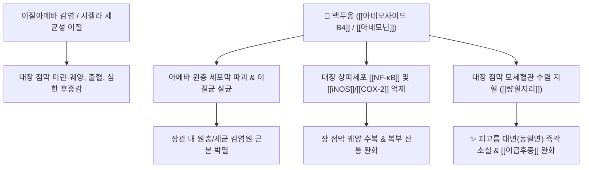

# 🌿 [[백두옹]] (白頭翁, Pulsatillae Radix)

> **핵심 요약 (Key Summary)**:
> 미나리아재비과(*Ranunculaceae*) 할미꽃(*Pulsatilla koreana*) 또는 백두옹의 뿌리
> 트리테르펜 사포닌인 [[아네모닌]](Anemonin)과 [[풀사틸로사이드]](Pulsatilloside)가 이질아메바 원충과 시겔라균을 강력히 살균하고 장 점막 염증 궤양 치유
> [[상한론]] 궐음병(厥陰病)의 열리(熱痢, 피고름 섞인 설사)와 이급후중(裏急後重) 및 아메바성 이질을 치료하는 대표적인 [[청열해독]](淸熱解毒)·[[량혈지리]](凉血止痢) 약재

---
## 📌 목차
1. [기본 본초 정보 & 화학 구조 (Pharmacognosy)](#1-기본-본초-정보--화학-구조-pharmacognosy)
2. [핵심 분자약리 기전 & 항원충·항장염 네트워크](#2-핵심-분자약리-기전--항원충항장염-네트워크)
3. [해부생체역학 / 대장 점막 궤양 & 직장 연축 연계](#3-해부생체역학--대장-점막-궤양--직장-연축-연계)
4. [사상의학 및 임상 응용 (적응증 vs 금기)](#4-사상의학-및-임상-응용-적응증-vs-금기)
5. [상한론 『약징(藥徵)』 분석 및 배오 원리](#5-상한론-약징藥徵-분석-및-배오-원리)
6. [핵심 처방 비교 매트릭스](#6-핵심-처방-비교-매트릭스)
7. [출처 및 학술 참고 문헌 (References)](#7-출처-및-학술-참고-문헌-references)

---
## 1. 기본 본초 정보 & 화학 구조 (Pharmacognosy)

| 항목 | 상세 내용 |
| :--- | :--- |
| **기원 식물** | 미나리아재비과(Ranunculaceae) 할미꽃 *Pulsatilla koreana* Nakai 또는 백두옹 *Pulsatilla chinensis* (Bunge) Regel의 뿌리 |
| **성미 (性味)** | 苦, 寒 |
| **귀경 (歸經)** | 胃·大腸經 (위경, 대장경) |
| **효능 (Actions)** | [[청열해독]](淸熱解毒), [[량혈지리]](凉血止痢), [[조습살충]](燥濕殺蟲) |
| **주요 성분** | • **프로토아네모닌계 성분**: [[아네모닌]] (Anemonin), 프로토아네모닌, 오키날린<br>• **트리테르펜 사포닌**: [[풀사틸로사이드]] (Pulsatilloside A-D), 헤데라게닌 배당체 (KP 규격 지표 [[아네모사이드 B4]] $\ge 4.6\%$)<br>• **탄닌 및 플라보노이드**: 베툴린산 |

> **[유래 및 본초학적 기전]**:
> * 열매에 백색의 긴 털이 밀생하여 할머니/할아버지의 흰머리를 닮아 '백두옹(白頭翁)'이라 불렸습니다.
> * 약성이 매우 차갑고 쓴맛이 강하여 대장(大腸) 혈분의 독열(毒熱)을 시원하게 식혀주고, 피고름이 섞여 나오는 열성 설사(열리 熱痢)를 멎게 합니다.

### 🔬 백두옹의 주요 지표물질 화학 구조
```
     O===C──CH──CH2
         │   │   │  <-- 아네모닌 (Anemonin)
     CH2─CH──C===O
```
> **[구조적 특징 및 이량체화]**: 생약 건조 시 불안정한 자극성 물질인 프로토아네모닌이 중합하여 안정한 락톤 이량체인 [[아네모닌]]으로 전환되며, 독성은 줄어들고 이질아메바 및 세균 살균 활성은 극대화됩니다.

---
## 2. 핵심 분자약리 기전 & 항원충·항장염 네트워크



### (1) 항원충 및 항균 활성
* **이질아메바(Entamoeba histolytica) 특이적 살멸**:
  * 백두옹 추출물은 아메바 원충의 영양형과 포낭을 직접 파괴하여 아메바성 이질 치료에 특효를 나타냅니다.
* **대장 점막 항염증 및 지혈 작용**:
  * 대장 점막의 염증성 사이토카인 생성을 차단하고 모세혈관 파열을 수렴하여 혈변(血便)과 점액변을 멎게 합니다.
* **직장 괄약근 연축 이완 (이급후중 완화)**:
  * 직장 점막의 충혈과 염증성 자극을 제거하여 배변 후 뒤가 묵직하고 당기는 후중감을 해소합니다.

---
## 3. 해부생체역학 / 대장 점막 궤양 & 직장 연축 연계

* **S상 결장 및 직장 점막 궤양 치유**:
  * 이질균 독소로 인한 장점막의 허혈성 미란을 방지하고 상피세포 재생을 촉진합니다.
* **트리코모나스 질염 및 음부 소양증**:
  * 외용 세척 시 트리코모나스 원충을 살멸하여 질염과 가려움증을 치료합니다.

---
## 4. 사상의학 및 임상 응용 (적응증 vs 금기)

```
[✅ 최적 적응증 (Sweet Spot)]
• 급성 세균성 이질 및 아메바성 이질: 복통, 발열, 피고름이 섞인 설사, 이급후중(뒤가 묵직함)
• 궤양성 대장염(UC) 급성 악화기: 혈변과 점액변이 잦고 하복부 열감이 심한 경우
• 부인과 질환: 트리코모나스 질염, 황색 대하, 음부 가려움증

[⚠️ 신중 투여 및 금기 (Caution / Contraindication)]
• 허한성 설사(虛寒痢): 배가 차고 맑은 물 같은 설사를 하며 몸이 찬 환자
• 장기 복용 주의: 약성이 대단히 차가우므로 급성기 증상이 가라앉으면 복용 중단
```

---
## 5. 상한론 『약징(藥徵)』 분석 및 배오 원리

### (1) 『[[약징]]』에 나타난 백두옹의 주치
> **"白頭翁 主治熱利, 腹痛, 下重也..."**  
> (백두옹의 주치는 열성 설사(熱利)와 복통 및 뒤가 묵직한 이급후중(下重)을 치료하는 것이다.)

* **핵심 배오 원리**:
  * [[백두옹]] + [[황련]] + [[황백]] + [[진피]](물푸레나무껍질)` $\rightarrow$ 열독을 끄고 장 점막 궤양을 다스리는 이질 치료의 최고 명방 ([[백두옹탕]])
  * [[백두옹]] + [[아교]] + [[감초]] $\rightarrow$ 산후 허약자의 혈리(血痢)에서 음혈을 보하며 지혈 ([[백두옹가감초아교탕]])

---
## 6. 핵심 처방 비교 매트릭스

| 처방명 | 구성 약재 | 주치 병증 및 임상 타깃 | 특징 및 감별점 |
| :--- | :--- | :--- | :--- |
| [[백두옹탕]] | [[백두옹]], [[황련]], [[황백]], [[진피]](물푸레껍질) | **궐음병 열리, 농혈변(피고름 설사), 복통, 이급후중** | 아메바성/세균성 이질 치료의 천하 명방 |
| [[백두옹가감초아교탕]] | [[백두옹탕]] + [[감초]], [[아교]] | **산후 허약자의 열리, 만성 궤양성 대장염, 빈혈 동반** | 음혈을 보강하면서 장관 출혈을 멎게 함 |
| [[백두옹산]](외용) | [[백두옹]], [[고삼]], [[사상자]] 전탕액 | 트리코모나스 질염, 음부 소양감, 황대하 | 외용 세척을 통한 원충 살균 |

---
## 7. 출처 및 학술 참고 문헌 (References)

1. **Guan, Y., et al. (2014)**. Triterpenoid saponins from *Pulsatilla chinensis* and their anti-inflammatory activities. *Phytochemistry*, 99, 107-114.
   - **[연구 요약]**: 백두옹의 아네모사이드 B4 성분이 NF-κB 활성화를 차단하여 대장염 모델에서 장 점막 염증성 사이토카인 발현과 궤양 형성을 유의하게 억제함을 검증.
2. **대한민국약전(KP) 제12개정 (2022)**. 의약품각조 제2부: 백두옹 (Pulsatillae Radix) 규격 기준.
   - **[공정서 규격]**: 건조물 기준 아네모사이드 B4($\text{C}_{59}\text{H}_{96}\text{O}_{26}$) 4.6% 이상 함유 필수 규격 명시.
3. **길익동동 (吉益東洞, 1784)**. 『약징(藥徵)』: 白頭翁 조문.
   - **[고전 원전]**: "白頭翁 主治熱利, 腹痛, 下重也" - 열성 설사 및 이급후중 주치 원리 제시.