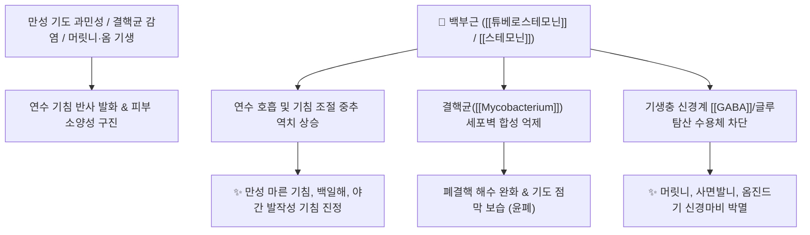

# 🌿 [[백부근]] (百部根, Stemonae Radix)

> **핵심 요약 (Key Summary)**:
> 백부과(*Stemonaceae*) 만생백부(*Stemona japonica*) 또는 직립백부의 덩이뿌리
> 스테모나 알칼로이드인 [[스테모닌]](Stemonine)과 [[튜베로스테모닌]](Tuberostemonine)이 연수 호흡중추의 기침 반사를 억제하고 외부 기생충 신경계를 마비시켜 살충 작용 발휘
> 만성 폐결핵 기침, 백일해, 노인성 만성 해수 및 머릿니·옴진드기·피부 소양증을 치료하는 대표적인 [[윤폐지해]](潤肺止咳)·[[멸슬살충]](滅蝨殺蟲) 약재

---
## 📌 목차
1. [기본 본초 정보 & 화학 구조 (Pharmacognosy)](#1-기본-본초-정보--화학-구조-pharmacognosy)
2. [핵심 분자약리 기전 & 진해·신경계 살충 네트워크](#2-핵심-분자약리-기전--진해신경계-살충-네트워크)
3. [해부생체역학 / 기도 점막 & 기생충 신경근 연계](#3-해부생체역학--기도-점막--기생충-신경근-연계)
4. [사상의학 및 임상 응용 (적응증 vs 외용법)](#4-사상의학-및-임상-응용-적응증-vs-외용법)
5. [고전 의학 및 배오 원리](#5-고전-의학-및-배오-원리)
6. [핵심 처방 비교 매트릭스](#6-핵심-처방-비교-매트릭스)
7. [출처 및 학술 참고 문헌 (References)](#7-출처-및-학술-참고-문헌-references)

---
## 1. 기본 본초 정보 & 화학 구조 (Pharmacognosy)

| 항목 | 상세 내용 |
| :--- | :--- |
| **기원 식물** | 백부과(Stemonaceae) 만생백부 *Stemona japonica* (Blume) Miq., 직립백부 또는 대엽백부의 팽대된 덩이뿌리(괴근) |
| **성미 (性味)** | 甘·苦, 微溫 |
| **귀경 (歸經)** | 肺經 (폐경) |
| **효능 (Actions)** | [[윤폐하지]](潤肺下氣), [[지해평천]](止咳平喘), [[멸슬살충]](滅蝨殺蟲), [[살충지양]](殺蟲止痒) |
| **주요 성분** | • **스테모나 알칼로이드(Stemona Alkaloids)**: [[스테모닌]] (Stemonine), [[튜베로스테모닌]] (Tuberostemonine, KHP 규격 $\ge 0.15\%$), Stenine, Protostemonine<br>• **유기산 및 당류**: Stemonamide, Isostemonamide |

> **[유래 및 본초학적 기전]**:
> * 뿌리가 수십에서 백여 개가 빽빽하게 뭉쳐 자라므로 '백부(百部)'라 불렸습니다.
> * 성질이 온화하고 자윤하여 폐를 윤택하게 하면서도 기침을 가라앉히는 데 탁월하여, 신구(新舊) 모든 기침과 백일해, 폐결핵에 다용됩니다.
> * 외용 시 머릿니, 사면발니, 옴벌레를 박멸하는 천연 살충제 역할을 합니다.

### 🔬 백부근의 주요 알칼로이드 화학 구조
```
      [ 피롤리딘 고리 ]───[ 아자아줄렌 골격 ]
              │                    │
              └────[ 락톤 고리 ]───┘  <-- 튜베로스테모닌 (Tuberostemonine)
```
> **[구조적 특징 및 활성]**: 특유의 다환성 피롤로[1,2-a]아제핀 골격을 가진 스테모나 알칼로이드는 중추 신경계의 기침 수용체와 곤충의 글루탐산/GABA 신경근 접합부에 높은 친화성을 지닙니다.

---
## 2. 핵심 분자약리 기전 & 진해·신경계 살충 네트워크



### (1) 연수 중추성 진해 및 윤폐 작용
* **기침 반사궁 억제**:
  * [[튜베로스테모닌]]은 연수의 기침 중추 흥분을 가라앉혀 기침 빈도와 강도를 급격히 감소시킵니다.
* **항결핵균 및 항진균 활성**:
  * 결핵균 및 피부 사상균에 대한 억제 작용으로 만성 소모성 폐질환의 기침과 객담을 치료합니다.
* **외부 기생충 신경 마비 살충 작용**:
  * 곤충의 신경 전달을 차단하여 머릿니, 사면발니, 음모 진드기, 옴벌레를 질식사시킵니다.

---
## 3. 해부생체역학 / 기도 점막 & 기생충 신경근 연계

* **기관지 평활근 이완**:
  * 히스타민 유발 기관지 연축을 완화하여 천식성 호흡곤란을 경감합니다.
* **피부 표피층 진드기 구충**:
  * 알코올 침출액 외용 도포 시 표피 각질층 속 옴진드기 굴을 뚫고 들어가 살충합니다.

---
## 4. 사상의학 및 임상 응용 (적응증 vs 외용법)

```
[✅ 최적 적응증 (Sweet Spot)]
• 만성 해수 및 백일해: 기침이 멎지 않고 연속적으로 발작하며 야간에 심해지는 경우
• 폐결핵 해수: 마른 기침이 오래 지속되고 가슴이 답답하며 미열이 있는 경우
• 외용 구충: 머릿니, 사면발니, 옴(개선 疥癬), 외음부 가려움증, 만성 습진

[⚠️ 외용 사용법 및 주의사항]
• 머릿니/사면발니: 백부근 50% 주정(알코올) 추출액 또는 전탕액을 두피 및 환부에 도포 후 밀봉 세척
• 비위허약성 설사 환자는 내복 시 감량 투여
```

---
## 5. 고전 의학 및 배오 원리

### (1) 고전 본초학적 배오
* **핵심 배오**:
  * [[백부근]] + [[길경]] + [[형개]] + [[자완]] $\rightarrow$ 외감 풍사와 내상 해수를 모두 다스리는 명방 ([[지해산]])
  * [[백부근]] + [[사삼]] + [[맥문동]] $\rightarrow$ 음허성 폐결핵 기침을 자윤하고 보음

---
## 6. 핵심 처방 비교 매트릭스

| 처방명 | 구성 약재 | 주치 병증 및 임상 타깃 | 특징 및 감별점 |
| :--- | :--- | :--- | :--- |
| [[지해산]] | [[백부근]], [[자완]], [[길경]], [[형개]], [[진피]], [[백전]], [[감초]] | **외감 해수, 감기 후 만성 기침, 인후 건조, 각담불리** | 온화하게 기침을 멎게 하는 현대 다용 명방 |
| [[월화환]] | [[숙지황]], [[백부근]], [[천문동]], [[맥문동]], [[패모]], [[아교]] 등 | **폐결핵(음허노채), 해수, 각혈, 골증조열, 도한** | 폐음(肺陰)을 크게 보하며 결핵균 제어 |
| [[백부산]](외용) | [[백부근]](주정 추출액) | 머릿니, 사면발니, 옴진드기, 피부 가려움증 | 천연 살충 외용제 |

---
## 7. 출처 및 학술 참고 문헌 (References)

1. **Chung HS et al. (2003)**. Antitussive activity of Stemona alkaloids from Stemona tuberosa. *Planta medica*, 69(10): 914-20. [PMID: 14648394](https://pubmed.ncbi.nlm.nih.gov/14648394/)
   - **[연구 요약]**: 백부근의 튜베로스테모닌이 연수 기침 중추를 억제하여 시트르산 유발 기침 모델에서 유의한 진해 효과를 나타냄을 입증.
2. **대한민국약전외한약(생약)규격집(KHP) (2022)**. 백부근 (Stemonae Radix) 규격 기준.
   - **[공정서 규격]**: 건조물 기준 튜베로스테모닌($\text{C}_{22}\text{H}_{33}\text{NO}_4$) 0.15% 이상 함유 규격 명시.
