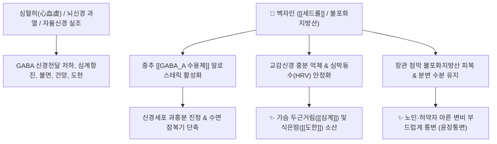

# 🌿 [[백자인]] (柏子仁, Platycladi Semen)

> **핵심 요약 (Key Summary)**:
> 측백나무과(*Cupressaceae*) 측백나무(*Platycladus orientalis*)의 성숙한 종자(씨앗)
> 세스퀴테르펜 정유인 [[세드롤]](Cedrol)과 풍부한 불포화지방산이 중추 [[GABA_A 수용체]] 신호를 강화하여 뇌신경 흥분을 진정시키고 장관 내 연동 윤활 작용 발휘
> 심혈부족(心血不足)으로 인한 불면·심계항진(가슴 두근거림)·도한(식은땀) 및 노인성 음혈허(陰血虛) 변비를 치료하는 대표적인 [[양심안신]](養心安神)·[[윤장통변]](潤腸通便) 약재

---
## 📌 목차
1. [기본 본초 정보 & 화학 구조 (Pharmacognosy)](#1-기본-본초-정보--화학-구조-pharmacognosy)
2. [핵심 분자약리 기전 & GABA·수면 네트워크](#2-핵심-분자약리-기전--gaba수면-네트워크)
3. [해부생체역학 / 자율신경계 & 장관 점막 연계](#3-해부생체역학--자율신경계--장관-점막-연계)
4. [사상의학 및 임상 응용 (산조인 vs 백자인 감별)](#4-사상의학-및-임상-응용-산조인-vs-백자인-감별)
5. [고전 의학 및 배오 원리 (천왕보심단 배오)](#5-고전-의학-및-배오-원리-천왕보심단-배오)
6. [핵심 처방 비교 매트릭스](#6-핵심-처방-비교-매트릭스)
7. [출처 및 학술 참고 문헌 (References)](#7-출처-및-학술-참고-문헌-references)

---
## 1. 기본 본초 정보 & 화학 구조 (Pharmacognosy)

| 항목 | 상세 내용 |
| :--- | :--- |
| **기원 식물** | 측백나무과(Cupressaceae) 측백나무 *Platycladus orientalis* (L.) Franco의 잘 익은 씨(종인) |
| **성미 (性味)** | 甘, 平 |
| **귀경 (歸經)** | 心·腎·大腸經 (심경, 신경, 대장경) |
| **효능 (Actions)** | [[양심안신]](養心安神), [[윤장통변]](潤腸通便), [[익음양혈]](益陰養血), [[지한]](止汗) |
| **주요 성분** | • **세스퀴테르펜 정유**: [[세드롤]] (Cedrol), $\alpha$-피넨, 카리오필렌<br>• **지방유(14~18%)**: [[올레산]] (Oleic acid), [[리놀레산]] (Linoleic acid), 팔미트산<br>• **스테롤 및 사포닌**: $\beta$-Sitosterol, Daucosterol, 백자인 다당체 |

> **[유래 및 본초학적 기전]**:
> * 모든 나무는 태양(동남쪽)을 향하지만 측백나무만이 음(陰)의 방향인 서쪽을 향해 자라므로 '백(柏)'이라 불리며, 음혈(陰血)을 깊이 보충해 줍니다.
> * 심장과 혈액이 부족하여 가슴이 두근거리고, 밤에 잠을 잘 이루지 못하며, 식은땀(도한)이 나고, 장이 메말라 생기는 노인성 변비를 치료합니다.
> * 기름기가 많으므로 비위가 허약하여 설사를 잘하는 환자에게는 기름을 짜낸 백자인상(柏子仁霜)을 사용합니다.

### 🔬 백자인의 주요 정유 지표물질 화학 구조
```
         CH3
          │
     [ 8환성 골격 ]───OH  <-- 세드롤 (Cedrol)
     /            \
  (CH3)2          CH3
```
> [구조적 특징 및 신경 진정]: [[세드롤]](Cedrol)은 측백나무과 특유의 삼환성 세스퀴테르펜 알코올로, 후각 및 혈관 점막을 통해 흡수되어 교감신경의 톤을 낮추고 부교감신경을 안정화시켜 수면 구조(Non-REM 수면)를 개선합니다.

---
## 2. 핵심 분자약리 기전 & GABA·수면 네트워크



### (1) 양심안신 및 중추신경계 진정 기전
* [[GABA_A 수용체]] 신호 강화:
  * 세드롤과 정유 분획이 뇌 내 억제성 신경전달물질인 GABA의 수용체 결합을 촉진하여 수면 유도 및 항불안, 항경련 작용을 발휘합니다.
* **심박동 안정 및 자한/도한 수렴**:
  * 심근의 자율신경 균형을 조절하여 신경성 심계항진(가슴 뜀)을 가라앉히고, 수면 중 발생하는 식은땀(도한 盜汗)을 수렴합니다.
* **윤장통변(潤腸通便) 및 장관 윤활**:
  * 풍부한 지방유가 메마른 대장 벽을 매끄럽게 코팅하여 자극 없이 분변 배출을 촉진합니다.

---
## 3. 해부생체역학 / 자율신경계 & 장관 점막 연계

* **심장 자율신경 톤(Vagal Tone) 정상화**:
  * 불안 및 심인성 스트레스로 인한 동방결절(SA node)의 빈맥을 안정적인 서맥 리듬으로 유도합니다.
* **골반저 근육 및 항문 점막 완충**:
  * 굳은 변으로 인한 치질 출혈 및 배변 곤란을 완화합니다.

---
## 4. 사상의학 및 임상 응용 (산조인 vs 백자인 감별)

```
[✅ 최적 적응증 (Sweet Spot)]
• 심혈부족 불면증: 생각이 많아 잠들기 어렵고, 가슴이 두근거리며(심계), 꿈이 많고(다몽), 기억력이 떨어지는 경우
• 노인성 및 산후 변비: 진액과 혈액이 말라 변이 염소똥처럼 굳어 나오는 변비
• 도한증(식은땀): 자고 일어나면 베개와 옷이 젖을 정도로 식은땀을 흘리는 증상
• 신경 쇠약으로 정신이 몽롱하고 안정이 되지 않는 상태

[🔍 백자인 vs 산조인 감별 포인트]
• [[산조인]]: 맛이 시고 달아(酸甘) 간담(肝膽)의 음혈을 수렴하는 작용이 강함 (불면·수렴 특화)
• [[백자인]]: 기름기가 풍부하여(甘潤) 심신(心腎)을 보하고 대장을 윤택하게 함 (불면 + 변비에 특화)

[⚠️ 신중 투여 및 법제 주의 (Caution)]
• 설사 환자 주의: 기름 성분으로 변이 묽어질 수 있으므로 비허 설사 환자는 기름을 짠 백자인상(霜) 사용
```

---
## 5. 고전 의학 및 배오 원리 (천왕보심단 배오)

### (1) 음혈부족 신경증의 명방: 천왕보심단(天王補心丹)
* **안신 2대 명약 배오**:
  * [[백자인]] + [[산조인]] $\rightarrow$ 심과 간의 음혈을 함께 자양하여 불면과 불안을 근본적으로 다스림
  * [[백자인]] + [[생지황]] + [[현삼]] $\rightarrow$ 허열을 내리고 혈액을 보충하여 정신을 안정 ([[천왕보심단]])
  * [[백자인]] + [[육종용]] + [[당귀]] $\rightarrow$ 혈액을 보하면서 노인성 완고한 변비를 매끄럽게 통리

---
## 6. 핵심 처방 비교 매트릭스

| 처방명 | 구성 약재 | 주치 병증 및 임상 타깃 | 특징 및 감별점 |
| :--- | :--- | :--- | :--- |
| [[천왕보심단]] | [[생지황]], [[현삼]], [[백자인]], [[산조인]], [[당귀]], [[인삼]], [[복신]] 등 | **음허혈소, 심계항진, 불면, 다몽, 건망, 구설생창, 변비** | 심신불교(心腎不交) 불면증의 최고 대표방 |
| [[양심탕]] | [[백자인]], [[산조인]], [[원지]], [[복신]], [[당귀]], [[황기]] 등 | **심비양허(心脾兩虛), 가슴 두근거림, 불안, 불면, 피로** | 기혈을 보강하면서 정신을 편안하게 함 |
| [[백자인원]] | [[백자인]], [[숙지황]], [[구기자]], [[당귀]], [[복령]] | **허로(虛勞), 정혈부족, 건망, 조기 백발, 마른 변비** | 음혈을 보강하여 노화를 억제하는 자양제 |
| [[오인환]] | [[도인]], [[행인]], [[백자인]], [[송자인]], [[울리인]] | **노인 및 산후 진액 고갈성 만성 변비** | 씨앗 기름으로 장을 부드럽게 통변 |

---
## 7. 출처 및 학술 참고 문헌 (References)

1. **Kagawa, E., et al. (2003)**. The sedative effects of inhalation of cedrol in humans and autonomic nervous activity. *Flavour and Fragrance Journal*, 18(6), 480-485.
   - **[연구 요약]**: 측백나무 종자(백자인)의 주요 성분인 세드롤 흡입이 인체의 부교감신경 활성을 높이고 수면 유도 및 심박수 안정 효과를 나타냄을 임상 검증.
2. **대한민국약전(KP) 제12개정 (2022)**. 의약품각조 제2부: 백자인 (Platycladi Semen) 규격 기준.
   - **[공정서 규격]**: 건조물 기준 순도시험(이물 2.0% 이하, 산패도 시험) 및 건조감량 7.0% 이하 기준 명시.
