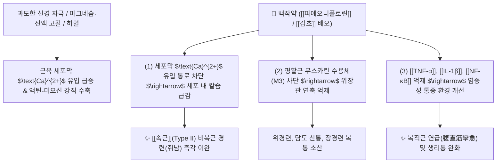

# 🌿 [[백작약]] (白芍藥, Paeoniae Radix Alba)

> **핵심 요약 (Key Summary)**:
> 작약과(*Paeoniaceae*) 작약(*Paeonia lactiflora*)의 주피를 벗겨 삶아 말린 뿌리
> 모노테르펜 배당체인 [[파에오니플로린]](Paeoniflorin)이 세포막 [[칼슘 채널]] 유입과 무스카린성 수용체를 차단하여 골격근 및 위장관 평활근 경련을 즉시 이완
> [[상한론]]의 복직근 연급(腹直筋攣急)·비복근 경련(쥐남) 및 간비불화(肝脾不和) 복통을 치료하는 대표적인 [[유간지통]](柔肝止痛)·[[양혈렴음]](養血斂陰) 군약(君藥)

---
## 📌 목차
1. [기본 본초 정보 & 화학 구조 (Pharmacognosy)](#1-기본-본초-정보--화학-구조-pharmacognosy)
2. [핵심 분자약리 기전 & 칼슘 통로·근이완 네트워크](#2-핵심-분자약리-기전--칼슘-통로근이완-네트워크)
3. [해부생체역학 / 속근(Type II) 경련 & 복직근 연급 연계](#3-해부생체역학--속근type-ii-경련--복직근-연급-연계)
4. [사상의학 및 체질별 임상 응용 (적응증 vs 적작약 감별)](#4-사상의학-및-체질별-임상-응용-적응증-vs-적작약-감별)
5. [상한론 『약징(藥徵)』 분석 및 배오 원리](#5-상한론-약징藥徵-분석-및-배오-원리)
6. [핵심 처방 비교 매트릭스](#6-핵심-처방-비교-매트릭스)
7. [출처 및 학술 참고 문헌 (References)](#7-출처-및-학술-참고-문헌-references)

---
## 1. 기본 본초 정보 & 화학 구조 (Pharmacognosy)

| 항목 | 상세 내용 |
| :--- | :--- |
| **기원 식물** | 작약과(Paeoniaceae) 작약 *Paeonia lactiflora* Pall.의 뿌리를 삶아서 외피를 벗겨 말린 것 |
| **성미 (性味)** | 苦·酸, 微寒 |
| **귀경 (歸經)** | 肝·脾經 (간경, 비경) |
| **효능 (Actions)** | [[양혈렴음]](養血斂陰), [[유간지통]](柔肝止痛), [[평억간양]](平抑肝陽), [[염음지한]](斂陰止汗) |
| **주요 성분** | • **모노테르펜 배당체**: [[파에오니플로린]] (Paeoniflorin, KP 규격 $\ge 2.0\%$), 알비플로린(Albiflorin), 옥시파에오니플로린, 벤조일파에오니플로린<br>• **탄닌 및 페놀 화합물**: 1,2,3,4,6-펜타갈로일글루코오스, 갈산, 카테킨<br>• **트리테르페노이드**: 베툴린산, 올레아놀산 |

> **[유래 및 본초학적 기전]**:
> * '약용 부위가 빼어난 꽃(芍)'이라는 의미처럼 혈액을 풍부하게 자양하고 굳어 있는 근육을 부드럽게 이완시키는 유간(柔肝)의 으뜸 약재입니다.
> * 간혈(肝血) 부족으로 인한 사지 근육 경련, 복직근 긴장, 늑간신경통, 생리통, 두통을 멎게 합니다.

### 🔬 백작약의 주요 지표물질 화학 구조
```
        O──[ Glc ]
       /
   [ 피난 케이지 골격 ]───O──CO──Ph  <-- 파에오니플로린 (Paeoniflorin)
      \     /
       C───O
```
> **[구조적 특징 및 이완 메커니즘]**: [[파에오니플로린]]은 독특한 케이지(Cage) 형태의 옥사-아다만탄 유도체 골격을 지니며, 세포막 전위의존성 칼슘 채널 및 무스카린성 수용체에 작용하여 평활근과 골격근의 비정상적 수축을 차단합니다.

> 🧬 **현대 학술 근거 (2026-09-08 B-7 패치)** — PubChem 실측 분자 앵커: 파에오니플로린(Paeoniflorin) CID **442534** · 분자식 C₂₃H₂₈O₁₁ · MW 480.5

🔬 **분자 구조** (Wikimedia Commons, Public Domain)

![[Paeoniflorin_구조.png|420]]
> [그림 1] 파에오니플로린(Paeoniflorin, C₂₃H₂₈O₁₁) 분자 구조 — 출처: Wikimedia Commons (기존 첨부 재사용)

---
## 2. 핵심 분자약리 기전 & 칼슘 통로·근이완 네트워크



### (1) 표적 근육 이완 및 진통 작용
* **세포 내 칼슘 유입 차단 (골격근 경련 이완)**:
  * 골격근 및 혈관 평활근의 전위의존성 칼슘 채널을 억제하여 세포질 내 칼슘 이온 농도를 낮춤으로써 근육 강직과 경련을 신속히 풉니다.
* **무스카린 수용체 조절 (평활근 산통 진정)**:
  * 위장관, 담도, 요로, 자궁 평활근의 무스카린 $\text{M}_3$ 수용체를 길항하여 위경련, 담석 산통, 생리통을 완화합니다.
* **항염증 및 면역 조절 (간 보호)**:
  * 대식세포의 염증성 사이토카인([[TNF-α]], [[IL-1β]]) 생성을 차단하고 간세포 손상을 방어합니다.

---
## 3. 해부생체역학 / 속근(Type II) 경련 & 복직근 연급 연계

* **속근(Type II, 순간수축근)의 유통성 경련(Cramp)**:
  * 격렬한 운동이나 허혈로 종아리 비복근(Gastrocnemius)에 쥐가 났을 때 감초와 배오하여([[작약감초탕]]) 수분 만에 경련을 해소합니다.
* **복진 상 복직근 연급(腹直筋攣急)**:
  * 복직근이 마치 대나무 막대기처럼 팽팽하게 굳어 누르면 심한 통증을 호소하는 병태를 유연하게 풀어줍니다.

---
## 4. 사상의학 및 체질별 임상 응용 (적응증 vs 적작약 감별)

```
[✅ 최적 적응증 (Sweet Spot)]
• 근육 경련: 야간 종아리 쥐남(비복근 전근), 안면근육 떨림, 목·어깨 결림
• 복통 및 소화기 산통: 배가 쥐어짜듯 아프고 복직근이 팽팽하게 긴장된 경우 ([[소건중탕]])
• 부인과 질환: 생리통, 혈허성 무월경, 산후 복통, 습관성 유산
• 간양상항(肝陽上亢): 혈압이 오르고 두통, 어지럼증, 눈 충혈이 있는 경우

[🔍 백작약 vs 적작약 감별]
• [[백작약]]: 껍질을 벗겨 삶아 말린 것으로, 보혈(補血)·양혈렴음·유간지통에 특화 (허증/근육경련)
• [[적작약]]: 껍질째 말린 것으로, 청열량혈(淸熱凉血)·산어소종에 특화 (실증/혈열어혈)
```

---
## 5. 상한론 『약징(藥徵)』 분석 및 배오 원리

### (1) 『[[약징]]』에 나타난 작약의 주치
> **"芍藥 主治結實, 拘攣也. 旁治腹痛, 頭痛, 身疼, 癰膿, 咳逆, 下利, 小便不利..."**  
> (작약의 주치는 근육과 조직이 굳어 뭉친 것(結實)과 쥐가 나고 당기는 구련(拘攣)이며, 곁들여 복통, 두통, 몸살, 옹농, 기침, 설사, 소변불리를 치료한다.)

* **핵심 배오 원리**:
  * [[백작약]] + [[감초]] $\rightarrow$ 산감화음(酸甘化陰)의 진수로 전신 모든 근육 경련과 급성 산통을 즉시 완화 ([[작약감초탕]])
  * [[백작약]] + [[당귀]] + [[천궁]] + [[숙지황]] $\rightarrow$ 혈허를 보강하고 순환을 촉진하는 보혈의 기본방 ([[사물탕]])
  * [[백작약]] + [[시호]] + [[지실]] $\rightarrow$ 간기울결과 담음 통증을 풀고 흉협고만을 해소 ([[사역산]])
> 🧬 **현대 학술 근거 (2026-09-08 B-7 패치)**
> - 배오 데이터마이닝 근거(연구 결과): 중국약전(2020·2025판) 및 역대 경전 명방 208방을 데이터마이닝한 결과 백작약이 포함된 배오 36종 중 사용빈도 최상위 5개가 백작약+감초, 백작약+당귀, 백작약+천궁, 백작약+숙지황, 백작약+백출 순으로 확인되어 상기 사물탕·작약감초탕 계열 배오가 실제 임상 처방 빈도에서도 최상위임이 재확인됨(PMID 42184908).

---
## 6. 핵심 처방 비교 매트릭스

| 처방명 | 구성 약재 | 주치 병증 및 임상 타깃 | 특징 및 감별점 |
| :--- | :--- | :--- | :--- |
| [[작약감초탕]] | [[백작약]], [[감초]] (동량 배오) | **비복근 경련(쥐남), 위경련, 담석/요로 결석 산통, 복직근 긴장** | 근육 경련 및 진통의 천하제일 구급방 |
| [[소건중탕]] | [[계지탕]] + [[백작약]](배용), [[이당]](조청) | **허로 복통, 소아 야제증, 만성 피로, 복직근 긴장** | 비위를 보하며 신경성 복통을 다스림 |
| [[당귀작약산]] | [[당귀]], [[백작약]], [[복령]], [[백출]], [[택사]], [[천궁]] | **부인과 혈허수체, 임신 복통, 하지 부종, 어지럼증** | 보혈과 이뇨를 겸하여 부인과 다용 |
| [[사역산]] | [[시호]], [[백작약]], [[지실]], [[감초]] | **간비불화, 양협통, 스트레스성 복통, 수족궐랭** | 사지 말초 혈류를 개통하고 흉협부 통증 완화 |

---
## 7. 출처 및 학술 참고 문헌 (References)

1. **Zhang L et al. (2020)**. Anti-inflammatory and immunoregulatory effects of paeoniflorin and total glucosides of paeony. *Pharmacology & therapeutics*, 207: 107452. [PMID: 31836457](https://pubmed.ncbi.nlm.nih.gov/31836457/)
   - **[연구 요약]**: 작약의 파에오니플로린이 칼슘 통로 차단 및 NF-κB 신호 억제를 통해 근육 경련을 완화하고 관절염 염증을 억제함을 규명.
2. **대한민국약전(KP) 제12개정 (2022)**. 의약품각조 제2부: 작약 (Paeoniae Radix) 규격 기준.
   - **[공정서 규격]**: 건조물 기준 파에오니플로린($\text{C}_{23}\text{H}_{28}\text{O}_{11}$) 2.0% 이상 함유 필수 규격 명시.
3. **길익동동 (吉益東洞, 1784)**. 『약징(藥徵)』: 芍藥 조문.
   - **[고전 원전]**: "芍藥 主治結實, 拘攣也" - 결실과 근육 구련에 대한 작약의 핵심 주치 원리 제시.
