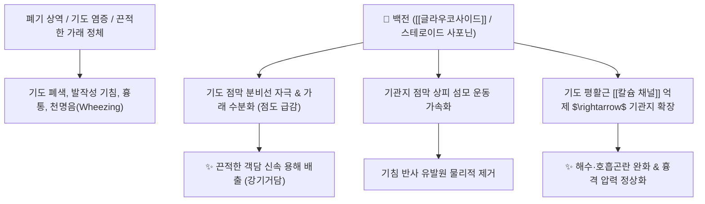

# 🌿 [[백전]] (白前, Cynanchi Stauntonii Rhizoma et Radix)

> **핵심 요약 (Key Summary)**:
> 박주가리과(*Apocynaceae*) 유엽백전(*Cynanchum stauntonii*)의 뿌리줄기 및 뿌리
> $\text{C}_{21}$ 스테로이드 배당체인 [[스타운토닌]](Stauntonin)과 [[글라우코사이드]](Glaucoside)가 기관지 점막 분비물을 용해하고 평활근 연축을 억제하여 강력한 거담 및 진해 작용 발휘
> 폐기울체(肺氣鬱滯)와 담음상역(痰飲上逆)으로 가슴에 가래가 끓고 숨이 차며 기침이 멎지 않는 증상을 치료하는 대표적인 [[강기거담]](降氣祛痰)·[[지해평천]](止咳平喘) 약재

---
## 📌 목차
1. [기본 본초 정보 & 화학 구조 (Pharmacognosy)](#1-기본-본초-정보--화학-구조-pharmacognosy)
2. [핵심 분자약리 기전 & 기도 분비·진해 네트워크](#2-핵심-분자약리-기전--기도-분비진해-네트워크)
3. [해부생체역학 / 기관지 평활근 & 흉격 압력 연계](#3-해부생체역학--기관지-평활근--흉격-압력-연계)
4. [사상의학 및 임상 응용 (적응증 vs 전호 감별)](#4-사상의학-및-임상-응용-적응증-vs-전호-감별)
5. [고전 의학 및 배오 원리](#5-고전-의학-및-배오-원리)
6. [핵심 처방 비교 매트릭스](#6-핵심-처방-비교-매트릭스)
7. [출처 및 학술 참고 문헌 (References)](#7-출처-및-학술-참고-문헌-references)

---
## 1. 기본 본초 정보 & 화학 구조 (Pharmacognosy)

| 항목 | 상세 내용 |
| :--- | :--- |
| **기원 식물** | 협죽도과 / 박주가리과(Asclepiadaceae) 유엽백전 *Cynanchum stauntonii* (Decne.) Schltr. ex H. Lév. 또는 원화엽백전의 뿌리줄기 및 뿌리 |
| **성미 (性味)** | 辛·甘, 微溫 (또는 平) |
| **귀경 (歸經)** | 肺經 (폐경) |
| **효능 (Actions)** | [[강기거담]](降氣祛痰), [[강기하지]](降氣下氣), [[지해평천]](止咳平喘), [[선폐화담]](宣肺化痰) |
| **주요 성분** | • **$\text{C}_{21}$ 스테로이드 배당체**: [[스타운토닌]] (Stauntonin), [[글라우코사이드]] (Glaucoside A-E), Glaucogenin A-C<br>• **페난트로인돌리지딘 알칼로이드**: 안토핀(Antofine), 티로포린<br>• **사포닌 및 정유**: 모노테르페노이드, 시토스테롤 |

> **[유래 및 본초학적 기전]**:
> * 뿌리가 희고 형태가 곧으며, 가래(담음)와 싸워 '백전백승(百戰百勝)'한다는 뜻에서 '백전(白前)'이라 불렸습니다.
> * 기운이 위로 치솟아 가슴이 그득하고 숨이 차며 가래가 목구멍에서 그르렁거리는 증상(담다해천 痰多咳喘)을 기운을 아래로 내림으로써(降氣) 다스립니다.
> * 성질이 차지도 덥지도 않아 한담(寒痰)과 열담(熱痰), 신구(新舊) 기침에 두루 활용됩니다.

### 🔬 백전의 $\text{C}_{21}$ 스테로이드 배당체 화학 구조
```
        [ 스테로이드 A/B/C/D 4환 골격 ]───O──[ 사카라이드 사슬 ]
                     │
                   C-17 위치에 에틸렌 글리콜/아세틸 곁사슬
                     │
             글라우코사이드 (Glaucoside)
```
> **[구조적 특징 및 거담 기전]**: 백전의 $\text{C}_{21}$ 스테로이드 배당체 분획은 계면활성 능력을 통해 기도 내 점액성 단백질의 점도를 낮추고 기관지 섬모 운동을 촉진하여 가래 배출을 용이하게 합니다.

---
## 2. 핵심 분자약리 기전 & 기도 분비·진해 네트워크



### (1) 표적 거담 및 강기평천 작용
* **기관지 점액 점도 저하 및 거담**:
  * 객담 내의 뮤신 결합을 완화하여 끈적한 가래를 묽게 만들어 체외 배출을 극대화합니다.
* **강기하지(降氣下氣) 및 진해 작용**:
  * 치밀어 오르는 폐기를 가라앉혀 기침과 천명을 안정화시킵니다.
* **항염증 및 기관지 경련 억제**:
  * 기도 내 염증 세포 침윤을 줄이고 알레르기성 기도 과민성을 완화합니다.

---
## 3. 해부생체역학 / 기관지 평활근 & 흉격 압력 연계

* **흉곽 내압(Intrathoracic Pressure) 정상화**:
  * 잦은 기침으로 인해 상승한 흉막 및 횡격막의 긴장을 이완시킵니다.
* **말초 세기관지 개통**:
  * 가래로 막힌 말초 기도 저항을 줄여 폐포 환기량을 개선합니다.

---
## 4. 사상의학 및 임상 응용 (적응증 vs 전호 감별)

```
[✅ 최적 적응증 (Sweet Spot)]
• 담탁조폐(痰濁阻肺): 가슴에 가래가 가득 차서 그르렁거리고, 숨이 차서 누워있기 힘들며 기침이 심한 경우
• 만성 기관지염, 기관지 확장증, 폐기종으로 인한 만성 해수·천식
• 감기 후기 기침이 멎지 않고 목에 가래가 걸려 뱉어내기 힘든 증상

[🔍 백전 vs 전호 감별 포인트]
• [[백전]]: 오로지 '강기화담(降氣化痰)'에 집중하여 기운을 내리고 가래를 삭임 (내상/기역/담음)
• [[전호]]: '선폐(宣肺) + 강기(降氣)'를 겸하여 체표의 풍열을 흩트리면서 가래를 내림 (외감/표열)

[⚠️ 신중 투여 (Caution)]
• 음허화왕(陰虛火旺)으로 인한 마른 기침(가래가 전혀 없는 마른 기침) 환자 신중 투여
```

---
## 5. 고전 의학 및 배오 원리

### (1) 고전 본초학적 배오
* **핵심 배오**:
  * [[백전]] + [[백부근]] + [[자완]] + [[길경]] $\rightarrow$ 기를 내리고 가래를 삭여 기침을 멈추는 명방 ([[지해산]])
  * [[백전]] + [[상백피]] + [[소자]] $\rightarrow$ 폐열 천해와 호흡 곤란을 시원하게 소통

---
## 6. 핵심 처방 비교 매트릭스

| 처방명 | 구성 약재 | 주치 병증 및 임상 타깃 | 특징 및 감별점 |
| :--- | :--- | :--- | :--- |
| [[지해산]] | [[백전]], [[백부근]], [[자완]], [[길경]], [[형개]], [[진피]], [[감초]] | **외감 해수, 만성 기침, 각담불리, 흉민** | 기침 치료의 가장 온화하고 표준적인 처방 |
| [[백전탕]] | [[백전]], [[자완]], [[반하]], [[생강]] | **폐기상역, 담다천해, 가슴 답답함, 구토** | 한담으로 인한 기침과 천식을 신속히 제어 |
| [[금불초산]](가감) | [[금불초]](선복화), [[백전]], [[전호]], [[마황]], [[적작약]] | 풍한 풍열 외감, 해수, 담천(痰喘) | 표리와 상하를 소통시켜 호흡을 편안하게 함 |

---
## 7. 출처 및 학술 참고 문헌 (References)

   **Lu Y et al. (1997)**. [Antitussive expectorant and antiasthmatic actions of Cynanchum Komarovii Ai. Iljinski]. *Zhongguo Zhong yao za zhi = Zhongguo zhongyao zazhi = China journal of Chinese materia medica*, 22: 242-3, 256. [PMID: 10743222](https://pubmed.ncbi.nlm.nih.gov/10743222/)
   - **[연구 요약]**: Cynanchum속(백전) 식물의 진해·거담·항천식 작용 연구.
2. **대한민국약전외한약(생약)규격집(KHP) (2022)**. 백전 (Cynanchi Stauntonii Rhizoma et Radix) 규격 기준.
   - **[공정서 규격]**: 건조물 기준 순도시험(이물, 중금속, 비소) 및 건조감량 12.0% 이하 기준 명시.
