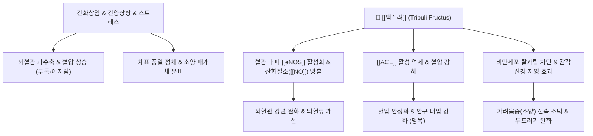

---
aliases:
  - 백질려
  - 白蒺藜
  - 질려자
  - 蒺藜子
  - Tribuli Fructus
  - 남가새
tags:
  - 본초
  - 평간식풍약
  - 평간잠양
  - 소간해울
  - 거풍명목
  - 지양
  - 고혈압
  - 소양증
  - 두통
  - 현훈
---
# 🌿 [[백질려]] (白蒺藜, 질려자 蒺藜子, Tribuli Fructus)

> **핵심 요약 (Key Summary)**:
> 남가새과(Zygophyllaceae) 남가새(*Tribulus terrestris* L.)의 익은 열매.
> 스테로이드 사포닌(프로토디오신, 트리불로신) 및 플라보노이드 성분이 혈관 내피 [[eNOS]] 활성화, 안지오텐신 전환효소([[ACE]]) 억제 및 중추 도파민·테스토스테론 대사 조절.
> 간양상항(肝陽上亢)으로 인한 고혈압성 두통·현훈, 간기울결로 인한 흉협창통·유즙불통, 풍열성 안질환(목적종통) 및 피부 풍진 소양증을 치료하는 대표 평간식풍 약재.

---

## 📌 목차
1. [기본 본초 정보 & 화학 성분 (Pharmacognosy)](#1-기본-본초-정보--화학-성분-pharmacognosy)
2. [핵심 분자약리 기전 & 대사 네트워크](#2-핵심-분자약리-기전--대사-네트워크)
3. [혈관·근육 대사 및 신경-호르몬계 연계](#3-혈관근육-대사-및-신경-호르몬계-연계)
4. [사상의학 및 체질별 임상 응용](#4-사상의학-및-체질별-임상-응용)
5. [상한·임상 배오 원리 및 주요 방제](#5-상한임상-배오-원리-및-주요-방제)
6. [출처 및 학술 참고 문헌 (References)](#6-출처-및-학술-참고-문헌-references)

---

## 1. 기본 본초 정보 & 화학 성분 (Pharmacognosy)

| 항목 | 상세 내용 |
| :--- | :--- |
| **기원 식물** | 남가새과(Zygophyllaceae) 남가새(*Tribulus terrestris* L.)의 성숙한 열매 |
| **성미 (性味)** | 고(苦), 신(辛), 평(平) (미온 또는 미한) |
| **귀경 (歸經)** | 간경(肝經) |
| **전통 효능** | 평간잠양(平肝潛陽), 소간해울(疏肝解鬱), 거풍명목(祛風明目), 지양(止痒) |
| **주요 성분** | • **스테로이드 사포닌**: 프로토디오신(Protodioscin), 디오신, 트리불로신(Tribulosin) • **플라보노이드**: 루틴(Rutin), 케르세틴-배당체, 켐페롤 • **알칼로이드**: 하만(Harmane), 하민(Harmine) 미량 |

---

## 2. 핵심 분자약리 기전 & 대사 네트워크

* **혈관 확장 및 항고혈압 작용**:
  * 프로토디오신이 혈관 내피세포의 [[eNOS]] 인산화를 유도하여 [[NO]] 생성을 촉진함으로써, 말초 혈관 및 뇌혈관을 이완시키고 수축기·이완기 혈압을 안정화.
* **소간해울(疏肝解鬱) 및 신경내분비 조절**:
  * 스트레스로 인한 시상하부-뇌하수체-부신(HPA) 축의 과흥분을 조절하여 가슴 답답함(흉민), 유방 팽통, 갱년기 정서 불안을 완화.
* **항소양 및 항염증 활성**:
  * 비만세포로부터 히스타민 방출을 차단하고 표피 감각신경의 과민성을 억제하여 알레르기성 두드러기, 가려움증, 습진을 개선.
* **남성 호르몬 대사 및 활력 증진 (트리뷸러스)**:
  * 서양 스포츠 영양학(Tribulus)에서 널리 알려진 바와 같이, 황체형성호르몬(LH) 분비를 자극하여 유리 테스토스테론 농도 정상화 및 근력 개선에 기여.

---

## 3. 혈관·근육 대사 및 신경-호르몬계 연계

* **동맥경화반 형성 억제 및 혈소판 응집 방지**:
  * 혈관 내막의 지질 과산화를 억제하고 혈전 형성을 방어하여 허혈성 뇌졸중 전조 증상을 완화.
* **골격근 피로 회복 및 안구 미세순환 개선**:
  * 미토콘드리아 ATP 생성을 촉진하여 근육 피로를 줄이고, 망막 미세혈관 혈류를 개선하여 충혈과 눈부심을 치료(거풍명목).

---

## 4. 사상의학 및 체질별 임상 응용

* **소양인(少陽人) 간양상항 두통의 명약**:
  * 화열이 머리로 치솟아 발생하는 두통, 눈 충혈, 어지럼증에 [[독활지황탕]]이나 [[형방사백산]]에 가미하여 다용.
* **소음인(少陰人) 유방 울체 질환**:
  * 소음인이 산후 기혈 울체로 젖이 잘 돌지 않고 유방에 통증이 생길 때 소간통유(疏肝通乳) 목적으로 배합.
* **주의사항**:
  * 혈허(血虛)로 기운이 없고 빈혈이 심한 환자, 임산부는 신중 투약 또는 감량.

---

## 5. 상한·임상 배오 원리 및 주요 방제

* **배오 원리**:
  * 백질려 + [[조등롱]](조등산): 평간잠양 효과를 극대화하여 고혈압, 안면홍조, 어지럼증을 치료.
  * 백질려 + [[국화]]: 풍열을 끄고 눈을 맑게 하는(명목) 안과 질환의 핵심 배합.
* **대표 처방**:
  * [[백질려산]](白蒺藜散): 풍진, 피부 가려움, 두드러기 치료.
  * [[조등산]]: 간양상항성 고혈압 두통, 뇌동맥경화증.
  * [[천궁다조산]] 가감방: 편두통, 안면신경 마비 전조.

---

## 6. 출처 및 학술 참고 문헌 (References)

* Chhatre, S., et al. (2014). Phytopharmacological overview of Tribulus terrestris. *Pharmacognosy Reviews*, 8(15), 45-51.
  * `[연구 요약]` 백질려(Tribulus terrestris)의 사포닌, 플라보노이드 성분의 혈관확장, 항고혈압, 항산화 및 호르몬 조절 활성을 총괄 정리한 종설.
* Phillips, O. A., et al. (2006). Antihypertensive and vasodilator effects of methanolic and aqueous extracts of Tribulus terrestris in rats. *Journal of Ethnopharmacology*, 104(3), 351-355.
  * `[연구 요약]` 백질려 추출물이 NO 의존성 혈관 확장을 통해 혈압을 유의하게 강하시키며 ACE 활성을 억제함을 증명.
