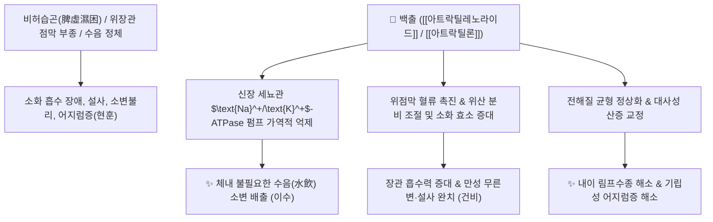

# 🌿 [[백출]] (白朮, Atractylodis Rhizoma Alba)

> **핵심 요약 (Key Summary)**:
> 국화과(*Asteraceae*) 큰꽃삽주(*Atractylodes macrocephala*) 또는 삽주의 뿌리줄기
> 세스퀴테르펜 락톤인 [[아트락틸레노라이드]](Atractylenolide I-III)가 신장 세뇨관 $\text{Na}^+/\text{K}^+$-ATPase 펌프를 억제하여 이뇨를 촉진하고 위장관 점막 혈류와 소화액 분비 촉진
> [[상한론]]의 수음(水飲) 정체·소변불리·현훈(어지럼증) 및 비위기허(脾胃氣虛) 설사·임신 부종을 치료하는 대표적인 [[건비익기]](健脾益氣)·[[조습이수]](燥濕利水)·[[지한안태]](止汗安胎) 군약(君藥)

---
## 📌 목차
1. [기본 본초 정보 & 화학 구조 (Pharmacognosy)](#1-기본-본초-정보--화학-구조-pharmacognosy)
2. [핵심 분자약리 기전 & 세뇨관 Na-K 펌프·건비 네트워크](#2-핵심-분자약리-기전--세뇨관-na-k-펌프건비-네트워크)
3. [해부생체역학 / 위장관 점막 수송 & 내이 림프액 대사 연계](#3-해부생체역학--위장관-점막-수송--내이-림프액-대사-연계)
4. [사상의학 및 체질별 임상 응용 (백출 vs 창출 감별)](#4-사상의학-및-체질별-임상-응용-백출-vs-창출-감별)
5. [상한론 『약징(藥徵)』 분석 및 배오 원리](#5-상한론-약징藥徵-분석-및-배오-원리)
6. [핵심 처방 비교 매트릭스](#6-핵심-처방-비교-매트릭스)
7. [출처 및 학술 참고 문헌 (References)](#7-출처-및-학술-참고-문헌-references)

---
## 1. 기본 본초 정보 & 화학 구조 (Pharmacognosy)

| 항목 | 상세 내용 |
| :--- | :--- |
| **기원 식물** | 국화과(Compositae / Asteraceae) 큰꽃삽주(백출) *Atractylodes macrocephala* Koidz. 또는 삽주 *Atractylodes japonica* Koidz.의 뿌리줄기(근경) |
| **성미 (性味)** | 苦·甘, 溫 |
| **귀경 (歸經)** | 脾·胃經 (비경, 위경) |
| **효능 (Actions)** | [[건비익기]](健脾益氣), [[조습이수]](燥濕利水), [[고표지한]](固表止汗), [[안태]](安胎) |
| **주요 성분** | • **세스퀴테르펜 락톤**: [[아트락틸레노라이드]] (Atractylenolide I, II, III), [[아트락틸론]] (Atractylone)<br>• **정유 및 폴리아세틸렌**: 바이아트락틸로라이드, 아세톡시아트락틸론<br>• **다당류**: 백출 다당체(AMP, 면역 증강) |

> **[유래 및 본초학적 기전]**:
> * '출(朮)'은 비장을 튼튼하게 하여 기운을 돋우는 으뜸 약재로, 껍질을 벗겨 보비(補脾) 작용을 극대화한 것을 백출이라 합니다.
> * 비위의 수습(水濕)을 말려 소화 기능을 강화하고, 몸에 고인 쓸데없는 수분을 소변으로 몰아내며, 표(表)를 굳건히 하여 헛땀을 멎게 하고 임신부의 태아를 편안하게 안태(安胎)시킵니다.

### 🔬 백출의 주요 지표물질 화학 구조
![[Pasted image 20240228142750.png|450]]
> **[구조적 특징 및 이뇨 메커니즘]**: [[아트락틸레노라이드]]는 유데스만(Eudesmane) 골격에 락톤 고리가 결합된 구조로, 신장 세뇨관 상피세포의 $\text{Na}^+/\text{K}^+$-ATPase 활성을 억제하여 나트륨과 수분의 재흡수를 차단하고 소변 배출을 촉진합니다.

> 🧬 **현대 학술 근거 (2026-09-07 B-7 패치)** — PubChem 실측 분자 앵커: [[아트락틸레노라이드]] I(Atractylenolide I) CID **5321018** · 분자식 C₁₅H₁₈O₂ · MW 230.3 | Atractylenolide III CID **155948** · 분자식 C₁₅H₂₀O₃ · MW 248.3

🔬 **분자 구조** (Wikimedia Commons, CC BY-SA 3.0)

![[Atractylenolide_I-III_구조.png|520]]
> [그림] 아트락틸레노라이드 I·II·III(Atractylenolide I/II/III; I: C₁₅H₁₈O₂, III: C₁₅H₂₀O₃) 유데스만 골격 락톤 구조 — 출처: Wikimedia Commons (Atractylenolide I-III.png, CC BY-SA 3.0)

---
## 2. 핵심 분자약리 기전 & 세뇨관 Na-K 펌프·건비 네트워크



### (1) 건비조습 및 이뇨 기전
* **신장 세뇨관 나트륨/칼륨 펌프 조절 (이수소종 利水消腫)**:
  * 신장의 $\text{Na}^+/\text{K}^+$-ATPase 펌프를 억제하여 전해질 및 수분 저류를 해소하고, 대사성 산증 환경을 개선합니다.
* **위장관 점막 보호 및 소화 기능 촉진 (건비익기 健脾益氣)**:
  * 위점막 프로스타글란딘($\text{PGE}_2$) 합성을 증가시켜 공격인자(위산)로부터 위벽을 보호하고 소화관 운동을 정상화합니다.
* **표허자한(表虛自汗) 억제 및 안태(安胎)**:
  * 기허(氣虛)로 모공이 열려 식은땀이 줄줄 흐르는 것을 수렴하고, 자궁 평활근의 불안정한 연축을 억제하여 유산을 방지합니다.

> 🧬 **현대 학술 근거 (2026-09-07 B-7 패치)**
> - 위장관 염증 확장 근거: 궤양성 대장염(UC) 연구에서 백출 근경이 LCN2 매개 pyroptosis 억제를 통해 대장 점막 염증을 개선하며, 쌀뜨물 법제(米泔水漂) 가공품(R-AMR)에서 효능이 증강됨을 보고(PMID 42302942).
> - 장-비장 축 면역 근거: 백출 다당체(PAMK)가 대장암 마우스에서 장내미생물-비장 이중 네트워크를 통해 NK/NKG2D·CD4:CD8 비율·IFN-γ를 높여 항종양 면역을 조율하며, 항생제로 장내미생물을 제거하면 효과가 소실 — 장내미생물 의존성 시사(PMID 42362557).

---
## 3. 해부생체역학 / 위장관 점막 수송 & 내이 림프액 대사 연계

* **내이 전정기관 림프액 압력 조절**:
  * 내이 림프액의 과다 저류로 인한 메니에르병 및 담음성 어지럼증(수독성 현훈)을 해소합니다 ([[택사탕]], [[영계출감탕]]).
* **소장 융모의 수분 재흡수 정상화**:
  * 장관 점막 부종을 제거하여 흡수되지 못하고 쏟아지는 만성 설사를 멎게 합니다.

---
## 4. 사상의학 및 체질별 임상 응용 (백출 vs 창출 감별)

```
[✅ 최적 적응증 (Sweet Spot)]
• 비기허약(脾氣虛弱): 식욕이 없고 먹으면 소화가 안 되며 헛배가 부르고 대변이 묽은 경우
• 수음 정체로 인한 어지럼증(현훈): 앉았다 일어설 때 핑 돌고 머리가 무거우며 눈앞이 아찔한 경우
• 수종 및 소변불리: 몸이 무겁고 다리가 부으며 소변량이 시원치 않은 경우
• 표허자한: 조금만 움직여도 식은땀이 비 오듯 쏟아지는 자한증 ([[옥병풍산]])
• 임신부 입덧 및 태동불안(임신 복통/출혈)

[🔍 백출 vs 창출 감별 포인트]
• [[백출]]: 단맛이 강하고 보(補)하는 작용이 우수 (건비익기·지한·안태 $\rightarrow$ 허증/소화기 보익)
• [[창출]]: 매운맛과 방향성이 강해 발한·조습 작용이 우수 (조습건비·거풍습 $\rightarrow$ 실증/관절염/습체)

[⚠️ 주의사항 (Caution)]
• 음허내열(陰虛內熱)로 진액이 마르고 대변이 심하게 굳은 환자는 감량
```

> 🧬 **현대 학술 근거 (2026-09-07 B-7 패치)**
> - 부인과·안태 계열 확장 근거: 다낭성난소증후군(PCOS) 랫트 모델에서 Atractylenolide III가 Cybb 매개 산화 스트레스 조절을 통해 배란 주기 회복, 난소 기능 및 자궁내막 착상능을 개선(메트포르민 대조) — 安胎·조습 관련 현대 연구 결과(PMID 41910730).

---
## 5. 상한론 『약징(藥徵)』 분석 및 배오 원리

### (1) 『[[약징]]』에 나타난 출(朮)의 주치
> **"朮 主治水也. 故旁治小便自利, 小便不利, 身體煩疼, 痰飲, 失精, 眩冒, 下利, 喜唾..."**  
> (출의 주치는 체내에 정체된 물(水)을 배출하는 것이며, 소변이 저절로 새거나 시원치 않은 것, 몸이 쑤시고 아픈 것, 담음, 몽정, 어지럼증, 설사, 침을 자주 뱉는 것을 곁들여 치료한다.)

* **핵심 배오 원리**:
  * [[백출]] + [[복령]] $\rightarrow$ 비장을 튼튼히 하고 체내 수습을 완벽히 이뇨시키는 불후의 짝 ([[사군자탕]], [[영계출감탕]])
  * [[백출]] + [[택사]] $\rightarrow$ 상초로 치솟는 수독(水毒)을 하초 소변으로 빼내어 어지럼증 완치 ([[택사탕]])
  * [[백출]] + [[인삼]] + [[건강]] $\rightarrow$ 비위의 한습을 덥혀 복통 설사를 멈추게 함 ([[인삼탕]])

---
## 6. 핵심 처방 비교 매트릭스

| 처방명 | 구성 약재 | 주치 병증 및 임상 타깃 | 특징 및 감별점 |
| :--- | :--- | :--- | :--- |
| [[사군자탕]] | [[인삼]], [[백출]], [[복령]], [[감초]] | **비위기허, 식욕부진, 무기력, 안색위황, 연변** | 보기(補氣)와 건비의 기초 근간방 |
| [[영계출감탕]] | [[복령]], [[계지]], [[백출]], [[감초]] | **수음상역, 기립성 어지럼증(현훈), 심계항진, 흉협지만** | 수독성 현훈 및 심장성 수종의 최고 명방 |
| [[택사탕]] | [[택사]], [[백출]] | **심하에 수음이 있어 머리가 빙빙 돌고 배에서 물소리 남** | 단 두 가지 약재로 어지럼증을 다스림 |
| [[옥병풍산]] | [[황기]], [[백출]], [[방풍]] | **표허자한, 면역력 저하, 잦은 감기, 알레르기 비염** | 체표의 기운을 굳건히 방어 |
| [[진무탕]] | [[복령]], [[작약]], [[백출]], [[생강]], [[부자]] | **신양허 수종, 사지 침중동통, 오한, 어지럼증, 설사** | 양기를 북돋우며 수기를 몰아냄 |

---
## 7. 출처 및 학술 참고 문헌 (References)

1. **Li H et al. (2026)**. Atractylenolide III for central nervous system disorders: a review of multi-target mechanisms and therapeutic potential. *Frontiers in pharmacology*, 17: 1799976. [PMID: 42292848](https://pubmed.ncbi.nlm.nih.gov/42292848/)
   - **[연구 요약]**: 백출의 아트락틸레노라이드 성분들이 Na+/K+-ATPase 억제를 통한 이뇨 및 위점막 상피 보호, 대사 경로 개선 활성을 종합적으로 검증.
2. **대한민국약전(KP) 제12개정 (2022)**. 의약품각조 제2부: 백출 (Atractylodis Rhizoma Alba) 규격 기준.
   - **[공정서 규격]**: 건조물 기준 순도시험(이물, 중금속, 비소) 및 엑스함량(묽은에탄올) 22.0% 이상 기준 명시.
3. **길익동동 (吉益東洞, 1784)**. 『약징(藥徵)』: 朮 조문.
   - **[고전 원전]**: "朮 主治水也" - 체내 수음 정체 및 현훈·하리 주치 원리 제시.
