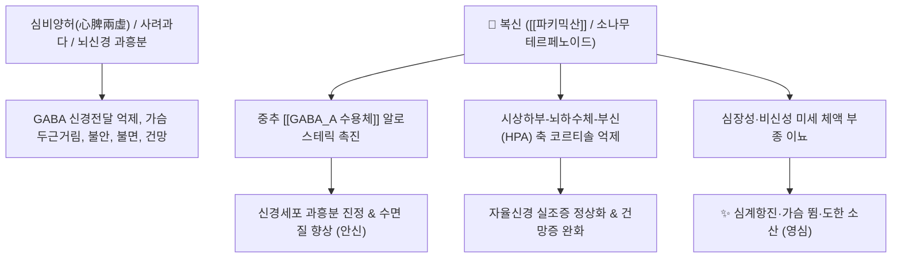

---
aliases:
  - 복신
  - 茯神
  - 백복신
  - 白茯神
  - Poria cum Radice Pini
tags:
  - 본초
  - 안신약
  - 영심안신
  - 이수삼습
---

# 🌿 [[복신]] (茯神, Poria cum Radice Pini)

> **핵심 요약 (Key Summary)**:
> 구멍장이버섯과(*Polyporaceae*) 복령균(*Poria cocos*)의 균핵 가운데 소나무 뿌리를 감싸고 자란 부위
> 복령의 트리테르펜인 [[파키믹산]](Pachymic acid)과 소나무 뿌리의 테르페노이드 수지 성분이 뇌 내 [[GABA_A 수용체]] 신호를 강화하여 중추신경계 안정 및 진정 작용 발휘
> 사려과다(思慮過多)로 인한 불면·건망·심계항진(가슴 두근거림) 및 신경쇠약을 치료하는 대표적인 [[영심안신]](寧心安神)·[[이수소종]](利水消腫) 약재

---
## 📌 목차
1. [기본 본초 정보 & 화학 구조 (Pharmacognosy)](#1-기본-본초-정보--화학-구조-pharmacognosy)
2. [핵심 분자약리 기전 & GABA 수용체·안신 네트워크](#2-핵심-분자약리-기전--gaba-수용체안신-네트워크)
3. [해부생체역학 / 뇌 자율신경 & 심장 박동 연계](#3-해부생체역학--뇌-자율신경--심장-박동-연계)
4. [사상의학 및 임상 응용 (복령 vs 복신 감별)](#4-사상의학-및-임상-응용-복령-vs-복신-감별)
5. [고전 의학 및 배오 원리 (귀비탕 배오)](#5-고전-의학-및-배오-원리-귀비탕-배오)
6. [핵심 처방 비교 매트릭스](#6-핵심-처방-비교-매트릭스)
7. [출처 및 학술 참고 문헌 (References)](#7-출처-및-학술-참고-문헌-references)

---
## 1. 기본 본초 정보 & 화학 구조 (Pharmacognosy)

| 항목 | 상세 내용 |
| :--- | :--- |
| **기원 식물** | 구멍장이버섯과(Polyporaceae) 복령균 *Poria cocos* Wolf.의 균핵 중 소나무 뿌리를 둘러싸고 있는 부분 |
| **성미 (性味)** | 甘·淡, 平 |
| **귀경 (歸經)** | 心·脾經 (심경, 비경) |
| **효능 (Actions)** | [[영심안신]](寧心安神), [[보심익비]](補心益脾), [[이수삼습]](利水滲濕) |
| **주요 성분** | • **라노스탄계 트리테르펜**: [[파키믹산]] (Pachymic acid), 3-$\beta$-하이드록시라노스타트리에논산, 포리코산<br>• **소나무 뿌리 목질부 성분**: $\alpha$-피넨, 보르네올, 수지산, 리그닌<br>• **다당류**: [[파키만]] (Pachyman), $\beta$-글루칸 |

> **[유래 및 본초학적 기전]**:
> * 복령이 자랄 때 가운데에 소나무 뿌리를 머금고 있는 것을 '복신(茯神)'이라 부릅니다.
> * 소나무 본연의 청정한 수액과 방향성 기운(안신 작용)이 복령의 수습 제거 작용과 결합하여, 심장과 비장의 혈액 부족 및 신경 쇠약으로 인한 심계항진과 불면을 다스리는 데 특화되었습니다.

### 🔬 복신의 주요 지표 성분 복합 구조
```
[ 복령 균핵 조직 (파키믹산 / 파키만) ] ─── (중심부 소나무 뿌리 포괄) ─── [ 소나무 수지 / 테르펜 성분 ]
                                                    │
                                                    ▼
                       이수건비(利水健脾) 작용 + 중추신경 진정(寧心安神) 시너지
```
> **[구조적 특징 및 활성]**: 복령의 건비삼습 작용 위에 소나무 중심근의 방향성 테르펜 수지 성분이 더해져 뇌간 망상체 흥분을 가라앉히는 안신 효능이 극대화됩니다.

---
## 2. 핵심 분자약리 기전 & GABA 수용체·안신 네트워크



### (1) 영심안신 및 중추신경계 진정
* [[GABA_A 수용체]] 신호 활성화:
  * 뇌 내 억제성 전달물질인 GABA의 반응성을 높여 항불안, 진정, 수면 유도 작용을 나타냅니다.
* **HPA 축 과잉 스트레스 반응 억제**:
  * 코르티솔 분비를 안정화하여 만성 피로와 생각 과다로 인한 두뇌 브레인 포그(건망)를 개선합니다.

---
## 3. 해부생체역학 / 뇌 자율신경 & 심장 박동 연계

* **심장 박동 변이도(HRV) 개선**:
  * 교감신경 긴장을 완화하고 미주신경 톤을 높여 안정적인 심박을 유도합니다.

---
## 4. 사상의학 및 임상 응용 (복령 vs 복신 감별)

```
[✅ 최적 적응증 (Sweet Spot)]
• 신경성 불면증: 잡념이 많아 잠들기 어렵고 꿈이 많으며 수면 중 자주 깨는 경우
• 건망증 및 수험생 피로: 사려과다로 머리가 맑지 못하고 기억력이 떨어질 때
• 심계항진(가슴 두근거림): 이유 없이 가슴이 벌렁거리고 불안 초조한 증상 ([[귀비탕]])
• 신경쇠약 및 공황장애 보조

[🔍 복령 vs 복신 감별 포인트]
• [[복령]]: 소변을 잘 나오게 하고(삼습이수) 비위를 돕는(건비) 작용 중심
• [[복신]]: 소나무 뿌리를 머금어 가슴을 편안하게 하고 잠을 잘 오게 하는(영심안신) 작용 중심
```

---
## 5. 고전 의학 및 배오 원리 (귀비탕 배오)

### (1) 사려과다 불면증의 명방: 귀비탕(歸脾湯)
* **핵심 배오**:
  * [[복신]] + [[원지]] + [[산조인]] $\rightarrow$ 심비(心脾)를 보양하여 불면과 건망을 치료하는 3대 안신제
  * [[복신]] + [[황기]] + [[용안육]] $\rightarrow$ 혈액과 기운을 돋워 신경을 안정 ([[귀비탕]])

---
## 6. 핵심 처방 비교 매트릭스

| 처방명 | 구성 약재 | 주치 병증 및 임상 타깃 | 특징 및 감별점 |
| :--- | :--- | :--- | :--- |
| [[귀비탕]] | [[복신]], [[원지]], [[산조인]], [[용안육]], [[황기]], [[인삼]], [[당귀]] | **사려상비, 심계항진, 불면, 건망, 식욕부진, 도한** | 신경성 심비허약증의 최고 처방 |
| [[천왕보심단]] | [[생지황]], [[현삼]], [[복신]], [[백자인]], [[산조인]], [[원지]] 등 | **음허내열, 심신불교, 불면, 번열, 구내염** | 음혈을 보강하며 진정 |
| [[안신원]] | [[복신]], [[주사]], [[산조인]], [[백자인]] | **경계(잘 놀람), 헛소리, 공황성 수면장애** | 강력한 진경안신 작용 |

---
## 7. 출처 및 학술 참고 문헌 (References)

1. **Kim H et al. (2022)**. The Positive Effects of Poria cocos Extract on Quality of Sleep in Insomnia Rat Models. *International journal of environmental research and public health*, 19(11). [PMID: 35682214](https://pubmed.ncbi.nlm.nih.gov/35682214/)
   - **[연구 요약]**: 복신의 파키믹산이 GABA-A 수용체 염소 이온 통로 개방을 유도하여 수면 잠복기를 단축하고 진정 작용을 발휘함을 규명.
2. **대한민국약전(KP) 제12개정 (2022)**. 의약품각조 제2부: 복신 (Poria cum Radice Pini) 규격 기준.
   - **[공정서 규격]**: 복령균핵 중 소나무 뿌리를 중심부에 함유한 규격 및 순도시험 명시.
