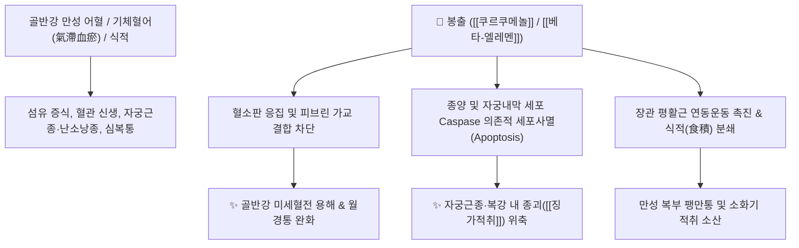

# 🌿 [[봉출]] (蓬朮, Curcumae Rhizoma / 莪朮)

> **핵심 요약 (Key Summary)**:
> 생강과(*Zingiberaceae*) 봉아출(*Curcuma phaeocaulis*)의 뿌리줄기(근경)
> 세스퀴테르펜 정유인 [[쿠르쿠메놀]](Curcumenol)과 [[엘레멘]](Elemene)이 혈소판 응집을 차단하고 비정상 섬유 증식성 종양 세포사멸(Apoptosis)을 유도하여 강력한 파혈 및 소적 작용 발휘
> 복강 내 징가적취(癥瘕積聚, 자궁근종·난소낭종·간비종대) 및 극심한 어혈성 생리통·식적(食積) 심복통을 치료하는 대표적인 [[파혈축어]](破血逐瘀)·[[행기소적]](行氣消積)·[[소적지통]](消積止痛) 약재

---
## 📌 목차
1. [기본 본초 정보 & 화학 구조 (Pharmacognosy)](#1-기본-본초-정보--화학-구조-pharmacognosy)
2. [핵심 분자약리 기전 & 파혈·항종양 네트워크](#2-핵심-분자약리-기전--파혈항종양-네트워크)
3. [해부생체역학 / 자궁 골반강 울혈 & 징가 종괴 연계](#3-해부생체역학--자궁-골반강-울혈--징가-종괴-연계)
4. [사상의학 및 임상 응용 (삼릉 vs 봉출 배오 감별)](#4-사상의학-및-임상-응용-삼릉-vs-봉출-배오-감별)
5. [고전 의학 및 배오 원리](#5-고전-의학-및-배오-원리)
6. [핵심 처방 비교 매트릭스](#6-핵심-처방-비교-매트릭스)
7. [출처 및 학술 참고 문헌 (References)](#7-출처-및-학술-참고-문헌-references)

---
## 1. 기본 본초 정보 & 화학 구조 (Pharmacognosy)

| 항목 | 상세 내용 |
| :--- | :--- |
| **기원 식물** | 생강과(Zingiberaceae) 봉아출 *Curcuma phaeocaulis* Valeton, 광서아출 또는 온욱금의 뿌리줄기(근경) |
| **성미 (性味)** | 苦·辛, 溫 |
| **귀경 (歸經)** | 肝·脾經 (간경, 비경) |
| **효능 (Actions)** | [[행기파혈]](行氣破血), [[소적지통]](消積止痛), [[파혈축어]](破血逐瘀), [[화어식적]](化瘀食積) |
| **주요 성분** | • **세스퀴테르펜 정유**: [[쿠르쿠메놀]] (Curcumenol, KP 규격 $\ge 0.15\%$), [[쿠르제레논]] (Curzerenone, KP 규격 $\ge 0.15\%$), [[게르마크론]] (Germacrone), 쿠르쿠몰<br>• **항암 테르펜 유도체**: [[베타-엘레멘]] ($\beta$-Elemene)<br>• **커큐미노이드**: [[커큐민]] (Curcumin 미량) |

> **[유래 및 본초학적 기전]**:
> * 잎과 뿌리가 쑥(蓬)처럼 향기롭고 단단하여 '봉아출(蓬莪朮)' 또는 '아출(莪朮)'이라 불렸습니다.
> * 기(氣)와 혈(血)의 흐름이 꽉 막혀 단단한 덩어리가 된 징가(癥瘕), 적취(積聚), 현벽(痃癖)을 깨뜨려 부수고, 묵은 어혈과 음식 식체(食積)로 인한 극심한 통증을 멎게 합니다.

### 🔬 봉출의 주요 항종양·파혈 성분 화학 구조
```
        CH2===CH
           │
      [ 사이클로헥산 골격 ]───CH===CH2  <-- 베타-엘레멘 (β-Elemene)
           │
       CH3─C===CH2
```
> **[구조적 특징 및 활성]**: [[베타-엘레멘]]과 [[쿠르쿠메놀]]은 종양 혈관 신생([[VEGF]])을 억제하고 혈소판 응집을 차단하여 자궁근종, 자궁내막증, 복강 내 섬유성 유착 덩어리를 위축·소산시키는 강력한 파적 작용을 발휘합니다.

---
## 2. 핵심 분자약리 기전 & 파혈·항종양 네트워크



### (1) 강력한 파혈소적 및 항종양 작용
* **비정상 증식 조직 세포사멸(Apoptosis) 유도**:
  * $\beta$-엘레멘은 종양 세포막 투과성을 변화시키고 미토콘드리아 경로를 활성화하여 자궁근종 및 암세포 증식을 차단합니다.
* **항혈전 및 혈류 개선 ([[행기파혈]] 行氣破血)**:
  * 혈소판 응집과 혈액 점도를 낮추어 골반강 내 울혈과 어혈성 무월경, 극심한 생리통을 치료합니다.
* **소식화적(消食化積) 및 장관 가스 제거**:
  * 소화 효소 분비를 촉진하고 장내에 굳은 음식물 찌꺼기(식적)를 뚫어 위완부 팽만통을 해소합니다.

---
## 3. 해부생체역학 / 자궁 골반강 울혈 & 징가 종괴 연계

* **자궁근층 섬유아세포 과증식 억제**:
  * 자궁 평활근종의 에스트로겐 수용체 과민 반응을 억제하여 근종의 크기 확장을 방어합니다.
* **장간막 림프 순환 및 복막 유착 완화**:
  * 만성 염증으로 인한 복벽 및 골반강 장기 간의 섬유성 유착을 완화합니다.

---
## 4. 사상의학 및 임상 응용 (삼릉 vs 봉출 배오 감별)

```
[✅ 최적 적응증 (Sweet Spot)]
• 부인과 질환: 자궁근종, 자궁선근증, 난소낭종, 극심한 어혈성 월경통, 무월경
• 소화기 적취: 윗배에 딱딱한 덩어리가 만져지고 소화가 전혀 안 되며 찌르는 듯 아픈 식적복통
• 종양 및 간비종대: 간경변으로 인한 비장 종대, 복강 내 종양 보조 치료

[🔍 삼릉 vs 봉출 감별 및 황금 배오]
• [[삼릉]](三稜): 혈분(血分)으로 들어가 피를 깨뜨리는 파혈(破血) 작용 위주
• [[봉출]](蓬朮): 기분(氣分)으로 들어가 기운을 뚫고 통증을 멎게 하는 행기(行氣) 작용 위주
• 삼릉과 봉출은 언제나 짝을 이루어 '기혈을 동시에 깨뜨려 종괴를 소산(破氣破血)'시킴

[⚠️ 신중 투여 및 금기 (Contraindication)]
• 임산부 절대 금기 (자궁 수축 및 태아 손상 유발)
• 월경 과다 및 출혈성 질환자 투여 금기
```

---
## 5. 고전 의학 및 배오 원리

### (1) 복강 내 적취 분쇄의 명방: 삼릉봉출산(三稜蓬朮散)
* **2대 파적 약재 배오**:
  * [[봉출]] + [[삼릉]] $\rightarrow$ 기와 혈의 어혈 덩어리를 완벽히 분쇄하는 천하제일 파적 조합 ([[화적환]])
  * [[봉출]] + [[당귀]] + [[향부자]] $\rightarrow$ 어혈성 생리통과 월경 불순을 통리

---
## 6. 핵심 처방 비교 매트릭스

| 처방명 | 구성 약재 | 주치 병증 및 임상 타깃 | 특징 및 감별점 |
| :--- | :--- | :--- | :--- |
| [[삼릉봉출산]] | [[삼릉]], [[봉출]], [[청피]], [[목향]], [[정향]] 등 | **징가적취, 심복창통, 복강 내 딱딱한 종괴** | 파혈행기로 묵은 덩어리를 부숨 |
| [[화적환]] | [[삼릉]], [[봉출]], [[해인]], [[신곡]], [[맥아]], [[빈랑]] 등 | **식적 어혈, 비괴(脾塊, 복강 종괴), 소화불량** | 음식과 어혈이 뭉친 적취를 소산 |
| [[개결서경탕]] | [[당귀]], [[천궁]], [[백작약]], [[봉출]], [[반하]], [[창출]] 등 | **칠정울결, 담음 어혈, 신경성 무월경, 복통** | 기혈담을 고루 풀어 순환 개통 |

---
## 7. 출처 및 학술 참고 문헌 (References)

1. **Zou, B., et al. (2018)**. Curcumenol inhibits proliferation and induces apoptosis in human endometrial cancer cells. *Oncology Letters*, 16(2), 2541-2546.
   - **[연구 요약]**: 봉출의 주성분인 쿠르쿠메놀이 PI3K/Akt 신호 경로를 차단하여 자궁내막 및 자궁근종 세포의 증식을 억제하고 세포사멸을 유도함을 규명.
2. **대한민국약전(KP) 제12개정 (2022)**. 의약품각조 제2부: 봉출 (Curcumae Rhizoma) 규격 기준.
   - **[공정서 규격]**: 건조물 기준 쿠르쿠메놀 0.15% 이상, 쿠르제레논 0.15% 이상 함유 필수 규격 명시.