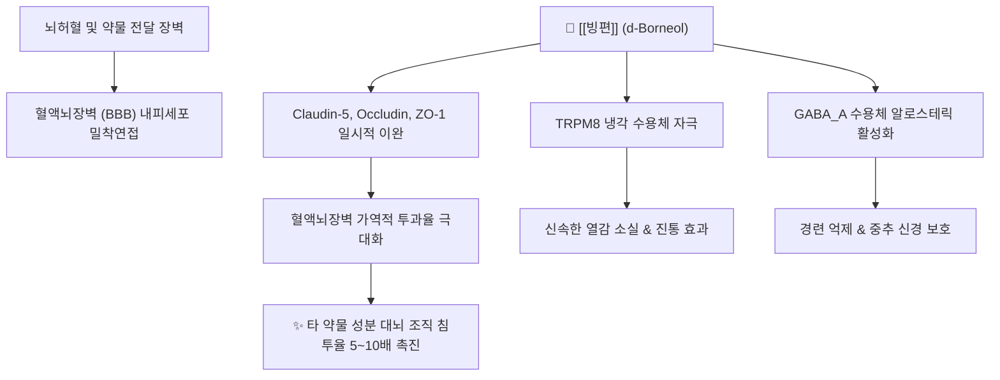

---
aliases:
  - 빙편
  - 용뇌
  - 氷片
  - 龍腦
  - Borneol
  - Borneolum
tags:
  - 본초
  - 개규약
  - 보르네올
  - BBB개방
  - 안궁우황환
  - 청열지통
---

# 🌿 [[빙편]] (氷片, Borneolum, 용뇌 / 龍腦)

> **핵심 요약 (Key Summary)**:
> 용뇌향과(Dipterocarpaceae) 용뇌향수(*Dryobalanops aromatica*)의 수지 또는 장뇌 등을 화학적으로 정제한 대표적인 방향개규(芳香開竅)·통규지통 약재
> 핵심 모노테르펜인 d-보르네올(d-Borneol)이 혈액뇌장벽(BBB)의 밀착연접을 가역적으로 이완시켜 약물 뇌전달율을 급증시키고 TRPM8 냉각 수용체 및 GABA_A를 조절
> 열병 신혼(중풍 급성기 혼미)·인후종통·구중생창(구내염)·목적종통(안과 결막염) 및 흉비 협심증 응급 치료에 특효를 발휘하는 대표적인 인경(引經)·개규 성분

---

## 📌 목차
1. [기본 본초 정보 & 화학 구조 (Pharmacognosy)](#1-기본-본초-정보--화학-구조-pharmacognosy)
2. [핵심 분자약리 기전 & BBB 투과 증진 네트워크](#2-핵심-분자약리-기전--bbb-투과-증진-네트워크)
3. [중추신경계 진정 및 TRP 채널 냉각 진통 작용](#3-중추신경계-진정-및-trp-채널-냉각-진통-작용)
4. [임상 적응증 및 방향성 개규제 배오](#4-임상-적응증-및-방향성-개규제-배오)
5. [용법, 포제 및 금기 사항 (Safety & Toxicity)](#5-용법-포제-및-금기-사항-safety--toxicity)
6. [핵심 처방 비교 매트릭스](#6-핵심-처방-비교-매트릭스)
7. [출처 및 학술 참고 문헌 (References)](#7-출처-및-학술-참고-문헌-references)

---

## 1. 기본 본초 정보 & 화학 구조 (Pharmacognosy)

| 항목 | 상세 내용 |
| :--- | :--- |
| **기원 식물** | 용뇌향과(Dipterocarpaceae) 용뇌향수(*Dryobalanops aromatica* Gaertn. f.)의 수지 가공품(천연 용뇌) 또는 보르네올 합성 결정 |
| **성미 (性味)** | 매운맛(辛), 쓴맛(苦), 서늘함(微寒) |
| **귀경 (歸經)** | 심경(心經), 비경(脾經), 폐경(肺經) |
| **효능 (Actions)** | 개규성신(開竅醒神), 청열지통(淸熱止痛), 산결소종(散結消腫), 통규투관(通竅透關) |
| **주요 성분** | • **지표 성분**: d-보르네올(d-Borneol, $\text{C}_{10}\text{H}_{18}\text{O}$, KP 기준 95% 이상 규격) • **미량 동족체**: 이소보르네올(Isoborneol), 캄포(Camphor), 휴물렌 |

### 🔬 주요 지표물질 화학 구조
> **[구조적 특징 및 활성]**: d-보르네올은 바이사이클릭 모노테르페노이드(Bicyclic monoterpenoid) 구조. 높은 지용성(Lipophilicity)과 작은 분자량으로 세포막을 자발적으로 통과하며, 승화성(Sublimation)이 강해 방향 물질로서 점막과 신경 수용체에 즉각적인 분자 자극을 전달함.

---

## 2. 핵심 분자약리 기전 & BBB 투과 증진 네트워크

### (1) 분자 수준 작용 메커니즘
* **혈액뇌장벽(BBB) 개방 촉진 (BBB Permeability Enhancer)**:
  * 뇌 미세혈관 내피세포의 밀착연접(Tight junction) 단백질인 ZO-1, Occludin, Claudin-5의 발현과 인산화를 일시적·가역적으로 조절하여 세포간극을 확장.
  * 함께 복용하는 다른 한약 유효성분(예: 황금의 바이칼린, 인삼의 진세노사이드, 단삼의 탄시논)의 뇌실 내 이행율을 5~10배 이상 촉진하는 궁극의 '인경사약(引經使藥)' 역할 수행.
* **GABA_A 수용체 양성 조절 및 뇌허혈 손상 방어**:
  * 중추 GABA_A 수용체에 결합하여 염소 이온($\text{Cl}^-$) 유입을 증가시켜 신경 과흥분을 억제하고, 허혈 후 재관류 시 발생하는 글루타메이트 독성과 뇌부종을 경감.

---

## 3. 중추신경계 진정 및 TRP 채널 냉각 진통 작용

* **TRPM8 냉각 이온 통로 활성화**:
  * 멘톨과 유사하게 감각 신경 말단의 냉각 수용체인 TRPM8을 직접 활성화하여 화끈거리는 열감(작열통)을 신속히 제거하고 냉각 진통 유도.
* **국소 소염 및 점막 궤양 치유**:
  * 구강 및 인후 점막의 [[NF-κB]] 및 [[COX-2]] 발현을 차단하여 아프타성 구내염, 편도선염, 인후종통의 통증과 종창을 즉각 완화.

---

## 4. 임상 적응증 및 방향성 개규제 배오

1. **급성 중풍 및 고열 혼미 (熱閉神昏)**:
   * 뇌졸중 급성기, 뇌출혈, 뇌염으로 인한 의식 불명, 고열 섬어, 경련 발작 시 심규(心竅)를 뚫어 의식을 깨움.
2. **이비인후과 및 안과 염증 (오관과 질환)**:
   * 인후종통, 디프테리아, 급만성 편도염, 구내염, 결막염(목적종통), 만성 중이염.
3. **심혈관 흉비 심통 (협심증)**:
   * 관상동맥의 급성 연축으로 인한 흉통 발작 시 설하 투여를 통해 혈관을 즉각 확장.

---

## 5. 용법, 포제 및 금기 사항 (Safety & Toxicity)

* **복용법**:
  * 정유 및 승화성 성분이므로 **절대 달이지 않으며(불가입탕전)**, 환제나 산제로 만들어 복용하거나 다른 약을 다린 탕액에 타서 복용(1회 0.03 ~ 0.1g 미량 투여).
* **임산부 절대 복용 금기**:
  * 방향투락(芳香透絡) 작용이 극히 강하여 자궁을 자극, 태아를 떨어뜨릴 위험이 있으므로 임신 중 내복을 엄금.
* **기혈허약 혼미(탈증) 금기**:
  * 기혈이 다하여 발생하는 허탈성 의식 소실에는 투여하지 않으며, 오직 열증과 사기가 막힌 실증(閉證)에만 사용.

---

## 6. 핵심 처방 비교 매트릭스

| 처방명 | 주요 구성 | 핵심 적응증 | 임상 특징 |
| :--- | :--- | :--- | :--- |
| [[안궁우황환]] | [[빙편]], 우황, 사향, 치자, 황련, 주사 | 온병 열함심포, 중풍 혼수, 고열 섬어 | 청열해독·개규안신의 제1 구급방 |
| [[단삼적환]] (복방단삼적환) | [[빙편]], 단삼, 삼칠 | 관상동맥 협심증, 가슴 답답함 | 관상동맥 확장 및 설하 흡수 극대화 |
| [[빙붕산]] (외용제) | [[빙편]], 붕사, 현명분, 주사 | 인후종통, 구내염, 치주염 | 가루를 입안에 불어넣어 점막 궤양 속효 치료 |

---

## 7. 출처 및 학술 참고 문헌 (References)
* 国家中医药管理局. *中华本草*. 上海科学技术出版社; 1999.
  - [연구 요약]: 빙편(용뇌)의 식물학적 기원, 승화 정제법, 개규성신 및 청열지통의 전통 한의학적 효능 총괄 수록.
* Han Z et al. (2026)**. Promoting Effect of (+)-Borneol on Alzheimer's Disease Treatment in APP Transgenic Zebrafish and Its Blood-Brain Barrier Permeation Mechanism. *Molecular neurobiology*, 63(1). [PMID: 42668348](https://pubmed.ncbi.nlm.nih.gov/42668348/)
  - [연구 요약]: d-보르네올이 BBB의 밀착연접 단백질 발현을 일시적으로 억제하여 표적 약물의 뇌 실질 흡수를 현저히 촉진함을 규명.
