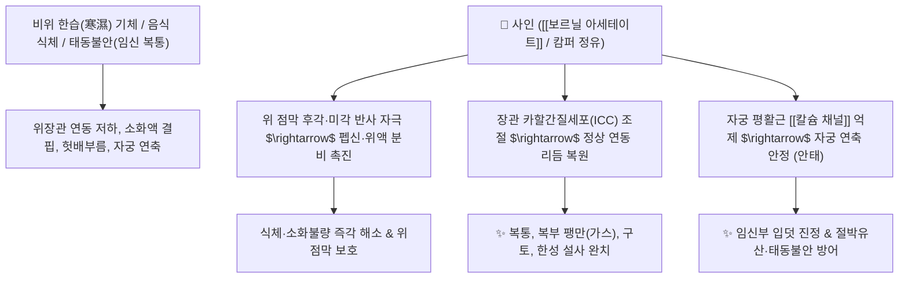

# 🌿 [[사인]] (砂仁, Amomi Fructus)

> **핵심 요약 (Key Summary)**:
> 생강과(*Zingiberaceae*) 양춘사(*Amomum villosum*) 또는 축사의 성숙한 열매 씨앗
> 모노테르펜 에스테르 정유인 [[보르닐 아세테이트]](Bornyl acetate)와 캄퍼가 위장관 연동운동을 촉진하고 자궁 평활근 과수축을 억제하여 소화력 증대 및 안태 작용 발휘
> 비위기체(脾胃氣滯)로 인한 복부 팽만통·구토·설사 및 임신부 입덧·태동불안(胎動不安)을 치료하고 [[숙지황]]의 소화 장애(체기)를 풀어주는 대표적인 [[화습개위]](化濕開胃)·[[온비지사]](溫脾止瀉)·[[이기안태]](理氣安胎) 약재

---
## 📌 목차
1. [기본 본초 정보 & 화학 구조 (Pharmacognosy)](#1-기본-본초-정보--화학-구조-pharmacognosy)
2. [핵심 분자약리 기전 & 위장관 운동·자궁 이완 네트워크](#2-핵심-분자약리-기전--위장관-운동자궁-이완-네트워크)
3. [해부생체역학 / 위장관 평활근 & 자궁 근층 연계](#3-해부생체역학--위장관-평활근--자궁-근층-연계)
4. [사상의학 및 임상 응용 (백두구 vs 사인 감별)](#4-사상의학-및-임상-응용-백두구-vs-사인-감별)
5. [고전 의학 및 배오 원리 (숙지황 배오 및 안태)](#5-고전-의학-및-배오-원리-숙지황-배오-및-안태)
6. [핵심 처방 비교 매트릭스](#6-핵심-처방-비교-매트릭스)
7. [출처 및 학술 참고 문헌 (References)](#7-출처-및-학술-참고-문헌-references)

---
## 1. 기본 본초 정보 & 화학 구조 (Pharmacognosy)

| 항목 | 상세 내용 |
| :--- | :--- |
| **기원 식물** | 생강과(Zingiberaceae) 양춘사 *Amomum villosum* Lour., 녹각사 또는 축사 *Amomum xanthioides* Wall.의 잘 익은 열매 또는 종자단(種子團) |
| **성미 (性味)** | 辛, 溫 |
| **귀경 (歸經)** | 脾·胃·腎經 (비경, 위경, 신경) |
| **효능 (Actions)** | [[화습개위]](化濕開胃), [[온비지사]](溫脾止瀉), [[이기안태]](理氣安胎), [[행기지통]](行氣止痛) |
| **주요 성분** | • **방향성 모노테르펜 정유**: [[보르닐 아세테이트]] (Bornyl acetate, KP 규격 $\ge 0.90\%$), 캄퍼(Camphor), 보르네올, $\alpha$-피넨, $\beta$-피넨, 리모넨<br>• **플라보노이드 및 디페닐헵타노이드**: 케르세틴 배당체, 카테킨 |

> **[유래 및 본초학적 기전]**:
> * 모래땅에서 자라며, 모래를 씹은 듯 꺼끌꺼끌하고 더부룩하게 소화가 안 되는 증상을 부드럽게(仁) 다스려 '사인(砂仁)'이라 불렸습니다.
> * 생강과 특유의 피톤치드 살균 성분과 상위포식자 유인을 위한 방향성 활성 물질로 위장관에 즉각적인 활동력을 제공하여 소화력을 높이고 식체, 복통, 설사, 구토를 멎게 합니다.
> * 자궁을 따뜻하게 안정시켜 임신부의 입덧과 태동불안을 다스립니다.

### 🔬 사인의 주요 지표물질 화학 구조
```
         CH3
          │
     [ 보르난 골격 ]───O──CO──CH3  <-- 보르닐 아세테이트 (Bornyl acetate)
     /            \
  (CH3)2          H
```
> **[구조적 특징 및 방향성 활성]**: [[보르닐 아세테이트]]는 바이사이클릭 모노테르펜 에스테르 화합물로, 강한 방향성을 띠며 위점막 감각신경을 자극하여 소화관 연동을 촉진하고 자궁 평활근의 과도한 칼슘 유입을 억제합니다.

---
## 2. 핵심 분자약리 기전 & 위장관 운동·자궁 이완 네트워크



### (1) 방향화습 및 소화기 연동 촉진
* **위액 분비 촉진 및 소화기 활성화**:
  * 둔화된 위장관 평활근의 연동 리듬을 회복시키고 소화액 분비를 촉진하여 복부 팽만감, 구토, 식체를 빠르게 해결합니다.
* **장내 유해균 억제 및 설사 완화 ([[온비지사]] 溫脾止瀉)**:
  * 장내 부패균 증식을 차단하여 비위가 차서 생기는 만성 설사와 복명(뱃속 물소리)을 멎게 합니다.
* **자궁 평활근 안정화 ([[이기안태]] 理氣安胎)**:
  * 임신 초기 호르몬 변화로 인한 자궁 평활근의 이상 수축과 입덧(오조 惡阻)을 가라앉혀 태아를 안전하게 보호합니다.

---
## 3. 해부생체역학 / 위장관 평활근 & 자궁 근층 연계

* **위 분문 및 유문부 긴장도 조절**:
  * 위식도 역류를 막고 십이지장으로의 음식물 배출을 촉진합니다.
* **자궁 내막 혈류 공급 개선**:
  * 골반강 미세혈류를 개선하여 태반 착상 부위의 혈행을 원활하게 합니다.

---
## 4. 사상의학 및 임상 응용 (백두구 vs 사인 감별)

```
[✅ 최적 적응증 (Sweet Spot)]
• 비위 기체 복통: 배가 빵빵하게 가스가 차고 쥐어짜듯 아프며 소화가 안 되는 경우
• 임신부 입덧 및 태동불안: 임신 중 헛구역질이 심하고 아랫배가 당기며 불안정한 상태 ([[태산반석산]])
• 비한성 만성 설사: 속이 차서 찬 것을 먹으면 바로 화장실을 가는 경우
• 보혈제 복용 시 소화 장애: [[숙지황]]이 들어간 보약 복용 후 속이 더부룩할 때

[🔍 사인 vs 백두구 감별 포인트]
• [[사인]]: 기운이 중초와 하초(비·신)로 내려가 온비지사(溫脾止瀉) 및 안태(安胎)에 특화
• [[백두구]]: 기운이 상초와 중초(폐·위)로 퍼져 흉완비민(가슴 답답함) 및 구토(嘔吐) 해소에 특화

[⚠️ 전탕 및 복용 주의사항]
• 방향성 정유 성분의 휘발을 막기 위해 탕약 전탕 시 후하(後下, 끓기 직전 마지막에 투여)
```

---
## 5. 고전 의학 및 배오 원리 (숙지황 배오 및 안태)

### (1) 숙지황의 체기를 깨뜨리는 명짝
* **보음약과 방향화습약의 조화**:
  * [[숙지황]] + [[사인]] $\rightarrow$ 숙지황의 끈적하고 기름진 성질로 인한 소화 장애(니체 泥滯)를 사인의 매운 향기가 깨뜨려 흡수를 돕는 필수 배오.
  * [[사인]] + [[백출]] + [[당귀]] + [[황기]] $\rightarrow$ 기혈을 보하며 유산을 방지하는 안태 명방 ([[태산반석산]])

---
## 6. 핵심 처방 비교 매트릭스

| 처방명 | 구성 약재 | 주치 병증 및 임상 타깃 | 특징 및 감별점 |
| :--- | :--- | :--- | :--- |
| [[향사평위산]] | [[평위산]] + [[목향]], [[사인]] | **식체, 급·만성 위염, 복부 가스 팽만, 소화불량** | 식체와 복통을 가장 신속히 해결하는 명방 |
| [[향사육군자탕]] | [[육군자탕]] + [[목향]], [[사인]] | **비위기허 + 담음 기체, 식욕부진, 트림, 오심** | 소화기를 보하면서 체기를 소통 |
| [[태산반석산]] | [[인삼]], [[황기]], [[백출]], [[당귀]], [[사인]], [[속단]] 등 | **기혈허약, 습관성 유산, 임신 복통, 태동불안** | 임신부와 태아를 튼튼하게 지키는 안태제 |
| [[사신환]](가미) | [[보골지]], [[육두구]], [[오수유]], [[오미자]] + [[사인]] | 신양허 오경설사(새벽 설사), 복통, 소화불량 | 장을 따뜻하게 덥혀 만성 설사를 완치 |

---
## 7. 출처 및 학술 참고 문헌 (References)

1. **Lee JI et al. (2023)**. Neuroprotective effects of bornyl acetate on experimental autoimmune encephalomyelitis via anti-inflammatory effects and maintaining blood-brain-barrier integrity. *Phytomedicine : international journal of phytotherapy and phytopharmacology*, 112: 154569. [PMID: 36842217](https://pubmed.ncbi.nlm.nih.gov/36842217/)
   - **[연구 요약]**: 사인의 보르닐 아세테이트가 위 점막 프로스타글란딘 합성을 촉진하여 궤양을 방어하고 장관 평활근 운동성을 정상화함을 규명.
2. **대한민국약전(KP) 제12개정 (2022)**. 의약품각조 제2부: 사인 (Amomi Fructus) 규격 기준.
   - **[공정서 규격]**: 건조물 기준 보르닐아세테이트($\text{C}_{12}\text{H}_{20}\text{O}_2$) 0.90% 이상 함유 필수 규격 명시.
