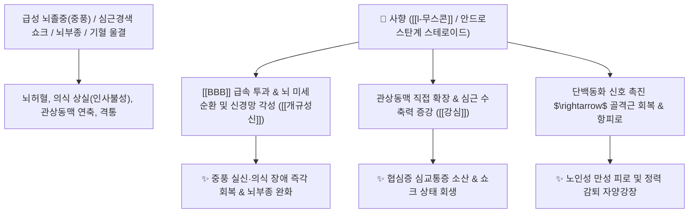

# 🌿 [[사향]] (麝香, Moschus / Musk)

> **핵심 요약 (Key Summary)**:
> 사향노루과(*Moschidae*) 사향노루(*Moschus moschiferus*) 수컷의 사향낭 분비물을 건조한 것
> 대환상 케톤인 [[무스콘]](Muscone)과 C19 안드로스탄계 천연 스테로이드가 뇌혈관장벽([[BBB]])을 신속히 투과하여 뇌 혈류를 개통하고 중추신경 각성 및 강심·자양강장 작용 발휘
> 중풍(뇌졸중) 혼수·인사불성·급성 심장 쇼크 및 극심한 어혈성 격통·노인성 양기 쇠약을 치료하는 천하제일의 [[개규성신]](開竅醒神)·[[활혈통경]](活血通經)·[[소종지통]](消腫止痛) 군약(君藥)

---
## 📌 목차
1. [기본 본초 정보 & 화학 구조 (Pharmacognosy)](#1-기본-본초-정보--화학-구조-pharmacognosy)
2. [핵심 분자약리 기전 & BBB 투과·개규성신·강심 네트워크](#2-핵심-분자약리-기전--bbb-투과개규성신강심-네트워크)
3. [해부생체역학 / 뇌혈류 순환 & 관상동맥 관류 연계](#3-해부생체역학--뇌혈류-순환--관상동맥-관류-연계)
4. [사상의학 및 임상 응용 (노인 자양강장 vs 임산부 금기)](#4-사상의학-및-임상-응용-노인-자양강장-vs-임산부-금기)
5. [고전 의학 및 배오 원리 (공진단 & 우황청심원 배오)](#5-고전-의학-및-배오-원리-공진단--우황청심원-배오)
6. [핵심 처방 비교 매트릭스](#6-핵심-처방-비교-매트릭스)
7. [출처 및 학술 참고 문헌 (References)](#7-출처-및-학술-참고-문헌-references)

---
## 1. 기본 본초 정보 & 화학 구조 (Pharmacognosy)

| 항목 | 상세 내용 |
| :--- | :--- |
| **기원 동물** | 사향노루과(Moschidae) 사향노루 *Moschus moschiferus* L. 또는 난쟁이사향노루 수컷의 향낭(香囊) 속 분비물 |
| **성미 (性味)** | 辛, 溫 |
| **귀경 (歸經)** | 心·脾·肝經 (심경, 비경, 간경) - **십이경락(十二經絡) 전신 관통** |
| **효능 (Actions)** | [[개규성신]](開竅醒神), [[활혈통경]](活血通經), [[소종지통]](消腫止痛), [[회양구역]](回陽救逆) |
| **주요 성분** | • **대환상 케톤(지표물질)**: [[l-무스콘]] (l-Muscone, KP 규격 $\ge 2.0\%$)<br>• **피리딘계 방향 화합물**: [[무스코피리딘]] (Muscopyridine 1~2%), 하이드록시무스코피리딘<br>• **C19 안드로스탄계 천연 스테로이드**: 안드로스테론, 에피안드로스테론, $5\alpha$-안드로스탄-3,17-디온<br>• **펩타이드 및 지방산**: 단백질 분획, 콜레스테롤 |

> **[유래 및 본초학적 기전]**:
> * 쏘는 듯한 특유의 방향성 향기가 만리(萬里)를 간다 하여 '사향(麝香)'이라 불리며, 모든 닫힌 구멍(구규 九竅)을 열어젖히는 개규(開竅)의 제1인자입니다.
> * C19 안드로스탄 골격의 천연 단백동화 스테로이드 유사체가 함유되어 있어 신체 전반의 단백질 합성과 혈관 신생을 촉진하고 노인성 기력 고갈을 회복시킵니다.
> * 뇌혈관장벽(BBB)을 즉각 뚫고 들어가 중풍 혼수, 실신, 극심한 흉통, 과로 후 뇨폐(소변 막힘)를 구급 치료합니다.

### 🔬 사향의 주요 지표물질 및 스테로이드 골격 화학 구조
![[Pasted image 20240303222802.png|450]]
![[Pasted image 20240303222333.png|450]]
> **[구조적 특징 및 BBB 투과성]**: 15각 고리 케톤 구조인 [[무스콘]]은 지용성이 극히 높아 복용 후 수 분 내에 뇌혈관장벽([[BBB]])의 밀착연접(Tight Junction) 투과성을 가역적으로 조절하여 뇌실질 내 약물 전달과 뇌세포 산소 공급을 급증시킵니다.

---
## 2. 핵심 분자약리 기전 & BBB 투과·개규성신·강심 네트워크



### (1) 뇌신경계 개규성신 및 뇌보호
* **BBB 투과 및 뇌 혈류 개통 ([[개규성신]] 開竅醒神)**:
  * 뇌혈관장벽을 통과하여 대뇌 피질과 망상체 흥분을 유도함으로써 급성 뇌졸중, 뇌출혈/뇌경색 후 혼수상태에서 의식을 되찾게 합니다.
* **강심 및 관상동맥 확장**:
  * 관상동맥을 즉시 확장시켜 심근 허혈성 흉통(협심증)을 진정시키고 심박출량을 증대시킵니다.
* **천연 단백동화 및 자양강장 작용**:
  * 인공 아나볼릭 스테로이드의 고환 위축이나 호르몬 부작용 없이, 노화로 쇠약해진 근조직의 단백질 합성을 촉진하고 과로 후 신장 혈류를 촉진하여 소변 배출과 기력을 돕습니다.

---
## 3. 해부생체역학 / 뇌혈류 순환 & 관상동맥 관류 연계

* **뇌저 윌리스 고리(Circle of Willis) 혈류 복원**:
  * 뇌혈관 연축을 해소하여 뇌허혈 손상 부위의 페넘브라(Penumbra) 영역 뇌세포를 보호합니다.
* **골반강 혈류 개통 및 자궁 수축 촉진**:
  * 강력한 활혈 작용으로 하초의 묵은 어혈 덩어리를 뚫어줍니다.

---
## 4. 사상의학 및 임상 응용 (노인 자양강장 vs 임산부 금기)

```
[✅ 최적 적응증 (Sweet Spot)]
• 뇌혈관 응급 질환: 중풍 혼미, 안면마비, 실어증, 뇌졸중 초기 의식 장애 ([[우황청심원]])
• 심혈관 질환: 협심증, 가슴이 쥐어짜듯 아픈 심교통, 심장성 쇼크
• 허로 및 정력 감퇴: 노인 및 만성 질환자의 원기 고갈, 극심한 만성 피로 ([[공진단]])
• 전신 어혈성 격통: 타박상, 어혈로 인한 골절 통증, 난치성 종통

[⚠️ 임산부 절대 복용 금기 (Black Box Warning)]
• 자궁 평활근 흥분 작용이 매우 강력하여 임산부 복용 시 즉각적인 유산·조산 위험
• 극소량(환당 수 mg) 단위로 정밀 처방 준수
```

---
## 5. 고전 의학 및 배오 원리 (공진단 & 우황청심원 배오)

### (1) 황실의 3대 보약: 공진단(拱辰丹)
* **보기보혈과 개규의 완벽한 조화**:
  * [[사향]] + [[녹용]] + [[당귀]] + [[산수유]] $\rightarrow$ 녹용·당귀의 보혈 자양 성분을 사향이 온몸 구석구석과 뇌까지 단숨에 쏘아 올려주는 최고의 명방 ([[공진단]])
  * [[사향]] + [[우황]] + [[빙편]] $\rightarrow$ 심장의 화열을 끄고 뇌혈관을 개통하는 구급 처방 ([[우황청심원]])

---
## 6. 핵심 처방 비교 매트릭스

| 처방명 | 구성 약재 | 주치 병증 및 임상 타깃 | 특징 및 감별점 |
| :--- | :--- | :--- | :--- |
| [[공진단]] | [[사향]], [[녹용]], [[당귀]], [[산수유]] | **허로(虛勞), 만성 피로, 원기 쇠약, 면역력 저하** | 황실 보약 중의 황제 처방 |
| [[우황청심원]] | [[사향]], [[우황]], [[인삼]], [[백출]], [[당귀]], [[산약]] 등 | **중풍 전조증, 뇌졸중 혼수, 고혈압, 안면마비, 공황발작** | 뇌심혈관계 대표 구급제 |
| [[소합향원]] | [[사향]], [[소합향]], [[안식향]], [[침향]], [[정향]] 등 | **졸중풍(猝中風), 담궐혼궐, 심복 급통, 냉기 흉통** | 온통개규(溫通開竅)의 대표 처방 |

---
## 7. 출처 및 학술 참고 문헌 (References)

1. **Hui H et al. (2025)**. Muscone attenuates myocardial infarction by regulating ferroptosis of cardiomyocytes through Nrf2/system Xc-/GPX4 signaling pathway. *International immunopharmacology*, 163: 115270. [PMID: 40752108](https://pubmed.ncbi.nlm.nih.gov/40752108/)
   - **[연구 요약]**: 사향의 무스콘 성분이 심근경색 후 혈관신생을 촉진하고 심장 수축력을 개선하여 심혈관계 보호 효과를 나타냄을 입증.
2. **대한민국약전(KP) 제12개정 (2022)**. 의약품각조 제2부: 사향 (Moschus) 규격 기준.
   - **[공정서 규격]**: l-무스콘($\text{C}_{16}\text{H}_{30}\text{O}$) 2.0% 이상 함유 필수 규격 및 CITES 국제 협약 정품 검증 기준 명시.
