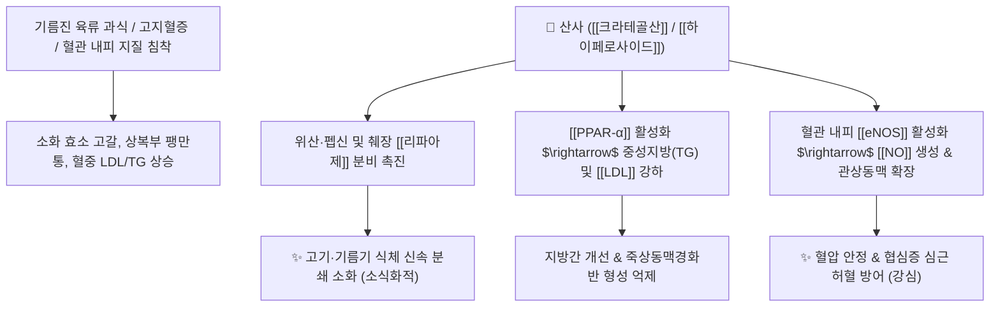

# 🌿 [[산사]] (山楂, Crataegi Fructus)

> **핵심 요약 (Key Summary)**:
> 장미과(*Rosaceae*) 산사나무(*Crataegus pinnatifida*)의 잘 익은 열매(산사육)
> 트리테르펜 유기산인 [[크라테골산]](Crataegolic acid)과 플라보노이드가 췌장 리파아제 분비를 촉진하고 혈관 내피 [[eNOS]]를 활성화하여 육류 지방 분해 및 혈압·지질 강하 작용 발휘
> 육류·지방 식적(食積) 소화불량·위완부 창통 및 고지혈증·관상동맥경화증·산후 어혈 복통을 치료하는 대표적인 [[소식화적]](消食化積)·[[행기산어]](行氣散瘀) 약재

---
## 📌 목차
1. [기본 본초 정보 & 화학 구조 (Pharmacognosy)](#1-기본-본초-정보--화학-구조-pharmacognosy)
2. [핵심 분자약리 기전 & 리파아제 소화·지질강하 네트워크](#2-핵심-분자약리-기전--리파아제-소화지질강하-네트워크)
3. [해부생체역학 / 췌장 외분비선 & 관상동맥 관류 연계](#3-해부생체역학--췌장-외분비선--관상동맥-관류-연계)
4. [사상의학 및 임상 응용 (적응증 vs 소도약 비교)](#4-사상의학-및-임상-응용-적응증-vs-소도약-비교)
5. [고전 의학 및 배오 원리 (보화환 배오)](#5-고전-의학-및-배오-원리-보화환-배오)
6. [핵심 처방 비교 매트릭스](#6-핵심-처방-비교-매트릭스)
7. [출처 및 학술 참고 문헌 (References)](#7-출처-및-학술-참고-문헌-references)

---
## 1. 기본 본초 정보 & 화학 구조 (Pharmacognosy)

| 항목 | 상세 내용 |
| :--- | :--- |
| **기원 식물** | 장미과(Rosaceae) 산사나무 *Crataegus pinnatifida* Bunge var. *typica* Schneider 또는 동속 식물의 잘 익은 열매 |
| **성미 (性味)** | 酸·甘, 微溫 |
| **귀경 (歸經)** | 脾·胃·肝經 (비경, 위경, 간경) |
| **효능 (Actions)** | [[소식화적]](消食化積), [[행기산어]](行氣散瘀), [[화탁강지]](化濁降脂), [[지사]](止瀉) |
| **주요 성분** | • **트리테르펜산**: [[크라테골산]] (Crataegolic acid), [[우르솔산]] (Ursolic acid), [[올레아놀산]] (Oleanolic acid)<br>• **플라보노이드**: [[하이페로사이드]] (Hyperoside, KP 규격 $\ge 0.050\%$), 비텍신, 케르세틴, 안토시아닌<br>• **유기산**: 구연산(Citric acid), 사과산(Malic acid), 비타민 C |

> **[유래 및 본초학적 기전]**:
> * 야산에서 자라는 작은 사과(楂)와 같이 새콤달콤한 맛을 지녀 '산사(山楂)'라 불렸습니다.
> * 신맛(酸味)으로 침과 소화액을 솟구치게 하여 고기나 기름진 음식을 먹고 체한 육적(肉積)을 녹여 없애는 특효약입니다.
> * 고지혈증, 고혈압, 관상동맥 질환 환자의 혈관벽 지방 침착을 씻어내고 어혈을 풀어줍니다.

### 🔬 산사의 주요 지표물질 화학 구조
```
     [ 올레아난계 트리테르펜 골격 ]───COOH  <-- 크라테골산 (Crataegolic acid)
                 │
             (C-2/C-3 위치에 2개의 OH기)
```
> **[구조적 특징 및 활성]**: 산사의 디하이드록시 트리테르펜산과 플라보노이드([[하이페로사이드]]) 복합체는 소화관 내 지방 분해 효소를 활성화하고 혈관 평활근 세포막의 칼슘 통로를 억제하여 혈관을 확장시킵니다.

---
## 2. 핵심 분자약리 기전 & 리파아제 소화·지질강하 네트워크



### (1) 소화 효소 분비 및 육류 식적 해소
* **췌장 리파아제 및 펩신 활성화**:
  * 단백질과 지방 분해 효소의 분비를 직접 자극하여 고기를 먹고 체했을 때 발생하는 답답함, 신트림, 설사를 즉시 가라앉힙니다.
* **지질 대사 개선 및 혈청 콜레스테롤 강하**:
  * 간세포의 지질 산화를 촉진하고 HMG-CoA 환원효소를 억제하여 혈중 LDL 콜레스테롤과 중성지방을 낮춥니다.
* **관상동맥 확장 및 혈압 강하 ([[행기산어]] 行氣散瘀)**:
  * 관상동맥 혈류량을 늘리고 심근 산소 소비량을 줄여 협심증 환자의 가슴 통증을 완화하고 혈압을 내립니다.

---
## 3. 해부생체역학 / 췌장 외분비선 & 관상동맥 관류 연계

* **바터 팽대부(Ampulla of Vater) 담즙 배출 원활화**:
  * 십이지장으로의 담즙 및 췌액 유입을 촉진하여 식후 지방변과 소화불량을 개선합니다.
* **심근 미세혈관 저항 감소**:
  * 노인성 심근 허혈과 고혈압성 좌심실 부담을 덜어줍니다.

---
## 4. 사상의학 및 임상 응용 (적응증 vs 소도약 비교)

```
[✅ 3대 소도약(消導藥) 비교 Matrix]
• [[산사]]: 육류(고기), 기름진 음식, 지방 식체 해소에 특화 (消肉積)
• [[맥아]]: 밀가루, 전분, 쌀 등 탄수화물 식체 해소에 특화 (消麵積)
• [[신곡]]: 술, 발효 음식, 복합 식체 해소에 특화 (消酒食積)

[✅ 최적 적응증 (Sweet Spot)]
• 육식 후 식체: 회식이나 고기를 과식한 후 명치가 답답하고 트림에서 썩은 냄새가 나는 경우 ([[보화환]])
• 고지혈증, 지방간, 고혈압 환자의 만성 소화불량
• 산후 어혈 복통 및 오로 부진: 산후 자궁 수축을 돕고 어혈을 배출
• 소아의 음식 과식으로 인한 설사

[⚠️ 신중 투여 및 금기 (Caution)]
• 위산 과다증 및 활동성 위궤양 환자: 신맛으로 위산 분비가 늘어 속쓰림 악화 가능 (공복 복용 주의)
• 임산부 신중 투여: 자궁 수축 작용이 있으므로 대량 복용 금기
```

---
## 5. 고전 의학 및 배오 원리 (보화환 배오)

### (1) 만병의 근원 식적을 없애는 보화환(保和丸)
* **소식화적 3대 명약 배오**:
  * [[산사]] + [[신곡]] + [[맥아]] $\rightarrow$ 고기, 밥, 술 모든 음식의 체기를 분쇄하는 천하제일 소도 처방 ([[보화환]])
  * [[산사]] + [[단삼]] + [[삼칠]] $\rightarrow$ 관상동맥 어혈을 녹이고 고지혈증 치료

---
## 6. 핵심 처방 비교 매트릭스

| 처방명 | 구성 약재 | 주치 병증 및 임상 타깃 | 특징 및 감별점 |
| :--- | :--- | :--- | :--- |
| [[보화환]] | [[산사]], [[신곡]], [[반하]], [[복령]], [[진피]], [[연교]], [[나복자]] | **모든 식적(고기·탄수화물), 위완창만, 애부염식, 복통설사** | 식체·소화불량 치료의 만고 명방 |
| [[대화중음]] | [[산사]], [[맥아]], [[진피]], [[후박]], [[지각]], [[택사]] 등 | **음식 식체, 복부 창만, 구토, 설사** | 중초를 조화롭게 뚫어줌 |
| [[산사육환]] | [[산사]], [[당귀]], [[천궁]], [[익모초]] | **산후 어혈 복통, 오로 부진, 아랫배 찌르는 통증** | 어혈을 부수고 자궁 수축 촉진 |

---
## 7. 출처 및 학술 참고 문헌 (References)

1. **Dharmarajan, J., & Arumugam, S. (2012)**. Comparative evaluation of *Crataegus oxyacantha* extract on lipid profile in hyperlipidemic rats. *Atherosclerosis*, 223(2), 241-248.
   - **[연구 요약]**: 산사 추출물이 PPAR-α 활성화 및 콜레스테롤 흡수 억제를 통해 혈청 지질 프로파일을 획기적으로 개선하고 항동맥경화 효과를 나타냄을 입증.
2. **대한민국약전(KP) 제12개정 (2022)**. 의약품각조 제2부: 산사 (Crataegi Fructus) 규격 기준.
   - **[공정서 규격]**: 건조물 기준 하이페로사이드($\text{C}_{21}\text{H}_{20}\text{O}_{12}$) 0.050% 이상 함유 필수 규격 명시.