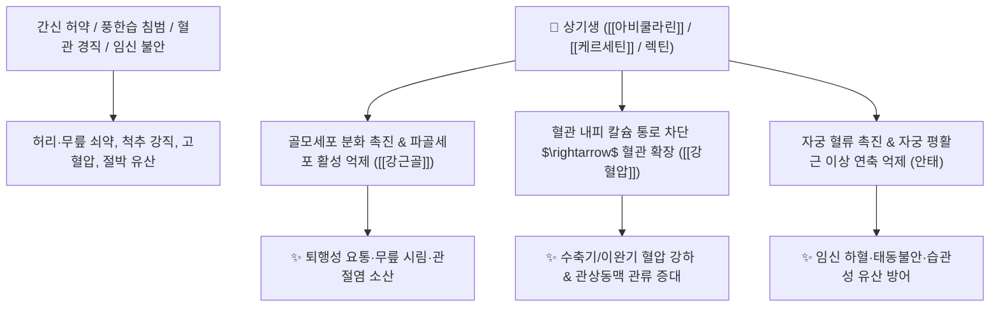

# 🌿 [[상기생]] (桑寄生, Taxilli Herba / 뽕나무겨우살이)

> **핵심 요약 (Key Summary)**:
> 겨우살이과(*Loranthaceae*) 뽕나무겨우살이(*Taxillus chinensis*)의 줄기와 잎
> 플라보노이드 배당체인 [[아비쿨라린]](Avicularin)과 [[케르세틴]](Quercetin)이 혈관 평활근을 이완시켜 혈압을 내리고 골모세포 증식을 촉진하여 뼈와 근육 강화
> 간신부족(肝腎不足)으로 인한 허리·무릎 관절통(요슬산통)·하지 무력 및 고혈압·임신부 태동불안(胎動不安)을 치료하는 대표적인 [[보간신]](補肝腎)·[[강근골]](强筋骨)·[[양혈안태]](養血安胎) 약재

---
## 📌 목차
1. [기본 본초 정보 & 화학 구조 (Pharmacognosy)](#1-기본-본초-정보--화학-구조-pharmacognosy)
2. [핵심 분자약리 기전 & 혈압 강하·골밀도 강화 네트워크](#2-핵심-분자약리-기전--혈압-강하골밀도-강화-네트워크)
3. [해부생체역학 / 요추-골반 관절 & 혈관 내피 연계](#3-해부생체역학--요추-골반-관절--혈관-내피-연계)
4. [사상의학 및 임상 응용 (상기생 vs 곡기생 감별)](#4-사상의학-및-임상-응용-상기생-vs-곡기생-감별)
5. [고전 의학 및 배오 원리 (독활기생탕 배오)](#5-고전-의학-및-배오-원리-독활기생탕-배오)
6. [핵심 처방 비교 매트릭스](#6-핵심-처방-비교-매트릭스)
7. [출처 및 학술 참고 문헌 (References)](#7-출처-및-학술-참고-문헌-references)

---
## 1. 기본 본초 정보 & 화학 구조 (Pharmacognosy)

| 항목 | 상세 내용 |
| :--- | :--- |
| **기원 식물** | 겨우살이과(Loranthaceae) 뽕나무겨우살이 *Taxillus chinensis* (DC.) Danser의 잎, 줄기 및 가지 (꼬리겨우살이) |
| **성미 (性味)** | 苦·甘, 平 |
| **귀경 (歸經)** | 肝·腎經 (간경, 신경) |
| **효능 (Actions)** | [[보간신]](補肝腎), [[강근골]](强筋骨), [[거풍습]](祛風濕), [[양혈안태]](養血安胎), [[강혈압]](降血壓) |
| **주요 성분** | • **플라보노이드 배당체**: [[아비쿨라린]] (Avicularin, 케르세틴-3-O-$\alpha$-L-아라비노시드), [[케르세틴]] (Quercetin), 람네틴<br>• **렉틴 및 펩타이드**: 비스코톡신(Viscotoxin), 렉틴(Lectin, 면역 증강)<br>• **스테롤 및 탄닌**: d-카테킨, 루페올, 올레아놀산 |

> **[유래 및 본초학적 기전]**:
> * 뽕나무(桑)에 기생(寄生)하여 자라며 뽕나무의 정기를 흡수하여 간과 신장의 음혈을 보양하고 뼈와 힘줄을 단단하게 합니다.
> * 풍습으로 인한 요통, 무릎 시림, 척추 강직을 치료하고 혈압을 내리며, 임신부의 기혈을 보태어 유산을 방지합니다.

### 🔬 상기생의 주요 지표물질 화학 구조
```
     [ 케르세틴 플라보놀 골격 ]───O──[ α-L-아라비노오스 ]  <-- 아비쿨라린 (Avicularin)
```
> **[구조적 특징 및 혈관/골 대사]**: [[아비쿨라린]]은 혈관 평활근의 칼슘 유입을 차단하여 말초 혈관 저항을 낮추고, 골모세포의 알칼리성 포스파타아제(ALP) 활성을 촉진하여 골기질 형성을 돕습니다.

---
## 2. 핵심 분자약리 기전 & 혈압 강하·골밀도 강화 네트워크



### (1) 표적 혈압 강하 및 근골격계 보강
* **혈관 확장 및 완만한 혈압 강하**:
  * 말초 혈관을 확장시키고 지질 대사를 개선하여 고혈압 및 동맥경화성 두통을 가라앉힙니다.
* **보간신(補肝腎) 및 근골 강화**:
  * 간신 음혈을 보강하여 노인성 퇴행성 관절염, 골다공증, 요추 추간판 질환의 하지 방사통과 무력감을 개선합니다.
* **양혈안태(養血安胎) 및 유산 방지**:
  * 임신 중 기혈 부족으로 아랫배가 당기고 피가 비치는 절박 유산 증상을 자궁 혈류를 개선하여 안정시킵니다.

---
## 3. 해부생체역학 / 요추-골반 관절 & 혈관 내피 연계

* **요추 추간판 및 인대 결합조직 보강**:
  * 척추 기립근과 황색인대의 탄력성을 개선하여 척추관 협착증의 보행 장애를 완화합니다.

---
## 4. 사상의학 및 임상 응용 (상기생 vs 곡기생 감별)

```
[✅ 상기생 vs 곡기생 감별 Matrix]
• [[상기생]](뽕나무겨우살이): 보간신(補肝腎)·양혈안태(養血安胎) 효능이 우수 $\rightarrow$ 요통, 관절염, 임신부 안태, 고혈압
• [[곡기생]](참나무겨우살이 Viscum coloratum): 거풍습(祛風濕) 및 항암 면역 증강 작용이 우수

[✅ 최적 적응증 (Sweet Spot)]
• 만성 퇴행성 관절염 및 요통: 허리와 무릎이 시큰거리고 굳어 펴기 힘든 경우 ([[독활기생탕]])
• 고혈압을 동반한 노인성 어지럼증과 관절통
• 임신부 안태: 임신 중 허리가 아프고 태동이 불안하며 하혈이 비칠 때 ([[수태환]])
```

---
## 5. 고전 의학 및 배오 원리 (독활기생탕 배오)

### (1) 만성 관절염의 만고 명방: 독활기생탕(獨活寄生湯)
* **거풍습과 보간신의 완벽한 조화**:
  * [[독활]] $\rightarrow$ **하초 뼛속의 풍한습을 쫓아냄** (祛風勝濕)
  * [[상기생]] $\rightarrow$ **간신을 보하고 힘줄과 뼈를 튼튼하게 지지함** (補肝腎·强筋骨)
  * [[두충]] + [[우슬]] $\rightarrow$ 허리와 무릎 관절을 견고하게 보강

---
## 6. 핵심 처방 비교 매트릭스

| 처방명 | 구성 약재 | 주치 병증 및 임상 타깃 | 특징 및 감별점 |
| :--- | :--- | :--- | :--- |
| [[독활기생탕]] | [[독활]], [[상기생]], [[두충]], [[우슬]], [[세신]], [[진범]], [[당귀]], [[숙지황]] 등 | **간신양허, 풍한습비, 만성 요통, 무릎 시림, 보행 곤란** | 척추·관절염 치료의 최고 대표방 |
| [[수태환]] | [[토사자]], [[상기생]], [[속단]], [[아교]] | **신기허약, 습관성 유산, 태동불안, 임신 요통** | 임신부 태아를 튼튼하게 고정 |
| [[상기생산]] | [[상기생]], [[천궁]], [[당귀]], [[속단]] | **임신 복통, 산후 오로 부진, 허약 요통** | 기혈을 보하며 통증 완화 |

---
## 7. 출처 및 학술 참고 문헌 (References)

2. **대한민국약전(KP) 제12개정 (2022)**. 의약품각조 제2부: 상기생 (Taxilli Herba) 규격 기준.
   - **[공정서 규격]**: 건조물 기준 순도시험(이물, 중금속, 비소) 및 회분 7.0% 이하 기준 명시.
