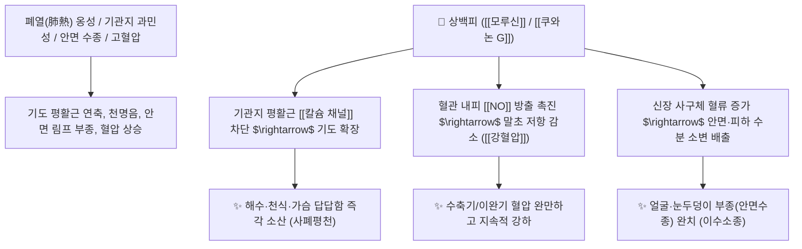

# 🌿 [[상백피]] (桑白皮, Mori Cortex)

> **핵심 요약 (Key Summary)**:
> 뽕나무과(*Moraceae*) 뽕나무(*Morus alba*)의 코르크층을 벗긴 뿌리껍질(근피)
> 프레닐화 플라보노이드인 [[모루신]](Morusin)과 쿠와논 G가 기도 평활근 [[칼슘 채널]]을 억제하고 혈관 내피 이완을 유도하여 폐열 천식 및 혈압 강하 작용 발휘
> 폐열(肺熱)로 인한 해수·천식·가슴 답답함 및 안면 수종(얼굴과 눈두덩이 부음)·급성 신우신염·고혈압을 치료하는 대표적인 [[사폐평천]](瀉肺平喘)·[[이수소종]](利水消腫) 약재

---
## 📌 목차
1. [기본 본초 정보 & 화학 구조 (Pharmacognosy)](#1-기본-본초-정보--화학-구조-pharmacognosy)
2. [핵심 분자약리 기전 & 기관지 이완·혈압 강하 네트워크](#2-핵심-분자약리-기전--기관지-이완혈압-강하-네트워크)
3. [해부생체역학 / 폐포 혈류 & 안면부 림프 순환 연계](#3-해부생체역학--폐포-혈류--안면부-림프-순환-연계)
4. [사상의학 및 임상 응용 (적응증 vs 감별점)](#4-사상의학-및-임상-응용-적응증-vs-감별점)
5. [고전 의학 및 배오 원리 (사백산 배오)](#5-고전-의학-및-배오-원리-사백산-배오)
6. [핵심 처방 비교 매트릭스](#6-핵심-처방-비교-매트릭스)
7. [출처 및 학술 참고 문헌 (References)](#7-출처-및-학술-참고-문헌-references)

---
## 1. 기본 본초 정보 & 화학 구조 (Pharmacognosy)

| 항목 | 상세 내용 |
| :--- | :--- |
| **기원 식물** | 뽕나무과(Moraceae) 뽕나무 *Morus alba* L. 또는 동속 식물의 뿌리껍질(코르크층을 제거한 백색 근피) |
| **성미 (性味)** | 甘, 寒 |
| **귀경 (歸經)** | 肺·脾經 (폐경, 비경) |
| **효능 (Actions)** | [[사폐평천]](瀉肺平喘), [[이수소종]](利水消腫), [[청열사폐]](淸熱瀉肺), [[강혈압]](降血壓) |
| **주요 성분** | • **프레닐화 플라보노이드**: [[모루신]] (Morusin, KP 규격 $\ge 0.10\%$), [[쿠와논 G]] (Kuwanon G), 상겐논 C/D, 알바플라본<br>• **이미노슈가**: [[1-DNJ]] (1-Deoxynojirimycin, 혈당 강하)<br>• **다당류 및 유기산**: 모란 A, 베타닌 |

> **[유래 및 본초학적 기전]**:
> * 뽕나무 뿌리의 흰 속껍질로, 과로와 열로 헉헉대며 숨이 차고 얼굴이 붓는 병태를 시원하게 식혀줍니다.
> * 폐에 가득 찬 화열(火熱)을 아래로 쏟아내어(瀉肺) 기침과 천식을 가라앉히고, 수분을 소변으로 배출시켜 얼굴과 사지의 부종을 내리며 혈압을 안정시킵니다.

### 🔬 상백피의 주요 플라보노이드 지표물질 화학 구조
```
     [ 플라본 골격 ]───( C-3/C-8 위치에 프레닐 곁사슬 )  <-- 모루신 (Morusin)
            │
      피란 고리 융합
```
> **[구조적 특징 및 이완 기전]**: [[모루신]]은 친유성 프레닐기를 가진 플라보노이드로, 기관지 및 혈관 평활근의 $\text{Ca}^{2+}$ 유입을 차단하여 신속한 기관지 확장과 혈관 이완을 유도합니다.

---
## 2. 핵심 분자약리 기전 & 기관지 이완·혈압 강하 네트워크



### (1) 표적 사폐평천 및 혈압 강하
* **기관지 평활근 연축 억제 및 진해**:
  * 폐열로 인한 마른 기침, 발작성 천식, 쌕쌕거리는 천명음을 기관지 확장을 통해 즉각 완화합니다.
* **혈압 강하 및 혈관 보호**:
  * 혈관 수축을 억제하고 혈관 내피세포를 보호하여 고혈압 및 동맥경화성 두통을 개선합니다.
* **이수소종(利水消腫) 및 안면 부종 제거**:
  * 폐의 통조수도(通調水道) 기능을 회복시켜 아침에 얼굴과 눈꺼풀이 붓는 부종과 급성 신우신염의 핍뇨를 치료합니다.

---
## 3. 해부생체역학 / 폐포 혈류 & 안면부 림프 순환 연계

* **상기도 및 안면부 림프액 순환 촉진**:
  * 안면 두경부 정맥 및 림프관의 울혈을 소산시켜 부종을 가라앉힙니다.

---
## 4. 사상의학 및 임상 응용 (적응증 vs 감별점)

```
[✅ 최적 적응증 (Sweet Spot)]
• 폐열 해수·천식: 기침이 심하고 숨이 차며 얼굴이 붉고 가래가 누런 소아 폐렴 및 만성 기관지염 ([[사백산]])
• 안면 수종: 얼굴과 눈 주변이 퉁퉁 붓고 소변량이 줄어든 경우 ([[오피음]])
• 고혈압성 두통 및 어지럼증을 동반한 호흡기 질환

[⚠️ 신중 투여 (Caution)]
• 폐한(肺寒)으로 가래가 맑고 묽으며 오한이 있는 기침 환자 복용 금기
• 소변이 맑고 잦은 허한 환자
```

---
## 5. 고전 의학 및 배오 원리 (사백산 배오)

### (1) 폐열 천식의 최고 명방: 사백산(瀉白散)
* **핵심 배오**:
  * [[상백피]] + [[지골피]] $\rightarrow$ 폐 속의 잠복된 화열을 서늘하게 식혀 천식을 멎게 함 ([[사백산]])
  * [[상백피]] + [[마황]] + [[행인]] $\rightarrow$ 담열 천식을 강력하게 평천 ([[정천탕]])

---
## 6. 핵심 처방 비교 매트릭스

| 처방명 | 구성 약재 | 주치 병증 및 임상 타깃 | 특징 및 감별점 |
| :--- | :--- | :--- | :--- |
| [[사백산]] | [[상백피]], [[지골피]], [[감초]], [[경미]](멥쌀) | **폐열천해, 조열(오후 미열), 마른 기침, 소아 천식** | 폐열을 씻어내는 표준 방 |
| [[오피음]] | [[상백피]], [[진피]], [[복령피]], [[대복피]], [[생강피]] | **피수(皮水), 전신 부종, 안면 부종, 흉복창만** | 5가지 껍질로 부종을 치료 |
| [[정천탕]] | [[마황]], [[상백피]], [[은행]], [[반하]], [[관동화]], [[황금]] 등 | **담열 효천(천식 발작), 흉민, 천명음, 누런 가래** | 급성 천식 발작을 제어 |

---
## 7. 출처 및 학술 참고 문헌 (References)

1. **Lee, C. Y., et al. (2012)**. Morusin inhibits airway inflammation and hyperresponsiveness in a murine model of asthma. *Journal of Agricultural and Food Chemistry*, 60(41), 10243-10250.
   - **[연구 요약]**: 상백피의 모루신이 기도 과민성을 낮추고 염증성 사이토카인을 차단하여 천식 병태를 유의하게 억제함을 규명.
2. **대한민국약전(KP) 제12개정 (2022)**. 의약품각조 제2부: 상백피 (Mori Cortex) 규격 기준.
   - **[공정서 규격]**: 건조물 기준 모루신($\text{C}_{25}\text{H}_{24}\text{O}_6$) 0.10% 이상 함유 필수 규격 명시.
