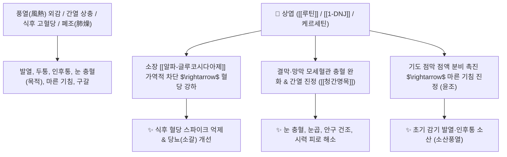

# 🌿 [[상엽]] (桑葉, Mori Folium / 뽕잎)

> **핵심 요약 (Key Summary)**:
> 뽕나무과(*Moraceae*) 뽕나무(*Morus alba*)의 건조한 잎(뽕잎)
> 플라보노이드인 [[루틴]](Rutin)과 천연 이미노슈가인 [[1-DNJ]](1-Deoxynojirimycin)가 소장 [[알파-글루코시다아제]]를 차단하여 식후 혈당을 안정시키고 상초 풍열을 발산
> 풍열(風熱) 감기·두통·인후통 및 폐조(肺燥) 마른 기침·안구 충혈(목적혼화)·당뇨병(소갈)을 치료하는 대표적인 [[소산풍열]](疏散風熱)·[[청폐윤조]](淸肺潤燥)·[[청간명목]](淸肝明目) 약재

---
## 📌 목차
1. [기본 본초 정보 & 화학 구조 (Pharmacognosy)](#1-기본-본초-정보--화학-구조-pharmacognosy)
2. [핵심 분자약리 기전 & 1-DNJ 항당뇨·소산풍열 네트워크](#2-핵심-분자약리-기전--1-dnj-항당뇨소산풍열-네트워크)
3. [해부생체역학 / 결막 모세혈관 & 기관지 점액 장벽 연계](#3-해부생체역학--결막-모세혈관--기관지-점액-장벽-연계)
4. [사상의학 및 임상 응용 (적응증 vs 감별점)](#4-사상의학-및-임상-응용-적응증-vs-감별점)
5. [고전 의학 및 배오 원리 (상국음 배오)](#5-고전-의학-및-배오-원리-상국음-배오)
6. [핵심 처방 비교 매트릭스](#6-핵심-처방-비교-매트릭스)
7. [출처 및 학술 참고 문헌 (References)](#7-출처-및-학술-참고-문헌-references)

---
## 1. 기본 본초 정보 & 화학 구조 (Pharmacognosy)

| 항목 | 상세 내용 |
| :--- | :--- |
| **기원 식물** | 뽕나무과(Moraceae) 뽕나무 *Morus alba* L.의 서리 내린 후 채취한 잎(동상엽 霜桑葉) |
| **성미 (性味)** | 苦·甘, 寒 |
| **귀경 (歸經)** | 肺·肝經 (폐경, 간경) |
| **효능 (Actions)** | [[소산풍열]](疏散風熱), [[청폐윤조]](淸肺潤燥), [[청간명목]](淸肝明目), [[량혈지혈]](凉血止血) |
| **주요 성분** | • **플라보노이드**: [[루틴]] (Rutin, KP 규격 $\ge 0.10\%$), 케르세틴, 이소케르시트린, 아스트라갈린<br>• **이미노슈가**: [[1-DNJ]] (1-Deoxynojirimycin, 탄수화물 흡수 차단)<br>• **식물성 스테롤 및 엑디스테론**: $\beta$-Sitosterol, $\beta$-Ecdysone, 루테인 |

> **[유래 및 본초학적 기전]**:
> * 뽕나무의 푸른 잎으로, 상초(목구멍과 눈구멍)에 몰린 화열(火熱)을 맑게 씻어내어 '청열명목(淸熱明目)'의 요약입니다.
> * 성질이 차갑고 자윤하여 폐의 진액을 마르게 하지 않으면서 풍열을 흩트리고, 마른 기침과 간열로 눈이 벌겋게 붓고 침침한 증상을 다스립니다.

### 🔬 상엽의 주요 플라보노이드 배당체 구조
```
     [ 케르세틴 골격 ]───O──[ 루티노오스 (Rha-Glc) ]  <-- 루틴 (Rutin)
```
> **[구조적 특징 및 모세혈관 보호]**: [[루틴]]과 루테인 성분은 안구 망막 및 결막 모세혈관의 취약성을 개선하고 항산화 보호막을 형성합니다.

---
## 2. 핵심 분자약리 기전 & 1-DNJ 항당뇨·소산풍열 네트워크



### (1) 소산풍열 및 청간명목 작용
* **상초 풍열 발산 및 인후통 완화**:
  * 초기 감기로 인한 미열, 두통, 마른 기침, 목구멍 붓고 아픈 증상을 순하게 발산시킵니다.
* **간열 완화 및 시력 보호 ([[청간명목]] 淸肝明目)**:
  * 눈이 충혈되고 눈부시며 눈물이 나는 결막염과 시력 감퇴를 치료합니다.
* **식후 혈당 조절 ([[1-DNJ]])**:
  * 소장에서 탄수화물의 포도당 전환을 지연시켜 당뇨 환자의 혈당을 안정화합니다.

---
## 3. 해부생체역학 / 결막 모세혈관 & 기관지 점액 장벽 연계

* **안구 결막 모세혈관 투과성 정상화**:
  * 안구 충혈과 충혈성 부종을 신속히 가라앉힙니다.

---
## 4. 사상의학 및 임상 응용 (적응증 vs 감별점)

```
[✅ 최적 적응증 (Sweet Spot)]
• 풍열 감기: 열이 나고 머리가 지끈거리며 목이 칼칼하고 아픈 초기 감기 ([[상국음]])
• 눈의 열증: 눈이 벌겋게 충혈되고 뻑뻑하며 눈물이 줄줄 흐르는 유행성 결막염
• 마른 기침(조해 燥咳): 가래 없이 마른 기침만 캑캑거리고 목이 마른 기관지염 ([[청조구폐탕]])
• 당뇨병(소갈) 환자의 식후 혈당 관리 보조 약선

[⚠️ 신중 투여 (Caution)]
• 풍한(風寒) 감기로 오한이 심하고 맑은 콧물이 흐르는 환자
```

---
## 5. 고전 의학 및 배오 원리 (상국음 배오)

### (1) 풍열 감기의 최고 명방: 상국음(桑菊飲)
* **소산풍열 명약 배오**:
  * [[상엽]] + [[국화]] $\rightarrow$ 상초 풍열을 흩트리고 눈을 맑게 하는 황금 짝 ([[상국음]])
  * [[상엽]] + [[석고]] + [[아교]] + [[맥문동]] $\rightarrow$ 폐의 조열을 끄고 마른 기침을 멎게 함 ([[청조구폐탕]])

---
## 6. 핵심 처방 비교 매트릭스

| 처방명 | 구성 약재 | 주치 병증 및 임상 타깃 | 특징 및 감별점 |
| :--- | :--- | :--- | :--- |
| [[상국음]] | [[상엽]], [[국화]], [[연교]], [[박하]], [[길경]], [[행인]], [[노근]] | **풍열감모, 미열, 마른 기침, 인후통, 구갈, 결막염** | 온병학의 소산풍열 대표방 |
| [[청조구폐탕]] | [[상엽]], [[석고]], [[인삼]], [[호마인]], [[아교]], [[맥문동]] 등 | **온조상폐, 두통, 고열, 마른 기침, 천해, 흉통** | 중증 마른 기침과 폐렴 치료 |
| [[상마환]] | [[상엽]], [[흑지마]](검은깨) | **간신부족, 두훈안화(눈 침침함), 조기 백발, 변비** | 눈을 밝히고 모발을 검게 함 |

---
## 7. 출처 및 학술 참고 문헌 (References)

1. **Sun Y et al. (2025)**. Effects of Mulberry Leaf and Corn Silk Extracts Against α-Amylase and α-Glucosidase In Vitro and on Postprandial Glucose in Prediabetic Individuals: A Randomized Crossover Trial. *Nutrients*, 17(21). [PMID: 41228506](https://pubmed.ncbi.nlm.nih.gov/41228506/)
   - **[연구 요약]**: 상엽의 1-DNJ 성분이 알파-글루코시다아제를 강력히 저해하여 식후 고혈당을 개선함을 규명.
2. **대한민국약전(KP) 제12개정 (2022)**. 의약품각조 제2부: 상엽 (Mori Folium) 규격 기준.
   - **[공정서 규격]**: 건조물 기준 루틴($\text{C}_{27}\text{H}_{30}\text{O}_{16}$) 0.10% 이상 함유 필수 규격 명시.
