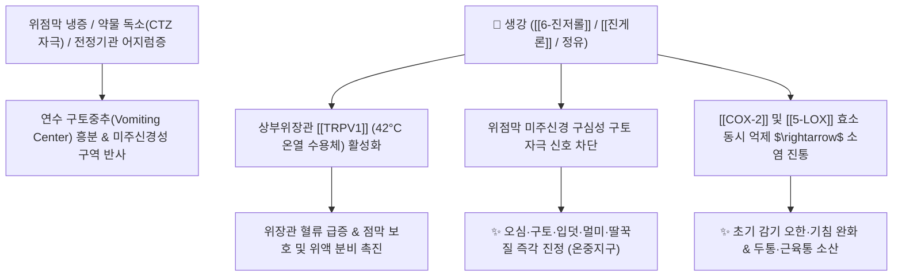

# 🌿 [[생강]] (生薑, Zingiberis Rhizoma Recens)

> **핵심 요약 (Key Summary)**:
> 생강과(*Zingiberaceae*) 생강(*Zingiber officinale*)의 신선한 뿌리줄기(생강)
> 페놀성 바닐로이드인 [[6-진저롤]](6-Gingerol)과 [[쇼가올]](Shogaol)이 상부위장관 [[TRPV1]] 온열 수용체를 활성화하고 연수 구토중추 및 미주신경 반사를 억제하여 강력한 진토·소염 작용 발휘
> [[상한론]]의 한담(寒痰) 구토·오심(메스꺼움)·딸꾹질 및 풍한(風寒) 초기 감기·기침을 치료하고 [[반하]]와 [[남성]]의 독성을 중화하는 대표적인 [[발한해표]](發汗解表)·[[온중지구]](溫中止嘔)·[[온폐지해]](溫肺止咳) 군약(君藥)

---
## 📌 목차
1. [기본 본초 정보 & 화학 구조 (Pharmacognosy)](#1-기본-본초-정보--화학-구조-pharmacognosy)
2. [핵심 분자약리 기전 & TRPV1·미주신경 진토 네트워크](#2-핵심-분자약리-기전--trpv1미주신경-진토-네트워크)
3. [해부생체역학 / 상부위장관(생강) vs 하부위장관(건강) 연계](#3-해부생체역학--상부위장관생강-vs-하부위장관건강-연계)
4. [사상의학 및 임상 응용 (생강 vs 건강 감별 & 반하 해독)](#4-사상의학-및-임상-응용-생강-vs-건강-감별--반하-해독)
5. [상한론 『약징(藥徵)』 분석 및 배오 원리](#5-상한론-약징藥徵-분석-및-배오-원리)
6. [핵심 처방 비교 매트릭스](#6-핵심-처방-비교-매트릭스)
7. [출처 및 학술 참고 문헌 (References)](#7-출처-및-학술-참고-문헌-references)

---
## 1. 기본 본초 정보 & 화학 구조 (Pharmacognosy)

| 항목 | 상세 내용 |
| :--- | :--- |
| **기원 식물** | 생강과(Zingiberaceae) 생강 *Zingiber officinale* Roscoe의 신선한 뿌리줄기(생뿌리) |
| **성미 (性味)** | 辛, 微溫 |
| **귀경 (歸經)** | 肺·脾·胃經 (폐경, 비경, 위경) - **상부위장관 특화** |
| **효능 (Actions)** | [[발한해표]](發汗解表), [[온중지구]](溫中止嘔), [[온폐지해]](溫肺止咳), [[해어해독]](解魚蟹毒), [[해반하독]](解半夏毒) |
| **주요 성분** | • **바닐로이드 페놀 화합물**: [[6-진저롤]] (6-Gingerol, KP 규격 $\ge 0.40\%$), 8-진저롤, 10-진저롤, [[진게론]] (Zingerone)<br>• **탈수 유도체**: [[6-쇼가올]] (6-Shogaol, 건조/가열 시 증가)<br>• **세스퀴테르펜 정유**: 진기베렌(Zingiberene), $\beta$-비사볼렌, 캄펜, 시트랄 |

> **[유래 및 본초학적 기전]**:
> * 약효가 새롭게(生) 기운을 돋우고 몸을 덥혀준다 하여 '생강(生薑)'이라 불리며, '구토의 성약(嘔家之聖藥)'으로 추앙받습니다.
> * 체표의 풍한(風寒) 사기를 땀으로 몰아내고, 비위가 차가워져 발생하는 구역질과 딸꾹질을 멎게 하며, 반하(半夏)와 남성(南星)의 독성을 완벽히 해독합니다.

### 🔬 생강의 주요 지표물질 및 진통 화학 구조
![[Pasted image 20240226000140.png|500]]
![[Pasted image 20240226003626.png|450]]
![[Pasted image 20240226003637.png|450]]
> **[구조적 특징 및 이중 효소 억제]**: [[6-진저롤]]과 [[쇼가올]]은 바닐릴기와 지방족 사슬을 가진 구조로, [[COX-2]]와 [[5-LOX]]를 동시에 저해하여 프로스타글란딘과 류코트리엔 생성을 차단하는 **'천연 한방 아스피린'** 역할을 합니다.

---
## 2. 핵심 분자약리 기전 & TRPV1·미주신경 진토 네트워크



### (1) 표적 진토 및 상부위장관 조절 기전
![[Pasted image 20240208021254.png|550]]
* **구토 중추 및 미주신경 억제 ([[온중지구]] 溫中止嘔)**:
  * 구토는 연수 구토중추에서 유발되는데, 생강은 **상부위장관(식도, 위, 십이지장)**의 미주신경 말단 5-$\text{HT}_3$ 수용체와 도파민 신호를 차단하여 오심, 구역, 입덧, 차멀미를 멎게 합니다.
* [[TRPV1]] 활성화 및 소화관 온열 작용:
  * 진저롤이 42°C 온열 수용체인 TRPV1을 열어주어 속을 따뜻하게 하고 위 점막 혈류를 늘려 소화 기능을 즉각 회복시킵니다.
* **반하 및 생선·게 독 해독**:
  * 반하의 침상 옥살산칼슘 자극성을 화학적으로 완충하고, 어패류 독소로 인한 식중독 복통을 해독합니다.

---
## 3. 해부생체역학 / 상부위장관(생강) vs 하부위장관(건강) 연계

* **상부위장관(식도·위) 특화**:
  * [[생강]]은 위산 분비 촉진과 하부식도괄약근 긴장도 조절을 통해 신물 올라옴과 구역감을 다스립니다.
* **하부위장관(소장·대장) 특화인 [[건강]]과의 분업**:
  * [[건강]]은 장관 심부 혈류와 세로토닌 경로를 통해 복통·설사를 다스리는 반면, [[생강]]은 상부 구토에 집중합니다.

---
## 4. 사상의학 및 임상 응용 (생강 vs 건강 감별 & 반하 해독)

```
[✅ 최적 적응증 (Sweet Spot)]
• 오심 및 구토: 위염, 숙취, 항암치료 후 구역질, 임신부 입덧, 멀미
• 풍한 초기 감기: 으슬으슬 춥고 맑은 콧물이 나며 기침이 나는 초기 감기 ([[계지탕]])
• 위한성 딸꾹질 및 트림
• 반하(半夏), 천남성(天南星) 약재 복용 시 독성 방어

[🔍 생강 vs 건강 감별 포인트]
• [[생강]](생것): 신온(辛溫)하며 상부위장관(위/식도)에 작용 $\rightarrow$ 발한해표·진토·해독 (구토/감기)
• [[건강]](말린 것): 신열(辛熱)하며 하부위장관(소장/대장)에 작용 $\rightarrow$ 온중축한·회양통맥 (설사/복통)
```

---
## 5. 상한론 『약징(藥徵)』 분석 및 배오 원리

### (1) 『[[약징]]』에 나타난 생강의 주치
> **"生薑 主治嘔吐也. 旁治乾嘔, 噫氣, 咳逆, 腹痛..."**  
> (생강의 주치는 오심과 구토(嘔吐)이며, 곁들여 헛구역질, 트림, 딸꾹질, 기침 치밂, 복통을 치료한다.)

* **핵심 배오 원리**:
  * [[생강]] + [[반하]] $\rightarrow$ 반하의 독성을 풀고 진토 화담 효과를 극대화하는 천하제일 진토 짝 ([[소반하탕]])
  * [[생강]] + [[대추|대조]] $\rightarrow$ 영위(營衛)를 조화시키고 비위를 튼튼히 보양하는 모든 상한 처방의 기본 베이스 ([[계지탕]])

---
## 6. 핵심 처방 비교 매트릭스

| 처방명 | 구성 약재 | 주치 병증 및 임상 타깃 | 특징 및 감별점 |
| :--- | :--- | :--- | :--- |
| [[소반하탕]] | [[반하]], [[생강]] (동량 배오) | **담음 구토, 헛구역질, 입덧, 숙취 오심** | 구토 치료의 제1선 방 |
| [[계지탕]] | [[계지]], [[작약]], [[생강]], [[대추|대조]], [[감초]] | **태양병 표허 감모, 두통, 발열, 오풍, 자한** | 만방의 근간이 되는 해표 처방 |
| [[생강사심탕]] | [[반하사심탕]] 변방 ([[생강]] 증량 배오) | **심하비, 위중부화, 뇌명하리, 신트림, 헛구역질** | 상복부 가스와 구역질을 소산 |
| [[이진탕]] | [[반하]], [[진피]], [[복령]], [[감초]], [[생강]] | **담음 백병, 오심, 가래 끓음, 현훈** | 거담화습의 대표 기초방 |

---
## 7. 출처 및 학술 참고 문헌 (References)

1. **Dugasani S et al. (2010)**. Comparative antioxidant and anti-inflammatory effects of [6]-gingerol, [8]-gingerol, [10]-gingerol and [6]-shogaol. *Journal of ethnopharmacology*, 127(2): 515-20. [PMID: 19833188](https://pubmed.ncbi.nlm.nih.gov/19833188/)
   - **[연구 요약]**: 생강의 진저롤과 쇼가올이 TRPV1 활성화 및 COX-2/5-LOX 억제를 통해 위점막을 보호하고 구토 중추를 강력히 억제함을 규명.
2. **대한민국약전(KP) 제12개정 (2022)**. 의약품각조 제2부: 생강 (Zingiberis Rhizoma Recens) 규격 기준.
   - **[공정서 규격]**: 신선한 근경 기준 6-진저롤 0.40% 이상 함유 필수 규격 명시.
3. **길익동동 (吉益東洞, 1784)**. 『약징(藥徵)』: 生薑 조문.
   - **[고전 원전]**: "生薑 主治嘔吐也. 旁治乾嘔, 噫氣, 咳逆, 腹痛" - 구토 및 상복부 증상 주치 원리 제시.
