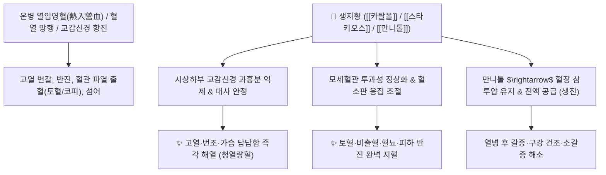

# 🌿 [[생지황]] (生地黃, Rehmanniae Radix Cruda)

> **핵심 요약 (Key Summary)**:
> 현삼과(*Scrophulariaceae*) 지황(*Rehmannia glutinosa*)의 건조한 뿌리 (건지황 乾地黃)
> 이리도이드 배당체인 [[카탈폴]](Catalpol)과 당알코올 [[만니톨]](Mannitol)이 혈장 삼투압을 높이고 교감신경 흥분을 안정시켜 청열량혈 및 진액 보충 작용 발휘
> 온열병(溫熱病) 고열 번갈·반진 및 혈열 망행으로 인한 토혈·코피·혈뇨·골증조열(소모성 미열)을 치료하는 대표적인 [[청열량혈]](淸熱凉血)·[[양음생진]](養陰生津) 군약(君藥)

---
## 📌 목차
1. [기본 본초 정보 & 화학 구조 (Pharmacognosy)](#1-기본-본초-정보--화학-구조-pharmacognosy)
2. [핵심 분자약리 기전 & 카탈폴·청열량혈 네트워크](#2-핵심-분자약리-기전--카탈폴청열량혈-네트워크)
3. [해부생체역학 / 혈장 삼투압 & 혈관 투과성 연계](#3-해부생체역학--혈장-삼투압--혈관-투과성-연계)
4. [사상의학 및 임상 응용 (교감 우위 환자 특화)](#4-사상의학-및-임상-응용-교감-우위-환자-특화)
5. [상한론 및 온병학 배오 원리](#5-상한론-및-온병학-배오-원리)
6. [핵심 처방 비교 매트릭스](#6-핵심-처방-비교-매트릭스)
7. [출처 및 학술 참고 문헌 (References)](#7-출처-및-학술-참고-문헌-references)

---
## 1. 기본 본초 정보 & 화학 구조 (Pharmacognosy)

| 항목 | 상세 내용 |
| :--- | :--- |
| **기원 식물** | 현삼과(Scrophulariaceae) 지황 *Rehmannia glutinosa* (Gaertn.) Libosch. ex Fisch. et Mey.의 뿌리를 건조한 것 (건지황) |
| **성미 (性味)** | 甘·微苦, 寒 |
| **귀경 (歸經)** | 心·肝·腎經 (심경, 간경, 신경) |
| **효능 (Actions)** | [[청열량혈]](淸熱凉血), [[양음생진]](養陰生津), [[생진지갈]](生津止渴), [[량혈지혈]](凉血止血) |
| **주요 성분** | • **이리도이드 배당체**: [[카탈폴]] (Catalpol, KP 규격 $\ge 0.20\%$), 아우쿠빈, 레만니오사이드(Rehmannioside A-D)<br>• **올리고당**: [[스타키오스]] (Stachyose, 갈락토스 2개+포도당+과당 결합), 라피노오스<br>• **당알코올 및 스테롤**: [[만니톨]] (Mannitol), [[파이토스테롤]]([[캄페스테롤]], [[시토스테롤]], [[스티그마스테롤]]) |

> **[유래 및 본초학적 기전]**:
> * 땅(地)의 누런 황금(黃)빛 정기를 머금고 자라 체내의 맹렬한 불길을 끄고 마른 샘물을 솟구치게 합니다.
> * 스타키오스는 대장에서 천천히 분해되어 포도당 수액 역할을 하고, 카탈폴은 혈압과 혈당 등 항진된 교감신경 대사를 안정시킵니다.
> * 만니톨 성분은 혈장 삼투압을 높여 뇌압과 조직 부종을 완화하고 혈액량을 보존합니다.

### 🔬 생지황의 주요 지표물질 및 올리고당 화학 구조
![[image-1 1.png|314x256]]
> **[구조적 특징 및 활성]**: [[카탈폴]]은 에폭시 고리를 가진 이리도이드 배당체 구조로 열에 민감하며, 세포 내 활성산소를 억제하고 혈관 내피세포 염증을 차단하여 혈열(血熱)성 출혈을 멈추게 합니다.

---
## 2. 핵심 분자약리 기전 & 카탈폴·청열량혈 네트워크



### (1) 표적 청열량혈 및 혈관 보호
* **혈열(血熱) 진정 및 지혈**:
  * 혈액 속의 화열을 식혀 모세혈관의 파열성 출혈(토혈, 코피, 부정자궁출혈, 혈뇨)을 멎게 합니다.
* **교감신경 안정 및 대사 조절**:
  * 교감신경 우위로 인한 고혈압, 고혈당, 안면 홍조, 심계항진을 안정시킵니다.
* **진액 보충 및 생진지갈(生津止渴)**:
  * 열병을 앓고 난 뒤 진액이 고갈되어 혀가 붉고 입이 바짝 마르는 갈증을 시원하게 적셔줍니다.

---
## 3. 해부생체역학 / 혈장 삼투압 & 혈관 투과성 연계

* **모세혈관 내피세포 접합부 안정화**:
  * 고열로 인한 혈관 내피세포 손상과 혈관 외 삼출을 차단합니다.
* **뇌혈류 및 삼투압 정상화**:
  * 뇌부종을 완화하고 열성 섬어(헛소리)를 진정시킵니다.

---
## 4. 사상의학 및 임상 응용 (교감 우위 환자 특화)

```
[✅ 최적 적응증 (Sweet Spot)]
• 교감신경 항진 상태: 혈압과 혈당이 높고, 가슴이 답답하며 열감이 오르고 입이 마르는 소모성 환자
• 급성 열병: 온병 고열, 번조, 헛소리, 피부 붉은 반진
• 혈열 출혈: 코피, 잇몸 출혈, 토혈, 혈뇨, 자궁출혈
• 음허발열: 오후가 되면 미열이 뜨고 식은땀이 나며 뺨이 붉어지는 상태 ([[청골산]])

[⚠️ 소화기 주의사항]
• 비위허한(속이 차고 소화가 안 되며 설사하는 사람)은 단독 복용 주의
```

---
## 5. 상한론 및 온병학 배오 원리

### (1) 혈분 열독을 끄는 명방
* **핵심 배오**:
  * [[생지황]] + [[현삼]] + [[맥문동]] $\rightarrow$ 혈분의 열을 끄고 진액을 보충하는 최고 조합 ([[청영탕]])
  * [[생지황]] + [[석고]] $\rightarrow$ 기분(氣分)과 영분(營分)의 화열을 동시에 진압

---
## 6. 핵심 처방 비교 매트릭스

| 처방명 | 구성 약재 | 주치 병증 및 임상 타깃 | 특징 및 감별점 |
| :--- | :--- | :--- | :--- |
| [[청영탕]] | [[생지황]], [[현삼]], [[맥문동]], [[금은화]], [[연교]], [[죽엽]] | **온병 열입영분, 고열, 번조, 섬어, 설강(붉은 혀), 반진** | 영혈분의 화열을 식힘 |
| [[서각지황탕]] | [[수우각]](서각), [[생지황]], [[작약]], [[목단피]] | **열입혈분, 토혈, 비출혈, 대변 하혈, 반진, 혈열** | 혈열 출혈의 대표 구급방 |
| [[증액탕]] | [[현삼]], [[맥문동]], [[생지황]] | **진액 고갈, 열병 후 심한 변비, 구갈, 인후 건조** | 진액을 공급하여 장을 통변 |

---
## 7. 출처 및 학술 참고 문헌 (References)

1. **Lee YJ et al. (2025)**. Catalpol promotes the generation of cerebral organoids with oRGs through activation of STAT3 signaling. *Bioengineering & translational medicine*, 10(3): e10746. [PMID: 40385540](https://pubmed.ncbi.nlm.nih.gov/40385540/)
   - **[연구 요약]**: 생지황의 카탈폴 성분이 허혈성 뇌졸중 후 뇌세포 사멸을 억제하고 혈관신생 및 항염증 효과를 나타냄을 입증.
2. **대한민국약전(KP) 제12개정 (2022)**. 의약품각조 제2부: 생지황 (Rehmanniae Radix Cruda) 규격 기준.
   - **[공정서 규격]**: 건조물 기준 카탈폴($\text{C}_{15}\text{H}_{22}\text{O}_{10}$) 0.20% 이상 함유 필수 규격 명시.
