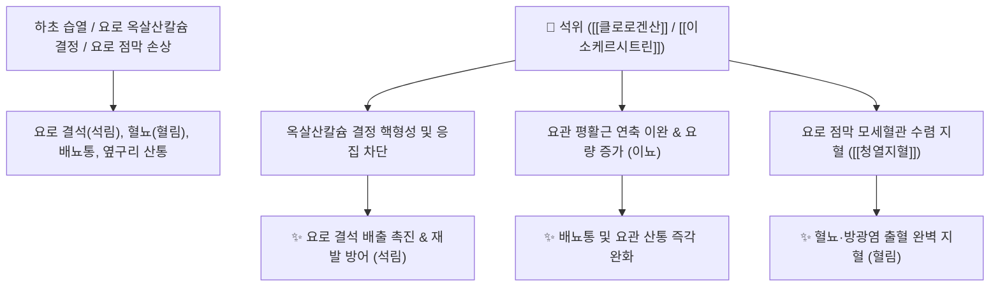

# 🌿 [[석위]] (石韋, Pyrrosiae Folium)

> **핵심 요약 (Key Summary)**:
> 고란초과(*Polypodiaceae*) 석위(*Pyrrosia lingua*)의 잎(엽상체)
> 플라보노이드인 [[이소케르시트린]](Isoquercitrin)과 [[클로로겐산]](Chlorogenic acid)이 요로 결석 결정 형성을 차단하고 모세혈관 수렴 지혈 및 이뇨 작용 발휘
> 습열(濕熱)로 인한 요로결석(석림 石淋)·혈뇨(혈림 血淋)·배뇨 곤란 및 폐열(肺熱) 해수·객담을 치료하는 대표적인 [[이뇨통림]](利尿通淋)·[[청열지혈]](淸熱止血)·[[청폐지해]](淸肺止咳) 약재

---
## 📌 목차
1. [기본 본초 정보 & 화학 구조 (Pharmacognosy)](#1-기본-본초-정보--화학-구조-pharmacognosy)
2. [핵심 분자약리 기전 & 요로결석 용해·지혈 네트워크](#2-핵심-분자약리-기전--요로결석-용해지혈-네트워크)
3. [해부생체역학 / 요관 평활근 & 방광 삼각부 연계](#3-해부생체역학--요관-평활근--방광-삼각부-연계)
4. [사상의학 및 임상 응용 (석림 배석 특화)](#4-사상의학-및-임상-응용-석림-배석-특화)
5. [고전 의학 및 배오 원리 (석위산 배오)](#5-고전-의학-및-배오-원리-석위산-배오)
6. [핵심 처방 비교 매트릭스](#6-핵심-처방-비교-매트릭스)
7. [출처 및 학술 참고 문헌 (References)](#7-출처-및-학술-참고-문헌-references)

---
## 1. 기본 본초 정보 & 화학 구조 (Pharmacognosy)

| 항목 | 상세 내용 |
| :--- | :--- |
| **기원 식물** | 고란초과 / 고사리과(Polypodiaceae) 석위 *Pyrrosia lingua* (Thunb.) Farw. 또는 애기석위의 잎 |
| **성미 (性味)** | 苦·甘, 微寒 |
| **귀경 (歸經)** | 肺·膀胱經 (폐경, 방광경) |
| **효능 (Actions)** | [[이뇨통림]](利尿通淋), [[청열지혈]](淸熱止血), [[청폐지해]](淸肺止咳), [[량혈통림]](凉血通淋) |
| **주요 성분** | • **페놀산 및 지표물질**: [[클로로겐산]] (Chlorogenic acid, KP 규격 $\ge 0.20\%$), 카페인산<br>• **플라보노이드 배당체**: [[이소케르시트린]] (Isoquercitrin), 만기페린(Mangiferin), 케르세틴<br>• **트리테르페노이드**: Diploptene, Fernene |

> **[유래 및 본초학적 기전]**:
> * 험준한 바위(石) 틈에서 질긴 가죽(韋)처럼 자라 '석위(石韋)'라 불렸습니다.
> * 바위처럼 단단한 기운으로 요로에 낀 결석(돌)을 부수어 소변으로 밀어내고, 혈열로 인한 혈뇨를 멎게 하며 폐의 열기를 식혀 기침을 가라앉힙니다.

### 🔬 석위의 주요 지표물질 화학 구조
```
     [ 퀴닌산 골격 ]───O──[ 카페오일기 ]  <-- 클로로겐산 (Chlorogenic acid)
```
> **[구조적 특징 및 요로 보호]**: [[클로로겐산]]과 만기페린은 요로계 상피세포의 활성산소를 제거하고 옥살산칼슘 결정의 응집을 방지하여 결석 성장을 억제합니다.

---
## 2. 핵심 분자약리 기전 & 요로결석 용해·지혈 네트워크



### (1) 표적 이뇨통림 및 요로결석 배출
* **요로 결석(석림 石淋) 배출 촉진**:
  * 요량을 급증시키고 요관 평활근 연축을 풀어주어 신장 및 요관, 방광 결석의 하향 배출을 돕습니다.
* **혈림(血淋, 혈뇨) 지혈**:
  * 결석 마찰이나 감염으로 인한 요로 출혈을 모세혈관 수렴 작용으로 멈추게 합니다.
* **청폐지해(淸肺止咳)**:
  * 폐열로 인한 기관지염 기침과 가슴 답답함을 완화합니다.

---
## 3. 해부생체역학 / 요관 평활근 & 방광 삼각부 연계

* **요관 방광 이행부(UVJ) 이완**:
  * 결석이 가장 잘 걸리는 협착 부위의 연축을 완화하여 자연 배석률을 높입니다.

---
## 4. 사상의학 및 임상 응용 (석림 배석 특화)

```
[✅ 최적 적응증 (Sweet Spot)]
• 요로결석(석림): 소변을 볼 때 찌릿하게 아프고 모래알이나 결석이 섞여 나오며 옆구리가 끊어지듯 아픈 경우 ([[석위산]])
• 혈뇨 및 급성 방광염: 소변에 피가 섞여 나오고 배뇨 시 작열감이 심한 혈림
• 폐열 해수: 가래가 끓고 기침이 심하며 가슴이 답답한 상태
```

---
## 5. 고전 의학 및 배오 원리 (석위산 배오)

### (1) 요로결석 배출의 명방: 석위산(石韋散)
* **핵심 배오**:
  * [[석위]] + [[활석]] + [[차전자]] + [[목통]] $\rightarrow$ 요로를 매끄럽게 윤활하고 결석을 배출하는 최고 조합 ([[석위산]])
  * [[석위]] + [[백모근]] + [[소계]] $\rightarrow$ 혈뇨를 신속히 지혈

---
## 6. 핵심 처방 비교 매트릭스

| 처방명 | 구성 약재 | 주치 병증 및 임상 타깃 | 특징 및 감별점 |
| :--- | :--- | :--- | :--- |
| [[석위산]] | [[석위]], [[활석]], [[차전자]], [[목통]], [[동규자]], [[구맥]] | **석림(요로결석), 배뇨통, 혈뇨, 요관 산통, 핍뇨** | 요로 결석 배출의 제1선 방 |
| [[팔정산]](가감) | [[석위]], [[목통]], [[활석]], [[치자]], [[대황]] 등 | 습열 하주, 급성 방광염, 요도 작열통, 소변불통 | 하초 습열을 씻어냄 |
| [[소계음자]](가미) | [[소계]], [[석위]], [[포황]], [[생지황]] | 혈림(혈뇨), 요로 점막 출혈, 방광 결석 | 지혈과 결석 배출을 겸치 |

---
## 7. 출처 및 학술 참고 문헌 (References)

1. **Wang YR et al. (2018)**. [Lithagogue effects of Pyrrosia lingua from Guizhou province on experimental renal calculus in rats]. *Zhongguo Zhong yao za zhi = Zhongguo zhongyao zazhi = China journal of Chinese materia medica*, 43(16): 3291-3300. [PMID: 30200732](https://pubmed.ncbi.nlm.nih.gov/30200732/)
   - **[연구 요약]**: 석위 추출물이 옥살산칼슘 결정의 응집을 억제하고 신장 세뇨관 상피 손상을 보호함을 입증.
2. **대한민국약전(KP) 제12개정 (2022)**. 의약품각조 제2부: 석위 (Pyrrosiae Folium) 규격 기준.
   - **[공정서 규격]**: 건조물 기준 클로로겐산($\text{C}_{16}\text{H}_{18}\text{O}_9$) 0.20% 이상 함유 필수 규격 명시.
