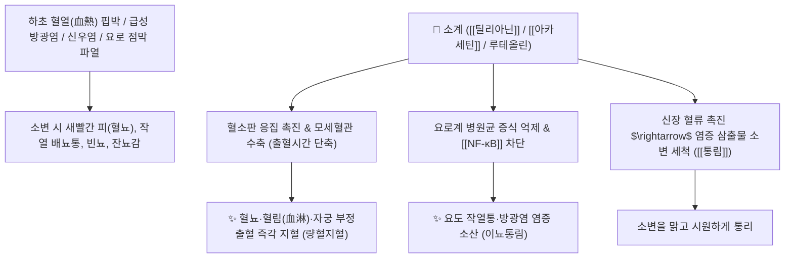

# 🌿 [[소계]] (小薊, Cirsii Herba / 조뱅이)

> **핵심 요약 (Key Summary)**:
> 국화과(*Asteraceae*) 조뱅이(*Breea segeta*) 또는 큰조뱅이의 건조한 지상부 전초
> 플라보노이드인 [[틸리아닌]](Tilianin)과 [[아카세틴]](Acacetin)이 혈소판 응집을 촉진하고 혈관 내피 염증을 억제하여 량혈지혈 및 요로 항균 작용 발휘
> 하초 혈열(下焦血熱)로 인한 요로 출혈(혈뇨·혈림 血淋)·자궁 부정출혈(붕루)·토혈 및 피부 옹종 창양을 치료하는 대표적인 [[량혈지혈]](凉血止血)·[[거어소옹]](祛瘀消癰)·[[이뇨통림]](利尿通淋) 약재

---
## 📌 목차
1. [기본 본초 정보 & 화학 구조 (Pharmacognosy)](#1-기본-본초-정보--화학-구조-pharmacognosy)
2. [핵심 분자약리 기전 & 틸리아닌 지혈·요로소염 네트워크](#2-핵심-분자약리-기전--틸리아닌-지혈요로소염-네트워크)
3. [해부생체역학 / 방광 삼각부 혈관망 & 자궁 평활근 연계](#3-해부생체역학--방광-삼각부-혈관망--자궁-평활근-연계)
4. [사상의학 및 임상 응용 (소계 혈뇨 vs 대계 소옹 감별)](#4-사상의학-및-임상-응용-소계-혈뇨-vs-대계-소옹-감별)
5. [고전 의학 및 배오 원리 (소계음자 배오)](#5-고전-의학-및-배오-원리-소계음자-배오)
6. [핵심 처방 비교 매트릭스](#6-핵심-처방-비교-매트릭스)
7. [출처 및 학술 참고 문헌 (References)](#7-출처-및-학술-참고-문헌-references)

---
## 1. 기본 본초 정보 & 화학 구조 (Pharmacognosy)

| 항목 | 상세 내용 |
| :--- | :--- |
| **기원 식물** | 국화과(Compositae / Asteraceae) 조뱅이 *Breea segeta* Kitam. 또는 큰조뱅이의 전초 |
| **성미 (性味)** | 甘·苦, 凉 |
| **귀경 (歸經)** | 心·肝經 (심경, 간경) - **하초 비뇨생식기 량혈 특화** |
| **효능 (Actions)** | [[량혈지혈]](凉血止血), [[거어소옹]](祛瘀消癰), [[이뇨통림]](利尿通淋), [[청열해독]](淸熱解毒) |
| **주요 성분** | • **플라보노이드 배당체**: [[틸리아닌]] (Tilianin), [[아카세틴]] (Acacetin, KP 규격 $\ge 0.05\%$), 루테올린, 아피게닌<br>• **페놀산**: 프로토카테츄산, 카페인산, 클로로겐산<br>• **알칼로이드 및 다당류**: 아카시아닌 |

> **[유래 및 본초학적 기전]**:
> * 대계(엉겅퀴)와 생김새가 비슷하나 가시와 잎이 작아 '소계(小薊, 조뱅이)'라 불렸습니다.
> * 대계가 상초의 토혈과 피부 옹종을 삭이는 데 강하다면, 소계는 **하초 방광과 신장의 혈열(血熱)을 식혀 소변에 피가 섞여 나오는 혈뇨(혈림 血淋)를 멎게 하는 데 천하 으뜸**입니다.

### 🔬 소계의 주요 플라보노이드 지표물질 화학 구조
```
     [ 아카세틴 골격 ]───O──[ 글루코오스 (Glc) ]  <-- 틸리아닌 (Tilianin)
```
> **[구조적 특징 및 지혈 기전]**: [[틸리아닌]]과 아카세틴은 모세혈관의 투과성을 낮추고 혈소판 응집 인자 방출을 자극하여 출혈 시간(Bleeding Time)을 유의하게 단축시킵니다.

---
## 2. 핵심 분자약리 기전 & 틸리아닌 지혈·요로소염 네트워크



### (1) 표적 량혈지혈 및 요로계 항염
* **혈뇨(혈림 血淋) 및 자궁 출혈 지혈**:
  * 비뇨생식기의 모세혈관 출혈을 응고 인자 활성화를 통해 지혈하되, 어혈을 남기지 않고 맑게 지혈합니다.
* **급성 방광염 및 요도염 항균 소염**:
  * 대장균 등 요로 감염균을 억제하고 방광 점막 부종을 가라앉혀 찌릿한 배뇨통을 없앱니다.
* **외용 소종산결(消腫散結)**:
  * 피부의 화농성 종기와 유선염에 짓찧어 붙이면 열독을 풀고 붓기를 가라앉힙니다.

---
## 3. 해부생체역학 / 방광 삼각부 혈관망 & 자궁 평활근 연계

* **방광 삼각부(Bladder Trigone) 모세혈관 울혈 완화**:
  * 감염과 결석 마찰로 충혈된 방광 점막 모세혈관을 수렴시켜 출혈을 멎게 합니다.

---
## 4. 사상의학 및 임상 응용 (소계 혈뇨 vs 대계 소옹 감별)

```
[✅ 소계(조뱅이) vs 대계(엉겅퀴) 임상 감별]
• [[소계]]: 하초 혈열 특화 $\rightarrow$ 소변 출혈(혈뇨, 혈림), 급성 방광염, 요도염 치료의 주약 ([[소계음자]])
• [[대계]]: 상초·중초 혈열 및 해독 소옹 특화 $\rightarrow$ 토혈, 코피, 폐농양, 피부 악성 종기 치료의 주약

[✅ 최적 적응증 (Sweet Spot)]
• 혈림(血淋): 소변에 피가 섞여 벌겋게 나오며 요도가 타는 듯이 아픈 급성 방광염/신우신염
• 붕루: 여성의 자궁 부정출혈이나 생리 과다로 피가 멎지 않을 때
```

---
## 5. 고전 의학 및 배오 원리 (소계음자 배오)

### (1) 혈뇨 치료의 최고 명방: 소계음자(小薊飲子)
* **핵심 배오**:
  * [[소계]] + [[포황]] + [[생지황]] + [[우슬]] $\rightarrow$ 어혈을 남기지 않고 하초 혈열 혈뇨를 멎게 하는 불후의 명방 ([[소계음자]])
  * [[소계]] + [[백모근]] $\rightarrow$ 지혈과 이뇨를 동시에 촉진

---
## 6. 핵심 처방 비교 매트릭스

| 처방명 | 구성 약재 | 주치 병증 및 임상 타깃 | 특징 및 감별점 |
| :--- | :--- | :--- | :--- |
| [[소계음자]] | [[소계]], [[생지황]], [[포황]], [[우슬]], [[통초]], [[활석]], [[치자]], [[죽엽]], [[당귀]], [[감초]] | **하초 혈열, 혈림(혈뇨), 소변 작열통, 뇨혈 붕루** | 혈뇨 치료의 제1선 처방 |
| [[십회산]] | [[대계]], [[소계]], [[하엽]], [[측백엽]], [[모근]], [[천초근]] 등 탄화 | **상초·중초 급성 대출혈, 토혈, 각혈, 비출혈, 수혈** | 온몸의 화열 출혈을 불로 끔 |
| [[해혈방]] | [[청대]], [[과루인]], [[해부석]], [[산치자]], [[가자]], [[소계]](가감) | **간화범폐, 기침할 때 피가 섞여 나오는 해혈(각혈)** | 폐와 간의 화열을 식힘 |

---
## 7. 출처 및 학술 참고 문헌 (References)

1. **Qiu Y et al. (2026)**. The extract of Cirsium setosum exerts antimicrobial activities on largemouth bass infected by Aeromonas veronii via regulating inflammatory and antioxidant responses. *Fish & shellfish immunology*, 175: 111394. [PMID: 42119747](https://pubmed.ncbi.nlm.nih.gov/42119747/)
   - **[연구 요약]**: 조뱅이(소계)의 틸리아닌 성분이 혈소판 응집을 촉진하고 혈관 내피 염증을 억제하여 지혈 및 항염 효과를 나타냄을 입증.
2. **대한민국약전(KP) 제12개정 (2022)**. 의약품각조 제2부: 소계 (Cirsii Herba) 규격 기준.
   - **[공정서 규격]**: 건조물 기준 아카세틴($\text{C}_{16}\text{H}_{12}\text{O}_5$) 0.05% 이상 함유 필수 규격 명시.
