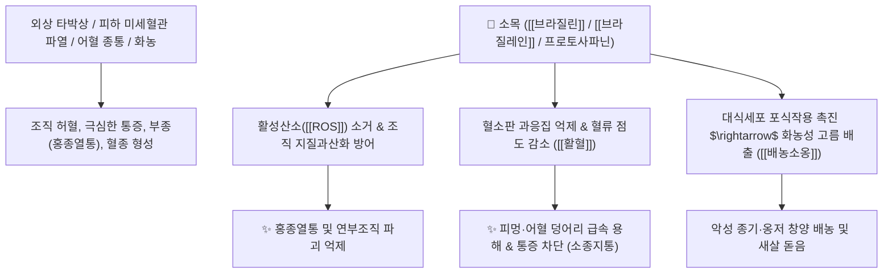

# 🌿 [[소목]] (蘇木, Sappan Lignum)

> **핵심 요약 (Key Summary)**:
> 콩과(*Fabaceae*) 다목(*Caesalpinia sappan*)의 붉은색 심재(줄기 속 목질부)
> 호모이소플라보노이드인 [[브라질린]](Brazilin)과 [[브라질레인]](Brazilein)이 혈소판 과응집을 억제하고 혈관 내피 염증성 활성산소를 차단하여 강력한 파어소종 및 배농 작용 발휘
> 외상 타박상으로 인한 어혈 종통(피멍·부종)·산후 어혈 복통·월경 폐색 및 화농성 옹종 창양을 치료하는 대표적인 [[활혈거어]](活血祛瘀)·[[소종지통]](消腫止痛)·[[배농소옹]](排膿消癰) 약재

---
## 📌 목차
1. [기본 본초 정보 & 화학 구조 (Pharmacognosy)](#1-기본-본초-정보--화학-구조-pharmacognosy)
2. [핵심 분자약리 기전 & 브라질린·어혈 소종 네트워크](#2-핵심-분자약리-기전--브라질린어혈-소종-네트워크)
3. [해부생체역학 / 피하 미세혈관망 & 연부조직 염증 연계](#3-해부생체역학--피하-미세혈관망--연부조직-염증-연계)
4. [사상의학 및 임상 응용 (타박 어혈 vs 출혈량에 따른 가감)](#4-사상의학-및-임상-응용-타박-어혈-vs-출혈량에-따른-가감)
5. [고전 의학 및 배오 원리 (홍화 배오)](#5-고전-의학-및-배오-원리-홍화-배오)
6. [핵심 처방 비교 매트릭스](#6-핵심-처방-비교-매트릭스)
7. [출처 및 학술 참고 문헌 (References)](#7-출처-및-학술-참고-문헌-references)

---
## 1. 기본 본초 정보 & 화학 구조 (Pharmacognosy)

| 항목 | 상세 내용 |
| :--- | :--- |
| **기원 식물** | 콩과(Fabaceae / Leguminosae) 다목 *Caesalpinia sappan* L.의 줄기 속 붉은 심재(心材) |
| **성미 (性味)** | 甘·鹹·辛, 平 |
| **귀경 (歸經)** | 心·肝·脾經 (심경, 간경, 비경) |
| **효능 (Actions)** | [[활혈거어]](活血祛瘀), [[소종지통]](消腫止痛), [[배농소옹]](排膿消癰), [[파어통경]](破瘀通經) |
| **주요 성분** | • **호모이소플라보노이드 원색소**: [[브라질린]] (Brazilin, KP 규격 $\ge 0.50\%$), [[브라질레인]] (Brazilein), [[헤마톡실린]] (Hematoxylin)<br>• **디벤족소신 및 프로토사파닌**: Protosappanin A, B, C<br>• **탄닌 및 정유**: 디갈로일글루코오스 |

> **[유래 및 본초학적 기전]**:
> * 붉은 비단 염색에 쓰이던 천연 고급 염료로, 혈액 속에 뭉친 죽은 피(어혈 瘀血)를 붉은 기운으로 씻어내어 흐르게 합니다.
> * 외상 타박상으로 조직이 찢어지고 피멍이 든 부위에 염증성 활성산소를 억제하고 조직을 보호막처럼 감싸서 부종과 통증(홍종열통 紅腫熱痛)을 가라앉히며 고름을 배출합니다.
> * 산어(散瘀) 작용이 뛰어난 [[홍화]]와 짝을 이루어 외과 및 부인과 어혈증에 다용됩니다.

### 🔬 소목의 주요 지표물질 화학 구조
![[Pasted image 20240228140001.png|450]]
> **[구조적 특징 및 활성]**: [[브라질린]]은 산화되면 붉은색의 [[브라질레인]]으로 전환되며, 강력한 전자 공여 능력을 통해 염증 부위의 지질 과산화를 차단하고 혈소판 응집을 억제합니다.

---
## 2. 핵심 분자약리 기전 & 브라질린·어혈 소종 네트워크



### (1) 표적 활혈파어 및 외상 진통
* **외상 타박 혈종 분해 및 진통**:
  * 타박상이나 골절 후 국소 모세혈관 폐색을 뚫고 혈종 흡수를 촉진하여 욱신거리는 통증을 없앱니다.
* **항산화 및 조직 보호 (염색약 보호 기전)**:
  * 염색약처럼 세포 표면을 안정화하여 과도한 염증 반응으로부터 주변 정상 조직을 방어합니다.
* **산후 어혈 복통 및 무월경 개선**:
  * 자궁 내 저류된 혈괴(오로)를 원활히 배출시켜 하복부 산통을 멎게 합니다.

---
## 3. 해부생체역학 / 피하 미세혈관망 & 연부조직 염증 연계

* **손상 부위 미세순환 복원**:
  * 타박 및 염좌 부위의 국소 혈관 투과성을 정상화하여 혈장 삼출성 부종을 완화합니다.

---
## 4. 사상의학 및 임상 응용 (타박 어혈 vs 출혈량에 따른 가감)

```
[✅ 용량에 따른 효능 차이 (Dose-Dependent)]
• 소량 사용(3~6g): 화혈(和血) $\rightarrow$ 완만하게 혈액순환 촉진
• 대량 사용(9~15g): 파혈(破血) $\rightarrow$ 단단한 어혈 덩어리와 징가를 부숨

[✅ 최적 적응증 (Sweet Spot)]
• 타박상 및 교통사고 후유증: 멍이 시퍼렇게 들고 붓고 만지지도 못하게 아픈 외상 어혈 ([[통도산]])
• 산후 오로 부진: 아랫배에 핏덩어리가 뭉쳐 쥐어짜듯 아플 때
• 화농성 옹종 창양의 초기 및 파동기

[⚠️ 금기 (Contraindication)]
• 임산부 절대 복용 금기 (자궁 수축 및 유산 유발)
• 혈허(血虛)로 어혈이 없는 환자 복용 주의
```

---
## 5. 고전 의학 및 배오 원리 (홍화 배오)

### (1) 타박 어혈 분쇄의 최고 짝: 홍화 배오
* **핵심 배오**:
  * [[소목]] + [[홍화]] $\rightarrow$ 어혈을 깨뜨리고 혈행을 촉진하는 상용 배오 ([[통도산]])
  * [[소목]] + [[당귀]] + [[유향]] + [[몰약]] $\rightarrow$ 외상 타박상의 부종과 극통을 완치

---
## 6. 핵심 처방 비교 매트릭스

| 처방명 | 구성 약재 | 주치 병증 및 임상 타깃 | 특징 및 감별점 |
| :--- | :--- | :--- | :--- |
| [[통도산]] | [[소목]], [[홍화]], [[대황]], [[당귀]], [[진피]], [[망초]], [[지각]] 등 | **교통사고, 심한 타박상, 늑골 골절 어혈 흉통, 대소변 불통** | 어혈을 대소변으로 배출하는 명방 |
| [[소목산]] | [[소목]], [[당귀]], [[천궁]], [[적작약]], [[유향]], [[몰약]] | **외상 종통, 멍듦, 삔 곳의 부종, 산후 어혈 복통** | 활혈지통의 대표 외과방 |
| [[복원활혈탕]](가미) | [[시호]], [[당귀]], [[도인]], [[홍화]], [[천산갑]], [[소목]] | 협통, 옆구리 결림, 타박 어혈로 숨쉬기 힘들 때 | 흉협부 어혈을 뚫어줌 |

---
## 7. 출처 및 학술 참고 문헌 (References)

1. **Washiyama, M., et al. (2009)**. Brazilin is responsible for the anti-inflammatory properties of *Caesalpinia sappan* L. *Biological and Pharmaceutical Bulletin*, 32(5), 941-944.
   - **[연구 요약]**: 소목의 브라질린이 iNOS 및 COX-2 발현을 차단하여 염증성 부종과 통증을 유의하게 억제함을 규명.
2. **대한민국약전(KP) 제12개정 (2022)**. 의약품각조 제2부: 소목 (Sappan Lignum) 규격 기준.
   - **[공정서 규격]**: 건조물 기준 브라질린($\text{C}_{16}\text{H}_{14}\text{O}_5$) 0.50% 이상 함유 필수 규격 명시.