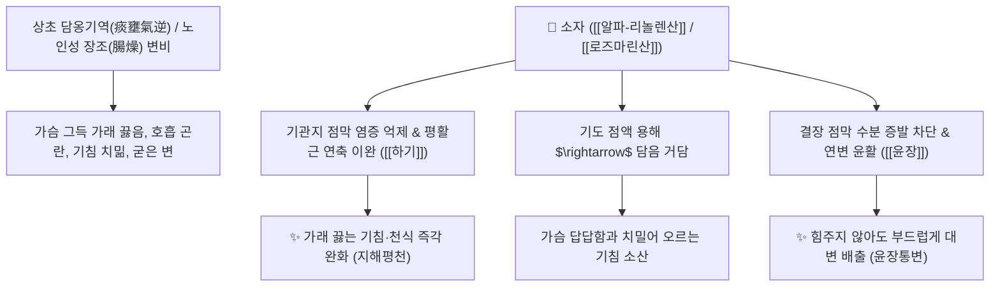

# 🌿 [[소자]] (紫蘇子 / 蘇子, Perillae Fructus / 차즈기씨)

> **핵심 요약 (Key Summary)**:
> 꿀풀과(*Lamiaceae*) 차즈기(*Perilla frutescens* var. *acuta*) 또는 들깨의 성숙한 씨앗(종자)
> 오메가-3 불포화지방산인 [[알파-리놀렌산]](α-Linolenic acid)과 폴리페놀 [[로즈마린산]](Rosmarinic acid)이 장관을 윤활하고 기관지 염증성 가래를 삭여 강기평천 및 윤장통변 작용 발휘
> 담옹기역(痰壅氣逆)으로 인한 가래 끓는 만성 기침·천식 및 노인·산후 진액 고갈로 인한 장조(腸燥) 변비를 치료하는 대표적인 [[강기화담]](降氣化痰)·[[지해평천]](止咳平喘)·[[윤장통변]](潤腸通便) 약재

---
## 📌 목차
1. [기본 본초 정보 & 화학 구조 (Pharmacognosy)](#1-기본-본초-정보--화학-구조-pharmacognosy)
2. [핵심 분자약리 기전 & 알파-리놀렌산·강기평천 네트워크](#2-핵심-분자약리-기전--알파-리놀렌산강기평천-네트워크)
3. [해부생체역학 / 기관지 점막 섬모 & 결장 연동운동 연계](#3-해부생체역학--기관지-점막-섬모--결장-연동운동-연계)
4. [사상의학 및 임상 응용 (자소자 vs 자소엽 감별)](#4-사상의학-및-임상-응용-자소자-vs-자소엽-감별)
5. [고전 의학 및 배오 원리 (삼자양친탕 배오)](#5-고전-의학-및-배오-원리-삼자양친탕-배오)
6. [핵심 처방 비교 매트릭스](#6-핵심-처방-비교-매트릭스)
7. [출처 및 학술 참고 문헌 (References)](#7-출처-및-학술-참고-문헌-references)

---
## 1. 기본 본초 정보 & 화학 구조 (Pharmacognosy)

| 항목 | 상세 내용 |
| :--- | :--- |
| **기원 식물** | 꿀풀과(Lamiaceae / Labiatae) 차즈기 *Perilla frutescens* (L.) Britton var. *acuta* Kudo 또는 들깨의 잘 익은 씨앗 |
| **성미 (性味)** | 辛, 溫 |
| **귀경 (歸經)** | 肺·大腸經 (폐경, 대장경) - **상초 폐의 담을 내리고 하초 대장을 윤활** |
| **효능 (Actions)** | [[강기화담]](降氣化痰), [[지해평천]](止咳平喘), [[윤장통변]](潤腸通便) |
| **주요 성분** | • **오메가-3 지방유(40~50%)**: [[알파-리놀렌산]] ($\alpha$-Linolenic acid, 50~60%), 리놀레산, 올레산<br>• **페놀산 지표물질**: [[로즈마린산]] (Rosmarinic acid, KP 규격 $\ge 0.25\%$), 카페인산<br>• **플라보노이드**: 루테올린, 아피게닌 |

> **[유래 및 본초학적 기전]**:
> * 사람을 되살리는(蘇) 씨앗(子)으로, 가래가 꽉 차 숨이 넘어갈 듯 헐떡거리거나 대변이 막혀 복통이 심할 때 대소변과 기운을 시원하게 소통시켜 살려냅니다.
> * 씨앗 속의 풍부한 지방유가 메마른 대장을 촉촉하게 적셔 배변을 유도하고, 맵고 따뜻한 성질이 폐에 뭉친 끈적한 가래를 녹여 아래로 내립니다.

### 🔬 소자의 주요 지표물질 화학 구조
```
     [ 카페오일기 ]───O──[ 3-(3,4-디하이드록시페닐)락트산 ]  <-- 로즈마린산 (Rosmarinic acid)
```
> **[구조적 특징 및 이중 작용]**: [[로즈마린산]]은 기도 염증 매개인자를 차단하고, 불포화지방산 사슬은 장관 내벽에 유성 윤활 피막을 형성하여 완화한 배변을 유도합니다.

---
## 2. 핵심 분자약리 기전 & 알파-리놀렌산·강기평천 네트워크



### (1) 표적 하기화담 및 윤장 작용
* **담음 기역 억제 및 평천 ([[강기화담]] 降氣化痰)**:
  * 가슴에 가래가 가득 차서 누우면 숨이 차고 쌕쌕거리는 노인성 만성 천식과 기관지염을 치료합니다.
* **노인·산후 장조 변비 통변 ([[윤장통변]] 潤腸通便)**:
  * 장관을 자극하지 않고 기름기로 부드럽게 밀어내어 기운이 약한 노인과 산모의 굳은 변비를 해결합니다.

---
## 3. 해부생체역학 / 기관지 점막 섬모 & 결장 연동운동 연계

* **기관지 섬모 청식능(Mucociliary Clearance) 강화**:
  * 심부 기도에 유착된 점액전을 분리 배출시킵니다.

---
## 4. 사상의학 및 임상 응용 (자소자 vs 자소엽 감별)

```
[🔍 차즈기 부위별 효능 감별]
• [[소엽]](잎): 가볍고 발산 $\rightarrow$ 발한해표(發汗解表)·행기안태(行氣安胎) (감기/체기)
• [[소자]](씨): 무겁고 하강 $\rightarrow$ 강기화담(降氣化痰)·윤장통변(潤腸通便) (천식/변비)

[✅ 최적 적응증 (Sweet Spot)]
• 노인성 천식: 가래가 끓어 숨이 가쁘고 대변까지 굳어 배가 답답한 복합 증상 ([[소자강기탕]])
• 식적 담음: 음식을 먹고 체해 가슴이 답답하고 기침이 터질 때 ([[삼자양친탕]])
```

---
## 5. 고전 의학 및 배오 원리 (삼자양친탕 배오)

### (1) 노인 담음 천식의 최고 명방: 삼자양친탕(三子養親湯)
* **3대 씨앗 약재 배오**:
  * [[소자]] $\rightarrow$ **기운을 아래로 내리고 가래를 삭임** (降氣化痰)
  * [[백개자]] $\rightarrow$ **가죽과 살 사이의 깊은 담을 뚫음** (溫肺利氣)
  * [[나복자]] $\rightarrow$ **음식 식적을 소화시키고 체기를 뚫음** (消食化積)
* **시너지**: 부모님(老親)을 봉양하는 3가지 씨앗으로 노인성 해수와 소화불량을 동시 치료.

---
## 6. 핵심 처방 비교 매트릭스

| 처방명 | 구성 약재 | 주치 병증 및 임상 타깃 | 특징 및 감별점 |
| :--- | :--- | :--- | :--- |
| [[삼자양친탕]] | [[소자]], [[백개자]], [[나복자]] (갈아서 살짝 달임) | **노인 담옹기역, 식체, 기침, 천식, 가슴 답답함** | 3가지 씨앗의 소화·평천 명방 |
| [[소자강기탕]] | [[소자]], [[반하]], [[후박]], [[전호]], [[육계]], [[당귀]], [[감초]] | **상성하허(上盛下虛), 담연옹성, 천해단기, 요슬냉통** | 위로는 담을 내리고 아래는 덥힘 |
| [[정천탕]](가미) | [[마황]], [[상백피]], [[소자]], [[은행]], [[행인]] | 담열 효천, 급성 기관지 천식 발작, 천명음 | 담열을 끄고 숨찬 증상 제어 |

---
## 7. 출처 및 학술 참고 문헌 (References)

1. **Sanbongi, C., et al. (2004)**. Rosmarinic acid in *Perilla frutescens* extract inhibits allergic airway inflammation in mice. *European Journal of Pharmacology*, 485(1-3), 255-262.
   - **[연구 요약]**: 소자의 로즈마린산이 알레르기성 기도 염증 및 점액 과분비를 억제하여 천식을 개선함을 입증.
2. **대한민국약전(KP) 제12개정 (2022)**. 의약품각조 제2부: 소자 (Perillae Fructus) 규격 기준.
   - **[공정서 규격]**: 건조물 기준 로즈마린산($\text{C}_{18}\text{H}_{16}\text{O}_8$) 0.25% 이상 함유 필수 규격 명시.
