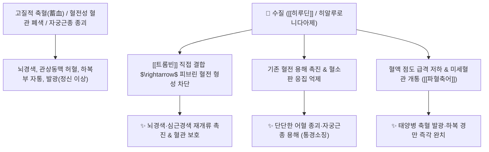

# 🌿 [[수질]] (水蛭, Hirudo / 거머리)

> **핵심 요약 (Key Summary)**:
> 거머리과(*Hirudinidae*) 참거머리(*Hirudo nipponia*) 또는 말거머리의 전체를 말린 것
> 천연 트롬빈 직접 억제 펩타이드인 [[히루딘]](Hirudin)이 피브린 응집을 완벽히 차단하여 강력한 혈전 용해 및 미세순환 개통 작용 발휘
> [[상한론]] 태양병 축혈증(蓄血證)·하복 경만(硬滿)·발광(發狂) 및 뇌경색·심혈관 혈전증·자궁근종(징가)·무월경을 치료하는 대표적인 [[파혈축어]](破血逐瘀)·[[통경소징]](通經消癥) 군약(君藥)

---
## 📌 목차
1. [기본 본초 정보 & 화학 구조 (Pharmacognosy)](#1-기본-본초-정보--화학-구조-pharmacognosy)
2. [핵심 분자약리 기전 & 히루딘·트롬빈 억제 혈전용해 네트워크](#2-핵심-분자약리-기전--히루딘트롬빈-억제-혈전용해-네트워크)
3. [해부생체역학 / 혈관 내피 미세순환 & 뇌혈관 관류 연계](#3-해부생체역학--혈관-내피-미세순환--뇌혈관-관류-연계)
4. [사상의학 및 임상 응용 (축혈증 vs 출혈 부작용)](#4-사상의학-및-임상-응용-축혈증-vs-출혈-부작용)
5. [상한론 『약징(藥徵)』 분석 및 배오 원리 (저당탕 배오)](#5-상한론-약징藥徵-분석-및-배오-원리-저당탕-배오)
6. [핵심 처방 비교 매트릭스](#6-핵심-처방-비교-매트릭스)
7. [출처 및 학술 참고 문헌 (References)](#7-출처-및-학술-참고-문헌-references)

---
## 1. 기본 본초 정보 & 화학 구조 (Pharmacognosy)

| 항목 | 상세 내용 |
| :--- | :--- |
| **기원 동물** | 거머리과(Hirudinidae) 참거머리 *Hirudo nipponia* Whitman 또는 말거머리의 몸체 전체 |
| **성미 (性味)** | 鹹·苦, 平, 有小毒 |
| **귀경 (歸經)** | 肝經 (간경) - **혈분(血分) 깊숙한 고질적 어혈을 뚫음** |
| **효능 (Actions)** | [[파혈축어]](破血逐瘀), [[통경소징]](通經消癥), [[통락지통]](通絡止痛), [[용전지혈]](溶栓止血) |
| **주요 성분** | • **폴리펩타이드 지표물질**: [[히루딘]] (Hirudin, 65개 아미노산으로 구성된 천연 항응고 펩타이드)<br>• **단백질 분해 효소**: 히알루로니다아제, 콜라게나아제, 헤파린 유사 펩타이드<br>• **미네랄 및 아미노산**: 다량의 필수 아미노산, 유기염 |

> **[유래 및 본초학적 기전]**:
> * 피를 빨아먹는 거머리(水蛭)로, 인체 내에 단단하게 응고된 피떡(혈전 핏덩어리)을 녹여 없애는 천하제일의 파혈(破血) 동물성 본초입니다.
> * 아랫배에 손으로 만져질 정도로 단단하게 뭉친 어혈 종괴(징가 癥瘕)와 뇌혈관·심장혈관에 낀 혈전을 신속히 용해시켜 막힌 경락을 뚫어줍니다.

### 🔬 히루딘의 트롬빈 복합체 결합 구조
```
     [ 히루딘 N-말단 ] ─── ( 트롬빈 활성 부위 Active site 차단 )
            │
     [ 히루딘 C-말단 ] ─── ( 트롬빈 피브리노겐 인식 엑소사이트 결합 )
```
> **[구조적 특징 및 항응고 메커니즘]**: [[히루딘]]은 항트롬빈-III와 같은 보조 인자 없이도 [[트롬빈]](Thrombin)에 $1:1$로 직접 결합하여 피브리노겐이 피브린 그물망(혈전)으로 전환되는 경로를 완벽히 차단합니다.

---
## 2. 핵심 분자약리 기전 & 히루딘·트롬빈 억제 혈전용해 네트워크



### (1) 표적 파혈축어 및 혈전 용해
* **강력한 천연 항혈전 및 혈전 용해**:
  * 아스피린이나 와파린보다 신속하고 강력하게 혈전을 용해하여 뇌혈전증, 심근경색, 심부정맥혈전증을 예방하고 치료합니다.
* **아랫배 고질적 어혈 덩어리 분쇄 ([[통경소징]] 通經消癥)**:
  * 골반강 내에 유착된 자궁내막증, 난소 낭종, 자궁근종의 크기를 줄이고 극심한 생리통을 없앱니다.
* **혈액 점도 개선 및 미세순환 촉진**:
  * 미세 모세혈관의 혈류 정체를 해소하여 당뇨병성 말초혈관병증을 개선합니다.

---
## 3. 해부생체역학 / 혈관 내피 미세순환 & 뇌혈관 관류 연계

* **뇌 미세혈관상(Microvascular Bed) 관류압 복원**:
  * 뇌혈관 허혈 부위의 혈류량을 즉각 증가시켜 신경세포 괴사를 최소화합니다.

---
## 4. 사상의학 및 임상 응용 (축혈증 vs 출혈 부작용)

```
[✅ 최적 적응증 (Sweet Spot)]
• 상한 태양병 축혈증: 아랫배가 단단하게 뭉쳐 만지지도 못하게 아프고, 피를 보지 못해 헛소리를 하거나 미친 듯이 날뛰는(발광 發狂) 응급 상태 ([[저당탕]])
• 심뇌혈관 질환: 뇌경색 후유증으로 반신불수, 언어장애, 손발 마비가 온 경우
• 자궁근종 및 만성 골반강 어혈 종괴

[⚠️ 출혈 경향 및 금기 수칙 (Safety)]
• 강력한 항응고 본초이므로 임산부 및 출혈성 질환자(혈우병, 소화성 궤양) 절대 복용 금기
• 항응고제(와파린, NOAC), 항혈소판제(아스피린) 복용 환자는 병용 시 출혈 위험 모니터링
```

---
## 5. 상한론 『약징(藥徵)』 분석 및 배오 원리 (저당탕 배오)

### (1) 축혈증을 깨부수는 천하제일의 짝: 맹충(虻蟲) 배오
* **핵심 배오**:
  * [[수질]] + [[맹충]] + [[도인]] + [[대황]] $\rightarrow$ 상한론에서 가장 강력한 어혈 파쇄 구급방 ([[저당탕]], [[저당환]])

---
## 6. 핵심 처방 비교 매트릭스

| 처방명 | 구성 약재 | 주치 병증 및 임상 타깃 | 특징 및 감별점 |
| :--- | :--- | :--- | :--- |
| [[저당탕]] | [[수질]], [[맹충]], [[도인]], [[대황]] (탕제) | **태양병 축혈증, 소복경만, 발광, 대변 흑색, 소변자리** | 파혈축어의 최고 구급방 |
| [[저당환]] | [[저당탕]] 구성 약재를 꿀로 환을 지음 | **축혈증이 완만하여 서서히 어혈을 삭여야 할 때** | 완만하게 어혈 종괴를 녹임 |
| [[수질산]] | [[수질]](불에 볶음), [[당귀]], [[몰약]] | **외상 타박으로 뱃속에 죽은 피가 가득 차 숨이 찰 때** | 어혈을 소변으로 몰아냄 |

---
## 7. 출처 및 학술 참고 문헌 (References)

1. **Markwardt F et al. (2002)**. Hirudin as alternative anticoagulant--a historical review. *Seminars in thrombosis and hemostasis*, 28(5): 405-14. [PMID: 12420235](https://pubmed.ncbi.nlm.nih.gov/12420235/)
   - **[연구 요약]**: 수질의 히루딘이 트롬빈의 직접적이고 가역적인 특이적 억제제로서 혈전증 치료에 미치는 분자 기전을 총괄 규명.
2. **대한민국약전(KP) 제12개정 (2022)**. 의약품각조 제2부: 수질 (Hirudo) 규격 기준.
   - **[공정서 규격]**: 참거머리 건조체의 성상, 순도시험 및 항트롬빈 활성 역가 기준 명시.
