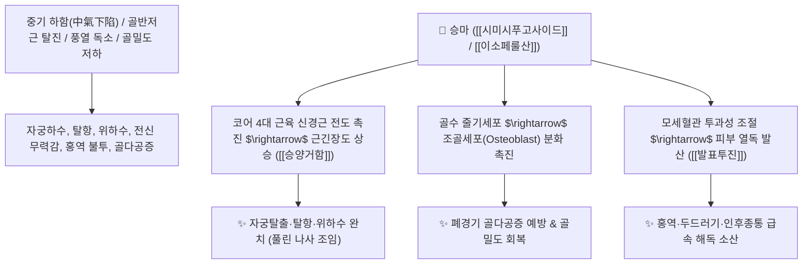

# 🌿 [[승마]] (升麻, Cimicifugae Rhizoma)

> **핵심 요약 (Key Summary)**:
> 미나리아재비과(*Ranunculaceae*) 황새승마(*Cimicifuga heracleifolia*) 또는 눈빛승마의 뿌리줄기(근경)
> 시클로아르탄계 트리테르펜 사포닌인 [[시미시푸고사이드]](Cimicifugoside)와 [[이소페룰산]](Isoferulic acid)이 코어 근육 긴장도를 회복시키고 에스트로겐 수용체를 조절하여 승양거함 및 해독 발진 작용 발휘
> 중기하함(中氣下陷)으로 인한 자궁하수·위하수·탈항(코어근육 무력증) 및 외감 풍열 두통·인후종통·홍역 발진·폐경 후 골다공증을 치료하는 대표적인 [[승양거함]](升陽擧陷)·[[발표투진]](發表透疹)·[[청열해독]](淸熱解毒) 군약(君藥)

---
## 📌 목차
1. [기본 본초 정보 & 화학 구조 (Pharmacognosy)](#1-기본-본초-정보--화학-구조-pharmacognosy)
2. [핵심 분자약리 기전 & 시미시푸고사이드·코어근육 수축 네트워크](#2-핵심-분자약리-기전--시미시푸고사이드코어근육-수축-네트워크)
3. [해부생체역학 / 코어 실린더 4대 근육 & 골밀도 분화 연계](#3-해부생체역학--코어-실린더-4대-근육--골밀도-분화-연계)
4. [사상의학 및 임상 응용 (승마 벡터 vs 과량 시 부작용 관리)](#4-사상의학-및-임상-응용-승마-벡터-vs-과량-시-부작용-관리)
5. [고전 의학 및 배오 원리 (보중익기탕 & 승마갈근탕)](#5-고전-의학-및-배오-원리-보중익기탕--승마갈근탕)
6. [핵심 처방 비교 매트릭스](#6-핵심-처방-비교-매트릭스)
7. [출처 및 학술 참고 문헌 (References)](#7-출처-및-학술-참고-문헌-references)

---
## 1. 기본 본초 정보 & 화학 구조 (Pharmacognosy)

| 항목 | 상세 내용 |
| :--- | :--- |
| **기원 식물** | 미나리아재비과(Ranunculaceae) 황새승마 *Cimicifuga heracleifolia* Kom. 또는 눈빛승마, 승마의 뿌리줄기 |
| **성미 (性味)** | 辛·微苦, 微寒 |
| **귀경 (歸經)** | 肺·脾·胃·大腸經 (폐경, 비경, 위경, 대장경) - **상향(升) 벡터를 형성** |
| **효능 (Actions)** | [[승양거함]](升陽擧陷), [[발표투진]](發表透疹), [[청열해독]](淸熱解毒), [[승제중기]](升提中氣) |
| **주요 성분** | • **트리테르펜 사포닌**: [[시미시푸고사이드]] (Cimicifugoside), 아세테인(Acctein), 27-데옥시아세테인<br>• **페놀산 지표물질**: [[이소페룰산]] (Isoferulic acid, KP 규격 $\ge 0.10\%$), 페룰산, 카페인산<br>• **크로몬 및 플라보노이드**: 시미시푸긴(Cimifugin) |

> **[유래 및 본초학적 기전]**:
> * 잎은 삼(麻)을 닮았고 성질이 맑은 양기를 위로 끌어올려준다(升) 하여 '승마(升麻)'라 불렸습니다.
> * 기운이 아래로 처져 발생하는 탈항, 자궁하수, 만성 피로에서 풀린 나사를 조이듯 코어 근육을 들어 올리고(升陽擧陷), 체표의 풍열 독소를 밖으로 뿜어내어 피부 발진을 다스립니다.

### 🔬 승마의 주요 트리테르펜 사포닌 구조
```
     [ 시클로아르탄 뼈대 ]───( C-16/C-23 위치 락톤 고리 )  <-- Cimicifugoside
```
> **[구조적 특징 및 활성]**: [[시미시푸고사이드]]는 에스트로겐 수용체($\text{ER}\beta$)에 선택적으로 작용하여 조골세포 분화를 촉진하고, 신경근 접합부의 아세틸콜린 감수성을 조절하여 골격근 긴장도를 유지합니다.

---
## 2. 핵심 분자약리 기전 & 시미시푸고사이드·코어근육 수축 네트워크



### (1) 표적 승양거함 및 코어근육 긴장 복원
![[Pasted image 20241112093833-1.jpg|450]]
* **코어 4대 근육 수축 촉진 ([[승양거함]] 升陽擧陷)**:
  * [[황격막]], [[복횡근]], [[골반저근]], [[다열근]]이 늘어지고 탈진하여 발생하는 자궁하수, 탈항, 방광 탈출증, 만성 피로 무력감을 강력하게 위로 들어 올립니다.
* **발표투진 및 청열해독 ([[발표투진]] 發表透疹)**:
  * 소아 홍역이나 바이러스 발진이 밖으로 돋아나지 못해 속으로 번열이 심할 때 피부 밖으로 시원하게 뿜어내어 해독합니다.
* **폐경기 골다공증 예방**:
  * 조골세포 증식을 촉진하여 뼈의 재흡수를 막고 골밀도를 높여줍니다.

---
## 3. 해부생체역학 / 코어 실린더 4대 근육 & 골밀도 분화 연계

* **골반저근 복합체(Pelvic Floor Muscle) 긴장도 개선**:
  * 항문거근 및 요도괄약근의 신경근 반응을 정상화하여 요실금과 탈항을 예방합니다.

---
## 4. 사상의학 및 임상 응용 (승마 벡터 vs 과량 시 부작용 관리)

```
[✅ 최적 적응증 (Sweet Spot)]
• 코어 탈진 환자: 몸이 천근만근 무겁고 축축 처지며, 밑이 빠질 것 같은 자궁하수/탈항 환자 ([[보중익기탕]])
• 소아 외감 및 피부 발진: 열이 나고 목이 붓고 피부에 두드러기나 홍역이 돋을 때 ([[승마갈근탕]])
• 양명열 두통 및 치통: 윗니와 뺨이 붓고 아픈 위열(胃熱) 통증

[⚠️ 부작용 관리 및 금기 수칙 (Safety / Toxicity)]
• 과량 복용 시 두통, 어지럼증, 사지 근육 경련, 구토, 음경 이상 발기 발생 가능 (1일 1.5~6g, 최대 10g 이하 사용)
• 음허화왕(陰虛火旺)으로 상초에 열이 뜨고 가슴이 답답하며 마른 기침을 하는 환자 복용 금기
```

---
## 5. 고전 의학 및 배오 원리 (보중익기탕 & 승마갈근탕)

### (1) 양기를 끌어올리는 천하 명방 배오
* **승양 3대 명약 벡터**:
  * [[황기]] + [[시호]] + [[승마]] $\rightarrow$ 처진 장기와 비위의 맑은 양기를 완벽히 들어 올림 ([[보중익기탕]])
  * [[승마]] + [[갈근]] $\rightarrow$ 피부 표면의 풍열을 발산시키고 진통 해열 ([[승마갈근탕]])

---
## 6. 핵심 처방 비교 매트릭스

| 처방명 | 구성 약재 | 주치 병증 및 임상 타깃 | 특징 및 감별점 |
| :--- | :--- | :--- | :--- |
| [[보중익기탕]] | [[황기]], [[인삼]], [[백출]], [[당귀]], [[진피]], [[승마]], [[시호]], [[감초]] | **비위기허, 중기하함, 자궁하수, 탈항, 만성 피로** | 기운을 올리는 승양거함의 대표방 |
| [[승마갈근탕]] | [[승마]], [[갈근]], [[작약]], [[감초]] | **풍열 표증, 홍역 초기, 발열, 오풍, 두통, 인후통** | 소아 발진 및 해열 소염방 |
| [[열다한소탕]] | [[태음인]] 처방 ([[갈근]], [[황금]], [[고본]], [[승마]] 등) | [[태음인]] **간열조열, 안면 홍조, 두통, 갈증, 변비** | 청간사화하여 열을 흩트림 |
| [[시갈해기탕]] | [[시호]], [[갈근]], [[황금]], [[강활]], [[백지]], [[승마]] | **삼양합병, 고열, 오한, 두통, 지절통, 눈 통증** | 겉과 속의 풍열을 소산 |

---
## 7. 출처 및 학술 참고 문헌 (References)

1. **Seidlova-Wuttke D et al. (2012)**. Osteoprotective effects of Cimicifuga racemosa and its triterpene-saponins are responsible for reduction of bone marrow fat. *Phytomedicine : international journal of phytotherapy and phytopharmacology*, 19(10): 855-60. [PMID: 22739411](https://pubmed.ncbi.nlm.nih.gov/22739411/)
   - **[연구 요약]**: 승마 추출물이 골수 유래 중간엽 줄기세포의 조골세포 분화를 촉진하여 골다공증을 예방함을 규명.
2. **대한민국약전(KP) 제12개정 (2022)**. 의약품각조 제2부: 승마 (Cimicifugae Rhizoma) 규격 기준.
   - **[공정서 규격]**: 건조물 기준 이소페룰산($\text{C}_{10}\text{H}_{10}\text{O}_4$) 0.10% 이상 함유 필수 규격 명시.
