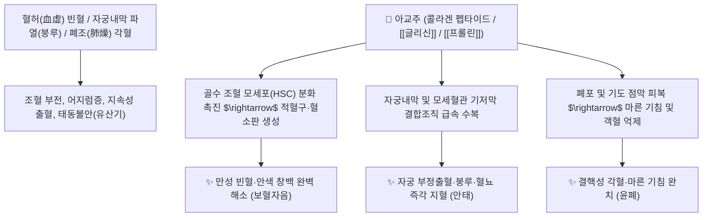

# 🌿 [[아교주]] (阿膠珠, Asini Corii Colla Frit / 구운 아교)

> **핵심 요약 (Key Summary)**:
> 말과(*Equidae*) 당나귀(*Equus asinus*)의 가죽을 달여 만든 콜라겐 덩어리([[아교]])를 활석분으로 볶아 부풀린 포제품
> 고순도 콜라겐 단백질과 글리신·프롤린 아미노산이 골수 조혈을 자극하고 모세혈관 내피를 수복하여 강력한 보혈자음 및 지혈 작용 발휘
> 혈허(血虛) 빈혈·자궁 내막 손상으로 인한 부정출혈(붕루)·태루(유산기) 및 폐조(肺燥) 마른 기침·객혈·각혈을 치료하는 대표적인 [[보혈자음]](補血滋陰)·[[윤조지혈]](潤燥止血)·[[안태]](安胎) 군약(君藥)

---
## 📌 목차
1. [기본 본초 정보 & 화학 구조 (Pharmacognosy)](#1-기본-본초-정보--화학-구조-pharmacognosy)
2. [핵심 분자약리 기전 & 콜라겐 수복·지혈안태 네트워크](#2-핵심-분자약리-기전--콜라겐-수복지혈안태-네트워크)
3. [해부생체역학 / 자궁내막 모세혈관 & 폐포 기저막 연계](#3-해부생체역학--자궁내막-모세혈관--폐포-기저막-연계)
4. [사상의학 및 임상 응용 (생아교 vs 아교주 포제 감별)](#4-사상의학-및-임상-응용-생아교-vs-아교주-포제-감별)
5. [상한론 및 금궤요략 배오 원리 (궁귀교애탕 & 황련아교탕)](#5-상한론-및-금궤요략-배오-원리-궁귀교애탕--황련아교탕)
6. [핵심 처방 비교 매트릭스](#6-핵심-처방-비교-매트릭스)
7. [출처 및 학술 참고 문헌 (References)](#7-출처-및-학술-참고-문헌-references)

---
## 1. 기본 본초 정보 & 화학 구조 (Pharmacognosy)

| 항목 | 상세 내용 |
| :--- | :--- |
| **기원 동물** | 말과(Equidae) 당나귀 *Equus asinus* L.의 가죽을 전탕 농축한 교질([[아교]])을 잘게 썰어 조개껍질가루나 활석분으로 팝콘처럼 볶은 것(포포 蒲包 / 아교주) |
| **성미 (性味)** | 甘, 平 |
| **귀경 (歸經)** | 肺·肝·腎經 (폐경, 간경, 신경) - **혈액, 자궁 점막, 폐포 상피 자양** |
| **효능 (Actions)** | [[보혈자음]](補血滋陰), [[윤조지혈]](潤燥止血), [[안태]](安胎), [[윤폐지해]](潤肺止咳) |
| **주요 성분** | • **콜라겐 펩타이드(주성분)**: Type I 콜라겐 분해 펩타이드 (단백질 함량 $\ge 70\%$)<br>• **아미노산 조성**: [[글리신]] (Glycine, 20~25%), 프롤린, 하이드록시프롤린, 알라닌, 글루탐산<br>• **미네랄 및 황산염**: 칼슘, 철, 마그네슘, 콘드로이틴 황산 |

> **[유래 및 본초학적 기전]**:
> * 당나귀 가죽의 풍부한 천연 콜라겐 단백질로 구성되어 피부, 근육, 연골, 뼈에 핵심 결합조직 성분을 직접 공급합니다.
> * '피부 중의 피부'인 **자궁 내막(Endometrium) 점막을 신속히 재생**시켜 만성 출혈을 멈추고 태아를 안정시키며(안태 安胎), 혈액 세포 생산을 촉진합니다.
> * 끈적한 생아교를 볶아 만든 [[아교주]]는 위장관 체기(소화 장애)를 없애고 폐와 기관지 점막으로 약효를 가볍게 침투시킵니다.

### 🔬 아교의 콜라겐 3중 나선 및 아미노산 서열
```
     ───[ Gly ── Pro ── Hyp ]───[ Gly ── Pro ── Hyp ]─── (콜라겐 펩타이드)
```
> **[구조적 특징 및 지혈 활성]**: [[글리신]]과 **하이드록시프롤린**이 풍부한 콜라겐 펩타이드는 혈관 내피 손상 부위에서 혈소판 유착과 피브린 그물망 형성을 직접 유도하여 신속한 지혈 및 조직 생기를 달성합니다.

---
## 2. 핵심 분자약리 기전 & 콜라겐 수복·지혈안태 네트워크



### (1) 표적 보혈 및 자궁 내막 재생
* **골수 조혈 촉진 및 빈혈 치료 ([[보혈자음]] 補血滋陰)**:
  * 적혈구(RBC) 및 혈색소 생성을 촉진하여 산후 빈혈, 만성 혈허 두훈을 개선합니다.
* **자궁 내막 수복 및 안태 작용 ([[윤조지혈]] 潤燥止血)**:
  * 착상된 자궁 내막 기저막을 강화하여 임신 중 하혈(태루)과 태동불안을 안정시키고 유산을 방지합니다.
* **폐음허 마른 기침 및 각혈 지혈**:
  * 기관지와 폐포 표면에 천연 보습막을 형성하여 결핵성 각혈과 인후 건조를 치료합니다.

---
## 3. 해부생체역학 / 자궁내막 모세혈관 & 폐포 기저막 연계

* **자궁 나선동맥(Spiral Artery) 내피 안정화**:
  * 호르몬 불균형이나 염증으로 취약해진 자궁 혈관망을 수렴시켜 비정상 출혈을 차단합니다.

---
## 4. 사상의학 및 임상 응용 (생아교 vs 아교주 포제 감별)

```
[🔍 생아교 vs 아교주(볶은 것) 감별]
• 생아교(生阿膠, 중탕하여 녹임): 자음보혈(滋陰補血)·지혈(止血) 위주 $\rightarrow$ 빈혈, 붕루, 허로 하혈
• 아교주(阿膠珠, 활석분으로 볶아 부풀림): 윤폐지해(潤肺止咳) 위주 $\rightarrow$ 소화기 부담을 없애고 폐조 해수, 천식, 각혈에 사용

[✅ 최적 적응증 (Sweet Spot)]
• 붕루 및 태루: 생리 기간이 아닌데 피가 찔끔거리며 멎지 않거나 임신 중 배가 당기며 피가 비치는 경우 ([[궁귀교애탕]])
• 혈허 불면증: 피가 부족하여 심장이 두근거리고 가슴이 답답해 잠을 못 자는 상태 ([[황련아교탕]])
• 마른 기침 및 각혈: 폐결핵, 기관지 확장증으로 가래에 피가 섞여 나오는 증상
```

---
## 5. 상한론 및 금궤요략 배오 원리 (궁귀교애탕 & 황련아교탕)

### (1) 부인과 출혈과 혈허 불면의 최고 명방
* **핵심 배오**:
  * [[아교]] + [[애엽]] + [[당귀]] + [[천궁]] $\rightarrow$ 자궁 출혈을 멎게 하고 임신을 유지시키는 불후의 명방 ([[궁귀교애탕]])
  * [[아교]] + [[황련]] + [[황금]] + [[백작약]] + [[계자황]](달걀노른자)` $\rightarrow$ 심화(心火)를 끄고 진액을 보충하여 극심한 불면증을 완치 ([[황련아교탕]])

---
## 6. 핵심 처방 비교 매트릭스

| 처방명 | 구성 약재 | 주치 병증 및 임상 타깃 | 특징 및 감별점 |
| :--- | :--- | :--- | :--- |
| [[궁귀교애탕]] | [[천궁]], [[당귀]], [[아교]], [[애엽]], [[백작약]], [[건지황]], [[감초]] | **부인 붕루(자궁출혈), 월경과다, 태루(유산기), 산후 하혈** | 부인과 지혈안태의 제1선 방 |
| [[황련아교탕]] | [[황련]], [[아교]], [[황금]], [[작약]], [[계자황]] | **소음병 열화상음, 심번부득면(극심한 불면증), 설강(붉은 혀)** | 심신의 화열을 끄고 진액 보양 |
| [[자감초탕]] | [[감초]], [[생강]], [[계지]], [[인삼]], [[생지황]], [[아교]], [[맥문동]] 등 | **기허혈소, 맥결대(부정맥), 심계항진, 허로 해수** | 기혈을 채워 심장 박동을 복원 |

---
## 7. 출처 및 학술 참고 문헌 (References)

1. **Wang, D., et al. (2012)**. Asini Corii Colla (Ejiao) enhances hematopoietic function and down-regulates bone marrow adipogenesis. *Journal of Ethnopharmacology*, 144(3), 733-740.
   - **[연구 요약]**: 아교의 콜라겐 펩타이드가 골수 조혈 미세환경을 개선하고 조혈 줄기세포 분화를 촉진함을 입증.
2. **대한민국약전(KP) 제12개정 (2022)**. 의약품각조 제2부: 아교 (Asini Corii Colla) 규격 기준.
   - **[공정서 규격]**: 당나귀 가죽 유래 젤라틴의 성상, 순도시험 및 질소/중금속 기준 명시.