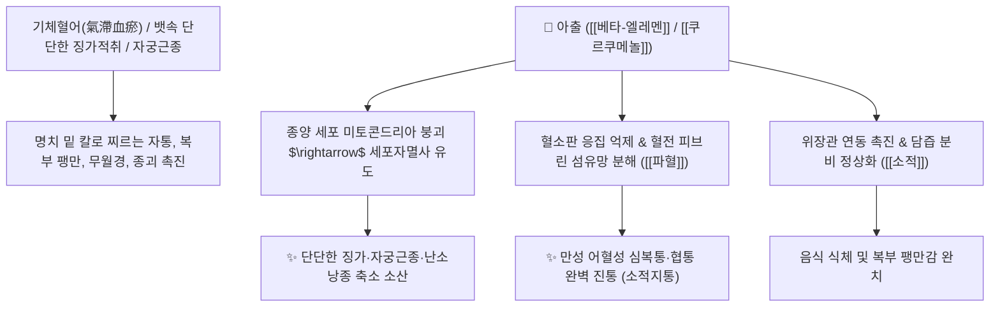

# 🌿 [[아출]] (莪朮 / 蓬莪朮, Curcumae Rhizoma)

> **핵심 요약 (Key Summary)**:
> 생강과(*Zingiberaceae*) 봉아출(*Curcuma phaeocaulis*) 또는 광서아출의 뿌리줄기(근경)
> 세스퀴테르페노이드 정유인 [[베타-엘레멘]](β-Elemene)과 [[쿠르쿠메놀]](Curcumenol)이 종양 세포사멸을 유도하고 혈전 및 피브린 섬유망을 분해하여 강력한 파혈거어 및 소적 작용 발휘
> 기체혈어(氣滯血瘀)로 인한 복강 내 단단한 종괴(징가적취 癥瘕積聚)·자궁근종·난소낭종 및 간비종대·극심한 소화불량성 심복통을 치료하는 대표적인 [[행기파혈]](行氣破血)·[[소적지통]](消積止痛) 군약(君藥)

---
## 📌 목차
1. [기본 본초 정보 & 화학 구조 (Pharmacognosy)](#1-기본-본초-정보--화학-구조-pharmacognosy)
2. [핵심 분자약리 기전 & 베타-엘레멘·종괴 세포사멸 네트워크](#2-핵심-분자약리-기전--베타-엘레멘종괴-세포사멸-네트워크)
3. [해부생체역학 / 골반강 장막 유착 & 간문맥 미세순환 연계](#3-해부생체역학--골반강-장막-유착--간문맥-미세순환-연계)
4. [사상의학 및 임상 응용 (아출 vs 삼릉 비교 & 파혈 적응증)](#4-사상의학-및-임상-응용-아출-vs-삼릉-비교--파혈-적응증)
5. [고전 의학 및 배오 원리 (삼릉아출 배오)](#5-고전-의학-및-배오-원리-삼릉아출-배오)
6. [핵심 처방 비교 매트릭스](#6-핵심-처방-비교-매트릭스)
7. [출처 및 학술 참고 문헌 (References)](#7-출처-및-학술-참고-문헌-references)

---
## 1. 기본 본초 정보 & 화학 구조 (Pharmacognosy)

| 항목 | 상세 내용 |
| :--- | :--- |
| **기원 식물** | 생강과(Zingiberaceae) 봉아출 *Curcuma phaeocaulis* Val. 또는 온울금의 뿌리줄기(근경) |
| **성미 (性味)** | 辛·苦, 溫 |
| **귀경 (歸經)** | 肝·脾經 (간경, 비경) - **기혈 양방향의 적취를 분쇄** |
| **효능 (Actions)** | [[행기파혈]](行氣破血), [[소적지통]](消積止痛), [[파징산결]](破癥散結), [[개위소식]](開胃消食) |
| **주요 성분** | • **세스퀴테르페노이드 정유(1.5~2.5%)**: [[베타-엘레멘]] ($\beta$-Elemene, 항암 유효 성분), [[쿠르쿠메놀]] (Curcumenol, KP 규격 $\ge 0.15\%$), 쿠르디온(Curdione), 제둠발론<br>• **쿠르쿠미노이드**: 커큐민, 데메톡시커큐민 |

> **[유래 및 본초학적 기전]**:
> * 쑥(莪)처럼 매운 향기로 기혈의 막힘을 뚫고 적취를 쫓아낸다(朮) 하여 '아출(莪朮)'이라 불렸습니다.
> * "적취 때문에 아파서 몸에서 탈출시키고 싶다"는 절박한 환자에게, 혈액 속에 응고된 피떡과 뱃속에 뭉친 돌 같은 덩어리(징가 癥瘕)를 부수어 배출시킵니다.
> * 기운을 뚫는 작용(行氣)과 어혈을 깨뜨리는 작용(破血)을 겸비하여 소화기 암과 자궁 질환에 다용됩니다.

### 🔬 아출의 주요 항종양 지표물질 화학 구조
```
     [ 구아이안 / 엘레만 골격 ]───CH===CH2 (비닐기 곁사슬)  <-- 베타-엘레멘 (β-Elemene)
```
> **[구조적 특징 및 세포사멸 유도]**: [[베타-엘레멘]]은 종양 세포의 미토콘드리아 막전위를 붕괴시키고 카스파아제-3([[Caspase-3]])을 활성화하여 비정상적으로 증식하는 섬유성 종괴 세포의 자멸사를 촉진합니다.

---
## 2. 핵심 분자약리 기전 & 베타-엘레멘·종괴 세포사멸 네트워크



### (1) 표적 파혈소적 및 항종양 작용
* **복강 내 징가적취 및 자궁근종 분쇄 ([[파징산결]] 破癥散結)**:
  * 골반강 내 혈액순환 장애로 형성된 단단한 섬유성 종괴와 자궁내막증을 녹여냅니다.
* **소화기 식적(食積) 및 복통 치료 ([[소적지통]] 消積止痛)**:
  * 위장관에 정체된 음식물과 가스를 뚫고 소화액 분비를 촉진하여 체기를 없앱니다.
* **항암 및 혈관신생 억제**:
  * 비정상 세포로 가는 신생 혈관(VEGF)을 차단하여 소화기 암의 성장을 억제합니다.

---
## 3. 해부생체역학 / 골반강 장막 유착 & 간문맥 미세순환 연계

* **골반강 내 장막 섬유성 유착 완화**:
  * 만성 염증으로 굳어진 조직의 섬유화를 억제하여 하복부 당김통을 치료합니다.

---
## 4. 사상의학 및 임상 응용 (아출 vs 삼릉 비교 & 파혈 적응증)

```
[🔍 아출(莪朮) vs 삼릉(三稜) 임상 감별]
• [[아출]]: 기분(氣分)의 혈어 위주 $\rightarrow$ 파혈과 동시에 행기(行氣) 작용이 강하여 소화기 적취와 복통에 우수
• [[삼릉]]: 혈분(血分)의 어혈 위주 $\rightarrow$ 순수한 파혈산어(破血散瘀) 작용이 강하여 단단한 혈괴 분쇄에 우수
• 두 약재를 동량으로 합방([[삼릉]]+[[아출]])하면 기혈의 모든 어혈 덩어리를 완벽히 분쇄

[✅ 최적 적응증 (Sweet Spot)]
• 징가적취: 아랫배에 주먹만 한 단단한 덩어리가 만져지고 찌르듯이 아픈 상태 ([[화적환]])
• 자궁근종, 자궁선근증, 만성 무월경
• 식적으로 명치 밑이 단단하게 뭉치고 아픈 만성 위염

[⚠️ 임산부 절대 금기 (Contraindication)]
• 강력한 파혈제이므로 임산부 복용 절대 금기
```

---
## 5. 고전 의학 및 배오 원리 (삼릉아출 배오)

### (1) 적취 분쇄의 천하제일 배오
* **핵심 배오**:
  * [[아출]] + [[삼릉]] $\rightarrow$ 기와 혈의 굳은 적취를 단숨에 깨뜨리는 황금 짝 ([[화적환]], [[삼릉봉출산]])
  * [[아출]] + [[목향]] + [[빈랑]] $\rightarrow$ 기운을 소통시키고 식적 복통을 멎게 함

---
## 6. 핵심 처방 비교 매트릭스

| 처방명 | 구성 약재 | 주치 병증 및 임상 타깃 | 특징 및 감별점 |
| :--- | :--- | :--- | :--- |
| [[화적환]] | [[삼릉]], [[아출]], [[산사]], [[신곡]], [[맥아]], [[진피]], [[향부자]] 등 | **일체 징가적취, 심복통, 비괴(뱃속 덩어리), 식적** | 굳은 적취를 녹이는 대표 환약 |
| [[삼릉봉출산]] | [[삼릉]], [[봉출]](아출), [[당귀]], [[육계]], [[목향]] | **부인 어혈 징가, 혈괴 복통, 월경폐색, 불임** | 자궁 내 어혈 덩어리를 삭임 |
| [[개결서경탕]] | [[반하]], [[창출]], [[남성]], [[향부자]], [[아출]], [[도인]] | **담음과 어혈이 겹친 관절통, 신경통, 복강 결절** | 기혈담의 울결을 뚫어줌 |

---
## 7. 출처 및 학술 참고 문헌 (References)

1. **Wang J et al. (2026)**. β-elemene enhances the efficacy of PD-L1 inhibitor in lung cancer by reprogramming tumor-associated macrophages to M1 phenotype via suppressing FLT1/PI3K/AKT signaling. *Cancer immunology, immunotherapy : CII*, 75(7). [PMID: 42104144](https://pubmed.ncbi.nlm.nih.gov/42104144/)
   - **[연구 요약]**: 아출의 베타-엘레멘이 암세포 증식 및 혈관신생을 차단하여 종괴 축소 효과를 나타냄을 규명.
2. **대한민국약전(KP) 제12개정 (2022)**. 의약품각조 제2부: 아출 (Curcumae Rhizoma) 규격 기준.
   - **[공정서 규격]**: 건조물 기준 쿠르쿠메놀($\text{C}_{15}\text{H}_{24}\text{O}_2$) 0.15% 이상 함유 필수 규격 명시.
