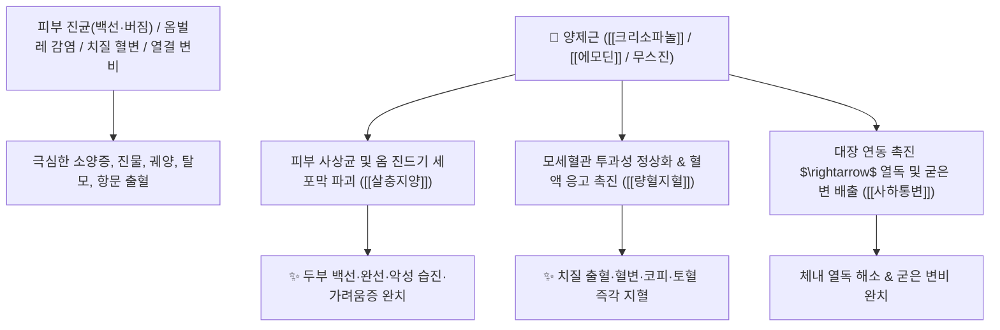

# 🌿 [[양제근]] (羊蹄根, Rumicis Radix / 소리쟁이뿌리)

> **핵심 요약 (Key Summary)**:
> 마디풀과(*Polygonaceae*) 참소리쟁이(*Rumex japonicus*) 또는 소리쟁이의 뿌리
> 안트라퀴논 유도체인 [[크리소파놀]](Chrysophanol)과 [[에모딘]](Emodin), 나프탈렌 화합물인 무스진이 피부 사상균을 박멸하고 대장 연동운동을 촉진하여 살충지양 및 량혈지혈 작용 발휘
> 피부 진균 감염(버짐·백선·옴·가려움증)·습진 및 혈열(血熱)로 인한 코피·토혈·변혈(치질 하혈)·열결(熱結) 변비를 치료하는 대표적인 [[살충지양]](殺蟲止痒)·[[량혈지혈]](凉血止血)·[[사하통변]](瀉下通便) 약재

---
## 📌 목차
1. [기본 본초 정보 & 화학 구조 (Pharmacognosy)](#1-기본-본초-정보--화학-구조-pharmacognosy)
2. [핵심 분자약리 기전 & 안트라퀴논·항진균 살충 네트워크](#2-핵심-분자약리-기전--안트라퀴논항진균-살충-네트워크)
3. [해부생체역학 / 표피 각질층 & 직장 정맥총 연계](#3-해부생체역학--표피-각질층--직장-정맥총-연계)
4. [사상의학 및 임상 응용 (내복 지혈 vs 외용 살충초식)](#4-사상의학-및-임상-응용-내복-지혈-vs-외용-살충초식)
5. [고전 의학 및 외용 배오 원리](#5-고전-의학-및-외용-배오-원리)
6. [핵심 처방 비교 매트릭스](#6-핵심-처방-비교-매트릭스)
7. [출처 및 학술 참고 문헌 (References)](#7-출처-및-학술-참고-문헌-references)

---
## 1. 기본 본초 정보 & 화학 구조 (Pharmacognosy)

| 항목 | 상세 내용 |
| :--- | :--- |
| **기원 식물** | 마디풀과(Polygonaceae) 참소리쟁이 *Rumex japonicus* Houtt. 또는 토대황의 뿌리 |
| **성미 (性味)** | 苦, 寒, 小毒 |
| **귀경 (歸經)** | 心·肝·大腸經 (심경, 간경, 대장경) - **피부 진균 및 대장 혈열 특화** |
| **효능 (Actions)** | [[살충지양]](殺蟲止痒), [[량혈지혈]](凉血止血), [[사하통변]](瀉下通便), [[청열해독]](淸熱解毒) |
| **주요 성분** | • **안트라퀴논 유도체**: [[크리소파놀]] (Chrysophanol), [[에모딘]] (Emodin), 피시온(Physcion)<br>• **나프탈렌계 항진균 성분**: 무스진(Musizin), 네포딘(Nepodin)<br>• **탄닌 및 유기산**: 루믹신, 옥살산 |

> **[유래 및 본초학적 기전]**:
> * 뿌리의 생김새가 양의 발굽(羊蹄)을 닮아 '양제근(羊蹄根)'이라 불렸으며 들판의 소리쟁이입니다.
> * 짓찧어 식초에 개어 바르면 머리의 부스럼(두창), 백선(버짐), 완선, 피부 옴벌레를 순식간에 죽여 가려움증을 멎게 합니다.
> * 내복 시 대황과 유사하게 장관을 청소하여 열성 변비를 뚫고 혈열로 터져 나오는 코피와 치질 출혈을 지혈합니다.

### 🔬 양제근의 주요 안트라퀴논 화학 구조
```
     [ 안트라센-9,10-디온 골격 ]───( C-1, C-8 위치에 OH, C-3 위치에 CH3 )  <-- 크리소파놀 (Chrysophanol)
```
> **[구조적 특징 및 활성]**: [[크리소파놀]]과 네포딘은 백선균(*Trichophyton*)의 세포벽 형성을 억제하고 대장 점막의 아쿠아포린-3([[AQP3]]) 발현을 조절하여 배변을 유도합니다.

---
## 2. 핵심 분자약리 기전 & 안트라퀴논·항진균 살충 네트워크



### (1) 표적 살충지양 및 지혈 작용
* **피부 진균증 및 옴 완치 ([[살충지양]] 殺蟲止痒)**:
  * 외용 도포 시 백선균, 칸디다균 및 옴벌레를 박멸하여 진물과 가려움증을 없앱니다.
* **치질 출혈 및 소화관 출혈 지혈 ([[량혈지혈]] 凉血止血)**:
  * 직장 점막의 울혈을 내리고 출혈 시간을 단축시켜 혈변과 치질 출혈을 멈추게 합니다.
* **완화한 사하통변(瀉下通便)**:
  * 장내 열을 식히고 수분을 유지시켜 변비를 해소합니다.

---
## 3. 해부생체역학 / 표피 각질층 & 직장 정맥총 연계

* **각질층 침투 및 가려움 수용체 안정화**:
  * 비후된 각질층을 연화시키고 C-신경섬유의 히스타민 독립적 가려움 신호를 억제합니다.

---
## 4. 사상의학 및 임상 응용 (내복 지혈 vs 외용 살충초식)

```
[✅ 외용 vs 내복 사용법]
• 외용(주요 용법): 생뿌리를 짓찧거나 가루 내어 식초(醋)에 개어 바름 $\rightarrow$ 백선, 버짐, 습진, 옴
• 내복(9~15g): 달여서 복용 $\rightarrow$ 변비, 치질 출혈, 혈열 망행 출혈

[✅ 최적 적응증 (Sweet Spot)]
• 두부 백선 및 완선: 머리에 버짐이 피고 가려워 긁으면 비듬과 진물이 나는 경우
• 치질성 하혈 및 변비: 대변을 볼 때 피가 뚝뚝 떨어지고 항문이 붓고 아픈 상태
```

---
## 5. 고전 의학 및 외용 배오 원리

### (1) 피부 진균 질환의 최고 외용 배오
* **핵심 배오**:
  * [[양제근]] + `식초(食醋)` $\rightarrow$ 짓찧어 환부에 바르면 백선과 옴벌레를 완벽 박멸 ([[양제근산]])
  * [[양제근]] + [[고삼]] + [[지부자]] $\rightarrow$ 피부 소양증과 습진을 치료

---
## 6. 핵심 처방 비교 매트릭스

| 처방명 | 구성 약재 | 주치 병증 및 임상 타깃 | 특징 및 감별점 |
| :--- | :--- | :--- | :--- |
| [[양제근산]](외용) | [[양제근]](가루), 식초 혼화 | 두부 백선, 완선, 버짐, 옴, 음부 가려움증 | 피부 진균을 죽이는 대표 외용방 |
| [[토대황탕]] | [[양제근]](토대황), [[지유]], [[황금]] | **치질 출혈, 혈변, 열결 변비, 복통** | 대장의 열을 식히고 지혈 |
| [[양제근음]] | [[양제근]], [[금은화]], [[연교]] | **외음부 궤양, 피부 악성 종기, 옹창** | 해독 소종하고 새살을 돋게 함 |

---
## 7. 출처 및 학술 참고 문헌 (References)

2. **대한민국약전(KP) 제12개정 (2022)**. 생약규격집: 양제근 (Rumicis Radix) 규격 기준.
   - **[공정서 규격]**: 참소리쟁이 근경의 성상, 순도시험 및 건조감량 12.0% 이하 기준 명시.
