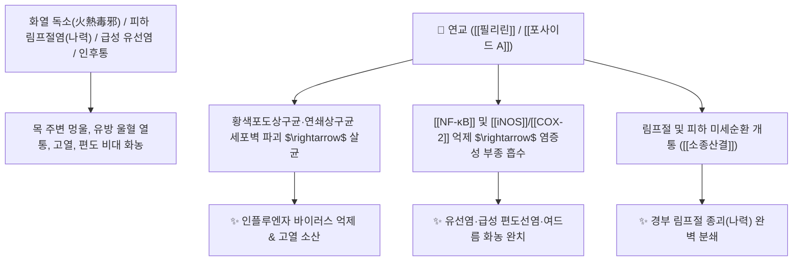

# 🌿 [[연교]] (連翹, Forsythiae Fructus / 개나리열매)

> **핵심 요약 (Key Summary)**:
> 물푸레나무과(*Oleaceae*) 의성개나리(*Forsythia viridissima*) 또는 당개나리의 건조한 열매
> 리그난 배당체인 [[필리린]](Phillyrin)과 [[포사이드 A]](Forsythoside A)가 광범위 세균막을 파괴하고 염증성 사이토카인을 차단하여 강력한 소종산결 및 해독 작용 발휘
> 화열(火熱)로 깊숙이 뭉친 경부 림프절염(나력 瘰癧)·급성 유선염(유옹)·악성 옹종 창양 및 온병(溫病) 초기 풍열 감모·고열·인후통을 치료하는 대표적인 [[청열해독]](淸熱解毒)·[[소종산결]](消腫散結)·[[소산풍열]](疏散風熱) 군약(君藥)

---
## 📌 목차
1. [기본 본초 정보 & 화학 구조 (Pharmacognosy)](#1-기본-본초-정보--화학-구조-pharmacognosy)
2. [핵심 분자약리 기전 & 필리린·열결산결·항바이러스 네트워크](#2-핵심-분자약리-기전--필리린열결산결항바이러스-네트워크)
3. [해부생체역학 / 경부 림프절망 & 유선 소엽 연계](#3-해부생체역학--경부-림프절망--유선-소엽-연계)
4. [사상의학 및 임상 응용 (금은화 vs 연교 열결 감별)](#4-사상의학-및-임상-응용-금은화-vs-연교-열결-감별)
5. [고전 의학 및 배오 원리 (은교산 & 양격산 배오)](#5-고전-의학-및-배오-원리-은교산--양격산-배오)
6. [핵심 처방 비교 매트릭스](#6-핵심-처방-비교-매트릭스)
7. [출처 및 학술 참고 문헌 (References)](#7-출처-및-학술-참고-문헌-references)

---
## 1. 기본 본초 정보 & 화학 구조 (Pharmacognosy)

| 항목 | 상세 내용 |
| :--- | :--- |
| **기원 식물** | 물푸레나무과(Oleaceae) 당개나리 *Forsythia suspensa* (Thunb.) Vahl 또는 의성개나리의 열매 |
| **성미 (性味)** | 苦, 微寒 |
| **귀경 (歸經)** | 心·肺·小腸·膽經 (심경, 폐경, 소장경, 담경) - **심화(心火)를 끄고 림프절 결절을 깸** |
| **효능 (Actions)** | [[청열해독]](淸熱解毒), [[소종산결]](消腫散결), [[소산풍열]](疏散風熱), [[청심사화]](淸心瀉火) |
| **주요 성분** | • **리그난 배당체(지표물질)**: [[필리린]] (Phillyrin, KP 규격 $\ge 0.15\%$), [[포사이드 A]] (Forsythoside A, KP $\ge 0.25\%$), 피노레시놀<br>• **플라보노이드**: 루틴, 케르세틴<br>• **트리테르펜산**: 베툴린산, 우르솔산, 올레아놀산 |

> **[유래 및 본초학적 기전]**:
> * 열매가 새의 깃털(翹)처럼 갈라져 이어져 있다(連) 하여 '연교(連翹)'라 불립니다.
> * "연진이처럼 교활하게 숨어 있는 깊은 열결(熱結)을 깨뜨린다"는 임상 메모처럼, 피하 깊숙이 뭉친 염증성 멍울(림프절염, 유선염, 종기)을 삭여 없애는 **'창양의 성약(瘡家之聖藥)'**입니다.
> * 체표의 전반적인 열은 [[금은화]]가 날려준다면, **피하와 장부에 딴딴하게 뭉쳐 곪아 터지려는 열독 결절은 [[연교]]가 단숨에 부숩니다**.

### 🔬 연교의 주요 리그난 지표물질 화학 구조
```
     [ 테트라하이드로퓨란 비스리그난 골격 ]───O──[ Glc ]  <-- 필리린 (Phillyrin)
```
> **[구조적 특징 및 항균 활성]**: [[필리린]]과 [[포사이드 A]]는 황색포도상구균과 인플루엔자 바이러스의 세포막 및 외피를 직접 파괴하고 염증성 [[NF-κB]] 신호 전달을 차단합니다.

---
## 2. 핵심 분자약리 기전 & 필리린·열결산결·항바이러스 네트워크



### (1) 표적 청열소종 및 림프절 결절 분쇄
* **경부 림프절염(나력 瘰癧) 및 유선염 치료 ([[소종산결]] 消腫散結)**:
  * 목 주변에 알사탕처럼 만져지는 림프절 멍울과 수유기 유방에 뭉친 젖몸살 화농을 삭입니다.
* **상초 풍열 감모 및 편도선염 해열 ([[소산풍열]] 疏散風熱)**:
  * 고열, 두통, 목구멍이 빨갛게 붓고 침을 삼키기 힘든 인후종통을 금은화와 함께 즉각 해열합니다.
* **청심사화(淸心瀉火) 및 번열 진정**:
  * 심장의 화열을 소변(소장)으로 배출시켜 가슴 답답함과 혓바늘을 가라앉힙니다.

---
## 3. 해부생체역학 / 경부 림프절망 & 유선 소엽 연계

* **경부 표재/심경 림프절(Cervical Lymph Node) 울혈 소산**:
  * 림프액 순환을 정상화하여 염증성 림프절 비대를 축소시킵니다.

---
## 4. 사상의학 및 임상 응용 (금은화 vs 연교 열결 감별)

```
[🔍 금은화(金銀花) vs 연교(連翹) 임상 감별]
• [[금은화]]: 표열(表熱) 발산 위주 $\rightarrow$ 체표의 붉은 열독과 초기 감기 발열을 땀과 소변으로 흩트림
• [[연교]]: 이열(裏熱) 산결 위주 $\rightarrow$ 피하 깊숙이 단단하게 뭉친 결절(림프절염, 옹저, 여드름)을 부숨

[✅ 최적 적응증 (Sweet Spot)]
• 림프절 비대: 목이나 겨드랑이에 멍울이 생겨 만지면 아픈 상태 ([[연교패독산]])
• 급성 화농성 질환: 급성 편도선염, 인두염, 유선염, 모낭염, 여드름
• 풍열 감모: 열이 펄펄 끓고 목이 찢어지게 아픈 온병 초기 ([[은교산]])
```

---
## 5. 고전 의학 및 배오 원리 (은교산 & 양격산 배오)

### (1) 온병 해열과 창양 소탕의 최고 명약
* **청열해독 천하제일 황금 짝**:
  * [[연교]] + [[금은화]] $\rightarrow$ 표리와 안팎의 모든 화열을 끄는 불후의 콤비 ([[은교산]])
  * [[연교]] + [[황금]] + [[치자]] + [[대황]] $\rightarrow$ 상초와 중초의 불길을 아래로 쏟아냄 ([[양격산]])

---
## 6. 핵심 처방 비교 매트릭스

| 처방명 | 구성 약재 | 주치 병증 및 임상 타깃 | 특징 및 감별점 |
| :--- | :--- | :--- | :--- |
| [[은교산]] | [[연교]], [[금은화]], [[길경]], [[박하]], [[죽엽]], [[형개]], [[담두시]] | **온병 초기, 풍열 감모, 고열, 두통, 인후종통, 구갈** | 온병학 소산풍열의 제1선 방 |
| [[연교패독산]] | [[연교]], [[금은화]], [[방풍]], [[강활]], [[독활]], [[시호]], [[길경]] | **옹저 창양 초기, 림프절염, 피부 화농, 오한발열** | 피부 외과의 대표 해독소종방 |
| [[양격산]] | [[연교]], [[대황]], [[망초]], [[치자]], [[황금]], [[박하]], [[감초]] | **상중이초 사화, 구설생창(혓바늘), 인후 폐색, 변비** | 화열을 대변으로 배출 |

---
## 7. 출처 및 학술 참고 문헌 (References)

1. **Liu C et al. (2022)**. Synergistic anti-inflammatory effects of peimine, peiminine, and forsythoside a combination on LPS-induced acute lung injury by inhibition of the IL-17-NF-κB/MAPK pathway activation. *Journal of ethnopharmacology*, 295: 115343. [PMID: 35533916](https://pubmed.ncbi.nlm.nih.gov/35533916/)
   - **[연구 요약]**: 연교의 포사이드 A가 NF-κB 활성을 억제하여 강력한 신경 항염증 및 해독 작용을 나타냄을 규명.
2. **대한민국약전(KP) 제12개정 (2022)**. 의약품각조 제2부: 연교 (Forsythiae Fructus) 규격 기준.
   - **[공정서 규격]**: 건조물 기준 필리린($\text{C}_{27}\text{H}_{34}\text{O}_{11}$) 0.15% 이상, 포사이드 A 0.25% 이상 함유 필수 규격 명시.
