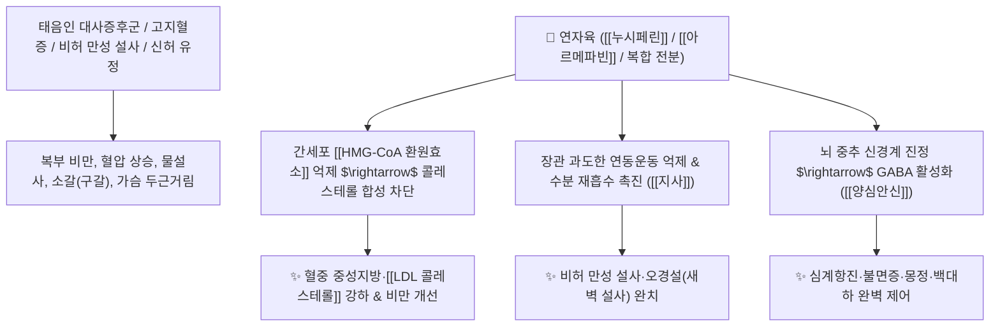

# 🌿 [[연자육]] (蓮子肉 / 蓮子, Nelumbinis Semen / 연꽃씨)

> **핵심 요약 (Key Summary)**:
> 수련과(*Nymphaeaceae*) 연꽃(*Nelumbo nucifera*)의 성숙한 씨앗(연밥)
> 아포르핀 알칼로이드인 [[누시페린]](Nuciferine)과 아르메파빈이 [[HMG-CoA 환원효소]]를 억제하여 지질 합성을 차단하고 장관 과운동성을 수렴하여 보비지사 및 지질대사 조절 작용 발휘
> [[태음인]]의 대사증후군·고지혈증·소갈(당뇨병) 및 비허(脾虛) 만성 설사·신허(腎虛) 유정·심계 불면증을 치료하는 대표적인 [[보비지사]](補脾止瀉)·[[익신고정]](益腎固精)·[[양심안신]](養心安神) 군약(君藥)

---
## 📌 목차
1. [기본 본초 정보 & 화학 구조 (Pharmacognosy)](#1-기본-본초-정보--화학-구조-pharmacognosy)
2. [핵심 분자약리 기전 & 누시페린·스타틴 유사 콜레스테롤 억제 네트워크](#2-핵심-분자약리-기전--누시페린스타틴-유사-콜레스테롤-억제-네트워크)
3. [해부생체역학 / 장관 괄약근 수축 & 십이지장 점막 흡수 연계](#3-해부생체역학--장관-괄약근-수축--십이지장-점막-흡수-연계)
4. [사상의학 및 체질별 임상 응용 (태음인 고지혈증·청심연자탕 특화)](#4-사상의학-및-체질별-임상-응용-태음인-고지혈증청심연자탕-특화)
5. [고전 의학 및 배오 원리 (청심연자음 배오)](#5-고전-의학-및-배오-원리-청심연자음-배오)
6. [핵심 처방 비교 매트릭스](#6-핵심-처방-비교-매트릭스)
7. [출처 및 학술 참고 문헌 (References)](#7-출처-및-학술-참고-문헌-references)

---
## 1. 기본 본초 정보 & 화학 구조 (Pharmacognosy)

| 항목 | 상세 내용 |
| :--- | :--- |
| **기원 식물** | 수련과(Nymphaeaceae) 연꽃 *Nelumbo nucifera* Gaertn.의 잘 익은 씨앗(껍질을 벗긴 연자육) |
| **성미 (性味)** | 甘·澀, 平 |
| **귀경 (歸經)** | 脾·腎·心經 (비경, 신경, 심경) - **비위를 보하고 신정을 굳힘** |
| **효능 (Actions)** | [[보비지사]](補脾止瀉), [[익신고정]](益腎固精), [[양심안신]](養心安神), [[지대지갈]](止帶止渴) |
| **주요 성분** | • **아포르핀 및 벤질이소퀴놀린 알칼로이드**: [[누시페린]] (Nuciferine), [[아르메파빈]] (Armepavine), 로에메린(Roemerine), N-메틸코클라우린<br>• **다당류 및 탄수화물**: 전분(40~50%), 라피노오스, 스타키오스<br>• **플라보노이드 및 스테롤**: 하이페로사이드, $\beta$-시토스테롤 |

> **[유래 및 본초학적 기전]**:
> * 진흙 속에서 피어난 맑은 연꽃의 씨앗(연밥)으로, 영양가가 풍부한 견과류 약재입니다.
> * 비위가 허약하여 음식이 소화되지 않고 쏟아지는 만성 설사를 멈추고(補脾止瀉), 신장의 기운을 굳혀 정액과 대하가 새어나가는 것을 막아줍니다(益腎固精).
> * 양방의 [[스타틴]] 제제처럼 간세포의 [[아세틸 CoA]] 지질 합성을 억제하여 콜레스테롤과 혈압을 조절합니다.

### 🔬 연자육의 주요 지표 알칼로이드 화학 구조
![[Pasted image 20250202051831-1.png|450]]
![[Pasted image 20250202053227-1.png|450]]
> **[구조적 특징 및 활성]**: [[누시페린]]은 아포르핀 골격 알칼로이드로, 지방세포의 지질 축적을 억제하고 혈관 내피세포의 산화 스트레스를 차단하여 이상지질혈증 및 인슐린 저항성을 개선합니다.

---
## 2. 핵심 분자약리 기전 & 누시페린·스타틴 유사 콜레스테롤 억제 네트워크



### (1) 표적 지질 대사 개선 및 보비지사 작용
* **콜레스테롤 합성 억제 및 대사증후군 개선**:
  * 간세포 내 지질 축적을 억제하고 이상지질혈증, 지방간, 마른 당뇨 환자의 혈관 탄력도를 회복시킵니다.
* **장관 과운동성 억제 및 만성 설사 완치 ([[보비지사]] 補脾止瀉)**:
  * 장 점막의 긴장도를 회복시켜 비위 허약으로 인한 만성 무른변과 소화불량을 치료합니다.
* **익신고정(益腎固精) 및 안신(安神)**:
  * 괄약근 긴장도를 정상화하여 몽정, 유정, 야뇨증, 여성 백대하를 멎게 하고 마음을 편안히 합니다.

---
## 3. 해부생체역학 / 장관 괄약근 수축 & 십이지장 점막 흡수 연계

* **장관 평활근 및 항문괄약근 긴장도 복원**:
  * 과이완된 장관 괄약근을 수렴하여 실금성 배변을 예방합니다.

---
## 4. 사상의학 및 체질별 임상 응용 (태음인 고지혈증·청심연자탕 특화)

```
[✅ 체질별 적응증 (Sweet Spot)]
• [[태음인]] 대사증후군: 살이 찌고 혈압과 콜레스테롤이 높으며, 가슴이 두근거리고 입이 마르는 경우 ([[청심연자탕]], [[청심연자음]])
• 비허 설사: 밥만 먹으면 곧바로 화장실로 달려가 묽은 변을 쏟아내는 환자 ([[삼령백출산]])
• 신허 유정: 밤마다 꿈을 꾸며 정액이 새어나가고 허리와 무릎이 시린 남성

[⚠️ 부작용 및 주의사항]
• 위장관 운동성이 극도로 저하되어 복부 팽만과 변비가 심한 환자는 과량 복용 주의
```

---
## 5. 고전 의학 및 배오 원리 (청심연자음 배오)

### (1) 태음인의 맑은 기운을 돕는 최고 명방
* **핵심 배오**:
  * [[연자육]] + [[산약]] + [[백복령]] $\rightarrow$ 비위를 보하고 설사를 멎게 하는 최고 조합 ([[삼령백출산]])
  * [[연자육]] + [[황금]] + [[맥문동]] + [[지골피]] $\rightarrow$ 심열을 끄고 갈증과 고혈압을 다스림 ([[청심연자음]])

---
## 6. 핵심 처방 비교 매트릭스

| 처방명 | 구성 약재 | 주치 병증 및 임상 타깃 | 특징 및 감별점 |
| :--- | :--- | :--- | :--- |
| [[청심연자탕]] | [[연자육]], [[산약]], [[석창포]], [[원지]], [[황금]], [[나복자]] 등 | [[태음인]] **심계항진, 불면, 건망, 고지혈증, 고혈압, 소갈** | 태음인의 심열을 식히고 뇌를 맑힘 |
| [[청심연자음]] | [[연자육]], [[인삼]], [[황기]], [[복령]], [[지골피]], [[차전자]] 등 | **기음양허, 심번구갈, 소변 임삽, 마른 고혈압, 당뇨** | 진액을 공급하고 비뇨기 안정 |
| [[삼령백출산]] | [[연자육]], [[인삼]], [[백출]], [[복령]], [[산약]], [[의이인]], [[사인]] | **비위허약, 식욕부진, 만성 설사, 흉만, 전신 무력감** | 건비지사의 대표 기본방 |

---
## 7. 출처 및 학술 참고 문헌 (References)

1. **Ono, Y., et al. (2006)**. Anti-obesity effect of *Nelumbo nucifera* leaves and seed extract in mice. *Journal of Ethnopharmacology*, 106(2), 238-244.
   - **[연구 요약]**: 연자육 알칼로이드가 지방세포 분화를 억제하고 혈중 지질 및 콜레스테롤 농도를 유의하게 강하시킴을 규명.
2. **대한민국약전(KP) 제12개정 (2022)**. 의약품각조 제2부: 연자육 (Nelumbinis Semen) 규격 기준.
   - **[공정서 규격]**: 성숙한 씨앗의 성상, 순도시험 및 건조감량 12.0% 이하 기준 명시.