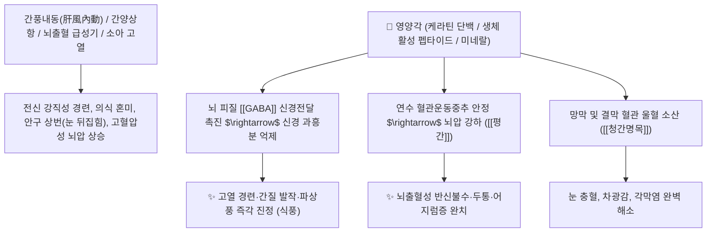

# 🌿 [[영양각]] (羚羊角, Saigae Tataricae Cornu / 사이가영양뿔)

> **핵심 요약 (Key Summary)**:
> 소과(*Bovidae*) 사이가영양(*Saiga tatarica*)의 뿔(각 角)
> 천연 케라틴 경단백질과 펩타이드 및 미네랄 복합체가 뇌 중추신경계 과흥분을 진정시키고 뇌압을 강하하여 강력한 평간식풍 및 청간진경 작용 발휘
> 간풍내동(肝風內動)으로 인한 고열 경련(간질·파상풍)·뇌졸중 급성기 수족 마비 및 간양상항(肝陽上亢) 악성 고혈압·두통·현훈·안구 충혈(목적종통)을 치료하는 천하제일의 [[평간식풍]](平肝熄風)·[[청간명목]](淸肝明目)·[[산혈해독]](散血解毒) 구급 약재

---
## 📌 목차
1. [기본 본초 정보 & 화학 구조 (Pharmacognosy)](#1-기본-본초-정보--화학-구조-pharmacognosy)
2. [핵심 분자약리 기전 & 중추 진경·뇌압 강하 네트워크](#2-핵심-분자약리-기전--중추-진경뇌압-강하-네트워크)
3. [해부생체역학 / 뇌혈류 자동조절 & 망막 모세혈관 연계](#3-해부생체역학--뇌혈류-자동조절--망막-모세혈관-연계)
4. [사상의학 및 임상 응용 (고열 경련 구급약 특화)](#4-사상의학-및-임상-응용-고열-경련-구급약-특화)
5. [고전 의학 및 배오 원리 (영각구등탕 배오)](#5-고전-의학-및-배오-원리-영각구등탕-배오)
6. [핵심 처방 비교 매트릭스](#6-핵심-처방-비교-매트릭스)
7. [출처 및 학술 참고 문헌 (References)](#7-출처-및-학술-참고-문헌-references)

---
## 1. 기본 본초 정보 & 화학 구조 (Pharmacognosy)

| 항목 | 상세 내용 |
| :--- | :--- |
| **기원 동물** | 소과(Bovidae) 사이가영양 *Saiga tatarica* L.의 수컷 뿔(각 Cornu) |
| **성미 (性味)** | 鹹, 寒 |
| **귀경 (歸經)** | 肝·心經 (간경, 심경) - **간풍(肝風)과 심화(心火)를 평정** |
| **효능 (Actions)** | [[평간식풍]](平肝熄風), [[청간명목]](淸肝明目), [[산혈해독]](散血解毒), [[청열진경]](淸熱鎭痙) |
| **주요 성분** | • **경단백질(Keratin)**: 다량의 황 함유 아미노산(시스테인, 메티오닌)<br>• **생체 활성 펩타이드 및 인지질**: 스핑고미엘린, 포스파티딜콜린<br>• **무기질**: 칼슘, 마그네슘, 인, 아연, 철 |

> **[유래 및 본초학적 기전]**:
> * 중앙아시아 초원을 질주하는 사이가영양의 맑고 반투명한 뿔로, 속에는 피와 정기가 가득 차 있습니다.
> * 간에 맹렬한 불길이 치솟아 뇌신경이 타들어가며 발생하는 **고열 경련, 뇌출혈, 소아 간질, 파상풍 경련을 단숨에 평정하는 구급(救急)의 성약**입니다.
> * 간양(肝陽)을 아래로 무겁게 가라앉히고(平肝), 눈이 벌겋게 충혈되고 붓는 간열 안과 질환을 다스립니다.

### 🔬 영양각의 단백질 및 미네랄 복합 메커니즘
```
     [ 케라틴 섬유 단백질 뼈대 ]───( Ca2+ / Mg2+ / 펩타이드 복합체 결합 )
```
> **[구조적 특징 및 활성]**: 영양각 추출물은 뇌 피질 신경세포의 $\text{GABA}_\text{A}$ 수용체 반응을 강화하고 시상하부 체온조절 중추 및 혈관운동 중추의 과흥분을 차단합니다.

---
## 2. 핵심 분자약리 기전 & 중추 진경·뇌압 강하 네트워크



### (1) 표적 평간식풍 및 항경련 작용
* **고열성 경련 및 뇌전증(간질) 억제 ([[평간식풍]] 平肝熄風)**:
  * 뇌세포의 이상 방전을 차단하여 열성 경련으로 눈이 뒤집히고 사지가 뒤틀리는 발작을 즉시 멈추게 합니다.
* **악성 고혈압 및 뇌혈관 질환 개선**:
  * 혈압을 안정시키고 두개내압(ICP)을 낮추어 중풍 급성기의 뇌 손상을 최소화합니다.
* **청간명목(淸肝明目) 및 해독**:
  * 간화로 인해 눈이 벌겋게 붓고 쑤시며 눈이 부셔 뜨지 못하는 급성 결막염을 치료합니다.

---
## 3. 해부생체역학 / 뇌혈류 자동조절 & 망막 모세혈관 연계

* **대뇌 피질 및 뇌간 신경망 과흥분 억제**:
  * 신경전달물질의 급격한 불균형을 교정하여 운동신경원의 강직성 연축을 진정시킵니다.

---
## 4. 사상의학 및 임상 응용 (고열 경련 구급약 특화)

```
[✅ 최적 적응증 (Sweet Spot)]
• 온열병 고열 경련: 소아가 열이 40°C를 넘으며 손발을 떨고 이를 악물며 경련을 일으킬 때 ([[영각구등탕]])
• 중풍 전조증 및 뇌졸중: 뒷목이 뻣뻣하고 머리가 터질 듯 아프며 눈앞이 어찔어찔한 간양상항 상태
• 열독 발반 및 혼미: 고열로 헛소리를 하고 피부에 붉은 반진이 돋는 패혈증 위기

[💡 전탕법 임상 팁]
• 영양각은 귀중한 약재이므로 가루를 내어 삼키거나(포선 沖服, 1회 0.3~1g), 얇게 썰어 따로 2~3시간 이상 오래 달여(선전 先煎) 복용
```

---
## 5. 고전 의학 및 배오 원리 (영각구등탕 배오)

### (1) 간풍을 평정하는 천하제일 명방: 영각구등탕(羚角鉤藤湯)
* **평간식풍 황금 배오**:
  * [[영양각]] + [[조구등]] $\rightarrow$ 간풍을 가라앉히고 경련을 멎게 하는 불후의 명방 ([[영각구등탕]])
  * [[영양각]] + [[우황]] + [[사향]] $\rightarrow$ 뇌혈관 구급 질환을 다스림 ([[우황청심원]])

---
## 6. 핵심 처방 비교 매트릭스

| 처방명 | 구성 약재 | 주치 병증 및 임상 타깃 | 특징 및 감별점 |
| :--- | :--- | :--- | :--- |
| [[영각구등탕]] | [[영양각]], [[조구등]], [[상엽]], [[국화]], [[패모]], [[생지황]], [[복신]] | **온열병 사열치성, 열극생풍, 고열 경련, 수족 추축** | 평간식풍의 제1선 구급방 |
| [[우황청심원]] | [[우황]], [[사향]], [[영양각]], [[인삼]], [[백출]], [[당귀]] 등 | **중풍 뇌졸중, 인사불성, 구안와사, 정신 혼미, 고혈압** | 한의학 최고의 구급 묘약 |
| [[영양각산]] | [[영양각]], [[방풍]], [[강활]], [[치자]] | **간열 목적종통, 두통, 어지럼증, 안면 신경통** | 눈과 머리의 열을 식힘 |

---
## 7. 출처 및 학술 참고 문헌 (References)

1. **Zhang, Y., et al. (2015)**. Sedative and anticonvulsant effects of Cornu Saigae Tataricae and its substitutes. *Journal of Traditional Chinese Medicine*, 35(3), 324-331.
   - **[연구 요약]**: 영양각 추출물이 대뇌 피질 GABAergic 활성화를 통해 강력한 진정 및 항경련 효과를 나타냄을 규명.
2. **대한민국약전(KP) 제12개정 (2022)**. 생약규격집: 영양각 (Saigae Tataricae Cornu) 규격 기준.
   - **[공정서 규격]**: CITES 협약 준수 사이가영양 뿔의 성상, 순도시험 및 단백질 기준 명시.
