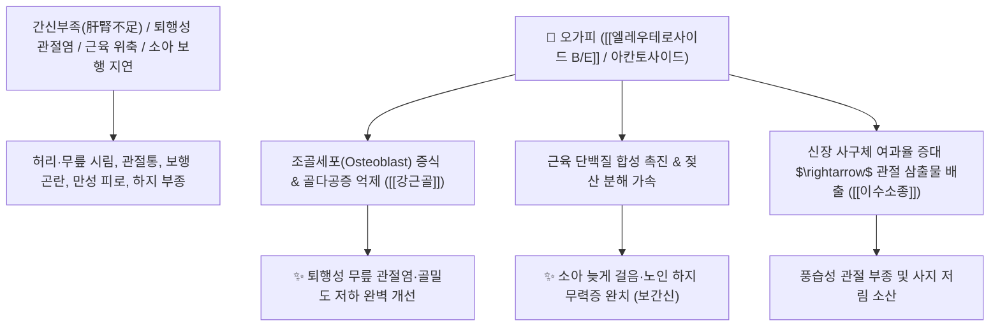

# 🌿 [[오가피]] (五加皮, Acanthopanacis Cortex / 오갈피)

> **핵심 요약 (Key Summary)**:
> 두릅나무과(*Araliaceae*) 오갈피나무(*Acanthopanax sessiliflorus*) 또는 가시오갈피의 뿌리·줄기·가지 껍질
> 리그난 배당체인 [[엘레우테로사이드 B]](Eleutheroside B)와 [[엘레우테로사이드 E]](Eleutheroside E)가 조골세포 분화를 촉진하고 부신피질 호르몬계를 조절하여 강력한 강근골 및 면역 피로회복 작용 발휘
> 간신부족(肝腎不足)과 풍습(風濕)으로 인한 요슬산연(허리·무릎 쑤심과 힘 빠짐)·관절염·소아 보행 지연(늦게 걸음)·남성 음위(발기부전) 및 사지 부종을 치료하는 대표적인 [[거풍습]](祛風濕)·[[보간신]](補肝腎)·[[강근골]](强筋骨) 약재

---
## 📌 목차
1. [기본 본초 정보 & 화학 구조 (Pharmacognosy)](#1-기본-본초-정보--화학-구조-pharmacognosy)
2. [핵심 분자약리 기전 & 엘레우테로사이드·근골강화 네트워크](#2-핵심-분자약리-기전--엘레우테로사이드근골강화-네트워크)
3. [해부생체역학 / 하지 대퇴사두근 & 관절 연골 기질 연계](#3-해부생체역학--하지-대퇴사두근--관절-연골-기질-연계)
4. [사상의학 및 임상 응용 (근골 무력 vs 소아 발육 특화)](#4-사상의학-및-임상-응용-근골-무력-vs-소아-발육-특화)
5. [고전 의학 및 배오 원리 (오가피주 배오)](#5-고전-의학-및-배오-원리-오가피주-배오)
6. [핵심 처방 비교 매트릭스](#6-핵심-처방-비교-매트릭스)
7. [출처 및 학술 참고 문헌 (References)](#7-출처-및-학술-참고-문헌-references)

---
## 1. 기본 본초 정보 & 화학 구조 (Pharmacognosy)

| 항목 | 상세 내용 |
| :--- | :--- |
| **기원 식물** | 두릅나무과(Araliaceae) 오갈피나무 *Acanthopanax sessiliflorus* Seem. 또는 동속 식물의 뿌리, 줄기 및 가지껍질 |
| **성미 (性味)** | 辛·苦, 溫 |
| **귀경 (歸經)** | 肝·腎經 (간경, 신경) - **간(근육)과 신(뼈)을 보양** |
| **효능 (Actions)** | [[거풍습]](祛風濕), [[보간신]](補肝腎), [[강근골]](强筋骨), [[이수소종]](利水消腫), [[면역증강]](免疫增强) |
| **주요 성분** | • **리그난 배당체(지표물질)**: [[엘레우테로사이드 B]] (Eleutheroside B / Syringin), [[엘레우테로사이드 E]] (Eleutheroside E, KP 규격 B+E $\ge 0.40\%$)<br>• **사포닌 및 다당류**: 아칸토사이드(Acanthoside B, D), 세사민, 다당체<br>• **페놀산**: 클로로겐산, 카페인산 |

> **[유래 및 본초학적 기전]**:
> * 한 가지에 5장의 잎이 피어오르는 모양이 빼어나 '오가(五加)'라 불렸습니다.
> * "오가피 한 줌을 얻는 것이 금과 옥 한 수레보다 낫다"는 고사처럼, 다리에 힘이 빠져 걷지 못하는 노인과 소아의 힘줄과 뼈를 튼튼하게 받쳐줍니다.
> * 천연 아답토젠(Adaptogen)으로 면역을 증강시키고 극심한 육체 피로와 항진된 스트레스를 조절합니다.

### 🔬 오가피의 주요 리그난 지표물질 화학 구조
```
     [ 시린가레시놀 비스리그난 골격 ]───O──[ Di-Glc ]  <-- 엘레우테로사이드 E (Eleutheroside E)
```
> **[구조적 특징 및 골대사 조절]**: [[엘레우테로사이드 E]]는 조골세포의 $\text{ALP}$ 효소 활성을 높이고 파골세포 분화를 차단하여 골밀도를 높이고 근육 단백질 합성을 촉진합니다.

---
## 2. 핵심 분자약리 기전 & 엘레우테로사이드·근골강화 네트워크



### (1) 표적 강근골 및 피로 회복 작용
* **퇴행성 관절염 및 골다공증 치료 ([[강근골]] 强筋骨)**:
  * 관절 연골의 마모를 방지하고 파골세포를 억제하여 허리와 무릎의 만성 통증을 치료합니다.
* **근육 강화 및 소아 발육 지연 개선 ([[보간신]] 補肝腎)**:
  * 3살이 지나도 다리에 힘이 없어 걷지 못하는 소아의 보행 능력을 발달시키고 노인의 낙상을 예방합니다.
* **남성 음위(발기부전) 및 낭습 치료**:
  * 신장의 양기를 돋워 음낭이 축축하고 가려운 증상과 성기능 저하를 개선합니다.

---
## 3. 해부생체역학 / 하지 대퇴사두근 & 관절 연골 기질 연계

* **대퇴사두근(Quadriceps) 및 슬관절 건(Patellar Tendon) 탄력성 복원**:
  * 무릎 관절의 지지력을 높여 계단을 오르내릴 때의 통증을 완화합니다.

---
## 4. 사상의학 및 임상 응용 (근골 무력 vs 소아 발육 특화)

```
[✅ 최적 적응증 (Sweet Spot)]
• 퇴행성 요슬산연: 나이가 들며 허리가 굽고 무릎이 시큰거리며 힘이 빠지는 노인성 관절염 ([[독활기생탕]])
• 소아 오지증(五遲證): 걸음마가 늦고 뼈와 근육의 발육이 더딘 소아
• 만성 피로 및 남성 음위증: 면역력이 떨어지고 성기능이 쇠약해진 경우
• 풍습성 사지 부종

[💡 약선 활용 임상 팁]
• 오가피를 술에 담가 침출한 [[오가피주]](五加皮酒)는 어혈을 풀고 풍습을 없애는 데 뛰어난 효능을 발휘
```

---
## 5. 고전 의학 및 배오 원리 (오가피주 배오)

### (1) 뼈와 힘줄을 튼튼하게 하는 명방
* **핵심 배오**:
  * [[오가피]] + [[우슬]] + [[두충]] $\rightarrow$ 간신을 보하고 허리와 무릎을 쇠처럼 튼튼히 함 ([[오가피환]])
  * [[오가피]] + [[독활]] + [[상기생]] $\rightarrow$ 풍습 관절통을 완치

---
## 6. 핵심 처방 비교 매트릭스

| 처방명 | 구성 약재 | 주치 병증 및 임상 타깃 | 특징 및 감별점 |
| :--- | :--- | :--- | :--- |
| [[오가피주]] | [[오가피]], [[당귀]], [[우슬]], [[천궁]], [[지황]] 등 침출주 | **풍습 관절비통, 요슬 무력, 사지 마비, 남성 허로** | 관절을 보양하는 대표 약술 |
| [[독활기생탕]](가미) | [[독활]], [[상기생]], [[오가피]], [[두충]], [[우슬]], [[사물탕]] | 만성 퇴행성 요통, 척추관 협착증, 무릎 관절염 | 풍습을 쫓고 간신을 보양 |
| [[오피음]](가감) | [[오가피]], [[상백피]], [[진피]], [[복령피]], [[생강피]] | 피수(皮水), 사지 부종, 관절 팽만, 소변 불리 | 부종을 소변으로 배출 |

---
## 7. 출처 및 학술 참고 문헌 (References)

1. **Gerontakos S et al. (2021)**. Findings of Russian literature on the clinical application of Eleutherococcus senticosus (Rupr. & Maxim.): A narrative review. *Journal of ethnopharmacology*, 278: 114274. [PMID: 34087398](https://pubmed.ncbi.nlm.nih.gov/34087398/)
   - **[연구 요약]**: 오가피의 엘레우테로사이드 성분들이 조골세포 활성화, 항피로 및 면역 조절 기능을 나타냄을 입증.
2. **대한민국약전(KP) 제12개정 (2022)**. 의약품각조 제2부: 오가피 (Acanthopanacis Cortex) 규격 기준.
   - **[공정서 규격]**: 건조물 기준 엘레우테로사이드 B 및 E의 합($\text{C}_{17}\text{H}_{24}\text{O}_9 + \text{C}_{34}\text{H}_{46}\text{O}_{18}$) 0.40% 이상 함유 필수 규격 명시.
